# 揭秘 ROC 曲线

> 原文：<https://towardsdatascience.com/demystifying-roc-curves-df809474529a?source=collection_archive---------1----------------------->

## 如何解释以及何时使用接收机工作特性曲线

ROC 曲线是评估和微调分类模型的重要助手。但是，对我们中的一些人来说，理解它们真的很难。我会把这些曲线对于初学者来说难以理解的原因全部列出来，逐一破解背后的奥秘。如果你之前试图解释 ROC 曲线没有成功，这篇文章将帮助你最终理解它们。如果你不熟悉混淆矩阵、灵敏度、特异性、真阳性率等。请参考我[以前的文章](https://medium.com/@ruchitoshniwal/how-to-select-performance-metrics-for-classification-models-c847fe6b1ea3)。

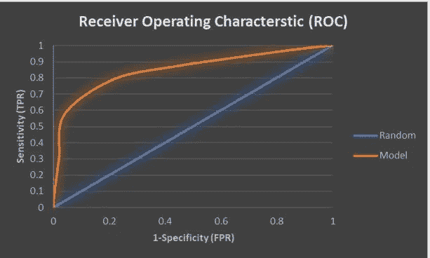

**ROC 曲线看起来有点复杂的原因:**

***1。它们令人生畏的名称接收器操作特性并没有给出任何字面上的暗示来说明其含义***

***2。当我们试图目视检查曲线时，x 轴为 1-特异性有点令人迷惑。***

***3。ROC 曲线显示了一个分类模型在所有分类阈值下的性能。它可以用来评估模型的强度。ROC 曲线也可以用来比较两个模型。当我们试图同时理解/应用所有这些概念时，就会变得令人困惑。***

***4。对角线代表的随机模型到底是什么？这是最糟糕的模型吗？***

让我们试着逐一解开这些谜团，了解 ROC 曲线。

# 1.名称—接收机工作特性曲线

ROC 曲线在第二次世界大战期间首次用于分析雷达信号。偷袭珍珠港后，美国陆军开始了新的研究，以提高从雷达信号中发现日本飞机的速度。不用说，他们不想错过任何一个。他们也不希望把资源浪费在错误的警报上。他们测量了雷达接收机操作员做出这些被称为接收机工作特性的预测的能力。这就是这个名字的由来。曲线的目的类似于我们现在如何使用它来改进我们的机器学习模型。目的是分析预测器的预测能力，以确保检测尽可能多的真阳性，同时尽量减少假阳性。

# **2。该图—灵敏度对(1-特异性)**

ROC 曲线是 y 轴上的真阳性率(TPR)对 x 轴上的假阳性率(FPR)的图。

TPR =灵敏度
FPR = 1-特异性

最好以原始形式理解 ROC 曲线，TPR Vs FPR。一旦你理解了它们，用上面的等式进行替换就很容易了。

为什么我们要比较 TPR 和 FPR？

假设我们有一个二元分类模型，它预测属于“是”和“否”类的观察值的概率。我们选择概率阈值= 0.5。概率> = 0.5 的观察值属于“是”和“概率”<0.5 belong to Class NO. We obtain the following confusion matrix.

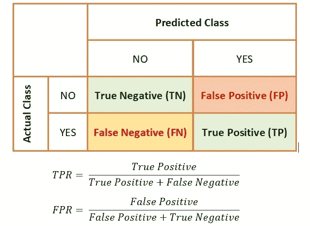

Notice in the figure below that TPR and FPR are derived from two separate rows of the confusion matrix. This ensures that the class distribution in the data (prevalence) does not affect the curve. The YESs and the NOs are being looked at separately.

The True Positive Rate looks at the actual YESs and the False Positive Rate looks at the actual NOs.
类，因此，即使 ROC 图包含关于这两类的信息(是和否)，这些组也不会相互影响。即使测试数据中类别的患病率/分布发生变化，每个值以及曲线本身也不会发生变化。(不要将此与(可能)影响模型强度的训练数据中的类别分布相混淆。这里我们讨论的是建立模型，然后根据测试数据对其进行评估。检验数据的类别分布不影响 ROC 曲线。)

我们将进一步详细讨论 ROC 曲线，但现在让我们注意 ROC 曲线中的 x 轴是假阳性率。一旦我们理解了曲线及其目的，我们可以很容易地用 1-灵敏度来代替它。

# **3。ROC 曲线的目的**

**a)目的 1——分析分类器的强度/预测能力**

我们的分类模型的任务是将较高的概率分配给属于“是”类的观察值，将较低的概率分配给属于“否”类的观察值。基本上，如果分配给任一类观察值的概率存在显著差异，我们将能够定义一个阈值，并以较高的置信度预测这两个类。

好的分类器的 ROC 曲线更靠近图的左上角。**为什么？**因为在一个好的分类器中，我们可以在低 FPR(最佳阈值)下实现高 TPR。不同阈值下的 FPR 和 TPR 将在 b)点中讨论。

绿色曲线显示类别 YES 的分布，红色曲线显示类别 NO 在分类器分配给每个 obs 的概率上的分布。使用阈值 0.5，我们能够正确地对大多数观察结果进行分类。分布有轻微的重叠。重叠案例是在 0.5 时被错误分类的案例。如果我们将阈值移动到 0.6，我们将能够正确地分类几乎 85%的真阳性，并且没有假阳性。当我们将阈值从 0.6 降低到 0.5 时，TPR 将增加，但 FPR 也会增加。(注意，在下面的 ROC 曲线中，我们看不到阈值。)

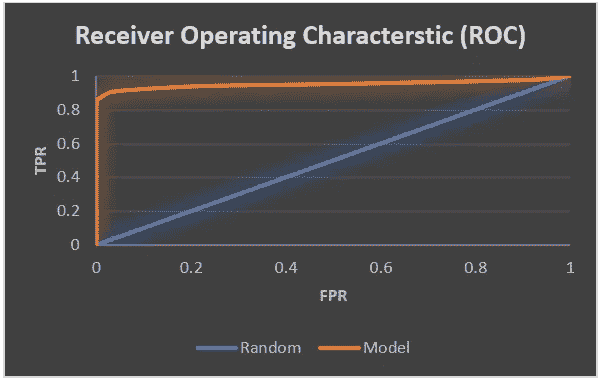

ROC 曲线—分类器 1

我们可以使用颜色编码的 ROC 曲线，如下图所示，以便能够看到曲线上的每个阈值。右边的颜色条表示每种颜色的阈值。

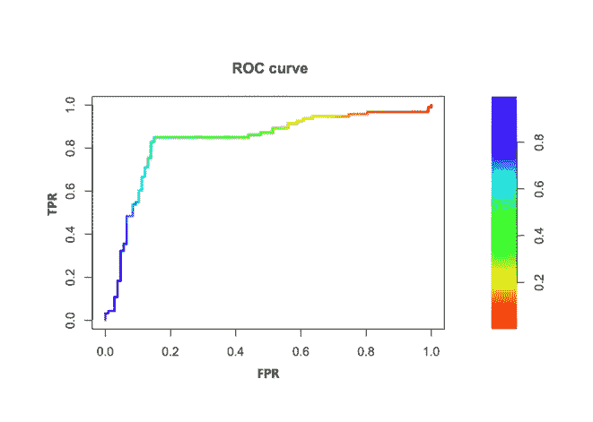

记得我们讨论过患病率/阶级分布如何不影响 ROC 曲线。前面讨论的分类器 1 将在不平衡数据集中分离类，就像它对上述平衡数据集所做的那样。该分类器的 ROC 曲线仍然是相同的。

即使在对不平衡数据集进行分类时，我们的分类器的 ROC 曲线也保持不变。

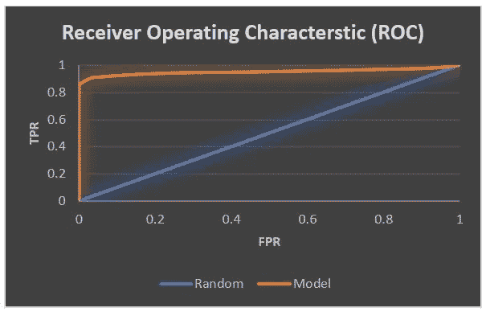

差的分类器(如下面的分类器 2)将不能很好地区分这两类，因此其 ROC 曲线将更接近对角线。这意味着更低的 TPR 率(更多的假阴性)和更高的 FPR 率(更多的假阳性)。这就引出了 c 点中讨论的曲线下面积的概念。

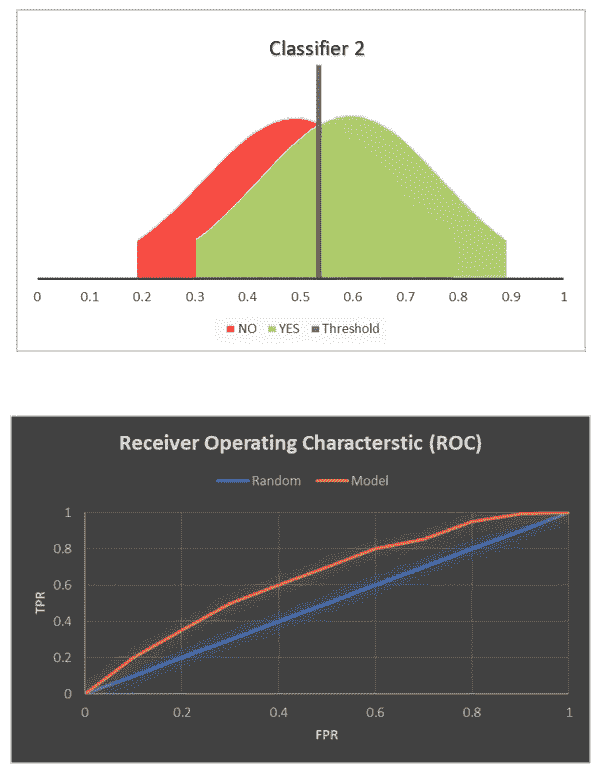

由 ROC 曲线中蓝色对角线表示的随机模型是随机分类器，其不具有任何区分两个类别的能力，即两个类别的预测概率重叠(分类器 3)。因此，TPR =任何阈值下的 FPR。

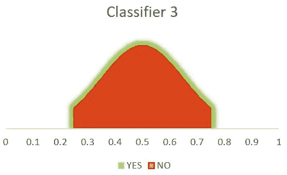

**b)目的 2——确定最佳阈值**

我们有一个分类模型，它预测一个观察值属于“是”类的概率。这个概率的范围可以从 0 到 1。用于确定该观察的类别的默认阈值 0.5 并不总是最佳阈值。ROC 曲线帮助我们找到 TPR 高而 FPR 低的阈值，即错误分类低。因此，ROC 曲线应该用于确定分类模型的最佳概率阈值。

此外，在很多情况下，误报和漏报的成本是不一样的。这就是 ROC 曲线非常有用的时候。

ROC 曲线显示了 TPR 和 FPR(或假阴性和假阳性)之间的权衡。它描绘了 TPR 与 FPR 在不同阈值的关系。如果我们降低分类阈值，我们会将更多的观察结果分类为阳性，从而增加真阳性。但是这将导致甚至假阳性增加。当我们改变这个阈值时，我们的系统的性能会变化。可以对其进行调整，以调整模型的行为，从而减少一种或另一种类型的误差(FP/FN)。

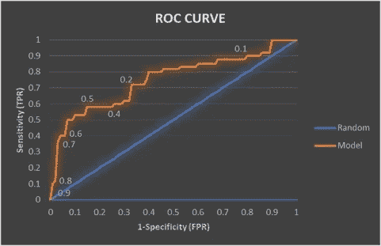

1.在上面的曲线中，如果你想要一个假阳性率非常低的模型，你可以选择 0.8 作为你的阈值。如果你喜欢低 FPR，但你不想要糟糕的 TPR，你可能会选择 0.5，这是曲线开始向右急转弯的点。

如果你喜欢低的假阴性率/高的 TPR，你可能会决定在 0.2 到 0.1 之间的某个地方，你开始得到进一步提高 TPR 的严重递减回报。

2.请注意阈值为 0.5 和 0.4 时的图表。两个阈值的总生育率都在 0.6 左右，但 FPR 在阈值 0.4 时较高。很明显，如果我们满意 TPR = 0.6，我们应该选择 threshold = 0.5。

**c)目的 3 —比较两个模型(使用曲线下面积)**

在 ROC 曲线中，对角线代表基线模型/随机分类器。ROC 曲线越接近 ROC 空间的 45 度对角线，模型就越不强大。

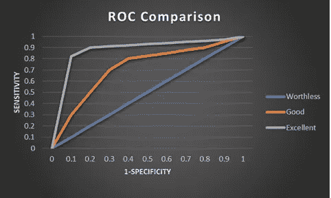

**AUC——曲线下面积**

ROC 曲线下的面积也称为 AUC。AUC 提供了一个模型在所有可能的分类阈值上的综合性能度量。

AUC 代表可分性的程度或度量。它告诉我们这个模型在多大程度上能够区分不同的类。AUC 越高，模型在预测“是”类的概率高于“否”类的概率方面就越好

AUC 值的范围从 0 到 1。预测 100%正确的模型的 AUC 为 1.0；其预测 100%错误的 AUC 为 0.0。

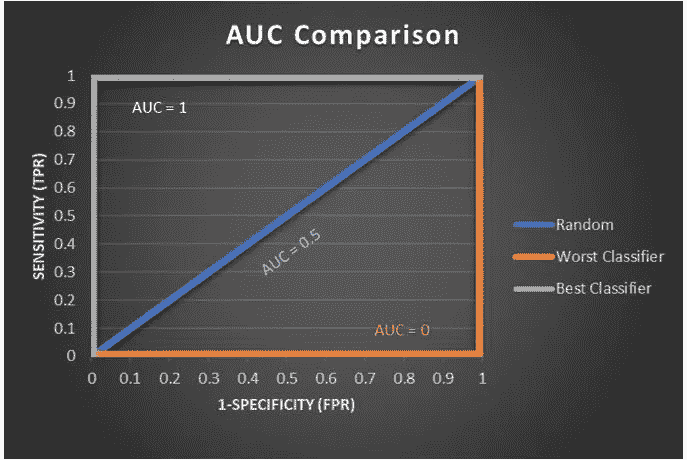

出于以下两个原因，AUC 是可取的:

1.  AUC 是比例不变的。它衡量预测的排名，而不是它们的绝对值。
2.  AUC 是分类阈值不变的。它测量模型预测的质量，而不管选择什么分类阈值。

**AUC 越大，分类器/模型越好。**

# **4。随机模型是最坏的可能模型吗？**

不完全是。随机模型是一个分类器，它随机预测观察值为“是”或“否”。在这种情况下，我们将有 50%的正确预测。AUC 为 0.5，TPR 等于所有阈值的 FPR。但是很明显，这样一个模型对我们没有多大价值。

最差的可能模型是将所有“是”类观测值预测为“否”类，将“否”类观测值预测为“是”类的模型。这种模型的 AUC 将是 0。

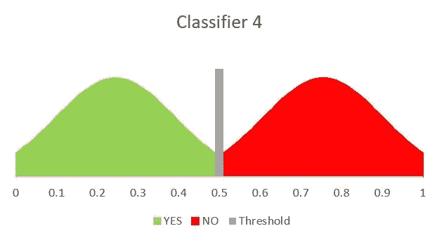

**总之**

每当您构建一个分类模型来预测某个观察值属于某个类别的概率时，绘制其 ROC 曲线来可视化其性能。不要使用默认阈值 0.5。使用 ROC 曲线和领域知识计算出模型的最佳阈值。

当数据中的类别分布不平衡或假阳性和假阴性的成本不同时，ROC 曲线非常有用。它们帮助我们可视化 TPR 和 FPR 之间的权衡，从而帮助我们达到最小化误分类成本的阈值。

ROC 曲线的形状包含许多关于模型预测能力的信息。

不同模型的 ROC 曲线可以直接进行总体比较，也可以针对不同的阈值进行比较。

曲线下面积(AUC)可用作模型技巧的总结，并可用于比较两个模型。

我希望你现在能够更好地利用 ROC 曲线。期待您的回复:)