# 揭秘支持向量机

> 原文：<https://towardsdatascience.com/demystifying-support-vector-machine-b04d202bf11e?source=collection_archive---------35----------------------->

## 理解基础数学的快速指南

# 介绍

[监督学习](https://en.wikipedia.org/wiki/Supervised_learning)描述了一类涉及使用模型来学习输入示例和目标变量之间的映射的问题。对于分类问题，目标变量可以是类标签，对于回归问题，目标变量可以是回归变量值。有些模型既适用于回归也适用于分类。我们将在这个博客中讨论的一个这样的模型是支持向量机，缩写为 SVM。我的目的是简单明了地向你提供 SVM 的内部运作。

事不宜迟，让我们开始吧。🚗

让我们假设我们正在处理一个二元分类任务。

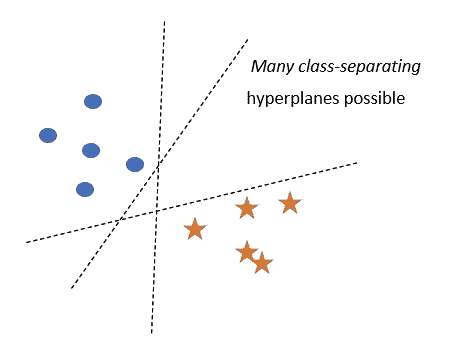

图 1

可能有无限多的超平面可以将这两类分开。你可以选择其中任何一个。但是这个超平面能很好地预测新查询点的类别吗？你不认为离其中一个班级很近的飞机偏向另一个班级吗？直观上，区分两个类别的最佳方法是选择一个超平面，该超平面与任一类别中的最近点等距。
这就是 SVM 所做的！

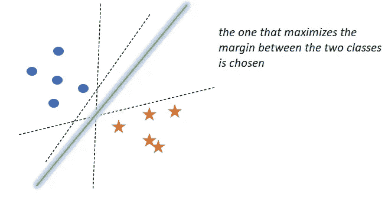

图 2

**SVM**的核心思想:

选择将+ve 点与-ve 点尽可能分开的超平面π。

设π是分开这两类的超平面，π₊和π₋是平行于π的两个超平面，使得

π₊是当我们平行于π移动时得到的平面，它与π最近的+ve 点接触

π₋是我们平行于π移动时得到的平面，它接触到π的最近点

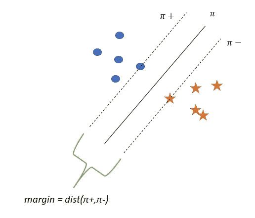

图 3

d =差额= dist(π₊,π₋)

*   SVM 试图找到一个使利润最大化的π。
*   随着边距的增加，泛化精度也会增加。

## 支持向量:

位于π₊或π₋上的点称为支持向量。

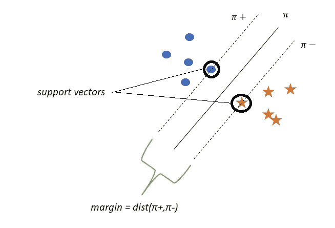

图 4

## SVM 的数学公式

π:边际最大化超平面

π: wᵀx+ b =0

比方说，

π₊ : wᵀx + b =+1

π₊上或正方向上远离它的任何一点都标为正

π₋ : wᵀx + b =-1

π₋上或负方向远离它的任何一点都标为负

在这种情况下，差额为

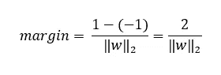

图 5

所以，我们的优化问题变成了

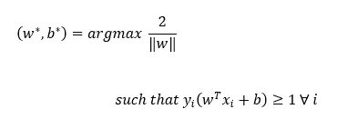

图 6:硬利润 SVM

现在，这可能看起来不错，但是，它只适用于我们的数据是线性可分的。如果不是，那么我们就不能解决上面的优化问题，我们就不能得到最优的 w 和 b。

让我们设想一个场景，其中数据不是线性可分的:

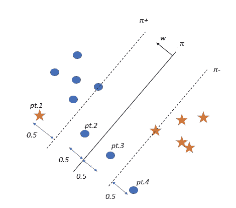

图 7

由于这四点，我们的优化问题将永远得不到解决，因为这些点 yᵢ(wᵀx+b 不≥ 1。

这是因为我们的优化问题过于严格，它只解决线性可分的数据。这种方法被称为硬利润。

那么，我们能修改它吗？我们能不能让它宽松一点，这样它就可以处理几乎线性可分的数据？

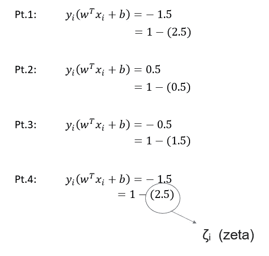

图 8

我们所做的是使松弛变量 **ζ** ᵢ (zeta)对应于每个数据点，使得对于位于+ve 区域的+ve 点和位于-ve 区域的-ve 点，
t5】ζᵢ= 0。

这给我们留下了错误分类的点和边缘内的点。

**ζ** ᵢ的意思

以 f *图 7 中的点 4 为例，* **ζ** ᵢ = 2.5
这意味着在这种情况下点 4 从其正确的 hyperplane(π₊向相反的方向偏离了 2.5 个单位)。

类似地，在这种情况下，点 1 距离其正确的 hyperplane(π₋2.5 个单位)在相反的方向。

*随着****ζ****ᵢ的增大，该点在* ***方向更加远离正确的超平面*** *方向。*

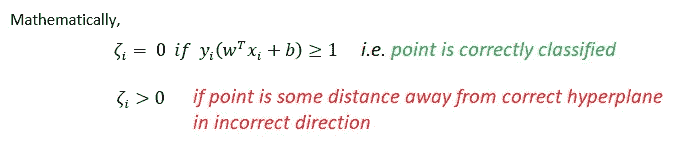

图 9

修正优化问题

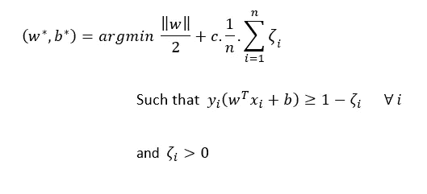

图 10:SVM 的原始形态

我们来分解一下

首先，约束条件:

我们知道，

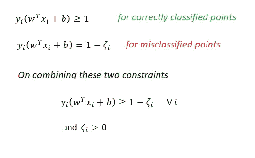

图 11

现在，

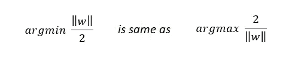

图 12

和

图 13

c 是超参数。

我们可以直观地把优化问题想成:

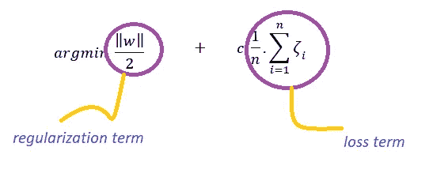

图 14

*   如果 c 较高，损失项将被赋予更大权重，这将导致数据过度拟合。
*   如果 c 较低，将给予正则化项更大权重，这将导致数据拟合不足。

## SVM 的双重形式

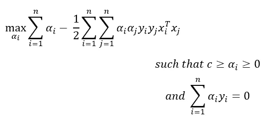

图 15

等等！我们是如何得到这种双重形式的呢？

嗯，这都与优化有关，如果我们深入其中，我们将偏离我们的目标。让我们在另一个博客中继续这个双重形式。

为什么我们需要这种双重形式？

对偶形式有时更容易解决，如果对偶间隙很小，我们会得到类似的结果。特别是对 SVM 来说:对偶形式非常重要，因为它开启了一种通过内核函数解释支持向量机的新方法(我将在本博客的后半部分告诉你)。

> 注意:在对偶形式中，所有的 xᵢ都以点积的形式出现，不像原始形式中所有的 xᵢ都以独立的点出现。

αᵢ可以被认为是拉格朗日乘数

从双重形式观察:

*   对于每一个 xᵢ，都有相应的αᵢ
*   所有 xᵢ都以点积的形式出现
*   我们对新点的分类方式发生了变化:

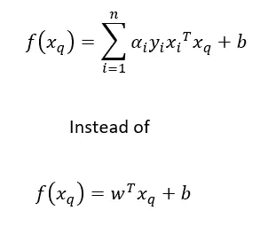

图 16

*   支持向量的αᵢ > 0，非支持向量的αᵢ =0。

这意味着只有点才是重要的支持向量，这就是将该模型命名为*支持向量机*的原因。

现在，以双重形式

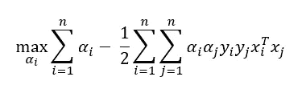

图 17

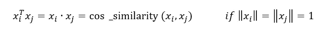

图 18

因此，如果给定一个相似矩阵，我们可以使用对偶形式而不是原始形式。这就是 SVM 的魅力所在。通常，这个 similarity(xᵢ,xⱼ)被 K(xᵢ,xⱼ)代替，其中 k 被认为是核函数。

## 内核技巧及其背后的直觉

用内核函数 K(xᵢ,xⱼ代替 similarity(xᵢ,xⱼ)被称为*内核化*，或者应用*内核技巧*。

你看看，无非就是计算 xᵢ和 xⱼ.的点积那么，它有什么了不起的呢？

让我们以下面的数据集为例。

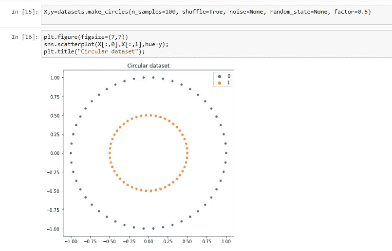

图 19

很明显，这两个类别不能用线性模型来区分。

现在，用特征<x>将数据集转换成 3D，看看神奇之处。</x>

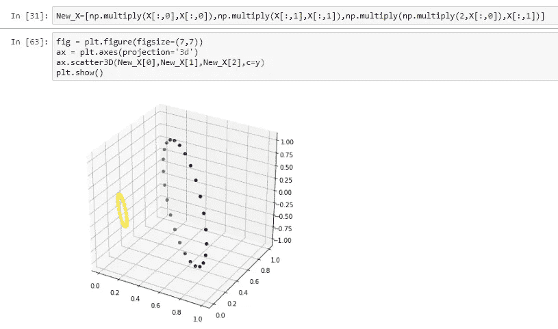

图 20

你看到了吗？应用适当的特征变换和增加维数使我们的数据线性可分。

这就是内核 SVM 所做的。它将原始特征映射到一个更高维度的空间中，在该空间中找到边际最大化超平面，并将该超平面映射到原始维度空间中，以获得非线性决策表面**，而无需实际访问**该更高维度的空间。

所以，

线性支持向量机:在 xᵢ's 空间中寻找边缘最大化超平面

核 SVM:在 xᵢ's 的*变换空间*中寻找边缘最大化超平面

因此，核 SVM 也能够解决非线性可分数据集。

让我们来看看 SVM 使用的一些玉米粒

## 多项式核

它被定义为:

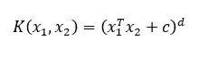

图 21

在哪里

d=数据的维度

c =常数

对于二次核，设 c=1，即

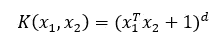

图 22

维度= 2

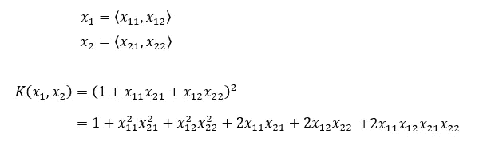

图 23

这可以被认为是两个向量 x₁'和 x₂'的乘积，其中:

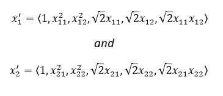

图 24

新维度= d' = 6

因此，内核化与特征转换是相同的，但通常是在内部隐式完成的。

## 径向基函数(RBF 核)

它是最受欢迎的内核，当你不知道选择哪个内核时，你可以选择这个😉

它被定义为:

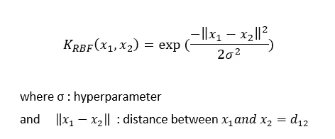

图 25

*d 的效果:*

当 d 增大时，指数部分的分子减小，或者换句话说，K 值或相似度减小。

σ的影响:

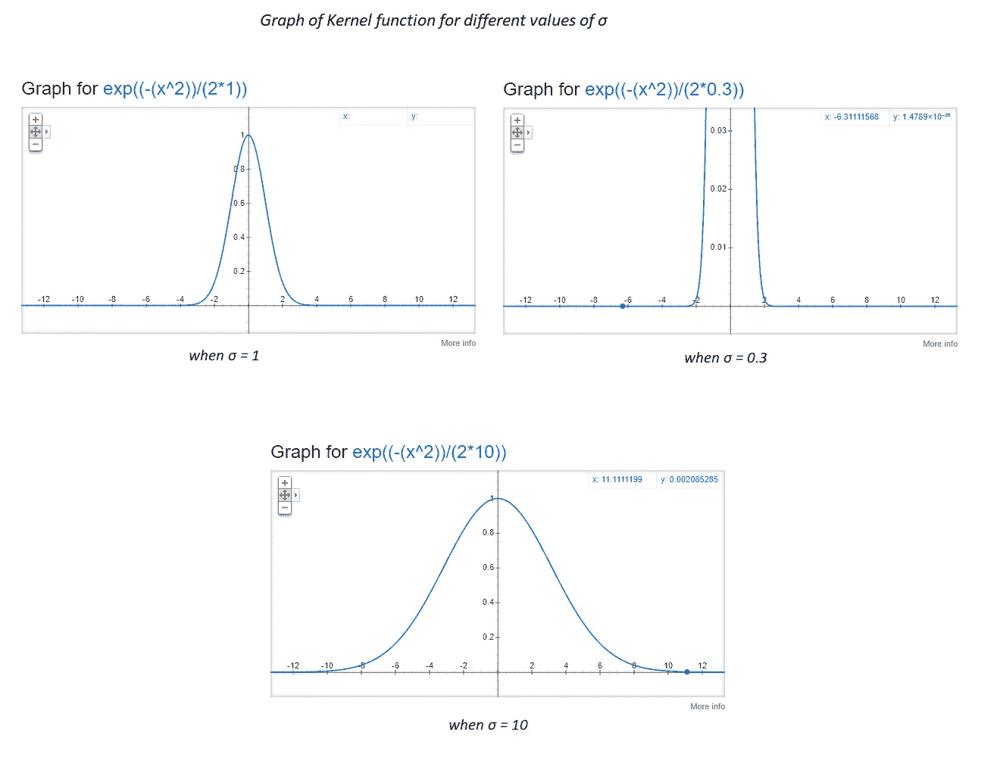

图 26:来源 Google

如果您注意到，当σ = 0.3 时，图表在 x=2 时接近 0。当σ =1 时，x=4 时接近 0，当σ=10 时，x=11。这表明，当σ增加时，即使两个点相距很远，它们的相似性得分也会大于 0。

没明白吗？

假设有两个点，x₁和 x₂，距离为 4 个单位。如果我们应用σ = 0.3 的 RBF 核，则核函数 K 值或相似性值将为 0。如果σ = 1，K 值将非常接近 0，但如果σ = 10，K 值将约为 0.4 左右。

现在，RBF 内核背后的直觉-

还记得我们在使用多项式内核时得到的 6 维映射函数吗(参见图 24)？现在让我们试着找出一个 RBF 核的映射函数。

为了简化数学，假设数据的原始维数为 2，指数部分的分母等于 1。在这种情况下，

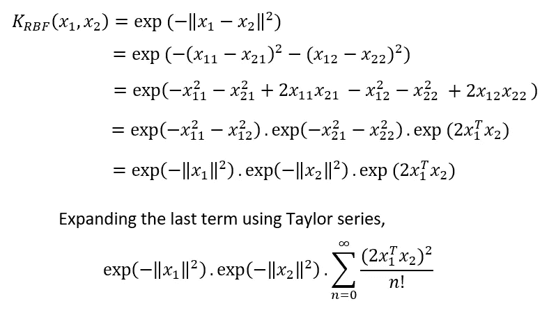

图 27

如果我们试图找出 RBF 核的映射函数，这将把我们引向一个无限向量。这意味着 RBF 核将我们的数据带入**无限维空间**，计算相似性得分并返回它，这就是为什么如果你无法确定选择哪个核，RBF 核将是最安全的选择。😎

## SVM 回归

到目前为止，我们已经了解了如何使用 SVM 执行分类任务。但是 SVM 不仅仅局限于此。它也可以用来执行回归任务。怎么会？我们去看看吧！

首先，让我们看看支持向量回归机(SVR)的数学公式

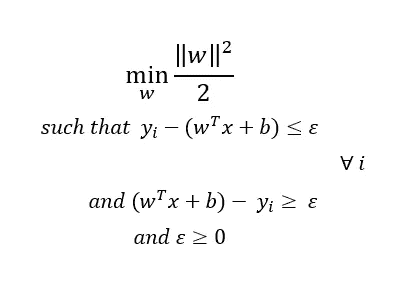

图 28

放心吧！我会为你打破它。

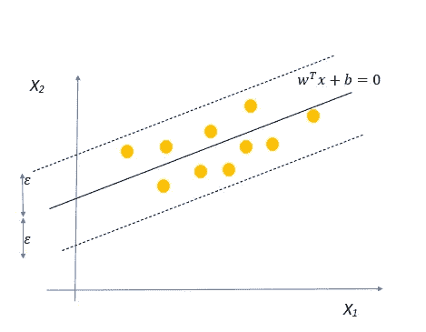

图 29

SVR 的工作方式是，它试图找到一个最适合数据点的超平面，同时保持容限= ε(超参数)，这意味着所有点都应该在超平面两侧的ε距离内。

这里最小化裕量意味着我们要找到一个超平面，它以低容限来拟合数据。

> 注意:平方是为了使函数变得可微，并适于优化。人们可以对 SVC 做同样的事情。

*这个提法有什么问题？*

这里的问题是我们太严格了，我们期望这些点位于超平面的ε距离内，这在现实世界中并不经常发生。在这种情况下，我们将无法找到所需的超平面。那么，我们该如何着手呢？

与我们在 SVC 中处理该问题的方式相同，我们将引入两个松弛变量**ζ(ζ)**用于法线方向的点，引入**ζ*(ζ星)**用于法线相反方向的点，以允许一些点位于容差范围之外，但会有损失。

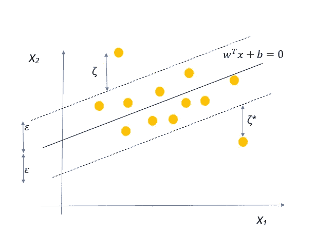

图 30

所以数学函数现在变成了:-

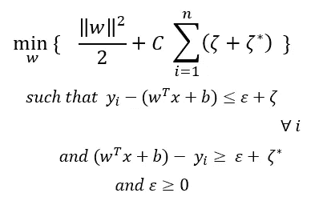

图 31:SVR 的原始形式

其中 C 决定了所需的严格程度。C 值越大，超出边界的点受到的惩罚越多，这可能导致数据过度拟合。C 值越小，对超出边界的点的惩罚就越小，这可能会导致数据拟合不足。

就像在 SVC 中一样，图 31 显示了 SVR 的原始形式。已经观察到对偶形式更容易解决，并且我们也可以使用核技巧来寻找非线性超平面。

> 正如我已经说过的，对偶形式的表述有点棘手，涉及到解决约束优化问题的知识。我们不会谈论那么多细节，因为那会转移我们对 SVM 的注意力。

## 支持向量回归机的对偶形式

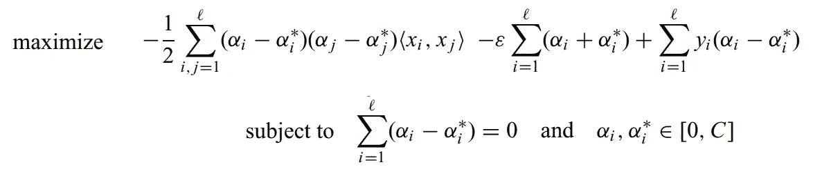

图 32:双重形式的 SVR

不好意思！我不是故意吓你的。这是通过使用拉格朗日乘子来解决优化问题而获得的。

对于一个新的点，我们计算产值的方法是:-

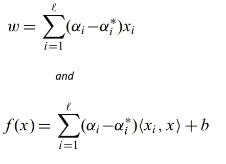

图 33:SVR 的函数值

你注意到 xᵢ以点积的形式出现了吗？是的，和我们在 SVC 中得到的一样。我们可以用我上面已经提到的相似度或核函数来代替这个点积。应用内核技巧也有助于我们拟合非线性数据。

## SVM 的案例

1.  *特征工程和特征转换*

这是通过如上所述找到正确的内核来隐式完成的

2.*决策面*

对于线性 SVM:决策面只是一个超平面

对于内核 SVM:这将是一个非线性的表面

3.*相似度函数/距离函数*

SVM 的原始形式不处理相似性函数。然而，由于点积形式的 xᵢ的存在，对偶形式可以容易地处理它。

4.*特征重要性*

如果特征不共线，则权重向量 w 中的特征权重确定特征重要性。在特征共线的情况下，可以使用前向特征选择或后向特征消除，这是确定任何模型的特征重要性的标准方式。

5.*离群值*

它们确实影响 SVM，但是，与其他模型如逻辑回归相比，影响较小。

6.*偏差-方差*

它取决于 SVM 对偶形式中 c 的值。

如果 c 较高，将给予误差项更大的权重，因此模型可能过拟合数据，如果 c 较小，将给予误差项更小的权重，并且模型可能欠拟合数据。

7.高维度

支持向量机被设计成即使在高维空间也能很好地工作。参考图 14，该图显示了 SVM 的数学公式中已经存在一个*正则项*，这有助于处理高维度。你可能会说像 KNN 这样的其他模型在高维情况下不太适用，那么支持向量机有什么特别之处呢？这是因为 SVM 只关心找到最大限度的平面，它不关心点之间的相对距离。

## SVM 的优势

*   它有一个正则项，有助于避免数据的过度拟合
*   它使用内核技巧，帮助处理非线性数据(在 SVR 的情况下)和非线性可分离数据(在 SVC 的情况下)
*   当我们不知道数据的时候，SVM 是非常好的。
*   适用于文本、图像和树等非结构化和半结构化数据。
*   即使当训练样本包含错误时，它也能工作，从这个意义上说，它是健壮的

## SVM 的局限性

*   选择正确的内核是一项艰巨的任务。
*   SVM 算法有几个需要正确设置的超参数，以实现任何给定问题的最佳分类结果。可能导致问题 *A* 的分类精度极佳的参数，可能导致问题 *B* 的分类精度不佳。
*   当数据点数量很大时，训练 SVM 需要很长时间。
*   对于核支持向量机，很难解释权重向量(w)。

## 参考

*   [https://alex.smola.org/papers/2004/SmoSch04.pdf](https://alex.smola.org/papers/2004/SmoSch04.pdf)
*   https://www.saedsayad.com/support_vector_machine_reg.htm
*   [https://statin fer . com/204-6-8-SVM-优势-劣势-应用/](https://statinfer.com/204-6-8-svm-advantages-disadvantages-applications/)
*   [http://www.cs.uky.edu/~jzhang/CS689/PPDM-Chapter2.pdf](http://www.cs.uky.edu/~jzhang/CS689/PPDM-Chapter2.pdf)