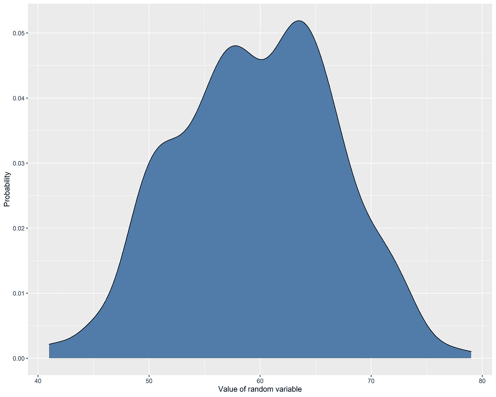
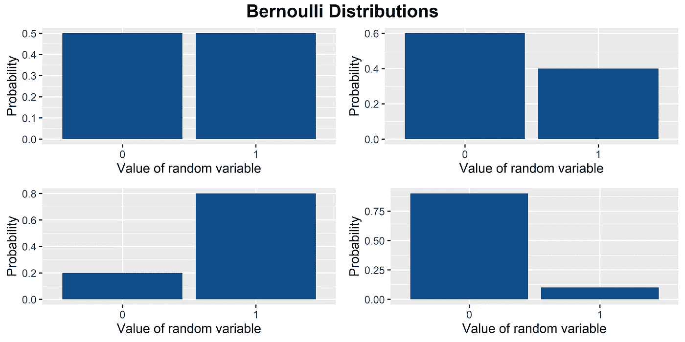
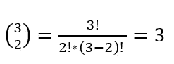
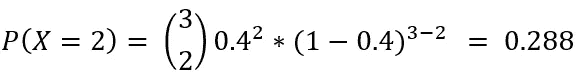
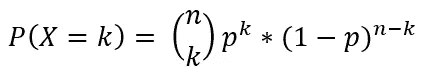
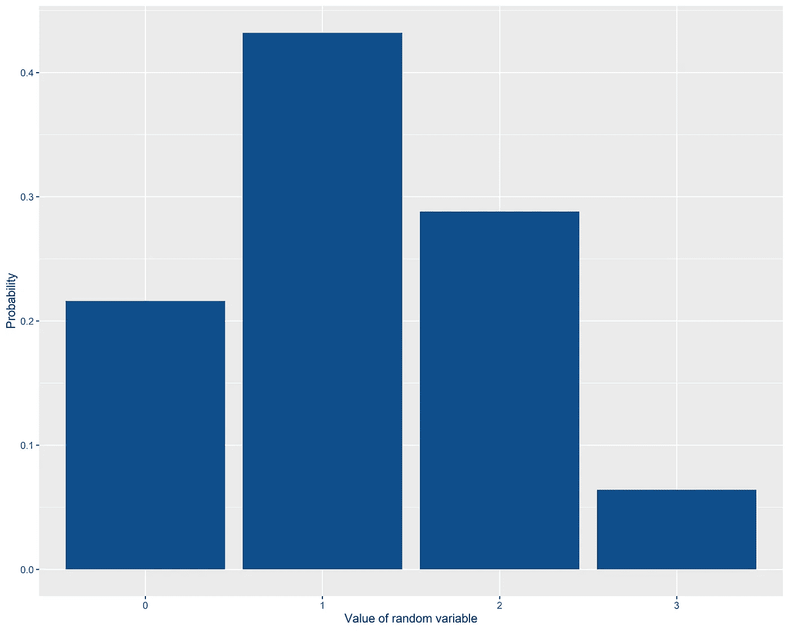
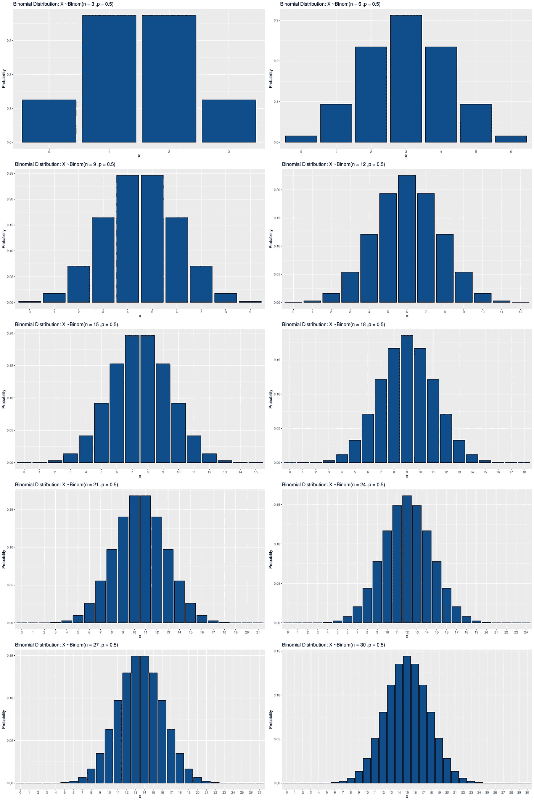
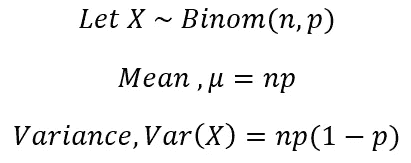

# 揭开二项分布的神秘面纱

> 原文：<https://towardsdatascience.com/demystifying-the-binomial-distribution-580475b2bb2a?source=collection_archive---------12----------------------->

## 本文的目的是介绍二项式分布背后的一些重要统计概念，并说明其在流行病学和/或医疗保健数据科学中的一个主要应用。

**伯努利试验**

在我们进入二项分布之前，理解伯努利试验是很重要的。伯努利试验是概率论和统计学中使用的术语。这是一个随机的试验，有两种可能的结果**。这两种结果可以是“成功”也可以是“失败”。理解这一点的最好方法是通过例子。我列举了三个与流行病学领域(病毒抗体测试)、机器学习(二元分类预测)和普通概率论(掷硬币)相关的例子。**

1.  概率论喜欢掷硬币，而掷硬币可以被认为是伯努利试验。掷硬币的结果要么是正面，要么是反面——所以我们有两种结果。
2.  流行病学的一个例子是对一个随机的病人进行病毒抗体测试。测试结果可能是“阳性”也可能是“阴性”——所以我们有两种结果。这又是一次伯努利试验。
3.  从机器学习/人工智能的角度来看，在二分类问题的情况下，预测也可以被视为伯努利试验。

你现在可能有这样的感觉，伯努利试验在实际场景中经常发生，这是真的。这就是为什么伯努利试验及其相关的概率分布如二项式分布在实践中有很多应用。

## **概率分布**

好吧，对于那些不知情的人来说，触及概率分布背后的直觉是有意义的。简单来说，概率分布就是一个随机变量可能值的分布。它总是用一个图来表示，这个图实际上就是一个直方图，x 轴表示随机变量的值，y 轴表示随机变量取相应变量的概率。

概率分布的例子。X 轴代表随机变量的值。在这里，这个变量的值在 40 到 80 之间。Y 轴表示从总体中抽取的随机样本具有相应值的概率。

现在一个可能的问题是什么是随机变量？随机变量是可以从随机实验中获取或存储值的变量。通常，随机变量是用一个大写字母来表示的，(例如:- X)。

## 为什么我们对概率分布感兴趣？

概率分布使我们能够从样本数据中推断科学实验。科学实验的最终目的是检验某个假设，并利用样本数据推断该假设是否成立。样本只是整个人口的一小部分代表(人口是世界上所有可能结果的集合)，获得人口的数据根本不实际。相反，我们提取样本，并利用样本从样本中推断出人群的发现。这种推断几乎总是通过使用概率分布来完成的。所以概率分布是统计学中最广泛使用的概念之一，几乎在每个科学领域都有应用。一般来说，根据产生概率分布的随机变量的类型，有两种类型的概率分布。这些分别是离散和连续随机变量的离散概率分布和连续概率分布。我不会深入讨论离散和连续随机变量的细节，但**二项式分布是一种离散概率分布**，因为二项式随机变量是一种离散变量(即它只能取整数)，而流行的正态分布是一种连续概率分布。

## 伯努利分布

顾名思义，伯努利分布就是伯努利试验的概率分布。**这是所有概率分布中最简单的一种，因为它是单次试验，只有两种结果，我们只需要知道得到每种结果的概率**。请记住，伯努利试验中的“失败”概率是“成功”概率的补充，因为这是两个相互排斥的事件，并且在一次试验/实验中只能出现其中之一。例如，在掷硬币时，如果我们假设硬币是公平的，那么获得正面的概率是 0.5，等价地，获得反面的概率是 1- 0.5 = 0.5。

让我们定义一个随机变量 **X，它取一次掷硬币的成功次数**(假设得到头就是成功)，这是一次伯努利试验。这里， **X** 只能有两个可能的值——0 和 1。那就是你要么得到一个头，要么得到一条尾巴。如果硬币是公平的，成功和失败的概率都是 0.5。同样，如果硬币不公平，成功的概率可能不是 0.5。相反，它可能是 0.4、0.6、0.7、0.2——可以是任何值。因此，伯努利概率分布取决于成功的概率，通常由字母 **p，**表示，其中 p 是 0 和 1 之间的值，包括 0 和 1。伯努利分布所依赖的唯一参数是 **p.**

伯努利分布。X 轴代表 X，伯努利随机变量。它只能取 0 或 1，因为它是单次试验，并且试验只能导致 0 次成功或 1 次成功。p 是 0.5，0.6，0.8 和 0.2 如果你顺时针方向走

## **二项随机变量和二项分布**

伯努利试验总是一次试验。如果我们在一个实验中进行多次伯努利试验会怎么样？比如， **n** 的次数？作为流行病学领域的一个例子，你不认为随机测试 1000 名受试者的新冠肺炎听起来很相似吗？是的，它是。我们现在不讨论新冠肺炎部分，但这只是为了提醒大家，二项式实验在实际情况中非常普遍。

我们来定义一个随机变量 X，代表这 n 次试验/实验的成功次数？如果伯努利试验重复 **n** 次，那么该试验作为一个整体被称为二项式试验。这里，每个单独的试验/实验都是伯努利试验。但与我们之前的伯努利示例中的 X 不同，这里的 **X** 代表二项式实验中的成功次数，该实验由 **n** 个伯努利试验组成。让我们从一个例子开始，开始学习任何新东西的最好方法。我们可以考虑掷硬币的例子。我们抛硬币三次，而不是之前在伯努利试验中提到的一次。所以这里的 **n** 是 3。我们的 X 是整个二项式实验的成功次数。这里，n 是 5，并且它们中的每一个可以有 2 个结果(头或尾)，因此我们有一组 2 = 8 个可能的结果，而不是在伯努利试验的情况下只有 2 个。

这 8 个结果是:{H，H，H}，{H，H，T}，{H，T，H}，{H，T，T}，{T，H，H}，{T，H，T}，{T，H，T}，{T，T，H}，{ T，T，T，T }其中 H 代表正面，T 代表反面。我们的 **X** 是一个二项式随机变量，这意味着它代表了在 **n** 次试验中的成功次数。所以它可以取 0，1，2 或者 3。现在，我们要为随机变量 **X 构建一个二项式分布。这意味着我们需要计算 X 的每个可能值的概率。**让我们从 X = 2 的情况开始，即在 3 次投掷中正好观察到 2 个头部的概率。我们来定义一下 **p** ，每次个人投掷(一次伯努利试验)的成功概率(获得人头)等于 0.4(硬币没那么公平！).

两个头可以出现在:HHT、HTH 和 THH。单次试验得到人头的概率，也就是 p，是 0.4。序列 HHT 因此具有 0.4 * 0.4*0.6 的概率。对于所有三种可能出现两个头的情况，每个单独序列的概率为:

1.  HHT——0.4 * 0.4 * 0.6
2.  HTH — 0.4*0.6*0.4
3.  THH——0.6 * 0.4 * 0.4

你可以看到一个模式，不管 H 和 T 的顺序，得到任何一个序列的概率都是相同的，总是等于 0.4 * 0.6。由于我们有三个看似合理的序列，我们可以将(0.4 *0.6)乘以 3，得到在三次试验中恰好得到两个头的概率。甚至这个数字“3”在这里也可以通过排列和组合很容易地计算出来。这里的问题是有多少次你可以从三个样本中选择两个项目。这无非就是流行的 n 为 3，r 为 2 的 nCr 题。在这个例子中，3C2 不过是 3！

现在，我们也可以用下面的表达式来表示在三次投掷中恰好获得两个头的概率:

同样，我们也可以很容易地计算出 P(X=0)，P(X=1)和 P(X=3)。

P(X=0) = 0.216

P(X=1) = 0.432

P(X=2) = 0.288

P(X=3) =0.064

注意，如果你把上面的四个概率加起来，等于 1。

> 一般来说，在 n 次固定且独立的伯努利试验中获得 k 次成功的概率，即二项式概率，可以写成如下形式:

二项分布的概率质量函数

> 上述函数也称为二项式分布的概率质量函数(PMF)。对于任何离散分布，都会有一个与之相关的 PMF，而对于二项式分布，PMF 恰好是上述函数。

如果你看看上面的二项式分布的 PMF 公式，你可以看到，如果 n 是 1，这个方程就变成了伯努利分布的 PMF。

回到我们之前的掷硬币的例子，我们现在已经计算了 3 次试验中所有可能成功的概率。因此，让我们构建二项式实验的概率分布，其中 n 为 3，p 为 0.4。

二项随机变量的概率分布，其中 n 是 3，p 是 0.4

**一般来说，二项分布取决于两个参数。这些是 n 和 p，记住伯努利分布只取决于 p，因为在伯努利试验中 n 总是 1。如果随机变量 X 遵循二项式分布，那么它在数学上由以下符号表示**

## x～Binom(n，p)

如果一个实验是二项式实验，注意该实验需要满足的条件也很重要。这些条件是:

1.  实验由 **n** 个相同的试验组成，并且 **n** 总是**固定**。
2.  每次试验都有两种结果，称为成功和失败。
3.  表示为 **p** 、**的成功概率在不同的试验中保持不变**。
4.  **n** 试验是**独立的**。也就是说，任何试验的结果都不会影响其他试验的结果。这是有替换样本的时候。

如果实验必须是二项式实验，则所有条件都要满足。但是也有违反条件 3 和更常见的条件 4 的情况。例如，如果您在不替换的情况下进行采样(即，在每次单独试验后移除您挑选的样本)，则 p 不会保持不变，试验也不会相互独立。然而，对于大样本量和 **p.** 的非极值，这通常不是问题

## **二项分布和正态分布有什么关系？**

这是假设你对所有概率分布之母的正态分布有所了解。那么二项分布和正态分布有什么关系呢？

让我们看一些二项式分布图，n 的值不同，p 为 0.5。

p = 0.5 时不同 n 值的二项式分布

让我们来看看二项分布，当每次试验的概率有点极端时，比如说 0.1

p = 0.1 时不同 n 值的二项式分布

在这两种情况下，你可以看到二项式分布看起来或多或少像正态分布中的钟形曲线！当 p 为 0.5 时尤其如此。这种特性被称为正态分布的近似值。这是一个非常有用的现象，因为通过这种近似，你可以从你的样本数据中得到关于人口的推论。请注意，对于 p 的极值，正态近似并不完全正确。在 p 为 0.1 的第二个示例中，您可以看到分布有点偏斜，不像 p 为 0.5 时那样对称。尽管如此，正态近似法在大多数情况下都适用，并且在处理二项式比例(如疾病流行率)时，有一些方法(如连续性校正)可以调整正态近似法的偏差。

我不喜欢在生物统计学中使用小抄，因为它们会导致不良实践，并误导那些寻找简单出路的人。永远记住，统计学没有免费的午餐。话虽如此，如果你总是持保留态度，那么出于实用目的，拥有某种备忘单有时还是有用的。**比如在二项式分布中，你可以说正态近似在 n*p 和 n*(1-p)的最小值大于等于 5 的情况下效果很好。**

> 二项式分布的正态近似与统计学中的中心极限定理密切相关，这种现象也被称为[德莫维尔—拉普拉斯定理](https://en.wikipedia.org/wiki/De_Moivre%E2%80%93Laplace_theorem)

> 对于那些想知道更多关于 [*中心极限定理*](https://en.wikipedia.org/wiki/Central_limit_theorem)*【CLT】的人来说，那里有成吨的材料。我还开发了一个* [*交互式 RShiny 仪表板，展示了 CLT*](https://dennisrobert.shinyapps.io/CentralLimitTheorem/) *的概念。*

## 二项随机变量 E(X)的期望值

上面两张图也说明了二项分布中的一个显著现象。仔细看可以发现最大概率发生在 X = n*p 的一点，比如第二个数列，当 n 为 30 时(这里 p 固定为 0.1)，n*p 得 3。你可以看到这里的酒吧的高度是最高的。无论你的 n 还是 p，这都会在所有的图中看到，这个值不过是 X 的期望值，通常用 E(X)来表示。**你可以把它想成一个平均值，或者出于实用目的的平均值。**当 X 实际等于或接近 E(X)时概率最高。这意味着如果你的样本量不是很小，一个随机无偏样本很可能包含等于 E(X)的成功次数，因为这是概率最高的地方。

> 总体中样本量足够大的随机无偏样本更有可能包含等于或接近总体中实际成功次数的成功次数。

## 二项分布的均值和方差

根据定义，随机变量的期望值是 X 的单个值与其相应概率的加权和。在这种概率分布的情况下，期望值和平均值可以被认为是基本相同的。

上述两个均值和方差方程可用于构建一个新的随机变量，该随机变量遵循均值为 0、标准差为 1 的标准正态分布(因为正态近似性质)，方法是将 X 的每个值减去其均值，然后除以其标准差。现在，可以假设这个新变量遵循均值为 0、标准差为 1 的标准正态分布。这使我们能够构建检验统计([参见我的早期出版物“揭开 p 值的神秘面纱”以了解详情](https://medium.com/swlh/demystifying-the-p-value-f60f2ccfab27))并因此获得 p 值，从而使我们能够进行假设检验。我不想谈论细节。我在这里的目的是让概念和直觉变得清晰。

## 二项分布的应用与一个与假设的新冠肺炎患病率估计研究相关的例子

我认为现在有必要说明二项分布在流行病学中的一个非常常见的应用。

例如，让我们说在你的国家新冠肺炎的实际流行率是大约 1%。这个数值其实是未知的(我们不知道真实的患病率！)，所以流行病学家通常做的是在随机样本中进行血清流行率研究。为什么？因为了解这种疾病的实际流行情况来指导重要的决策是非常重要的。

但是在整个人群中进行这项研究是不实际的，所以他们宁愿选择一个随机的样本，比如说 1000 人。因此，从人群中随机抽取一名受试者，对其进行新冠肺炎病毒测试。这个过程可以认为是伯努利试验！现在当你对 1000 名受试者做这个实验时，它变成了一个二项式实验！此处的成功数只是 COVID 测试呈阳性的受试者人数。你可以争辩说，这里的试验不是独立的，因为一旦一个受试者接受了测试，他就不会被“替代”,因此这不是一个有替代的抽样。因为这不是替换抽样，所以每个受试者被检测为阳性的概率是不同的。话又说回来，就像之前说的，除非你的样本量太小，否则你不用太担心这个。

现在，这就是问题所在。如果您的研究是一项没有偏见的理想研究，并且您的 1000 名受试者样本是整个人群的真实代表，那么最有可能的情况是，由于前面描述的特性，该样本中测试为阳性的受试者人数大约为 10 (n*p = 1000 * 1%= 10)。这意味着从您的样本中，您对真实流行率(人口流行率)的估计是 10 除以 1000，也就是 1%，这就是实际流行率！现在，在实际场景中，你可能不会得到精确的 1%,但是有可能你仍然会得到一个更接近真实值的值。这就是置信区间和 p 值的来源，在大多数情况下，这些值是根据正态近似的性质来估计的。

> 估计一种疾病的真实流行程度有更多的细微差别。我上面讨论的只是最基本的。如前所述，如果真实患病率实际上接近 0(这并不罕见)或 1，那么正常近似值可能无法达到预期效果。还有其他方法可以解决这个问题，但这超出了本文的讨论范围。此外，你的诊断/筛查测试永远不会完美。可能会有假阳性和假阴性。在估计患病率时，也有通过调整测试灵敏度和特异性来解决这个问题的方法(关键词:罗根·格莱登估计器*)。在进行研究和阅读血清流行病学期刊出版物时，了解这些注意事项非常重要。*

## **预测分析和机器学习中二项分布的关联**

机器学习或人工智能中最常见的用例是二元分类问题。也就是说，您希望训练和验证一个算法，该算法预测特定观察值是否属于一个类(0 或 1 个场景)。最基本的算法是逻辑回归模型。例如，你想预测，给定一个动物的图像，它是否是一只狗。这里，算法最终输出概率值，使得在给定输入特征(图像的像素值)的情况下，图像中的动物是狗的概率。另一个例子是，您希望预测出院后 30 天内再次住院的风险。这里的“风险”只不过是给定患者特征(人口统计、病史、生化特征等)后 30 天内再次入院的概率。).

在所有这些情况下，因变量(又名目标变量、响应变量)是一个二元变量，可以取 0 或 1。该变量实际上遵循伯努利分布(当 n 为 1 时，它就是二项式分布),逻辑回归模型的**目标是在给定输入特征**的情况下，估计成功的“p”。