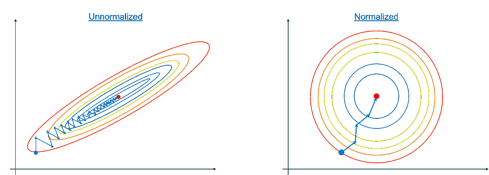
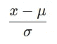
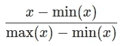
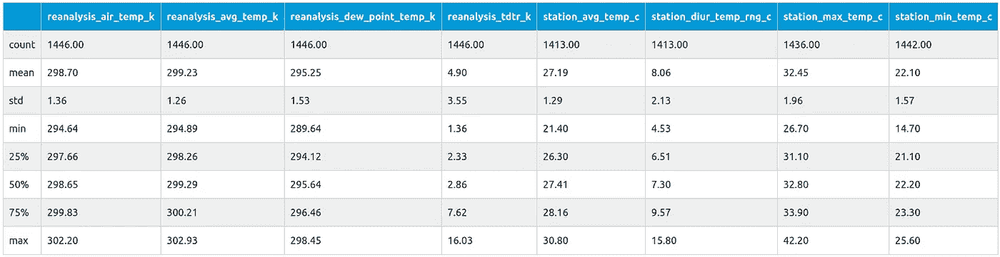
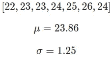
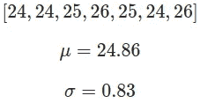

# 邓艾—数据预处理

> 原文：<https://towardsdatascience.com/dengai-data-preprocessing-28fc541c9470?source=collection_archive---------44----------------------->

## 理解 ML

## 如何对 ML 比赛的数据进行预处理？基于邓艾的例子。

> *本文基于我在 DrivenData 平台* *上参加* [*邓艾比赛。我的得分在 0.2%以内(截至 2020 年 6 月 2 日，14/9069)。*](https://www.drivendata.org/competitions/44/dengai-predicting-disease-spread/)

在本文中，我假设你已经熟悉了[邓艾——埃达](/dengai-how-to-approach-data-science-competitions-eda-22a34158908a)。你不需要读它来理解这里的一切，但是如果你读了，就会容易得多。

# 为什么要对数据进行预处理？

当设计 ML 模型时，我们必须记住其中一些是基于梯度法的。梯度的问题在于它在归一化/缩放数据上表现得更好。让我举个例子:



*梯度下降的例子。*

在左侧，我们有一个由两个要素组成的数据集，其中一个要素的比例比另一个要素大。在这两种情况下，梯度方法都有效，但是当要素位于相似的比例上时，达到最佳效果所需的步骤要少得多(右图)。

# 什么是正常化，什么是缩放？

## [正常化](https://en.wikipedia.org/wiki/Normalization_(statistics))

在标准意义上，规范化是指调整值分布范围以适应 **< -1，1 >** 的过程(id 不必精确到-1 比 1，但在同一数量级内，因此范围)。通过**从集合中的每个值中减去平均值，并将结果除以标准偏差**来完成标准归一化。



## [缩放](https://en.wikipedia.org/wiki/Feature_scaling#Rescaling_(min-max_normalization))

你可以看到它被称为“最小-最大归一化”，但缩放是另一个值调整以适应范围，但这次范围是 **< 0，1 >** 。



# 归一化还是缩放？

您可以对特征执行两种类型的操作。您可以标准化或缩放其值。选择哪一个取决于特性本身。如果您认为要素具有一些正值和负值，并且这些值很重要，则应该执行规范化。在负值没有意义的特征上，应该应用缩放。

并不总是非黑即白。让我们考虑一个特征，比如温度。取决于你选择的刻度(开尔文或摄氏/华氏),温度可能会有不同的解释。开尔文温标是**绝对热力学温标**(从绝对零度开始，不能低于绝对零度)。另一方面，我们有使用 IRL 的标度，负数对我们有意义。当温度降到摄氏零度以下时，水就结冰了。华氏温标也是如此，它的 0 度描述了[盐水](https://en.wikipedia.org/wiki/Brine)(盐在水中的浓缩溶液)的冰点。直截了当的选择是缩放开尔文，并使摄氏和华氏温度正常化。这并不总是奏效。我们可以在邓艾的数据集上展示它:



有些温度在开氏温标上，有些在摄氏温标上。这在这里并不重要。如果您仔细观察，您应该能够按类型对这些温度进行分组:

*   绝对最小值温度
*   没有绝对最小值的温度(可以是负值)

第一个例子是 **station_diur_temp_rng_c** 。这就是所谓的[日温度变化](https://en.wikipedia.org/wiki/Diurnal_temperature_variation)，它定义了一段时间内最低和最高温度之间的变化。该值不能为负值(因为最小值和最大值之差不能小于 0)。这就是我们应该使用缩放而不是归一化的地方。

再比如**再分析 _ 空气 _ 温度 _k** 。它是空气温度和重要特征。我们无法定义温度可能达到的最小值。如果我们真的希望每个城市都有一个任意的最低温度，我们永远不能低于这个温度，但这不是我们想要做的。在训练模型时，像我们这样的问题中的温度这样的东西可能有另一种意义。温度值可能有一些积极和消极的影响。在这种情况下，温度低于 298K 可能会对一些病例产生积极影响(蚊子减少)。这就是为什么我们应该对这个使用规范化。

检查整个数据集后，我们可以得出要归一化、缩放的特征列表，并从[我们的特征列表](https://erdem.pl/2020/07/deng-ai-how-to-approach-data-science-competitions-eda#dataset)中复制:

## 标准化特征

```
'reanalysis_air_temp_k'
'reanalysis_avg_temp_k'
'reanalysis_dew_point_temp_k'
'reanalysis_max_air_temp_k'
'reanalysis_min_air_temp_k'
'station_avg_temp_c'
'station_max_temp_c'
'station_min_temp_c'
```

## 缩放特征

```
'station_diur_temp_rng_c'
'reanalysis_tdtr_k'
'precipitation_amt_mm'
'reanalysis_precip_amt_kg_per_m2'
'reanalysis_relative_humidity_percent'
'reanalysis_sat_precip_amt_mm'
'reanalysis_specific_humidity_g_per_kg'
'station_precip_mm'
'year'
'weekofyear'
```

## 复制的特征

```
'ndvi_ne'
'ndvi_nw'
'ndvi_se'
'ndvi_sw'
```

# 为什么要复制？

如果我们看看 NDVI 指数的定义，我们可以决定没有理由缩放或标准化这些值。NDVI 值已经在 **< -1、>** 范围内。有时我们可能想像这样直接复制值。尤其是当原始值与我们的归一化特征处于同一数量级时。它可能是< 0，2 >或< 1，4 >，但它不会给模型带来问题。

# 代码

现在，我们必须编写一些代码来预处理我们的数据。我们将使用 [sklearn](https://scikit-learn.org/stable/) 库中的 [StandardScaler](https://scikit-learn.org/stable/modules/generated/sklearn.preprocessing.StandardScaler.html) 和 [MinMaxScaler](https://scikit-learn.org/stable/modules/generated/sklearn.preprocessing.MinMaxScaler.html) 。

作为函数的输入，我们希望发送 3 或 4 个变量。在处理训练集时，我们发送 3 个变量:

*   训练数据集(如熊猫数据帧)
*   要规范化的列列表
*   要缩放的列列表

当我们处理训练数据时，我们必须为缩放/标准化过程定义数据集。该数据集用于获取平均值**或标准差**等值。因为在处理训练数据集时，我们没有任何外部数据集，所以我们使用训练数据集。在第 19 行，我们使用`StandardScaler()`对选择的列进行规范化:

StandardScaler 在初始化时不需要任何参数，但它需要缩放数据集以适应。我们可以只通过两次`new_data`就可以了，但是我们需要为测试数据集创建另一个预处理。

接下来，我们要做同样的事情，但是用的是`MinMaxScaler()`。

这一次，我们传递一个名为`feature_range`的参数，以确保我们的比例在范围< 0，1 >内。和前面的例子一样，我们传递缩放数据集来适应和转换所选的列。

最后，我们返回转换后的`new_data`和另外的`train_scale`用于进一步的预处理。但是等一下！什么进一步的预处理？请记住，我们不仅要处理训练数据集，还要处理测试数据集。我们必须对它们应用相同的数据处理，以使模型具有相同的输入。如果我们简单地以同样的方式对测试数据集使用`preproc_data()`，我们将应用完全不同的标准化和缩放。原因是因为归一化和缩放是通过`.fit()`方法完成的，并且该方法使用一些给定的数据集来计算**平均值**和其他所需的值。如果您使用的测试数据集可能具有不同的值范围(由于全球变暖等原因，夏天很热。)您在测试数据集中的值 28C 将使用不同的参数进行标准化。让我给你看一个例子:

训练数据集:



测试数据集:



使用训练数据集中的平均值和标准差对测试数据集进行归一化，得到:

[0.11,0.11,0.91,1.71,0.91,0.11,1.71]

但是，如果您使用测试数据集中的平均值和标准差，您最终会得到:

[−1.04,−1.04,0.17,1.37,0.17,−1.04,1.37]

你可能认为第二个更好地描述了数据集，但这只适用于只处理测试数据集的情况。

这就是为什么在构建我们的模型时，我们必须像这样执行它:

# 结论

我们刚刚完成了一个非常标准的数据集标准化过程。理解标准化和缩放之间的区别很重要。另一件可能更重要的事情是归一化的特征选择(不同温度特征的例子)，你应该总是试图理解你的特征，而不仅仅是应用一些来自互联网的硬编码规则。

我必须提到的最后一件事(你可能已经想到了)是训练和测试数据集中的数据范围之间的差异。您知道测试数据的标准化应该使用来自训练数据的变量来完成，但是我们不应该调整过程以适应不同的范围吗？假设训练数据集的温度范围在 15℃和 23℃之间，测试数据集的温度范围在 18℃和 28℃之间。这难道不是我们模型的问题吗？实际上不是:)模型并不真的关心这样的小变化，因为它们是在逼近连续函数(或分布)，除非你的范围相差很大(来自不同的分布)，否则你不应该有任何问题。

*最初发布于*[*https://erdem . pl*](https://erdem.pl/2020/08/deng-ai-data-preprocessing)*。*