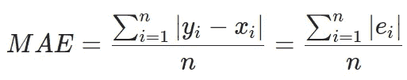
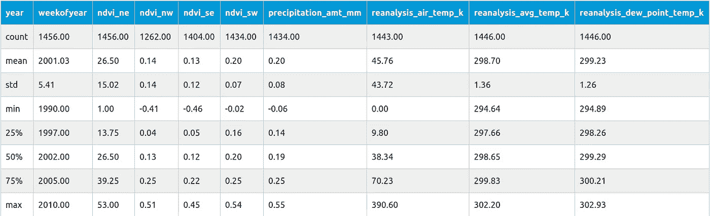
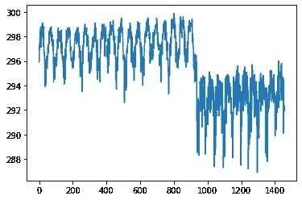
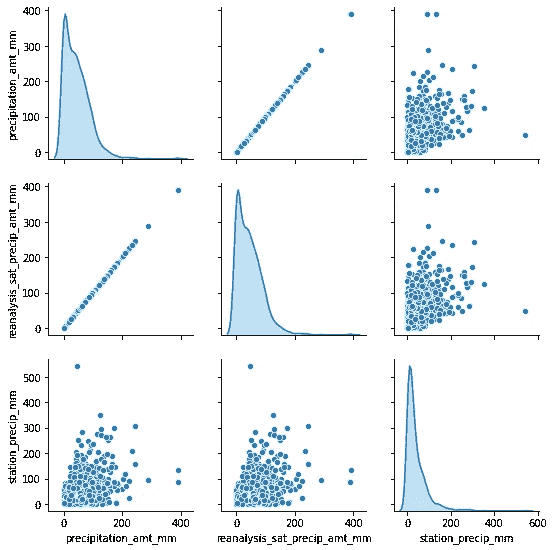
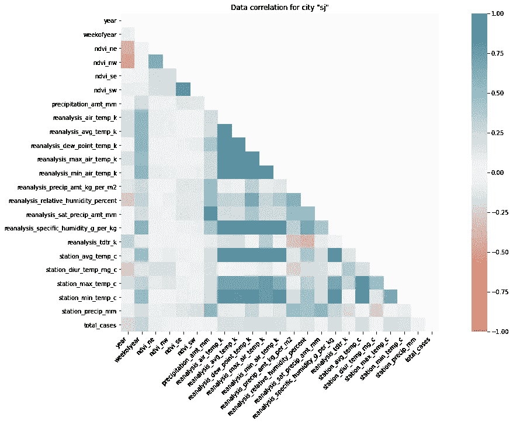
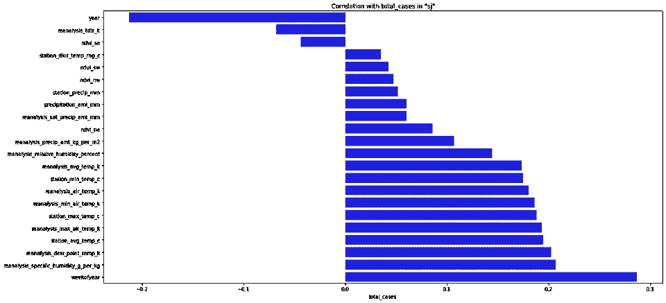
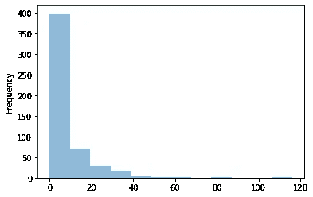

# 邓艾—如何对待数据科学竞赛？(EDA)

> 原文：<https://towardsdatascience.com/dengai-how-to-approach-data-science-competitions-eda-22a34158908a?source=collection_archive---------38----------------------->

## 理解 ML

## 一步一步解释如何应对类似的竞争。哪些是我们应该重点关注的，哪些是应该忽略的？


*蚊子 CC BY-NC-ND 2.0。来源:* [*flickr 用户赛诺菲巴斯德*](https://www.flickr.com/photos/sanofi-pasteur/5284040324/in/photolist-93W66w-arV2fF-3p8QNh-cnF7KE-cnF7Mj-cnF8a7-3p8RvU-cnF88u-cnF7Nu-arXFfy-cnF7J7-arXFto-arXDno-cnF7Hb-rwLX9d-cnF7UC-yM76y7-cnF7Ps-cnF85Q-cnF84G-cnF7TE-9wSDw-e4U78V-qRQpJa-e8GxDY-d4YEBA-d4YEwu-e8AVyt-e8GoTN-cnF873-4Gq9Y9-cnFty3-cnF7SQ-c3urbq-cnF7RY-qRJm2d-cnF7VL-62BwyV-qRJj2S-r9i7QB-r99a5k-62Bwt8-c3urhL-c3urd5-5xe7XE-pNRXZp-qRSbMx-pocK57-5xe13J-cnF7XY)

> *本文基于我在 DrivenData 平台* *上参加* [*邓艾大赛。我的得分在 0.2%以内(截至 2020 年 6 月 2 日，14/9069)。这里提出的一些想法是严格为这样的比赛设计的，可能没什么用。*](https://www.drivendata.org/competitions/44/dengai-predicting-disease-spread/)

在开始之前，我必须提醒您，对于更高级的数据工程师来说，有些部分可能是显而易见的，这是一篇很长的文章。你可以一节一节地读，或者只挑选你感兴趣的部分:

[邓艾，数据预处理](/dengai-data-preprocessing-28fc541c9470)

*更多零件即将推出…*

# 问题描述

首先，我们需要讨论比赛本身。邓艾的目标是(实际上，此时此刻甚至是，因为 DrivenData 的管理部门决定让它成为“正在进行的”比赛，所以你可以参加并亲自尝试)根据天气数据和位置预测特定周内的登革热病例数。每个参与者都有一个[训练数据集](https://github.com/burnpiro/dengai-predicting-disease-spread/blob/master/dengue_features_train.csv)和[测试数据集](https://github.com/burnpiro/dengai-predicting-disease-spread/blob/master/dengue_features_test.csv)(非验证数据集)。 **MAE** ( **平均绝对误差**)是一个用于计算得分的指标，训练数据集覆盖了 2 个城市 28 年的周值(1456 周)。测试数据较小，跨越 5 年和 3 年(取决于城市)。

对于那些不知道的人来说，登革热是一种蚊子传播的疾病，发生在世界的热带和亚热带地区。因为它是由蚊子携带的，所以传播与气候和天气变量有关。

# 资料组

如果我们看一下训练数据集，它有多个特征:

**城市和日期指示器:**

*   **城市** —城市缩写: **sj** 代表圣胡安 **iq** 代表伊基托斯
*   **week_start_date** —以 yyyy-mm-dd 格式给出的日期

**NOAA 的 GHCN 每日气候数据气象站测量:**

*   **最高温度温度** —最高温度
*   **车站最低温度** —最低温度
*   **station_avg_temp_c** —平均温度
*   **station_precip_mm** —总降水量
*   **station _ diur _ temp _ RNG _ c**—日温度范围

**波兰卫星降水测量(0.25x0.25 度刻度):**

*   **降水量 _ 降雨量 _ 毫米** —总降水量

**NOAA 的 NCEP 气候预报系统再分析测量值(0.5x0.5 度尺度):**

*   **再分析 _sat_precip_amt_mm** —总降水量
*   **再分析 _ 露点温度 _k** —平均露点温度
*   **再分析 _ 空气温度 _k** —平均空气温度
*   **再分析 _ 相对湿度 _ 百分比** —平均相对湿度
*   **再分析 _ 比湿度 _ 克/千克** —平均比湿度
*   **再分析 _ 降水量 _ 千克/平方米** —总降水量
*   **再分析 _ 最高空气温度 _k** —最高空气温度
*   **再分析 _ 最小空气温度 _k** —最低空气温度
*   **再分析 _ 平均温度 _k** —平均气温
*   **再分析 _tdtr_k** —日温差

**卫星植被——归一化差异植被指数(NDVI)——NOAA 的 CDR 归一化差异植被指数(0.5x0.5 度标度)测量:**

*   **ndvi_se** —城市质心东南方向的像素
*   **ndvi_sw** —城市质心西南方向的像素
*   **ndvi_ne** —城市质心东北方向的像素
*   **ndvi_nw** —城市质心西北的像素

此外，我们还有每周**总例数**的相关信息。

很容易发现，对于数据集中的每一行，我们都有多个描述相似类型数据的特征。有四个类别:

-温度
-降水
-湿度
- ndvi(这四个特征指的是城市中不同的点，所以它们不是完全相同的数据)

因此，我们应该能够从输入中删除一些冗余数据。我们不能随机选择一个温度。如果我们只看温度数据，范围(最小值、平均值、最大值)和类型(平均露点或昼夜)之间是有区别的。

## 输入示例:

```
week_start_date 1994-05-07
total_cases 22
station_max_temp_c 33.3
station_avg_temp_c 27.7571428571
station_precip_mm 10.5
station_min_temp_c 22.8
station_diur_temp_rng_c 7.7
precipitation_amt_mm 68.0
reanalysis_sat_precip_amt_mm 68.0
reanalysis_dew_point_temp_k 295.235714286
reanalysis_air_temp_k 298.927142857
reanalysis_relative_humidity_percent 80.3528571429
reanalysis_specific_humidity_g_per_kg 16.6214285714
reanalysis_precip_amt_kg_per_m2 14.1
reanalysis_max_air_temp_k 301.1
reanalysis_min_air_temp_k 297.0
reanalysis_avg_temp_k 299.092857143
reanalysis_tdtr_k 2.67142857143
ndvi_location_1 0.1644143
ndvi_location_2 0.0652
ndvi_location_3 0.1321429
ndvi_location_4 0.08175
```

## 提交格式:

```
city,year,weekofyear,total_cases
sj,1990,18,4
sj,1990,19,5
...
```

## 分数评估:



# 数据分析

在开始设计模型之前，我们需要查看原始数据并修正它。为了实现这个目标，我们将使用[熊猫图书馆](https://pandas.pydata.org/)。通常，我们可以直接导入`.csv`文件，并在导入的数据帧上工作，但有时(尤其是当第一行没有列描述时)我们必须提供列的列表。

```
import pandas as pd
pd.set_option("display.precision", 2)

df = pd.read_csv('./dengue_features_train_with_out.csv')
df.describe()
```

Pandas 有一个名为`describe`的内置方法，可以显示数据集中列的基本统计信息。



自然，这种方法只对数字数据有效。如果我们有非数字列，我们必须先做一些预处理。在我们的例子中，唯一的分类列是**城市**。该列只包含两个值 **sj** 和 **iq** ，我们将在稍后处理它。

回到主桌。每行包含不同种类的信息:

*   **计数** —描述非 NaN 值的个数，基本上有多少值是正确的，不是空数
*   **平均值** —整列的平均值(用于归一化)
*   **std** —标准偏差(也适用于标准化)
*   **最小值**->-**最大值**-显示包含值的范围(对缩放有用)

让我们从**计数**开始。知道数据集中有多少条记录有缺失数据(一条或多条)并决定如何处理它们是很重要的。如果你看一下 **ndvi_nw** 值，13.3%的情况下是空的。如果您决定用像 0 这样的任意值替换丢失的值，这可能是一个问题。通常，这个问题有两种常见的解决方案:

*   设置一个**平均值**值
*   做**插补**

**插值(处理缺失数据)**

当处理系列数据时(就像我们所做的那样)，从相邻数据中插值(仅从相邻数据中求平均值)比用整个集合的平均值替换更容易。通常，系列数据在系列中的值之间有一定的相关性，使用邻居会得到更好的结果。我给你举个例子。

假设您正在处理温度数据，并且您的整个数据集由从 1 月到 12 月的值组成。全年的平均值将是全年大部分时间里缺失天数的无效替代。如果你从 7 月开始计算天数，那么你可能会得到类似于 **[28，27，-，30]** (或者 **[82，81，-，86]** 的值，对于那些喜欢英制单位的人来说)。如果那是一个伦敦，那么年平均温度是**11 摄氏度**(或 52 华氏度)。在这种情况下使用 11 条接缝是错误的，不是吗？这就是为什么我们应该使用插值而不是平均值。通过插值(即使在有更大间隙的情况下)，我们应该能够获得更好的结果。如果你计算值，你应该得到(27+30)/2=28.5 和(28.5+30)/2=29.25，所以最后我们的数据集看起来像**【28，27，28.5，29.25，30】**，比**【28，27，11，11，30】**好得多。

**将数据集分割成城市**

因为我们已经介绍了一些重要的内容，所以让我们定义一个方法，该方法允许我们将分类列( **city** )重新定义为二进制列向量并插入数据:

```
def extract_data(train_file_path, columns, categorical_columns=CATEGORICAL_COLUMNS, categories_desc=CATEGORIES,
                 interpolate=True):
    # Read csv file and return
    all_data = pd.read_csv(train_file_path, usecols=columns)
    if categorical_columns is not None:
        # map categorical to columns
        for feature_name in categorical_columns:
            mapping_dict = {categories_desc[feature_name][i]: categories_desc[feature_name][i] for i in
                            range(0, len(categories_desc[feature_name]))}
            all_data[feature_name] = all_data[feature_name].map(mapping_dict)

        # Change mapped categorical data to 0/1 columns
        all_data = pd.get_dummies(all_data, prefix='', prefix_sep='')

    # fix missing data
    if interpolate:
        all_data = all_data.interpolate(method='linear', limit_direction='forward')

    return all_data
```

> *所有常量(如 CATEGORICAL _ COLUMNS)都在* [***本要诀***](https://gist.github.com/burnpiro/30610b5cf9fd685905fe36a0572ab292) *中定义。*

该函数返回一个数据集，该数据集包含两个名为 **sj** 和 **iq** 的二进制列，它们具有真值，其中 **city** 被设置为 **sj** 或 **iq** 。

## 绘制数据

绘制数据以直观地了解数值在系列中的分布是很重要的。我们将使用一个名为 [Seaborn](https://seaborn.pydata.org/) 的库来帮助我们绘制数据。

```
sns.pairplot(dataset[["precipitation_amt_mm", "reanalysis_sat_precip_amt_mm", "station_precip_mm"]], diag_kind="kde")
```



*训练数据集中的再分析最小空气温度 k*

这里我们只有数据集的一个特征，我们可以清楚地区分季节和城市(平均值从大约 297K 下降到大约 292K 的点)。

另一件有用的事情是不同特征之间的**对相关性**。这样，我们就能够从数据集中移除一些冗余的要素。



*降水成对图*

正如您所注意到的，我们可以立即删除其中一个降水特征。起初这可能是无意的，但因为我们有来自不同来源的数据，同类数据(如降水量)不会总是彼此完全相关。这可能是由于不同的测量方法或其他原因。

## 数据相关性

当处理大量特征时，我们不需要像那样为每一对绘制配对图。另一种选择是计算叫做**的相关性分数**。不同类型的数据有不同类型的相关性。因为我们的数据集只包含数字数据，所以我们可以使用名为`.corr()`的内置方法来为每个城市生成相关性。

> *如果存在不应被视为二进制的分类列，您可以计算* [*克莱姆的 V 关联度量*](https://en.wikipedia.org/wiki/Cram%C3%A9r%27s_V) *来找出它们与其余数据之间的“相关性”。*

```
import pandas as pd
import seaborn as sns

# Importing our extraction function
from helpers import extract_data
from data_info import *

train_data = extract_data(train_file, CSV_COLUMNS)

# Get data for "sj" city and drop both binary columns
sj_train = train_data[train_data['sj'] == 1].drop(['sj', 'iq'], axis=1)

# Generate heatmap
corr = sj_train.corr()
mask = np.triu(np.ones_like(corr, dtype=np.bool))
plt.figure(figsize=(20, 10))
ax = sns.heatmap(
    corr, 
     mask=mask, 
    vmin=-1, vmax=1, center=0,
    cmap=sns.diverging_palette(20, 220, n=200),
    square=True
)
ax.set_title('Data correlation for city "sj"')
ax.set_xticklabels(
    ax.get_xticklabels(),
    rotation=45,
    horizontalalignment='right'
);
```



*SJ 市的特征相关性*

你可以对 iq 城市做同样的事情，并比较两者(相关性不同)。

如果你看这张热图，很明显哪些特征是相互关联的，哪些是不关联的。你应该知道正相关和负相关(深蓝和深红)。不相关的特征是白色的。存在多组正相关的特征，并且不出所料，它们指的是相同类型的测量(在 *station_min_temp_c* 和 *station_avg_temp_c* 之间的相关性)。但不同种类的特征之间也有相关性(如*再分析 _ 比 _ 湿度 _ 克 _ 每 _ 千克*和*再分析 _ 露点 _ 温度 _k* )。我们还应该关注 **total_cases** 和其余特性之间的相关性，因为这是我们必须预测的。

这一次我们运气不佳，因为没有什么与我们的目标有很强的相关性。但是我们仍然应该能够为我们的模型选择最重要的特性。查看热图现在没什么用，所以让我切换到条形图。

```
sorted_y = corr.sort_values(by='total_cases', axis=0).drop('total_cases')
plt.figure(figsize=(20, 10))
ax = sns.barplot(x=sorted_y.total_cases, y=sorted_y.index, color="b")
ax.set_title('Correlation with total_cases in "sj"')
```



*与 sj 市目标值的相关性*

通常，在为我们的模型挑选特征时，我们选择与我们的目标具有最高绝对相关值的特征。由你来决定选择多少功能，你甚至可以选择所有的功能，但这通常不是最好的主意。

查看目标值在我们的数据集中是如何分布的也很重要。我们可以用熊猫轻松做到这一点:


***sj*** *总例数直方图*



***智商*** *总例数直方图*

平均一周的案件数量相当低。只是偶尔(一年一次)，病例总数会跳到某个更高的值。在设计我们的模型时，我们需要记住这一点，因为即使我们设法找到了“跳跃”,我们也可能在很少或没有案例的几周内损失很多。

## 什么是 NDVI 值？

最后我们要讨论的是本文中的一个 **NDVI 指数** ( [归一化差异植被指数](https://en.wikipedia.org/wiki/Normalized_difference_vegetation_index))。这个指数是植被的指标。高负值对应于水，接近 0 的值代表岩石/沙子/雪，接近 1 的值代表热带森林。在给定的数据集中，每个城市有 4 个不同的 NDVI 值(每个值代表地图上的一个不同角落)。

即使整体 NDVI 指数对于理解我们正在处理的地形类型非常有用，如果我们需要为多个城市设计一个可能会派上用场的模型，但在这种情况下，我们只有两个城市的气候和在地图上的位置是已知的。我们不必训练我们的模型来确定我们正在处理哪种环境，相反，我们可以为每个城市训练两个单独的模型。

我花了一些时间试图利用这些值(特别是在这种情况下插值很难，因为我们在这个过程中使用了大量的信息)。使用 NDVI 指数也可能产生误导，因为数值的变化不一定与植被过程的变化相对应。

如果你想看看这些城市，请参考[圣胡安，波多黎各](https://www.google.com/maps/place/San+Juan,+Puerto+Rico/@18.2818311,-67.176171,8.79z/data=!4m5!3m4!1s0x8c03686fe268196f:0xad6b7f0f5c935adc!8m2!3d18.4655394!4d-66.1057355)和[伊基托斯，秘鲁](https://www.google.com/maps/place/Iquitos,+Peru/@-3.7626024,-73.5930914,9.54z/data=!4m5!3m4!1s0x91ea10b0e440c1cb:0x9210b8d7040a6692!8m2!3d-3.7436735!4d-73.2516326)。

# 结论

此时，您应该知道我们的数据集是什么样子的。我们甚至没有开始设计第一个模型，但已经知道一些功能没有其他功能重要，其中一些只是重复相同的数据。如果您需要从整篇文章中吸取一点经验，那就是“首先尝试理解您的数据！”。

# 参考资料:

*   邓艾:预测疾病传播[https://www . driven data . org/competitions/44/邓艾-预测-疾病-传播/](https://www.drivendata.org/competitions/44/dengai-predicting-disease-spread/)

*最初发布于*[*https://erdem . pl*](https://erdem.pl/2020/07/deng-ai-how-to-aproach-data-science-competitions-eda)*。*