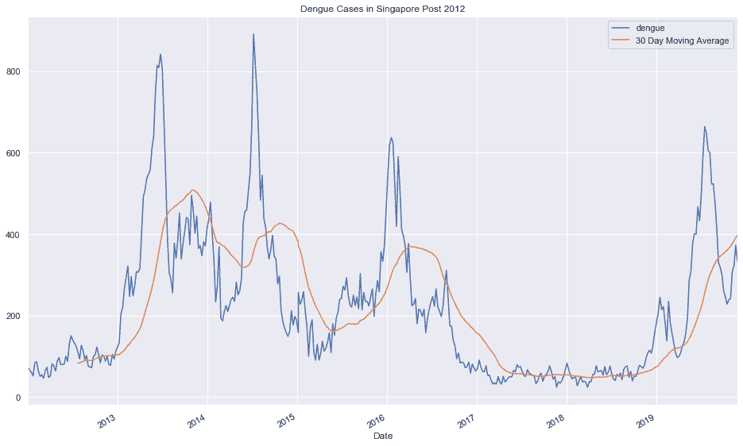
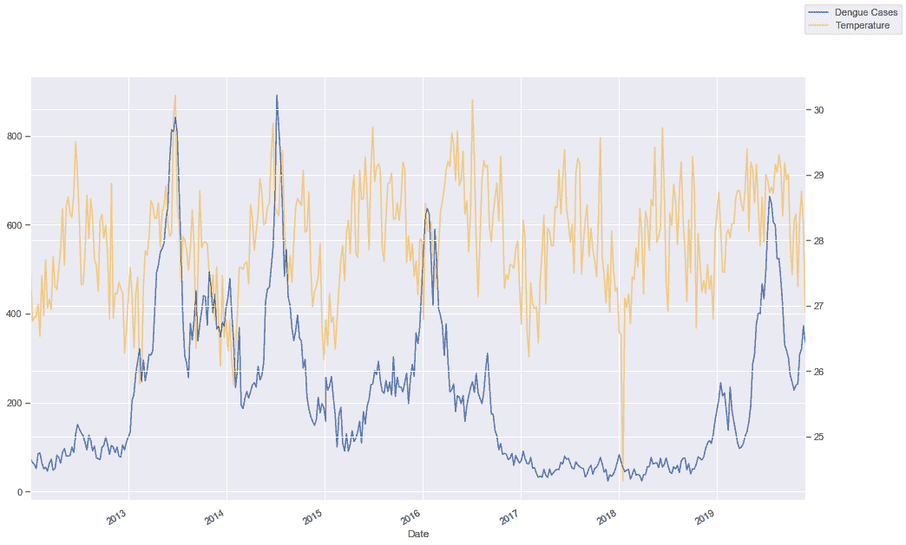
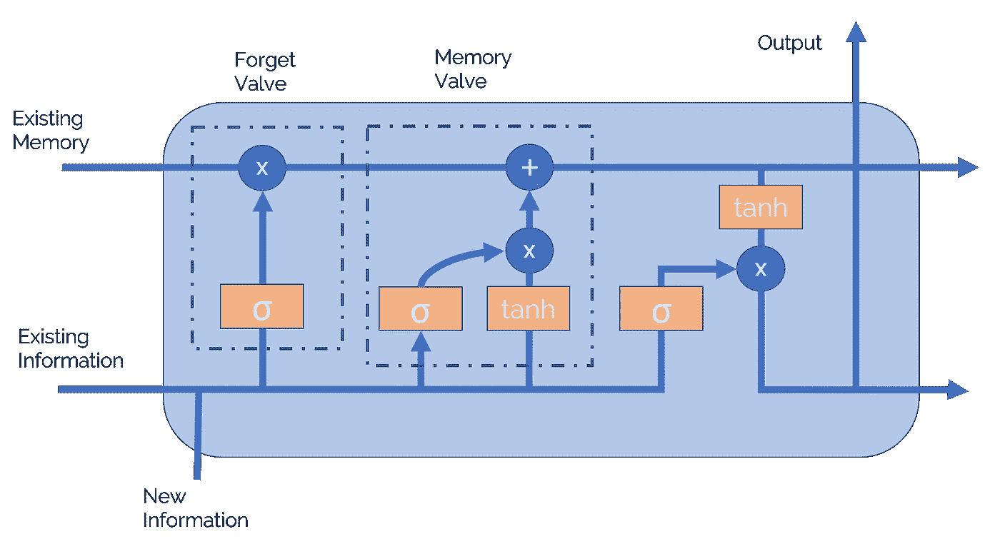
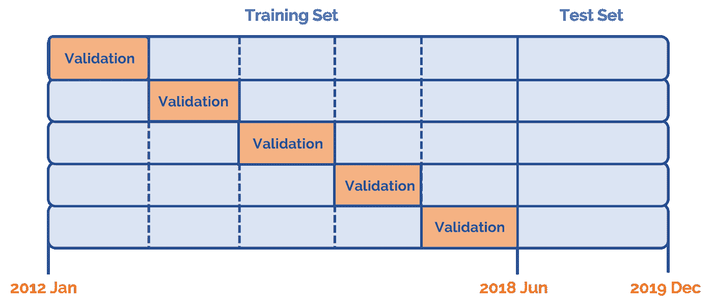
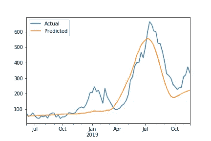

# 使用 XGBoost 和 LSTM 预测登革热

> 原文：<https://towardsdatascience.com/dengue-forecasting-using-xgboost-and-lstm-eb11e701b21d?source=collection_archive---------26----------------------->

## **新加坡的登革热**

每年有超过 5000 万人感染登革热病毒，这是一种由伊蚊传播的疾病，会导致高烧、皮疹和肌肉疼痛。在严重的情况下，病毒甚至会引起休克和出血，导致虚弱的受害者死亡。在新加坡，每天平均有 80 人感染登革热，在严重疫情期间，这一数字会飙升至 600 多人。

该图显示了 2012 年至 2019 年新加坡登革热病例的趋势。

2012 年至 2019 年新加坡的登革热感染病例

从图表中，我们观察到登革热病例通常会经历大约 3-4 个月的高峰，并需要大约相同的时间才能恢复到原始值。这一数据在很大程度上与登革热是一种容易暴发的传染性疾病相一致。然而，为了充分理解这些数据，我们必须研究影响登革热爆发的因素。

# 预测的重要性

利用各种数据集，我们能够建立一个机器学习模型来预测新加坡的登革热趋势。我们的方法考虑了前几周感染登革热的现有人数和气象数据，因为这些是导致登革热传播的因素。

# 问题陈述

我们的机器学习模型的目的是能够提前 8 周预测登革热，因为这将允许政府卫生组织和公众采取必要的预防措施，防止登革热的传播。有了预测登革热发生的良好预测模型，这使得公共卫生组织和个人能够为登革热在新加坡的传播做好准备、进行管理和控制。

# 数据集

3 个不同的数据集用于训练预测模型

**登革热感染** —登革热是一种传染病，严重依赖于现有感染登革热的人数。蚊子可以被感染登革热的人感染。因此，现有的感染人数也是现有的感染登革热的蚊子数量的一个因素。

**降雨数据**——伊蚊在死水中产卵，暴雨期间蚊子数量可能会激增

**温度数据—** 雌性伊蚊的最佳进食温度为 28 度，此时它们最活跃。这个最佳区域之外的温度会导致较低的喂食率，从而降低感染率。

这些数据集是从新加坡的不同地理区域收集的。在某些地区，发现了缺失的数据。对于这些缺失的数据，我们以如下方式进行处理:

1.  如果在某个特定区域有相对较大比例的数据缺失，我们将从数据集中删除该区域/因子。
2.  对于剩余的数据集，我们用平均值代替缺失值。

温度与登革热爆发之间的轻微相关性

# 模特培训

我们选择使用的模型是一个堆叠的 XGBoost 和 LSTM 神经网络。首先，我们仅在登革热数据上使用 XGBoost 算法来训练模型，以便能够预测数据中爆发和恢复的潜在趋势。我们的数据集相对较小，只有 413 行，使用像神经网络这样的高方差算法可能会在开始时过度拟合数据。因此，我们仅使用 LSTM 层来调整预测中的任何残留误差，并微调我们的结果。

# XGBoost

XGBoost 是由陈天琦和 Carlos Guestrin 开发的一种集成机器学习算法，使用决策树和随机森林进行预测。集成机器学习是一种结合相同或不同类型算法的多个模型的预测能力的系统。集成学习有两种主要类型，bagging 和 boosting。Bagging 指的是聚合根据随机数据采样训练的不同模型，并取预测值的平均值。例如，在整个数据集的随机样本上训练 10 个决策树。总计将是 10 次预测的平均值。然而，Boosting 是按顺序建立模型的，每个后续的模型都从其前一个模型的错误中学习，并创建一个新的模型来纠正错误。例如，第二个决策树将预测第一个决策树的错误，因此最终的预测将是两个预测的总和。

XGBoost 使用增强决策树来得出最终预测。然而，它使用一种称为梯度下降的特殊算法来有效地减少误差。为了进一步利用机器的全部计算能力，XGBoost 算法优化了硬件和软件，以确保在最短的时间内以最高的效率训练模型。

# LSTM 神经网络

LSTM 层的性能改进

在将 XGBoost 应用于我们的数据集之后，我们训练一个长短期记忆网络来最小化我们的模型的剩余误差。LSTM 网络是递归神经网络(RNN)的变体，用于解决输入/输出序列。今天，LSTMs 被用于最先进的应用程序，如 Google Translate 和其他自然语言处理任务。鉴于我们正在处理的时间序列预测问题是一个序列问题，LSTMs 是一个很好的学习算法。

LSTM 电池简图

LSTM 网络对于评估序列是有用的，因为它们能够存储关于称为单元状态的序列的信息。该信息可以被传递到网络中的下一个 LSTM 单元，或者如果序列中的下一个元素包含更重要的信息，则该信息可以被覆盖。网络具有内置存储器的能力允许它学习更复杂的行为。

[https://colah.github.io/posts/2015-08-Understanding-LSTMs/](https://colah.github.io/posts/2015-08-Understanding-LSTMs/)

# 交叉验证

我们将整个数据集分为两部分，从 2012 年 1 月到 2018 年 6 月，这是训练集，而剩余的数据用作测试集来评估我们的模型。

使用 5 重 K 重交叉验证来学习学习算法的最佳超参数。

K-Fold 交叉验证的数据集划分

训练集被分成 5 个部分，模型对 80%的数据进行训练，并使用均方误差损失度量对最后 20%的数据进行评估。然后，具有最低误差的模型将用于评估测试集，以查看模型的最终误差。这个过程是为了防止数据泄漏，以确保模型总是基于全新的数据进行评估，并且能够很好地进行概括。

最重要的超参数是输入算法的数据的回顾周期。通过我们的测试，我们确定 55 周的回顾期是最佳的。这可能是由于持续约 55 周的爆发和恢复周期，这对预测很重要。

最大似然算法的回顾期

# 模型评估

最后，该模型用于预测 2018 年 6 月起的登革热数据。使用相同的均方误差指标，我们获得了大约 5872 的适度误差。从图中可以看出，该模型能够以相对较高的准确度预测重大疫情，并且没有滞后时间。这对于决策者能够先发制人地阻止疾病爆发非常有用。

Github 链接:【https://github.com/reoneo97/datathon3-denga 

*团队成员:Neo Zheng Jie Reo，Jonathan Chua En Zhe，Joshua Seetoh Dewei*

*本文是新加坡国立大学(理学院)与 Terra 联合举办的 Datathon 3.0 机器学习竞赛的一部分。艾*