# 去噪有噪声的文档

> 原文：<https://towardsdatascience.com/denoising-noisy-documents-6807c34730c4?source=collection_archive---------29----------------------->

## 计算机视觉技术

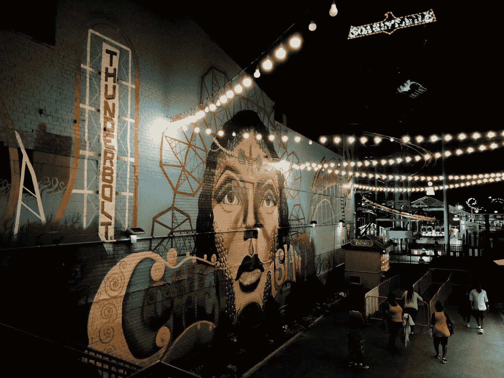

作者图片

无数的科学论文、历史文献/人工制品、食谱、书籍都以论文的形式储存，无论是手写的还是打印的。随着时间的推移，纸张/纸币往往会通过指纹、纸张纤维的弱化、灰尘、咖啡/茶渍、磨损、起皱等积累噪音/灰尘。有几种用于保存和清洁的表面清洁方法，但是它们有一定的局限性，主要的一个是:原始文件可能在处理过程中被改变。

我与[迈克尔·拉里](https://www.linkedin.com/in/michael-lally-a732bb112)和[卡提克亚·舒克拉](https://www.linkedin.com/in/kartikeya-shukla-738a48160)一起处理来自 [**加州大学欧文分校 NoisyOffice 数据集**](https://archive.ics.uci.edu/ml/datasets/NoisyOffice) 的嘈杂文档数据集。对脏文档去噪使得能够创建原始文档的更高保真度的数字再现。对文档去噪的几种方法，如中值滤波、边缘检测、膨胀&腐蚀、自适应滤波、自动编码和线性回归，被应用于测试数据集，并对它们的结果进行评估、讨论和比较。


来源: [UCI](https://archive.ics.uci.edu/ml/assets/logo.gif)

# 中值滤波

中值滤波是最简单的去噪技术，它遵循两个基本步骤:首先，使用核大小为 23 x 23 的中值滤波获得图像的“背景”，然后从图像中减去背景。只有“前景”会保留下来，清除背景中存在的任何噪声。在这种情况下，“前景”是文本或文档的重要细节，“背景”是噪音，文档元素之间的空白。

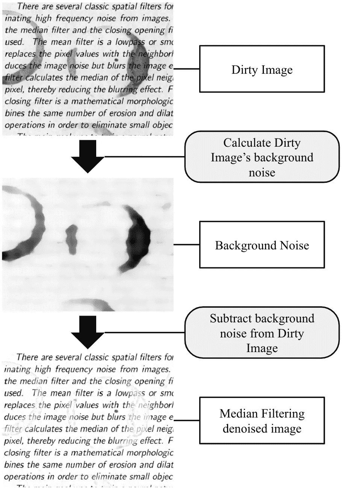

中值滤波流水线

# 边缘检测、膨胀和腐蚀(EDE 方法)

边缘检测方法识别图像亮度急剧变化的点，以将它们组织成边缘。

> Canny 边缘检测特别有助于提取边缘

在使用这些技术之前，图像被处理以去除噪声边缘。首先应用膨胀，通过向边界添加像素使线条变粗。请注意，这会导致“填充”文本，而污点周围的边缘保持中空。然后，通过应用相反的操作，腐蚀，可以完全去除细线，同时保留较粗的线。

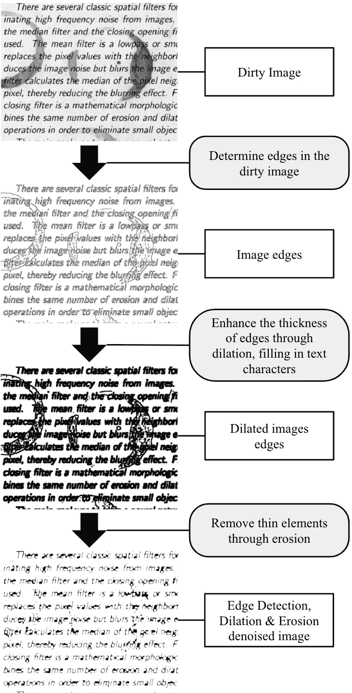

边缘检测流水线

# 自适应阈值

脏图像的另一个特征是文本比噪声更暗。在暗噪声中，里面的文本甚至更暗。

> 因此，目标是保留局部最暗的像素

阈值处理将强度高于阈值的所有像素设置为 1(背景)，其余像素设置为 0(前景)。在自适应阈值处理期间，没有单一的全局阈值:为每个像素计算阈值。为了确定阈值，我们使用高斯阈值。阈值是相邻像素强度的加权和，其中权重是高斯窗口

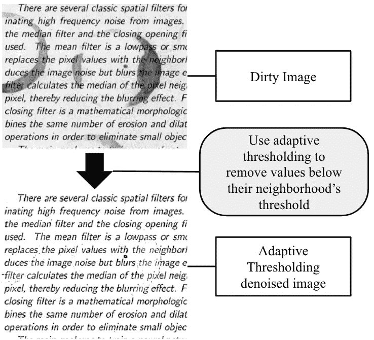

自适应阈值流水线

# 线性回归

我们不是一次模拟整个图像，而是尝试预测图像中每个像素的清除强度，并通过使用线性回归将一组预测的像素强度组合在一起来构建清除图像。在创建了 y 值的向量和 x 值的矩阵之后，最简单的数据集就是 x 值只是脏图像的像素亮度。

除了在极端情况下，脏图像和干净图像的亮度之间存在线性关系。当 y 接近 1 时，x 值分布很广，这些像素可能代表需要去除的污点。线性模型已经做了亮度和对比度校正。对于简单的最小二乘线性回归来说，这是相当好的性能！

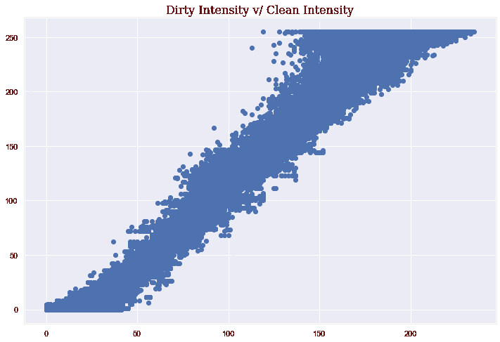

线性回归的强度图

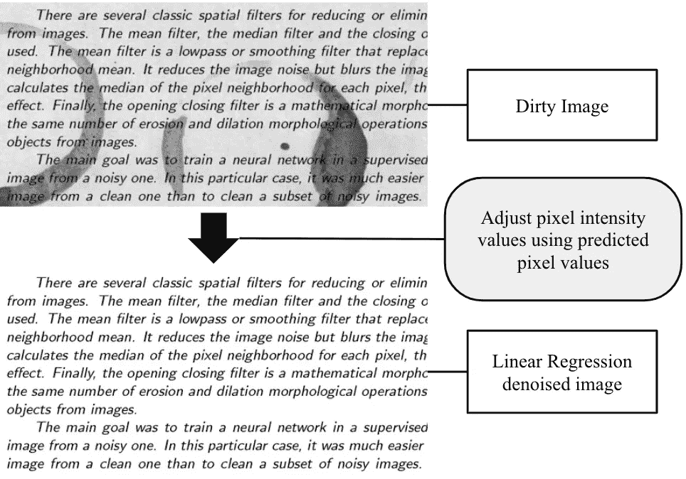

线性回归管道

# 自动编码器

自动编码器是由编码器和解码器组成的神经网络。编码器将输入数据压缩成低维表示。解码器重构该表示，以获得尽可能模拟输入的输出。这样，自动编码器学习输入数据的最显著的特征。

> 自动编码器与主成分分析(PCA)密切相关。如果自动编码器中使用的激活函数在每一层中是线性的，则潜在变量出现在瓶颈(网络中最小的层，aka。代码)直接对应于来自 PCA 的主分量

网络由 **5 个卷积层**组成，从图像中提取有意义的特征。在前四次卷积中，我们使用 **64 个内核**。每个核具有不同的权重，在输入层上执行不同的卷积，并产生不同的特征图。因此，卷积的每个输出由 64 个通道组成。

编码器使用**最大池**进行压缩。滑动滤波器在输入图像上运行，以构建更小的图像，其中每个像素是原始图像中由滤波器表示的区域的最大值。解码器使用**上采样**将图像恢复到其原始尺寸，只需简单地重复层输入的行和列，然后将其馈送到卷积层。

**批量标准化**减少了协方差移动，即各层之间激活分布的差异，并允许模型的每一层独立于其他层进行学习。

```
Model: "model_1"
_________________________________________________________________
Layer (type)                 Output Shape              Param #   
=================================================================
image_input (InputLayer)     (None, 420, 540, 1)       0         
_________________________________________________________________
Conv1 (Conv2D)               (None, 420, 540, 32)      320       
_________________________________________________________________
pool1 (MaxPooling2D)         (None, 210, 270, 32)      0         
_________________________________________________________________
Conv2 (Conv2D)               (None, 210, 270, 64)      18496     
_________________________________________________________________
pool2 (MaxPooling2D)         (None, 105, 135, 64)      0         
_________________________________________________________________
Conv3 (Conv2D)               (None, 105, 135, 64)      36928     
_________________________________________________________________
upsample1 (UpSampling2D)     (None, 210, 270, 64)      0         
_________________________________________________________________
Conv4 (Conv2D)               (None, 210, 270, 32)      18464     
_________________________________________________________________
upsample2 (UpSampling2D)     (None, 420, 540, 32)      0         
_________________________________________________________________
Conv5 (Conv2D)               (None, 420, 540, 1)       289       
=================================================================
Total params: 74,497
Trainable params: 74,497
Non-trainable params: 0
_________________________________________________________________
```

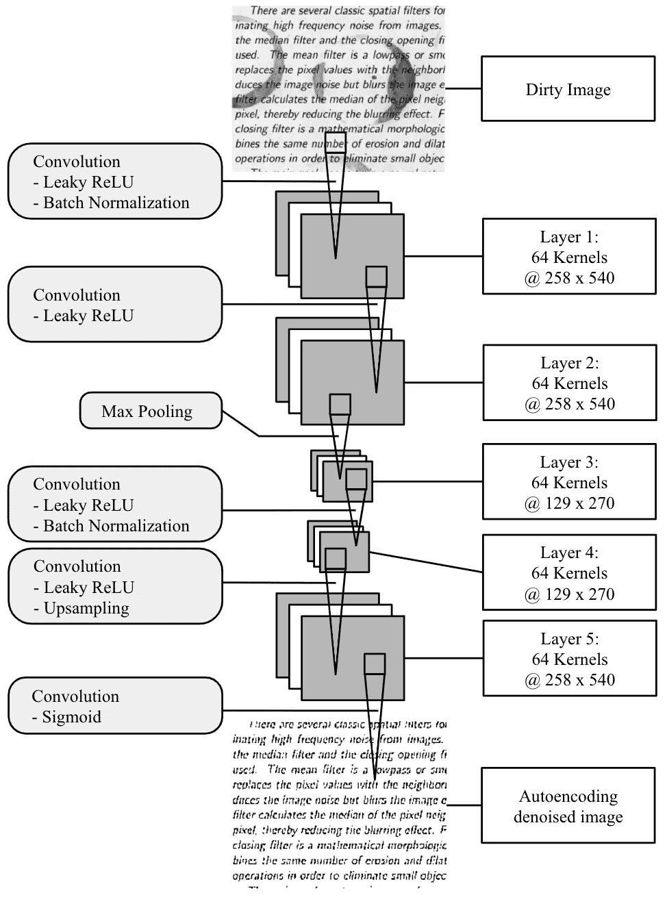

自动编码器管道

# 结果

来源:[吉菲](https://media.giphy.com/media/l2JdYIOL79carDNiE/giphy.gif)

## 中值滤波

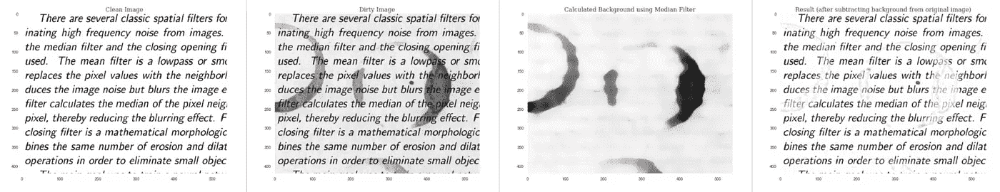

中值滤波结果

## 边缘检测、膨胀和腐蚀

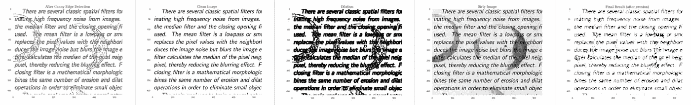

边缘检测结果

## 自适应阈值

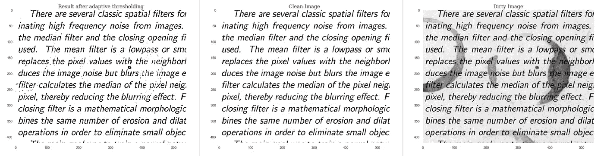

自适应阈值结果

## 线性回归

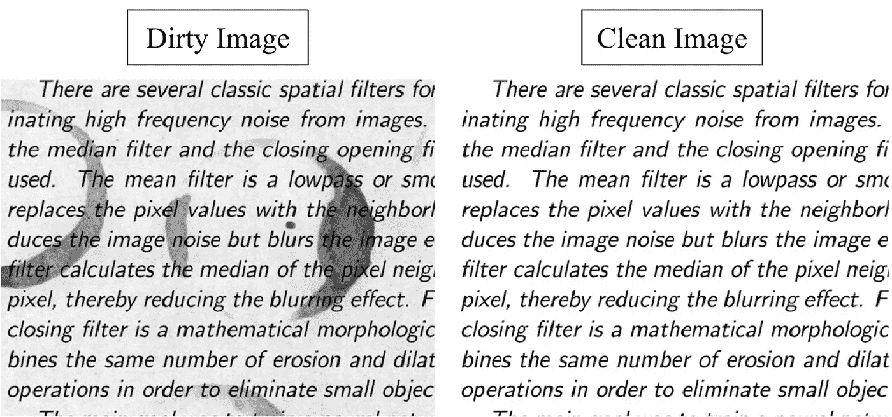

线性回归结果

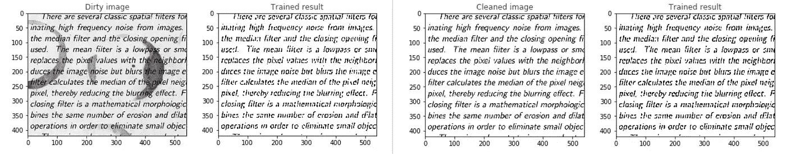

自动编码器结果

# 性能指标

## PSNR

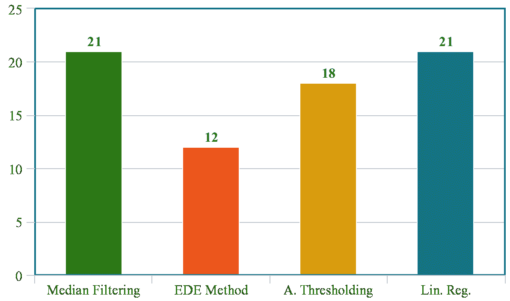

PSNR 比较结果

## 均方根误差

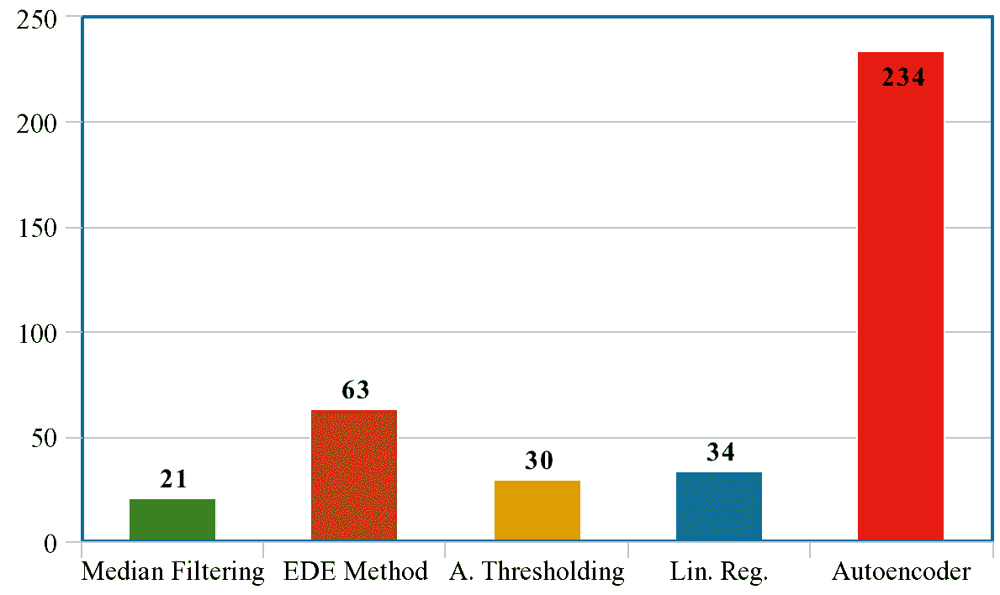

RMSE 比较结果

## UQI

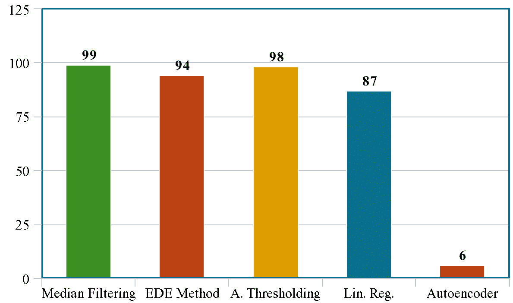

UQI 比较结果

# 体系结构

在观察了各种计算机视觉、机器学习和神经网络的结果后，我们想到将其部署为一个软件工具——“去噪器”，它托管在 AWS 上

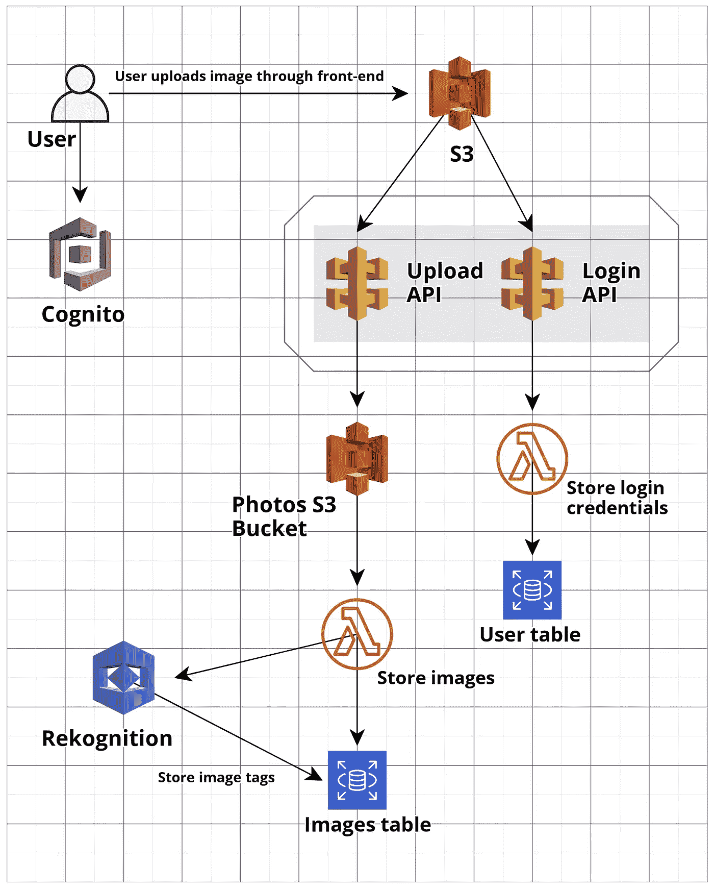

去噪器架构

# 密码

以下是比较研究的完整代码以及 AWS 上托管的应用程序:

[](https://github.com/gandalf1819/Denoise-Noisy-Docs) [## Gandalf 1819/降噪-噪音-文档

### 使用图像处理、机器学习、神经网络和自动编码器从嘈杂的文档中去除污点…

github.com](https://github.com/gandalf1819/Denoise-Noisy-Docs) 

# 参考

[1] F. Zamora-Martinez，S. Espan ̃a-Boquera 和 M. J. Castro-Bleda，
应用于文档增强的基于行为的神经网络聚类，载于:计算和环境智能，第 144- 151 页，Springer，2007 年。

[2] Z. Wang，A. C. Bovik“通用图像质量指数”, IEEE 信号处理通讯，第 9 卷，第 3 期，第 81–84 页，2002 年 8 月

[3]加州大学欧文分校 NoisyOffice 数据集:[https://archive.ics.uci.edu/ml/datasets/NoisyOffice](https://archive.ics.uci.edu/ml/datasets/NoisyOffice)

[4][https://medium . com/ill uin/cleaning-up-dirty-scanned-documents-with-deep-learning-2e 8 E6 de 6 cf a6](https://medium.com/illuin/cleaning-up-dirty-scanned-documents-with-deep-learning-2e8e6de6cfa6)