# 神经网络可解释性研究综述

> 原文：<https://towardsdatascience.com/dense-or-convolutional-part-2-interpretability-c310a9fd99a5?source=collection_archive---------23----------------------->

## 从简单的激活地图到复杂的地图集和网络视图

在这篇文章中，我们将对深度神经网络(DNN)的密集层和卷积层的可解释性进行比较，仍然专注于图像分类任务，使用 MNIST 或 CIFAR-10 数据集作为例子。但首先，让我们简单解释一下什么是可解释性，为什么需要可解释性。

劳拉·奥克尔在 [Unsplash](https://unsplash.com/?utm_source=medium&utm_medium=referral) 上的照片

在[第一部分](https://medium.com/analytics-vidhya/dense-or-convolutional-part-1-c75c59c5b4ad)中，我们以 MNIST 标准数据集为例，展示了卷积神经网络比密集神经网络性能更好、更纤细。如果这只是一个“运气”的问题怎么办:它在这个数据集上工作得很好，但如果数据集是不同的，或者手头的任务(即分类手写数字)正在发生变化(例如分类机器生成的数字)，就不会这样了。网络到底学到了什么？这些问题没有确定的答案。然而，在可解释性和对立的例子的保护伞下，有一个关于这个主题的积极研究的整个领域。

# 可解释性

DNN 是基于简单的数学运算，然而，在几个隐藏层上具有非线性激活的神经元的组合导致不能用数学公式评估的模型。DNN 的这一特性被 Roscher 称为缺乏透明性。解决这个问题的方法是通过可解释性，可解释性在同一篇文章中定义为:

> “可解释性的目的是用人类可以理解的术语呈现 ML 模型的一些特性。[……]解释可以通过可理解的代理模型获得，这种模型近似于更复杂方法的预测。”
> 
> [r . ROS cher，B. Bohn，M-F. Duarte 和 J. Garcke](https://arxiv.org/abs/1905.08883)

决策树很容易理解，因为可以看到每个决策变量-阈值的重要性。在深度神经网络中，没有这种决策工件，需要其他工具来检查网络内部。

# 直接检查

给定一个神经网络，我们可能会试图检查每一层的权重。这种方法有两个障碍。

首先，权重的数量很快就达到了数千，并且在最大的网络上达到了数亿。权重聚合是必需的，自然且不完美的统计工具是直方图。还有待发现聚合是如何进行的:按神经元单位还是按层？

[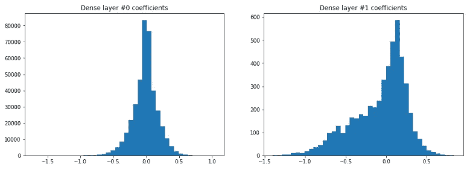](https://github.com/tonio73/data-science/blob/master/cnn/CnnVsDense-Part1.ipynb)

密集网络的两个层的权重直方图

鉴于它们的参数共享特性，卷积神经网络(CNN)有一个优势:卷积层的权值比稠密等效层低得多(见第 1 部分)。此外，给定卷积滤波器的图像/信号处理背景，表示它们的权重比密集层的权重的原始列表更有意义。不过，这只适用于小型网络和第一层。

[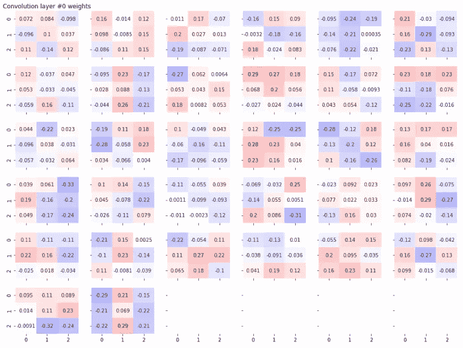](https://github.com/tonio73/data-science/blob/master/cnn/CnnVisualization-1-Activations.ipynb)

32 lenet 5 第一层的卷积滤波器权重

第二，只看一层的重量掩盖了各层之间的所有相互作用。我们回到上面提到的透明度问题。 [Tensorflow Playground](https://playground.tensorflow.org/) 具有这种相互作用的表示，其在层之间绘制漩涡，其宽度与连续神经元之间的相互作用成比例。但是，这种方法很难规模化。

[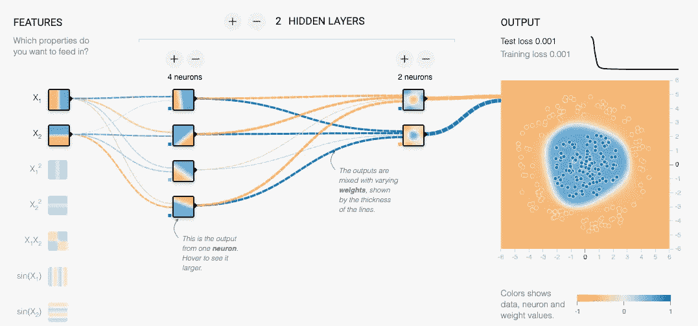](https://playground.tensorflow.org/)

神经网络的张量流操场表示

# 活化和梯度方法

观察网络的另一种方式是基于刺激:在图像分类网络的情况下是输入图像。

激活图是第一种基于刺激的解释方法:给定一幅图像或一小组图像，显示处理该图像时每个神经元的输出。这主要适用于 CNN，因为它们保留了图像的 2D 结构，并且只能根据前几层中的几何伪影(边缘、角)来解释。

[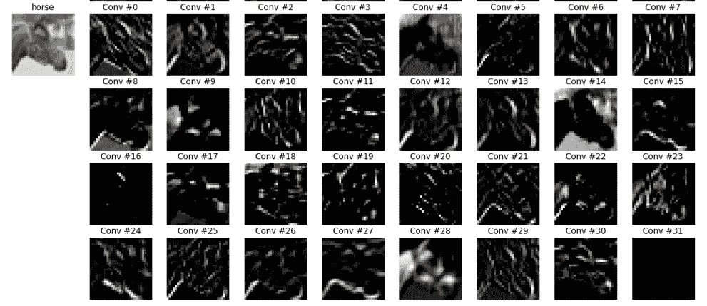](https://github.com/tonio73/data-science/blob/master/cnn/CnnVisualization-1-Activations.ipynb)

来自 CIFAR-10 的一幅马图像上 32 个卷积单元的激活图

自 2007 年以来，人们开发了更强大的方法，所有这些方法都基于同一个想法的梯度和变化:从一个给定的神经元单位或层，激活它的最佳输入是什么？

在这些方法中，我们可以列举:

- [可视化深层网络的高层特征，尔汗等人，2009](https://www.researchgate.net/publication/265022827_Visualizing_Higher-Layer_Features_of_a_Deep_Network)

- [可视化和理解卷积网络，泽勒等人，2013 年](https://arxiv.org/abs/1311.2901)

- [深入卷积网络内部:可视化图像分类模型和显著图，Simonyan 等人，2014 年](https://arxiv.org/pdf/1312.6034.pdf)

- [DeepLift:通过传播激活差异学习重要特征，Shrikumar 等人，2017](https://arxiv.org/pdf/1704.02685.pdf)

- [通过特征可视化了解神经网络:一项调查，Nguyen 等人，2019 年](http://www.evolvingai.org/files/1904.08939.pdf)

Erhan 和 Simonyan 的显著图基于反向传播到网络图像输入的梯度上升(下图中的橙色路径)。训练过程是相反的。在训练期间，图像是地面真实的一部分，并且网络权重被优化。如果要检查的神经元是网络的输出，我们将回到常规的深度神经网络优化，但具有冻结的层权重(下图中的蓝色路径)。

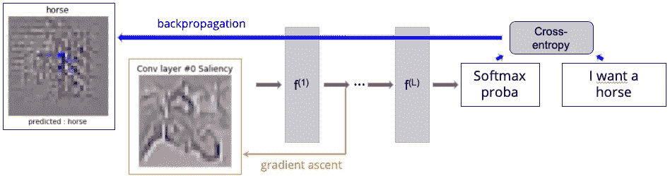

显著图原理

显著性图接近于对立的例子，因为有可能创建对网络有意义(即预测给定类别)但对我们的眼睛没有意义的图像。这里是一个例子，其中为 CIFAR-10 的 10 个类别中的每一个计算显著性，然后将其添加到 Concord 平面的图像中。对于大多数类别，CNN 预测显著性类别的裕度较大(概率超过 70%):

[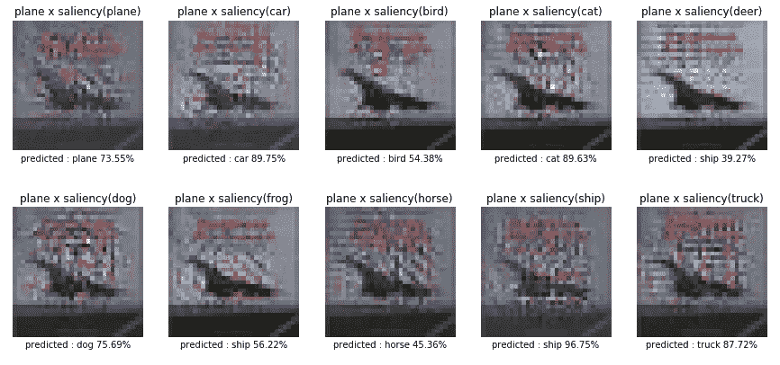](https://github.com/tonio73/data-science/blob/master/cnn/CnnVisualization-2-SaliencyMaps.ipynb)

从 CIFAR-10 数据集向协和平面添加显著性

初始输入图像(通常称为基线或先验)可以是中性灰色、随机噪声或我们想要检查的图像类别。在最后一种情况下，图像被修改，就像通过漫画。Nguyen 列出的更多最近的出版物一直在研究提高显著图的质量。主要的创新在于通过采样和聚集类来优化基线，以及正则化、增加图像中心上的梯度上升的焦点的惩罚和平滑度。

[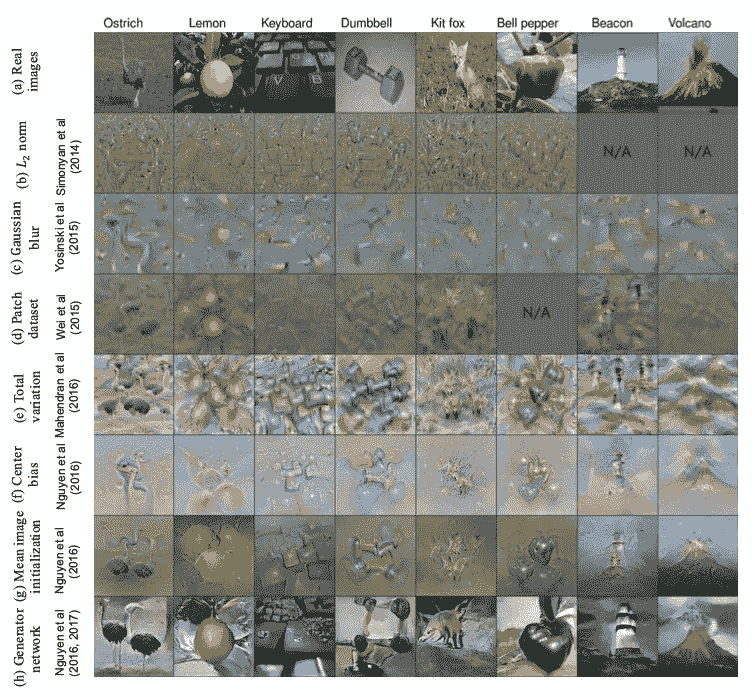](http://www.evolvingai.org/files/1904.08939.pdf)

Nguyen 在 2019 年对显著性图进行了审查

不过，这是神经网络的一个非常详细的视图，我们缺乏对类和层的概述。

# 降维

分类神经网络正在输出一个非常精炼和精简的度量:每一类的概率，更概括为概率最大的那一类的指标。基于这些，通常的度量是准确度，其仅计算匹配的预测类别相对于实际类别的数量。正如我在巴黎电信的一位老师所说:

> “分类神经网络的最后一层是一个非常简单的检测器，即 logistic 或多类回归(softmax)中的一种。该网络的强大之处在于，它是一个高度非线性的复杂函数，需要对该检测器的输入进行整形。”

许多信息出现在最后一层的输入端。它提供了对网络行为的洞察。然而，问题和以前的技术一样:维度非常高，不容易表示。

一套通用的降维技术被用于将这些高维空间显示为 2D(或 3D)空间中的流形:

## t 分布随机邻居嵌入(t-SNE)

> “t-分布式随机邻居嵌入(t-SNE)是一种([获奖](http://blog.kaggle.com/2012/11/02/t-distributed-stochastic-neighbor-embedding-wins-merck-viz-challenge/))的降维技术，特别适合于高维数据集的可视化。该技术可以通过 Barnes-Hut 近似实现，从而可以应用于大型真实数据集。我们将它应用于多达 3000 万个例子的数据集。”
> 
> 在[使用 t-SNE、范德马滕和辛顿](https://lvdmaaten.github.io/publications/papers/JMLR_2008.pdf)， [JMLR 2008](https://lvdmaaten.github.io/publications/papers/JMLR_2008.pdf)

# 一致流形逼近和降维投影(UMAP)

> UMAP 是一种新颖的流形学习降维技术。UMAP 是从基于黎曼几何和代数拓扑的理论框架中构建的。结果是一个实用的可扩展算法，适用于现实世界的数据。在可视化质量方面，UMAP 算法与 t-SNE 算法具有竞争力，并且可以说保留了更多的全局结构，具有更好的运行时性能。此外，UMAP 对嵌入维度没有计算限制，这使其成为机器学习的通用降维技术。”
> 
> 在 [UMAP:一致流形逼近和降维投影，McInns 2018](https://arxiv.org/abs/1802.03426)

如果我们看一下简单的 MNIST 数字数据集，我们可以用 UMAP 直接处理它:

[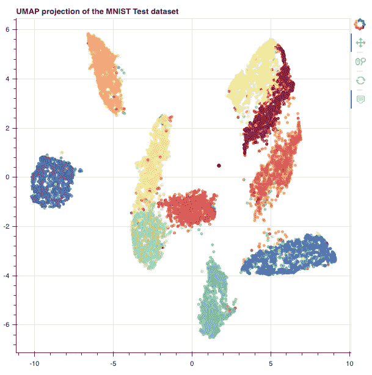](https://github.com/tonio73/data-science/blob/master/cnn/CnnVsDense-Part2-Visualization.ipynb)

UMAP 投影到 2D 的 MNIST 9 位数 28x28 像素图像数据集

这些颜色对应于真实数字类别。我们已经看到了类簇的很好的分离，但是有重叠的部分。

如果我们重用第 1 部分的密集网络并处理 softmax 层输入，我们会看到类簇被更好地分离并且更紧凑:

[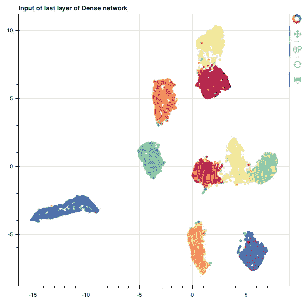](https://github.com/tonio73/data-science/blob/master/cnn/CnnVsDense-Part2-Visualization.ipynb)

MNIST 的 UMAP 视图经过密集网络处理，直至最后一层输入

使用这个用散景制作的漂亮的显示器，我们可以检查边界上的样本，可能会分类错误

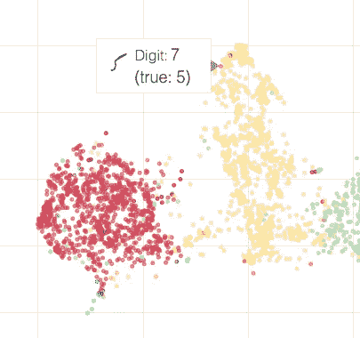

放大具有密集网络的错误分类的 5 位数

使用 LeNet5 CNN 架构执行相同的 UMAP 投影:

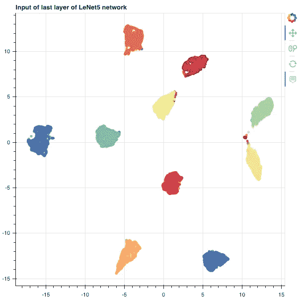

由 LeNet5 网络处理直到最后一层输入的 MNIST UMAP 视图

CNN 可以更好地分离集群，使 CNN 在密集网络上更具优势。

美国有线电视新闻网提供了一组边界样本的详细信息:

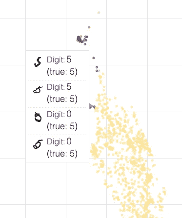

使用 LeNet5 CNN 放大错误分类的 0

# 网络和数据集概述

这些技术中的大多数应用于神经元单元水平，并应用于一个或几个图像。我们显然缺少整体网络视图和域(数据集)视图。

由 Carter 等人提出的激活地图集正在解决数据集概述的挑战。显著图是在数据集的大样本上计算的，并使用 t-SNE 或 UMAP 进行聚类。

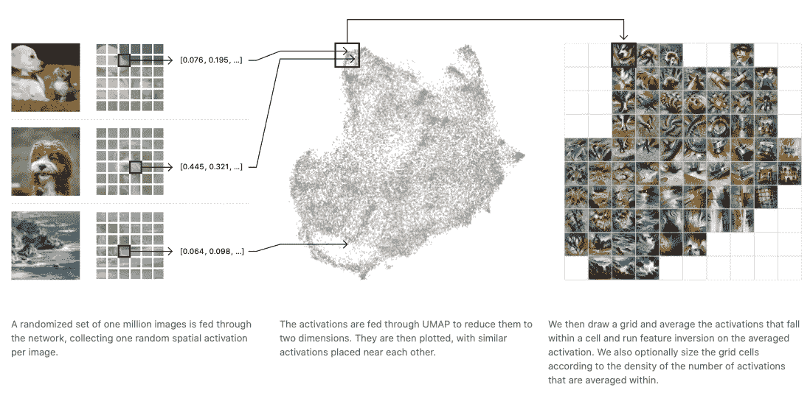

卡特等人的激活地图集。来自谷歌大脑和 OpenAI

我们已经创建了一个 Github 项目，[深度神经网络查看器](https://github.com/tonio73/dnnviewer)，来处理玩具网络上的网络视图。这个项目是年轻的，不完整的，但已经提供了一些不错的看法和 CNN 和 DNN 的检查。这将在以后的文章中更详细地介绍。

[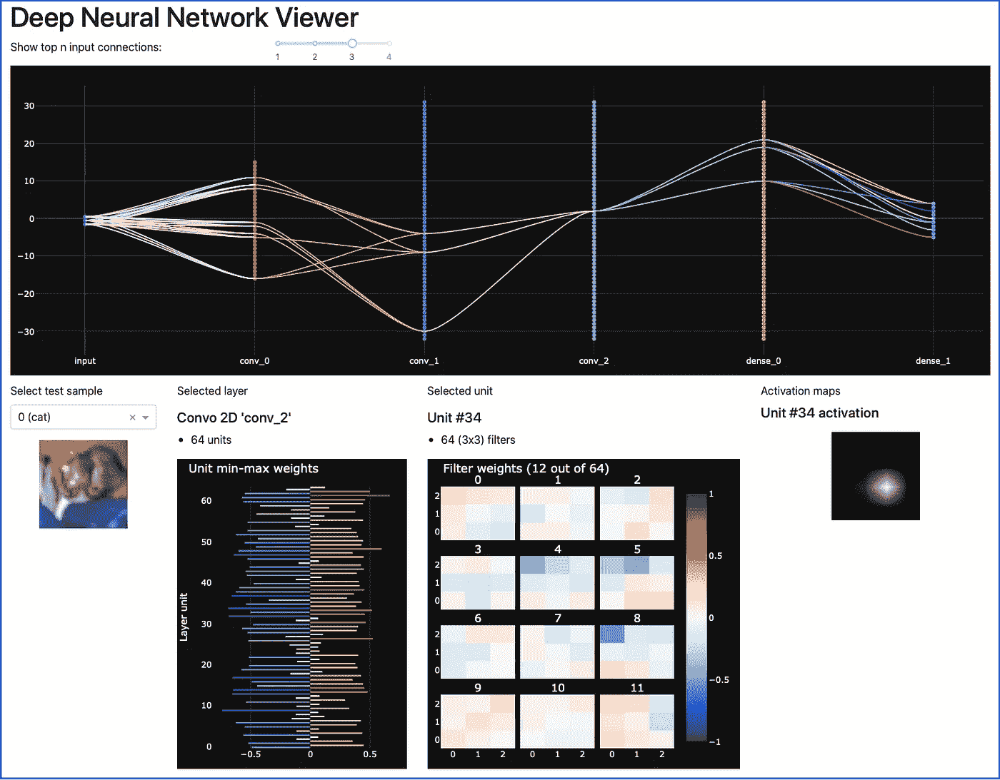](https://github.com/tonio73/dnnviewer)

CIFAR-10 简单 CNN 上的 DNN 观众截图

该方法不同于 [Tensorboard](https://www.tensorflow.org/tensorboard) 图或 [Netron](https://github.com/lutzroeder/netron) 图，它们显示网络拓扑，但不将其与实际性能和参数(权重、梯度)联系起来。

# 结论

我们回顾了一些实际的技术来检查深度神经网络的内容，并对其结果(分类)进行解释。我们已经表明，卷积网络(CNN)更容易检查，因为它们在卷积层中保留了图像的 2D 结构。在我们的例子中，我们已经观察到，当用 UMAP 投影表示最后一层的输入时，CNN 在密集 DNN 上的性能增益是可见的。

在这篇文章中，我们专注于一个单一的任务，图像分类，这是由深度神经网络处理的许多任务之一。已经列出了许多不同的工具和方面，并显示了它们的限制。深度神经网络的可解释性是一个非常广阔的活跃研究领域，对这些系统行为和鲁棒性的更多证明的需求仍然是趋势。我们可能会在以后的帖子中进一步处理它。

# 本帖中使用的笔记本

以下是本文中使用的笔记本，来自[数据科学分步指南](https://tonio73.github.io/data-science/)库:

*   密集和 LeNet5 设计，权重直方图: [CnnVsDense-Part1.ipynb](https://github.com/tonio73/data-science/blob/master/cnn/CnnVsDense-Part1.ipynb)
*   激活地图:[CNN visualization-1-activations . ipynb](https://github.com/tonio73/data-science/blob/master/cnn/CnnVisualization-1-Activations.ipynb)
*   显著图:[CNN visualization-2-salice maps . ipynb](https://github.com/tonio73/data-science/blob/master/cnn/CnnVisualization-2-SaliencyMaps.ipynb)
*   UMAP 图表:[CnnVsDense-part 2-visualization . ipynb](https://github.com/tonio73/data-science/blob/master/cnn/CnnVsDense-Part2-Visualization.ipynb)