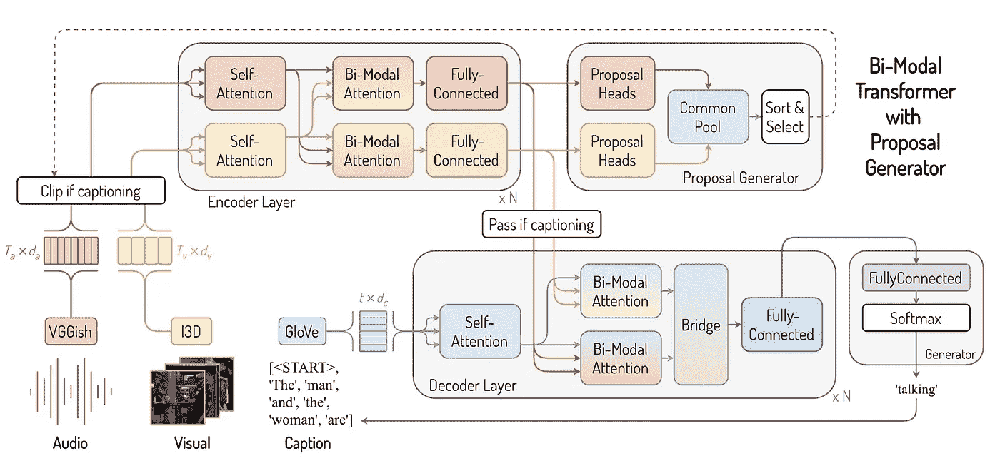
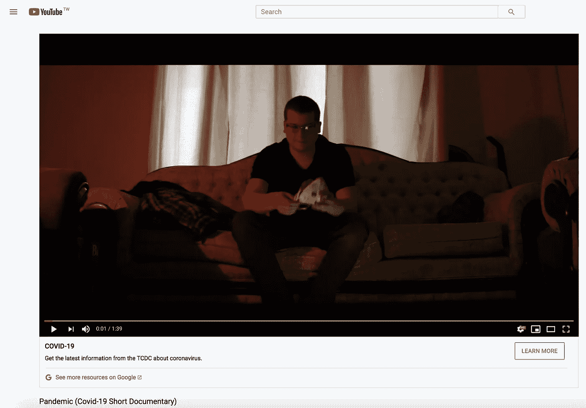
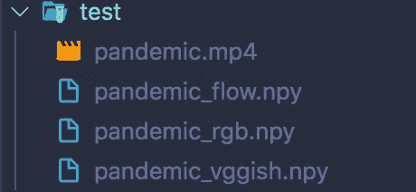

# 使用 Pytorch 的密集视频字幕

> 原文：<https://towardsdatascience.com/dense-video-captioning-using-pytorch-392ca0d6971a?source=collection_archive---------10----------------------->

## 如何在一个视频中为不同的时间段制作多个字幕


照片由[黄祖儿](https://unsplash.com/@onice?utm_source=medium&utm_medium=referral)在 [Unsplash](https://unsplash.com?utm_source=medium&utm_medium=referral) 上拍摄

# 介绍

深度学习任务 [**视频字幕**](https://www.ijcai.org/Proceedings/2019/0877.pdf) ，过去几年在计算机视觉和自然语言处理的交叉领域相当流行。特别是， [**密集视频字幕**](https://arxiv.org/pdf/1705.00754.pdf) ，这是一个子领域，已经在研究人员中获得了一些牵引力。**密集视频字幕**的任务是从未经剪辑的视频中定位感兴趣的事件，并为每个事件生成单独的文本描述。

# 模型

密集视频字幕具有挑战性，因为它需要视频的强上下文表示，并且能够检测局部事件。大多数模型通过将这个问题分解为两步来解决:从视频中检测事件提议，然后为每个事件生成句子。当前最先进的算法 [***具有建议生成器的双模式变换器* (BMT)**](https://arxiv.org/pdf/2005.08271.pdf) 提出组合两个输入通道，以便进行密集视频字幕:视频和音频信息。它在 [**ActivityNet 字幕数据集**](https://arxiv.org/pdf/1705.00754.pdf) 上实现了最先进的性能，该数据集由数千个视频和与特定时间范围相关联的字幕组成。



BMT 建筑([来源](https://github.com/v-iashin/BMT))

BMT 架构包括三个主要组件:**双模态编码器**、**双模态解码器**，以及最后的**建议生成器**。

首先，视频的音频和视频分别使用**[](https://arxiv.org/abs/1409.1556)**和[](https://arxiv.org/abs/1705.07750)**进行编码。在特征提取之后，VGG 和 I3D 特征被传递到双模式编码器层，在那里音频和视觉特征被编码成本文所称的音频参与的视觉和视频参与的音频。这些特征然后被传递给提议生成器，该生成器接收来自两种设备的信息并生成事件提议。******

******在事件提议生成之后，根据事件提议来修剪视频。从特征提取开始，每个短剪辑被再次传递到整个中。提取音频和视频特征，传递到双模式编码器，然后传递到双模式解码器层。这里，解码器层接受两个输入:来自双模式编码器的最后一层的输出，以及最后生成的字幕序列的 [**手套嵌入**](https://nlp.stanford.edu/projects/glove/) 。最后，解码器对内部表示进行解码，并基于概率分布生成下一个单词，该单词被添加到先前的字幕序列中。******

# ****履行****

****在本文中，我们将向您展示如何使用预训练的 BMT 来执行密集的视频字幕给定的视频。不需要模型训练。****

## ****步骤 1:下载 Repo 并设置环境****

****通过以下方式下载[论文的官方知识库](https://github.com/v-iashin/BMT):****

```
**git clone --recursive [https://github.com/v-iashin/BMT.git](https://github.com/v-iashin/BMT.git)
cd BMT/**
```

****下载 VGG 和 I3D 模型和手套嵌入。脚本会将它们保存在`./data`和`./.vector_cache`文件夹中。****

```
**bash ./download_data.sh**
```

****用所有需要的库和依赖项设置一个`conda`环境:****

```
**conda env create -f ./conda_env.yml
conda activate bmt
python -m spacy download en**
```

## ****第二步:下载视频****

****现在，你可以得到你想要的视频。例如，我将从 Youtube 上获得一个关于最近全球冠状病毒疫情的短片。我得到了这个[一个](https://www.youtube.com/watch?v=4XC2YWY9BLw&t=18s):****

********

****疫情 Youtube 视频([来源](https://www.youtube.com/watch?v=4XC2YWY9BLw&t=18s))****

****您可以使用在线下载程序下载 Youtube 视频，但请谨慎使用，风险自担！下载后，你可以把它保存在你喜欢的地方。我在`BMT`项目文件夹下创建了一个`test`文件夹，将下载的视频复制到`test`文件夹。****

```
**mkdir test
# copied video to the test directory**
```

********

****下载视频后(图片由作者提供)****

## ****步骤 3:特征提取(I3D 和 VGGish)****

****获得视频后，现在是提取 I3D 特征的时候了，首先创建`conda`环境，然后运行 python 脚本:****

```
**cd ./submodules/video_features
conda env create -f conda_env_i3d.yml
conda activate i3d
python main.py \
    --feature_type i3d \
    --on_extraction save_numpy \
    --device_ids 0 \
    --extraction_fps 25 \
    --video_paths ../../test/pandemic.mp4 \
    --output_path ../../test/**
```

****使用类似的过程提取 VGGish 特征:****

```
**conda env create -f conda_env_vggish.yml
conda activate vggish
wget https://storage.googleapis.com/audioset/vggish_model.ckpt -P ./models/vggish/checkpoints
python main.py \
    --feature_type vggish \
    --on_extraction save_numpy \
    --device_ids 0 \
    --video_paths ../../test/pandemic.mp4 \
    --output_path ../../test/**
```

****运行上述脚本后，I3D 和 VGGish 特性将保存在`test`目录中。保存的特征包括 RGB 视觉特征(`pandemic_rgb.npy`)、光流特征(`pandemic_flow.npy`)和音频特征(`pandemic_vggish.npy`)。****

********

****特征提取后(图片由作者提供)****

## ****步骤 4:在视频上运行密集视频字幕****

****导航回主项目文件夹，然后激活之前设置的`bmt`环境。最后，我们可以使用下面的命令运行视频字幕:****

```
**cd ../../
conda activate bmt
python ./sample/single_video_prediction.py \
    --prop_generator_model_path ./sample/best_prop_model.pt \
    --pretrained_cap_model_path ./sample/best_cap_model.pt \
    --vggish_features_path ./test/pandemic_vggish.npy \
    --rgb_features_path ./test/pandemic_rgb.npy \
    --flow_features_path ./test/pandemic_flow.npy \
    --duration_in_secs 99 \
    --device_id 0 \
    --max_prop_per_vid 100 \
    --nms_tiou_thresh 0.4**
```

****`prop_generator_model_path`和`pretrained_cap_model_path`指定建议生成器模型路径和字幕模型路径。因为我们正在使用两个预训练模型，所以我们可以将其直接链接到之前保存预训练模型的路径。`vggish_features_path`、`rgb_features_path`和`flow_features_path`是保存相应特征的路径，`duration_in_secs`是以秒为单位的视频持续时间，`device_id`是要使用的 GPU 号，`max_prop_per_vid`是要搜索的最大建议数(超参数)，最后`nms_tiou_thresh`是非最大抑制阈值参数。****

# ****结果****

****执行密集视频字幕后，以下是打印的结果:****

```
**[
  {'start': 2.9, 'end': 25.2, 'sentence': 'A person is seen sitting on a table and leads into a woman speaking to the camera'},
  {'start': 0.0, 'end': 61.9, 'sentence': 'A man is seen speaking to the camera and leads into several shots of people working on a building'},
  {'start': 0.0, 'end': 12.7, 'sentence': 'A woman is sitting in a chair talking to the camera'},
  {'start': 78.6, 'end': 100.0, 'sentence': 'The man then takes the cube and shows the cube off the table'},
  {'start': 0.2, 'end': 5.2, 'sentence': 'A man is sitting on a chair with a woman sitting on a chair and talking'},
  {'start': 38.8, 'end': 100.0, 'sentence': 'A man is seen speaking to the camera and leads into several shots of people working out and speaking to the camera'}
]**
```

****结果给出了开始和结束时间的列表，以及描述该时间段内视频内容的句子。在观看并与视频本身进行比较后，我必须说，该模型在理解视频和考虑音频方面表现得相当好！****

****这可以应用于任何视频，所以请随意尝试~！这篇文章是基于[官方知识库](https://github.com/v-iashin/BMT)的，所以一定要去看看。****

# ****结论****

****本文向您展示了如何使用预先训练好的模型为单个视频中的不同时间段生成多个字幕。该模型的性能被证明是相当好的，并且有更多的改进可以在将来应用于该模型和密集视频字幕任务。****

****有关深度学习的更多教程，请随时查看:****

****[](/bert-text-classification-using-pytorch-723dfb8b6b5b) [## 使用 Pytorch 的 BERT 文本分类

### 文本分类是自然语言处理中的一项常见任务。我们应用 BERT，一个流行的变压器模型，对假新闻检测使用…

towardsdatascience.com](/bert-text-classification-using-pytorch-723dfb8b6b5b) [](/fine-tuning-gpt2-for-text-generation-using-pytorch-2ee61a4f1ba7) [## 使用 Pytorch 微调用于文本生成的 GPT2

### 使用 Pytorch 和 Huggingface 微调用于文本生成的 GPT2。我们在 CMU 图书摘要数据集上进行训练，以生成…

towardsdatascience.com](/fine-tuning-gpt2-for-text-generation-using-pytorch-2ee61a4f1ba7) [](/controlling-text-generation-from-language-models-6334935e80cf) [## 控制语言模型的文本生成

### 控制机器生成文本的样式和内容的实际操作方法

towardsdatascience.com](/controlling-text-generation-from-language-models-6334935e80cf) [](/lstm-text-classification-using-pytorch-2c6c657f8fc0) [## 基于 Pytorch 的 LSTM 文本分类

### 一步一步的指导你如何在 Pytorch 中建立一个双向 LSTM！

towardsdatascience.com](/lstm-text-classification-using-pytorch-2c6c657f8fc0) [](/nlp-preprocessing-with-nltk-3c04ee00edc0) [## 用 NLTK 进行文本预处理

### NLTK 教程 NLP 预处理:小写，删除标点，标记化，停用词过滤，词干，和…

towardsdatascience.com](/nlp-preprocessing-with-nltk-3c04ee00edc0) 

# 参考资料:

 [## 更好地利用视听线索:使用双模式转换器的密集视频字幕

### 密集视频字幕旨在定位和描述未剪辑视频中的重要事件。现有的方法主要是…

arxiv.org](https://arxiv.org/abs/2005.08271) [](https://github.com/v-iashin/BMT) [## 沃伊申/BMT

### 这是我们论文的 PyTorch 实现:更好地使用视听提示:具有双模式的密集视频字幕…

github.com](https://github.com/v-iashin/BMT) [](https://v-iashin.github.io/bmt) [## BMT -弗拉迪米尔·雅辛

### 密集视频字幕旨在定位和描述未剪辑视频中的重要事件。现有的方法主要是…

v-iashin.github.io](https://v-iashin.github.io/bmt)  [## 视频中的密集字幕事件

### 大多数自然视频包含大量事件。例如，在一个“弹钢琴的人”的视频中，该视频也可能…

arxiv.org](https://arxiv.org/abs/1705.00754) [](https://cs.stanford.edu/people/ranjaykrishna/densevid/) [## 视频中的密集字幕事件

### A.添加上下文可以生成一致的标题。b .比较在线模型和完整模型。c .上下文可能会添加更多…

cs.stanford.edu](https://cs.stanford.edu/people/ranjaykrishna/densevid/) [](https://www.ijcai.org/Proceedings/2019/877) [## 视频字幕深度学习研究综述

### 陈，，蒋玉刚第二十八届国际人工智能联合会议论文集

www.ijcai.org](https://www.ijcai.org/Proceedings/2019/877)****