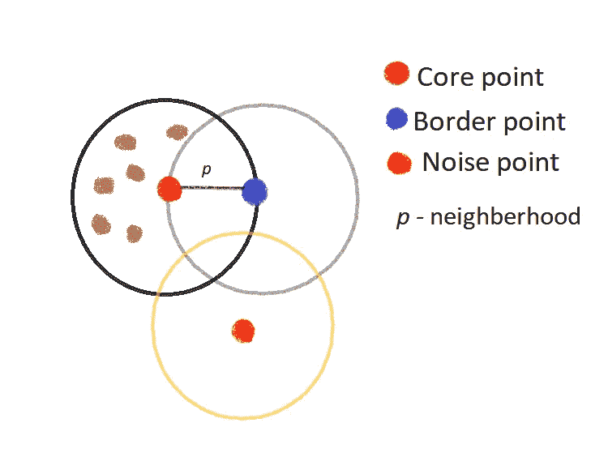

# 基于密度的算法

> 原文：<https://towardsdatascience.com/density-based-algorithms-49237773c73b?source=collection_archive---------15----------------------->

## 对两种基于密度的算法的理解:DBSCAN 和 OPTICS

[图片来源:Fabrice Jazbinsek](https://www.flickr.com/photos/jazbinsek/48210846062/in/photolist-2gsebTQ-Z1AeZb-achwEC-9DbiXJ-2dmPUKa-2hRg3M5-2isjxgr-23E1tgg-2inhm8f-Ud2Fm1-4f7rvy-YpqBcQ-achwHy-aceG9p-achwFw-7PtMsu-R96duY-52TjtK-AFBsDQ-ijcvEj-9D8ppg-jcxVE-bPh5X-f3wQDt-zhgrdk-HqMjmf-8y7Eu3-dYpukQ-dLbsc-r2VXcd-6DrCMN-DwBJZm-2h1D9Nc-2caRE4J-251idpH-n9nFXx-37XZkJ-37TRNV-35c6Xc-35kQjp-TWTT9Q-2iG8Mbi-YSgTwo-VT89xZ-6jH7VX-JYjFs-6jMiL9-aFwCRn-YSgTvm-YSgTxL)

像划分方法或层次聚类这样的聚类方法在寻找任意形状的聚类时是无效的。基于密度的聚类方法在发现任意形状的聚类方面是有效的，并且防止了离群值和噪声。

当使用基于密度的方法时，对象聚类简单地基于密度的概念。并且根据密度，使用该方法创建不同类型的算法，例如，如果通过使用邻域对象的密度创建聚类，则使用 DBSAN 算法，或者如果根据密度函数创建聚类，则使用 DENCLUE。而光学是基于密度的，这产生了数据收集结构的增强顺序。

# 基于密度的噪声应用空间聚类

DBSCAN 通过计算固定半径邻域或 **ɛ** 中的点的数量来估计密度，并认为只有当两个点位于彼此的邻域内时它们才是连通的。因此，该算法使用两个参数，如ɛ和 MinPts。ɛ表示一个点的 Eps 邻域，MinPts 表示 Eps 邻域中的最小点。所以ɛ和 MinPts 是由用户指定的参数

有几个要点需要记住:

***核心点:*** 作为核心点的是 Eps 邻域中的某个特定点，该点的值大于 MinPts 的精确点数。

****噪声点:**不属于核心或边界的点称为噪声点。**

****

**密度点**

## **算法**

**输入:n 个待聚类对象和全局参数 **ɛ** 和 **MinPts** 。
输出:物体的集群**

**1.任意选择一个点 P.
2。检索从 P wrt ɛ和 MinPts 可到达的所有点密度。
3。如果 P 是一个核心点，则形成一个簇。
4。如果 P 是边界点，那么不存在密度可达的点，DBSCAN 移动到下一个点。
5。这个过程一直持续到所有的点都被处理完。**

**当然，使用 DBSAN 有一些优点和缺点，例如:**

****优点** - DBSCAN 可以使用 MinPts 参数找到任意形状的聚类
-数据库中的点的顺序不敏感
-处理噪声和异常值
**缺点**
-在密度差异较大的情况下不能很好地执行
-不适合涉及各种密度的情况**

## **光学**

**光学系统的工作原理类似于 DBSCAN 的扩展。唯一的区别是它不分配聚类成员，而是存储处理点的顺序。所以对于每个对象商店:*核心距离*和可达性距离。订单种子被称为构成输出订单的记录。**

*****核心距离:***p 的ɛ-neighborhood 中出现的ɛ的最小值就是核心距离。当然，它需要保存最少的 MinPts 对象。**

*****可达距离:***p 与 q 之间的可达距离定义为从 q 到 p 密度的最小半径值。**

## **算法**

**1.随机选择一个未访问的点 P
2。选择从 P . w . r . t . Eps，MinPts 可达的所有点的密度。
3。分配核心距离&可达性距离=空值
4。如果 P 不是核心点
5。移动订单种子列表中的下一点
6。如果 P 是核心点
7。对于每个物体 q，在 P
8 的ɛ邻域中。从 P
9 更新可达性距离。如果 q 未被访问，将 q 插入订单种子
10。直到没有不被访问的对象**

***注:*以上算法摘自《基于密度的大数据聚类算法综述》。**

****优点
-** 它不需要密度参数。
**-** 聚类顺序对于提取基本的聚类信息很有用。
**缺点**
**——**它只产生一个集群排序。
**-** 它不能处理高维数据。**

*****注:*** 认为只存在上面解释的这两种基于密度的算法是不好的。还有其他这类算法在这里没有提到，例如 DENCLUE，但最流行的是 DBSCAN，因为它被认为是最简单的基于密度的方法。**

# **结论**

**本文旨在简要解释基于密度的方法。因此，总而言之，基于密度的方法满足这些要求:
——产生实际上只发生在空间数据上的非球形聚类。术语空间数据用于表示点、线和多边形。在空间数据簇中形成的簇可以具有任意形状。
-大型数据库对后续全效率的需求。
-检测和减少噪音和离群值的能力。**

**光学和 DBSCAN 不是实现基于密度的方法的唯一算法。尽管我提到了它们，但这并不意味着只需要使用这些算法。然而，这些算法是最受欢迎的，每种基于密度的算法都有其优点和缺点，因此在使用它之前，您需要查看数据集，首先了解数据集，看看该类型的算法是否符合您的需求。**

## **参考**

**T.米兰达·拉克什米、约瑟芬·萨哈纳、普拉桑娜·文卡特桑。基于密度的大数据聚类算法综述**

**数据聚类:算法和应用(查普曼和霍尔/CRC 数据挖掘和知识发现系列，第 113-117 页**