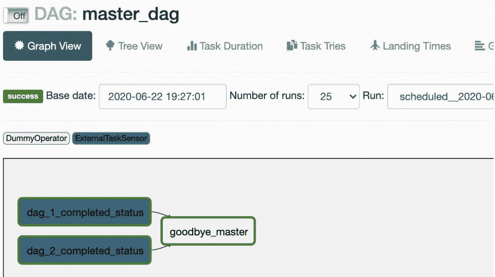

# Apache 气流中 Dag 之间的依赖关系

> 原文：<https://towardsdatascience.com/dependencies-between-dags-in-apache-airflow-2f5935cde3f0?source=collection_archive---------3----------------------->

仅在两个上游 DAG 成功完成后运行“再见”任务的 DAG。这篇文章解释了如何在 Apache Airflow 中创建这样的 DAG

在 Apache Airflow 中，我们可以有非常复杂的 Dag，包含几个任务，以及任务之间的依赖关系。

但是，如果我们有跨 DAG 的依赖关系，并且我们想创建 DAG 中的 DAG，该怎么办呢？通常，我们会尝试将所有有依赖关系的任务放在同一个 DAG 中。但是有时您不能修改 Dag，并且您可能仍然希望在 Dag 之间添加依赖关系。

为此，我们可以使用*外部任务传感器*。

该传感器将查找 DAG 和任务的过去执行，并将匹配那些与我们的 DAG 共享相同的 *execution_date* 的 DAG。然而，名字 *execution_date* 可能会引起误解:它不是一个日期，而是一个瞬间。因此，它们之间相互依赖的 Dag 需要在同一时刻运行，或者以恒定的时间量一个接一个地运行。总之，**我们需要在执行日期和时间上保持一致。**

让我们看一个例子。我们有两个上游 DAG，我们希望在前两个 DAG 成功完成后运行另一个 DAG。

这是第一个 DAG。它只有两个虚拟任务。

第二个上游 DAG 和这个很像，这里就不展示代码了，不过[你可以看看 Github](https://gist.github.com/iht/85c352f6451ff1c274b6b94a442dadb5) 里的代码。

重要的一点是两个 DAG 具有相同的计划和开始日期(请参见 [DAG 1](https://gist.github.com/iht/2c9c2c7135cb3fc6d7ccef2fd8fb1bde#file-parent_dag_1-py-L10-L11) 和 [DAG 2](https://gist.github.com/iht/85c352f6451ff1c274b6b94a442dadb5#file-parent_dag_2-py-L10-L11) 中的相应行)。请注意，dag 每分钟都在运行。那只是为了这个演示。在真实环境中，这将是一个非常高的频率，所以如果您为自己的 Dag 复制粘贴一些代码，请小心。

当两个上游 DAG 都成功时，将执行下游 DAG。这是下游 DAG 的代码:

一些需要注意的要点。[计划和开始日期与上游 Dag](https://gist.github.com/iht/bbb81c28e6139a1d9b9a5074274ab946#file-child_master_dag-py-L10-L11)相同。**这对于该 DAG 响应上游 DAG 是至关重要的，即，在上游 DAG 的运行和该 DAG 的运行之间添加依赖性。**

如果执行日期不匹配，但我仍然想添加一个依赖项，该怎么办？如果开始日期相差固定的时间量，您可以使用*外部任务传感器*的执行 *_delta* 参数。更多详情，[查看 ExternalTaskSensor](https://airflow.apache.org/docs/stable/_api/airflow/sensors/external_task_sensor/index.html#airflow.sensors.external_task_sensor.ExternalTaskSensor) 的文档。

Airflow 的文档包括一篇关于跨 DAG 依赖的文章:[https://air flow . Apache . org/docs/stable/how to/operator/external . html](https://airflow.apache.org/docs/stable/howto/operator/external.html)

如果我想根据前面 Dag 的结果在不同的下游 Dag 上进行分支，该怎么办？为此，您可以使用分支操作符和 XCOM 在 Dag 之间传递值。

*ExternalTaskSensor* 将仅接收与“感应到的”DAG 相对应的成功或失败状态，但不接收任何输出值。如果需要根据任务中计算出的值进行分支，可以使用*branch python operator*([https://air flow . Apache . org/docs/stable/concepts . html # branch](https://airflow.apache.org/docs/stable/concepts.html#branching)

上游 DAG 必须在 XCOM 中发布值，下游 DAG 需要向分支操作符提供回调函数。这个回调函数将使用上游的 *task_id* 读取 XCOM，然后它将返回这个任务之后要继续执行的任务的 *id* (在分支操作符之后的下游要执行的潜在任务列表中)——我将在以后的文章中用代码片段介绍这个例子！

当您无法修改现有 Dag 时，这并不意味着您无法在这些 Dag 之间创建依赖关系。这篇文章展示了如何创建这些依赖关系，即使您不控制上游 DAG:添加一个依赖于使用 *ExternalTaskSensor* 的新 DAG(每个上游 DAG 一个传感器)，将 DAG 之间的依赖关系编码为传感器任务之间的依赖关系，在与上游 DAG 相同的时间表中运行编码依赖关系的 DAG，如果 DAG 的时间表移动了恒定的时间量，则使用[相应的 *execution_delta*](https://airflow.apache.org/docs/stable/_api/airflow/sensors/external_task_sensor/index.html#airflow.sensors.external_task_sensor.ExternalTaskSensor) 配置传感器。