# 全栈 PyTorch 人群规模估计量

> 原文：<https://towardsdatascience.com/deploy-a-crowd-size-estimator-with-pytorch-size-ai-580903a101a5?source=collection_archive---------24----------------------->

## 查理·麦基，杰森·戴尔和但丁·德鲁卡

## 演示

请尝试我们的人群规模估计器的演示:[https://app 3-qhrzckmpq-UE . a . run . app](https://app3-qrhrzckmpq-ue.a.run.app)

你可以从 ShanghaiTech 数据集中选择一些图片，也可以上传自己的图片。如果你选择上传自己的图像，它必须是 JPG/JPEG 格式，并且小于 100KB。

您可以按如下方式检查图像尺寸:

计算机:

*   窗口:资源管理器→选择图像(窗口底部)。
*   Mac:按住 Control 键并点击→“获取信息”→“大小”

手机:

*   iPhone:确保图像不是截图，然后你可以“选择大小”的图像(屏幕底部)。选择“小”并上传。
*   安卓:看看这篇博文，[https://www . quora . com/How-do-I-reduce-the-size-of-photos-in-Android](https://www.quora.com/How-do-I-reduce-the-size-of-photos-in-Android)

## 介绍

在这篇文章中，我将解释我的[西部人工智能](https://www.facebook.com/westernuai/)项目团队如何开发一个 web 应用程序来估计给定图像中人群的大小。

我们从 2019 年 9 月开始的目标是部署一个可以预测人群规模的机器学习模型。我们实现了我们的目标，并能够在由女王人工智能中心主办的加拿大人工智能本科生会议上展示我们的项目。

人群规模估计是机器学习社区中的一个热门话题。它有多种应用，包括人群控制、客户管理和城市规划。我们的模型可以应用于学校环境，测量课堂出勤率或建筑物占用率。

## 最终产品

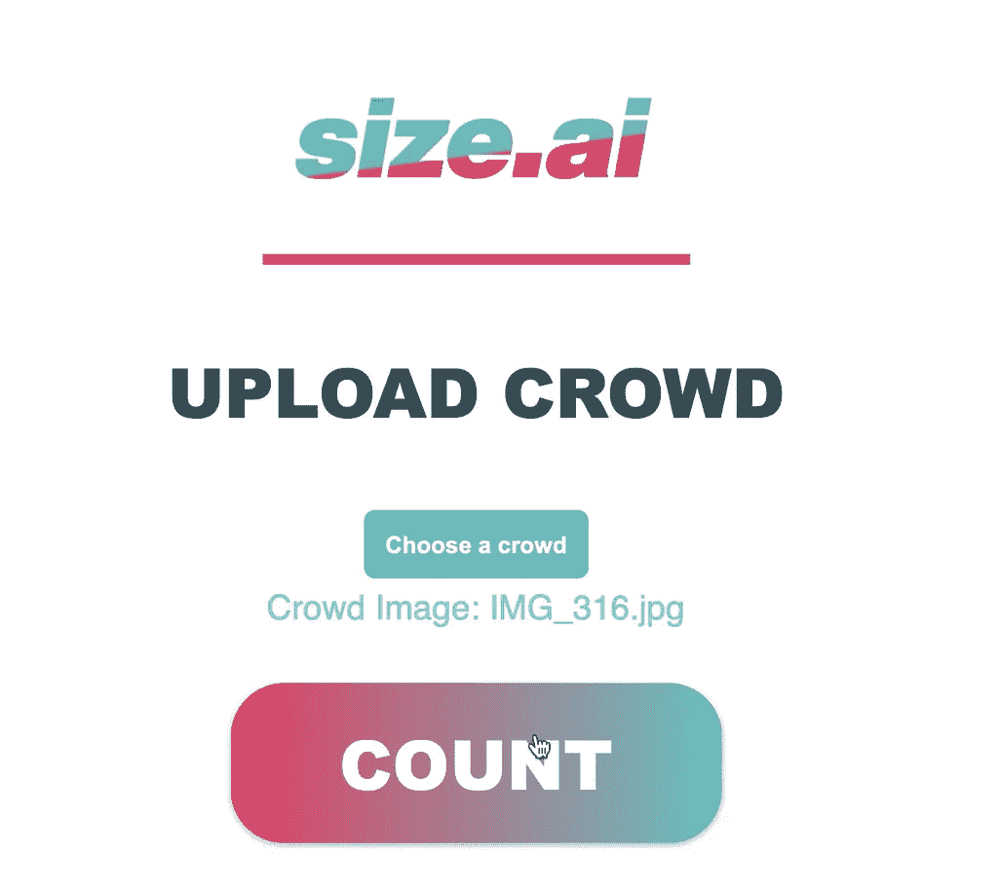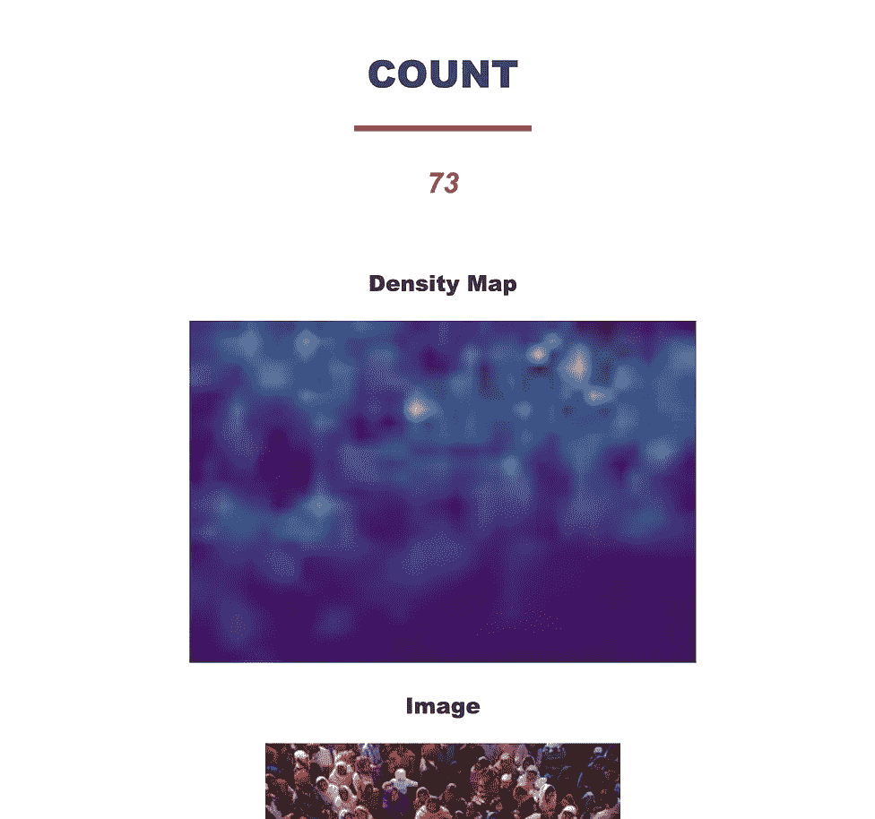

上图是我们部署的 web 应用程序。web 主机从用户那里获取 JPG 格式的本地图像，然后估计人群的大小(人数)。

## 目的

这篇文章的目的是:

*   展示我们的项目:尺寸。人工智能
*   深入了解当今的人群识别和机器学习
*   提供部署机器学习模型的教程

## 议程

这篇文章的结构如下:

*   机器学习、计算机视觉和人群规模估计简介
*   当前人群规模估计方法
*   我们的方法:CSRNet
*   培训、测试和验证(Google Colab/Python3)
*   部署(Flask/Google 云)
*   下一步、来源和西方人工智能

## 机器学习、计算机视觉和人群规模估计的介绍

**人工智能(AI)和机器学习(ML)** 含义不同。机器学习是一种人工智能，涉及统计分析和问题分类。流行的机器学习应用包括自然语言处理(NLP)和计算机视觉(CV)。这些应用程序由机器学习算法驱动，包括 K 近邻(kNN)、回归和神经网络。

让我们关注神经网络。神经网络是由我们大脑的结构松散地启发的。在大脑中有一个神经元网络，每个神经元存储一些信息。神经元通过轴突相互连接，轴突可以在神经元之间传递信号。在人工神经网络中，神经元由组织成层的节点表示。


来自:s . Logan:[“理解神经网络的结构”](https://becominghuman.ai/understanding-the-structure-of-neural-networks-1fa5bd17fef0)

第一层节点可以采用某种形式的输入，每一层的处理都将有助于对输入进行分类。最后一层表示容易解释的输出。

*例子*:计算机想要确定一幅图像中包含一只狗还是一只猫。图像将被分解成像素，每个像素将由一个 RGB 比例值(0–255)表示。RGB 值是第一层节点的输入。之后的每一层可以代表图像内的某种类型的特征检测；眼睛的重叠，头的大小与耳朵的大小的比较…等等。最后一层节点汇总了前几层的所有信息并做出决策。

机器学习的“学习”部分，包括迭代通过许多标记有元数据的例子，这些元数据已经被人类分类。神经网络经历反向传播过程，其中网络的误差被最小化。对于提供的每个示例，网络将进行预测，然后用提供的元数据验证其预测，并得出误差成本(预测-实际)。反向传播的目标是通过调整网络来最小化这种误差。

这背后的数学比我刚才解释的更复杂。如果你仍然感兴趣，可以看看 Jayson(项目经理)，[神经网络的简单分类器介绍。](https://github.com/jaysondale/Simple-Classifier/blob/master/Intro%20to%20NN%20(1).pdf)

## **人群规模估计**

人群规模估计使用神经网络对人群中的人进行分类，然后合计检测到的人数。目前有三种人群规模估计方法:检测、回归和密度。

*   **检测**:专注于物体检测；识别人的特征(例如:头、肩、身体等)。这种方法通常对人数较少的人群更准确。
*   **回归**:使用一个人更广泛的特征，把更多的注意力放在边缘细节上。当面对更密集的人群时，这优于检测模型。
*   **密度**:(见下面的密度图示例)密度图不是聚焦于单个人，而是追踪人群。这是对密集人群最准确的方法，也是我们选择的模型 CSRNet 使用的方法。

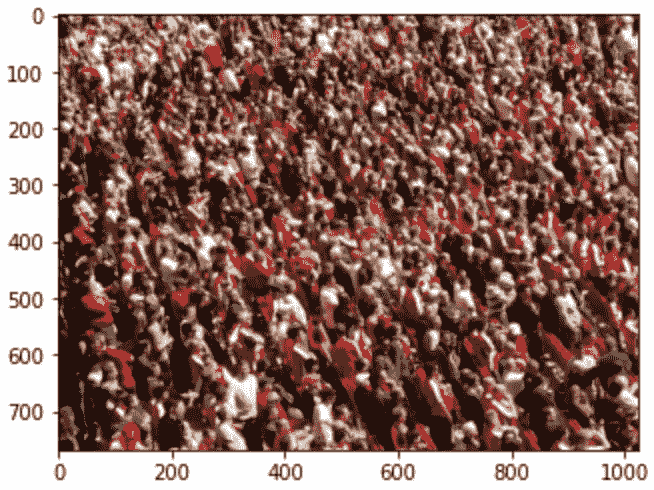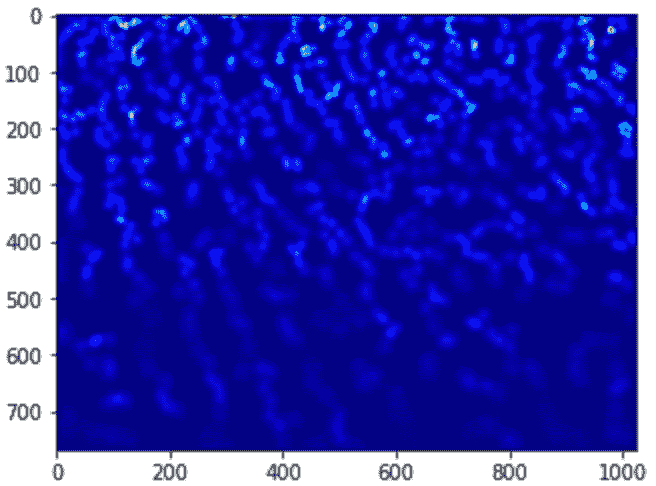

密度图(右)

## CSRNet

**拥挤场景识别网络(CSRNet)** 是由伊利诺伊大学厄巴纳-香槟分校的计算机科学家在 2018 年提出的人群规模估计模型。

CSRNet 利用 VGG-16 图像分类网络作为前端部分，因为它具有灵活有效的架构。VGG-16 使用各种激活功能(用于提取层间节点输出)和其他超参数(层/节点配置)，包括 ReLU 和 SoftMax。ReLU 是机器学习中的标准，意思是校正的线性单元。SoftMax 不太常见，但值得注意。SoftMax 的目标是把数字变成概率，把分类两极分化。这在最后一层的影像分类中非常有用，因为它为任何分类场景提供了概率。由于我们的目标是输出一个密度图，而不是一个热分类，CSRNet 的后端结构用更多的卷积层取代了全连接和 SoftMax 层。

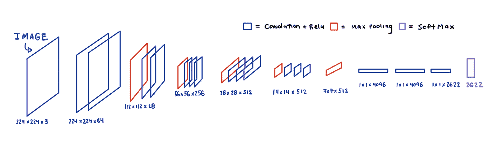

VGG-16 结构

**扩展内核:**在后端，使用扩展卷积层来代替最大池，以便保持输出维度并增加感受域。膨胀核是一个标准的卷积核，由一个膨胀因子分散(见下文)。膨胀的核不会降低图像质量，这一点很重要，因为密度图的尺寸越大，我们的估计就越准确。

膨胀的卷积有助于生成我们的密度图:

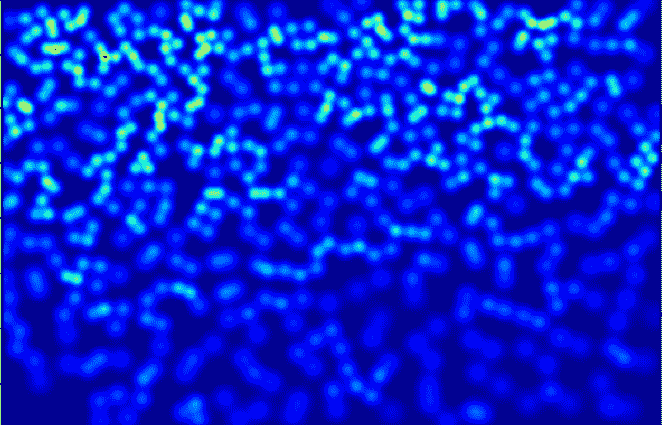

增大膨胀系数:1 → 2 → 3

**结果** : CSRNet 取得了比其他流行的人群规模估计网络更好的 MAE 和 MSE 结果。

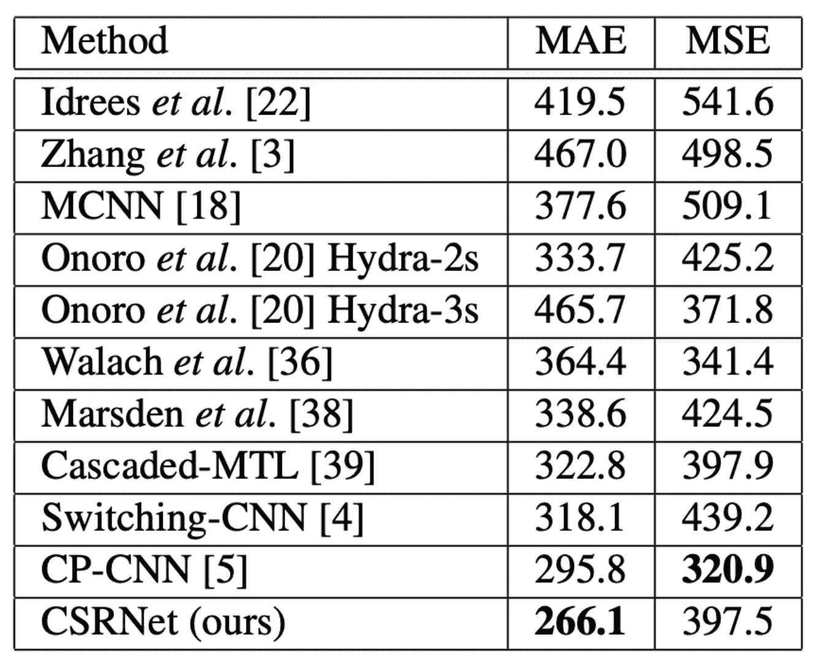

[CSRNet](https://arxiv.org/pdf/1802.10062.pdf)

对于更多的上下文**，** MAE 是平均绝对误差。平均绝对误差是每个训练图像的绝对误差的平均值。MSE 是均方误差。MSE 不同于 MAE，因为它更强调大误差。

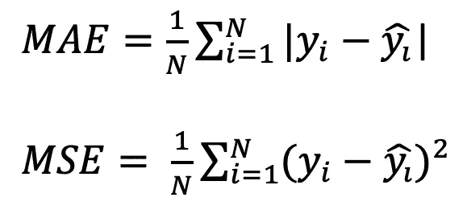

## 培训、测试和验证(Google Colab/Python3)

既然女王的学生都走了——我们来编码吧！我们使用了来自 Analytics Vidhya 的教程:[构建你自己的人群计数模型](https://www.analyticsvidhya.com/blog/2019/02/building-crowd-counting-model-python/)。我们将所有的预处理、训练、测试和验证脚本存储在一个 Google Drive 文件夹中。在 Google Drive 中，我们能够使用 Google Colab 笔记本来创建和共享我们的模型。在某些情况下，所有脚本都是用 Python 3 或 Python 2 编写和编译的。为了训练我们的模型，我们还安装了 CUDA GPU。

我们使用了[上海科技馆](https://www.cv-foundation.org/openaccess/content_cvpr_2016/papers/Zhang_Single-Image_Crowd_Counting_CVPR_2016_paper.pdf)的数据集，因为它具有摄像机视角的广度、人群规模的多样性以及大量的注释数据。该数据集包含近 1200 张图片和超过 330，000 个带注释的头像。

Google Drive 中的培训和测试的最终目标是生成我们经过培训的模型。PT 文件(PyTorch 文件)，我们可以上传到我们的前端界面。为了达到这个目标，我们必须编译并运行:

*   地面真实生产脚本
*   培训脚本
*   验证脚本

**地面实况生成脚本:**该脚本的目的是将数据集提供的地面实况转换成可用于训练的密度图。

下面你可以看到一个输出的例子。将地面实况转换成密度图。

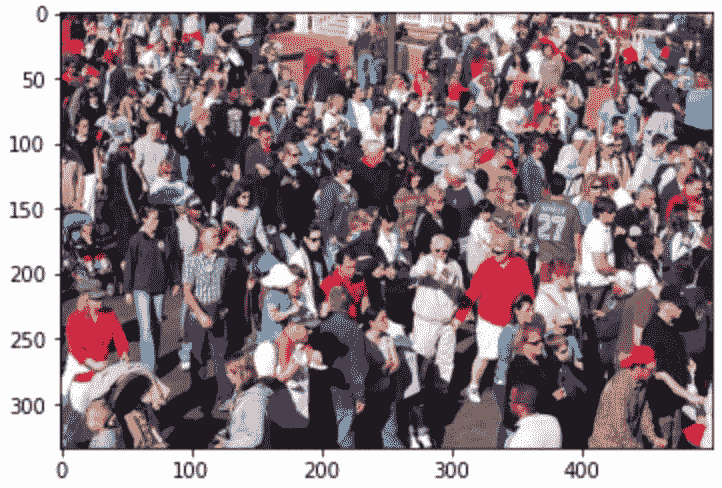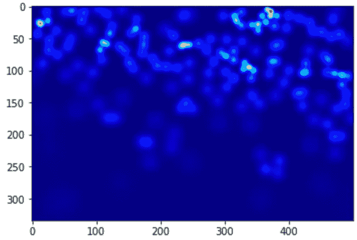

显示密度图中的原始预测计数:

```
np.sum(groundtruth) # Output -> 166.15
```

**训练脚本:**训练脚本遍历我们所有的训练数据集图像，并提高每个历元之间的准确性(历元是对数据的一次迭代)。

使用我们的第一个数据集运行训练脚本的示例代码:

```
root = "/content/gdrive/My Drive/Western AI - Intro to Computer Vision Project/CSRNet Crowd Counting Model/Data/"!python2 '/content/gdrive/My Drive/Western AI - Intro to Computer Vision Project/CSRNet Crowd Counting Model/train.py' '/content/gdrive/My Drive/Western AI - Intro to Computer Vision Project/CSRNet Crowd Counting Model/part_A_train.json' '/content/gdrive/My Drive/Western AI - Intro to Computer Vision Project/CSRNet Crowd Counting Model/part_A_test.json' 0 0
```

以下是其中一个训练时期(第 15 个)的快照:

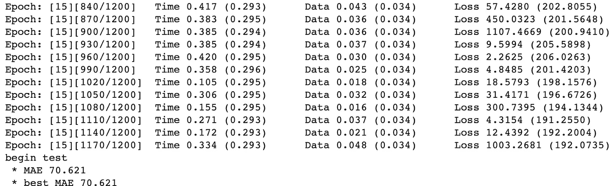

在时间和资源允许的情况下，我们能够为 100 个完整的时期训练我们的模型。在监控训练时，我们注意到 MAE 在每个时期都有轻微的改善。如果你看上面的输出，第 15 个纪元的 MAE 是 70.621。这意味着平均误差是 70.621 人(+/-)。第一纪元的 MAE 是 250，所以我们取得了一些进展。根据数据集的大小(1200 张图片)和每个人群的总规模(330，000 人)，每个人群中平均有 275 人。考虑到大规模的人群，我们的误差是令人满意的。

**验证脚本:**该脚本采用我们训练过的模型，并确定每个测试示例的平均误差和百分比误差。(注意:这是验证脚本的抽象版本)

```
checkpoint = torch.load('/content/gdrive/My Drive/Western AI - Intro to Computer Vision Project/CSRNet Crowd Counting Model/model.pt')model.load_state_dict(checkpoint['state_dict'])import numpy as np
mae = []
for i in xrange(len(img_paths)): ... mae.append(abs(np.sum(groundtruth)))
    print i, mae[i]
```

结果各不相同，但最终测试的平均平均误差为 90.19。这与来自训练脚本的 MAE 值有很好的相关性，并且不表明我们的训练集有任何显著的过拟合/欠拟合。以下是一些结果的片段:

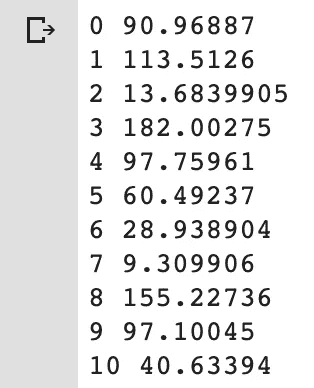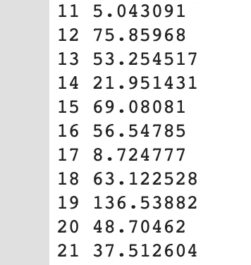

我们运行了这个验证脚本的一个类似变体，它给出了我们的模型误差/准确性。上述 MAE 值对应于 15.3%的总测试误差(两个测试集:A 和 B)。这意味着我们的模型有 84.7%的准确率。

**Model.pt:** 经过训练和测试后，我们将模型导出到一个. pt 文件(PyTorch ),可以部署到 Flask 上。model.pt 文件包含存储在大规模字典对象中的所有网络参数和权重。

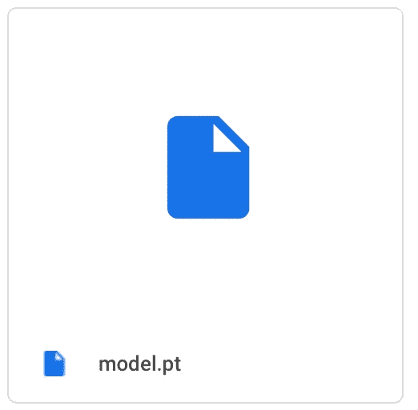

## **调配(烧瓶)**

您可以在这里查看我们的 Flask 部署的 GitHub 库:[https://github.com/jaysondale/Size.AI-Deployment](https://github.com/jaysondale/Size.AI-Deployment)

Flask 是一个 Python web 框架，采用易于扩展的理念([https://www.fullstackpython.com/flask.html](https://www.fullstackpython.com/flask.html))构建。启动您自己的 web 应用程序就像运行具有以下结构的“app . py”Python 文件一样简单:

```
from flask import Flask
app = Flask(__name__)

@app.route('/')
def hello_world():
    return 'Hello, World!'

if __name__ == '__main__':
    app.run()
```

在我们的部署框架中，有 5 个关键组件 **:**

*   App—启动我们的本地主机端口 5000
*   推论——初始化我们的模型并做出预测
*   commons—引用我们的模型文件
*   Model.pt —我们训练过的模型
*   模板—包含索引和结果模板(渲染结果页面)

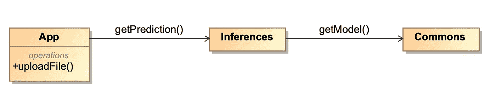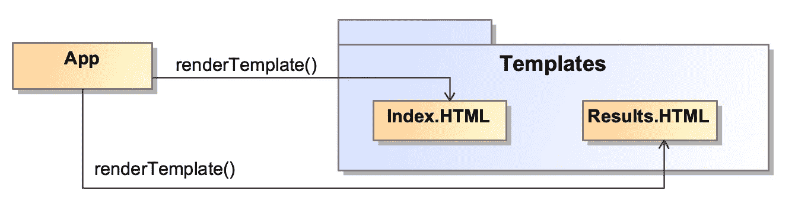

在 Cameo 系统建模器中设计的 UML

**App(' App . py '):**hello _ world 函数(如上)返回要在 web app 中显示的内容和功能。在我们的例子中，我们需要接受来自用户的图像并返回一个预测。当处理用户输入时，我们需要使用 HTTP 方法。“GET”呈现我们想要的模板，“POST”注册可以执行操作(上传文件)的用户。在这里，您可以看到“app.py”文件中的“上传文件”功能:

```
def **upload_file()**:
    if request.method == 'POST':
       absolute_path = os.path.abspath("../")
       if 'file' not in request.files:
          return redirect(request.url)
       file = request.files['file']
       if not file:
          return
       print("GETTING PREDICTION")
       filename = secure_filename(file.filename)
       file.save(os.path.join(app.config['UPLOAD_FOLDER'],filename))
       prediction = **get_prediction**(file) 
       return **render_template**('result.html', Prediction=prediction,        File=filename) 
       return render_template('index.html')
```

**推论(' inference.py'):** 初始化我们的模型，并从中获得一个预测。应用程序脚本从用户处发送了一个文件作为参数。get_prediction 函数将图像发送到模型并输出结果:

```
model = get_model() **# initialize model**def get_prediction(file): 
    img = transform(Image.open(file).convert('RGB')).cpu() 
    output = model(img.unsqueeze(0))
    prediction=int(output.detach().cpu().sum().numpy()) **# prediction**
    print("Predicted Count: ",int(output.detach().cpu().sum().numpy())) 
    return prediction
```

**Commons ('commons.py'):** 引用我们的 model.pt 文件。我们从 PyTorch 导入并初始化 CSRNet，然后加载我们的状态字典(来自训练的权重和偏差):

```
def get_model():
    model = CSRNet() **# original CSRNet**
    model.load_state_dict( torch.load('/Users/charliemackie/CSRNET_DEPLOYMENT/SIZE.AI/Pytorch/model (2).pt', map_location='cpu')) **# local reference to model.pt**
    model.eval()
    return model
```

'/Users/charliemackie/CSR net _ DEPLOYMENT/SIZE。AI/Pytorch/model (2)。“pt”是保存在我们的项目目录中的 **Model.pt** 的路径。

模板:有我们的自定义 HTML 和 CSS 模板，将显示我们的用户界面。这些文件结合了文本标签、按钮和标题。最重要的部分是显示我们的预测，它嵌入在文本正文中，如下所示:

```
<h2 class="h5 mb-3 font-weight-normal"><i>**{{Prediction}}**</i></h2>
```

所有这些组件一起工作，我们有我们的功能烧瓶应用程序！

## **部署(谷歌云)**

我们的部署过程利用了谷歌云的三个核心特性:云存储、构建和运行。创建基于云的 web 系统的第一步是将我们的 flask 应用程序容器化，这意味着它将包含在任何给定的计算机系统上运行的所有要求和命令。运行时，云平台被编程为监听 IP 地址为 0.0.0.0:8080 的特定网络端口。这个 IP 和端口被直接硬编码到 flask 应用程序中。将以下文件添加到 flask 应用程序目录中，以完成容器化过程:

**需求**(“Requirements . txt”):这个文件包含应用程序运行所需的所有 python 模块。

Docker(“Docker file”):这个文件包含一系列启动 flask 应用程序的 CLI 命令。

Dockerfile 文件内容:

```
FROM python:3
RUN apt-get update -y
RUN apt-get install -y python-pip python-dev build-essential
COPY . /app
WORKDIR /app
RUN pip install -r requirements.txt
ENTRYPOINT [“python”]
CMD [“app.py”]
```

**YAML**(“Cloud build . YAML”):这个文件与 Google Cloud 命令行界面(CLI)一起使用，并提供额外的构建参数(这包括构建目的地)。

Yaml 文件内容:

```
steps:
- name: ‘gcr.io/cloud-builders/docker’
args: [‘build’, ‘-t’, ‘gcr.io/size-ai/app’, ‘.’]
- name: ‘gcr.io/cloud-builders/docker’
args: [‘push’, ‘gcr.io/size-ai/app’]
images: [‘gcr.io/size-ai/app’]
```

一旦添加了这些文件，容器化的应用程序需要被压缩并上传到 Google 云存储中，以便在 web 服务中使用。一旦上传，Google Cloud Build 将遵循 cloudbuild.yaml 提供的步骤，并构建一个基于云的应用程序，该应用程序将准备好进行部署。在 size-deployment 目录中执行了以下命令来完成这两项任务。

```
$ gcloud builds submit
```

默认情况下，gcloud 接口会查找“cloudbuild.yaml”并完成上传和构建过程。一旦构建完成，就会在 Google Cloud Run 中创建一个 web 服务来托管容器化的应用程序。在配置服务时，我们使用了 2gb 和 900 秒的最大内存和超时余量，让用户有机会上传最高质量的图像。一旦选择了构建版本，我们的应用程序就成功地部署在 Google Cloud 上了！

Google Cloud dashboard(下图)让我们可以分析许多有用的指标，包括:请求计数、请求延迟、容器 CPU 利用率和容器内存利用率。通过“请求计数”指标，我们可以查看已经运行的应用程序的每个实例。

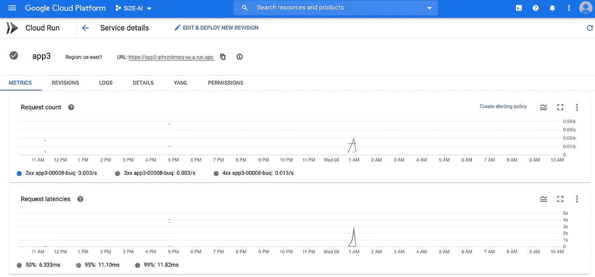

## 下一步，西方人工智能和来源

**下一步:**

*   调整超参数 *:* 我们希望尝试调整网络以获得更好的结果。超参数可能意味着层数、层大小或激活函数。目前，我们运行现成的 VGG-16/CSRNet 结构——有许多修改的可能性。我们强调的一些领域包括调整学习率和/或在增强型 GPU 上使用更长的训练时间。我们想在不久的将来在对数尺度上测试不同的学习速度。
*   优化器选择:我们的模型目前使用随机梯度下降(SGD)优化器。这意味着小批量大小为 1，并且在每个训练示例之后执行梯度下降。我们已经讨论了用 Adam 优化器或 RMSprop 进行试验。一旦我们实现了一个新的优化器，我们将有更多的超参数需要优化，包括调整我们的学习率。
*   大规模部署:由于模型的大小，我们的 web 应用程序目前是有限的。一个潜在的解决方案是使用迁移学习来训练更有效的模型版本。我们受到了 Geoffrey Hinton 的启发，他在 CUCAI re: Transfer Learning 上向我们展示了开发轻量级 ML 模型的方法。如果我们做到了这一点，我们可以考虑发布一款 IOS 应用。

**西方艾:**

> Western AI 是西部大学第一个由学生领导的组织，旨在为校园人工智能创建一个社区。这意味着我们正在为有兴趣接触人工智能的学生建立一个基础，让他们相互认识，学习真正的技能，并培养对理解人工智能在各种行业和经济中的全球影响的重要性的认识。
> 
> 仅在大学学生会(USC)批准运营的第一年，我们就正式吸纳了 170 多名学生成员，并与众多教授、行业专家和其他学生组织合作，在令人印象深刻的短时间内创建了一个非常强大的社区。我们相信有这么大的发展空间，有无数的机会。

**来源:**

CSRNet 的 Vidhya 实施:

[](https://www.analyticsvidhya.com/blog/2019/02/building-crowd-counting-model-python/) [## 这是破纪录的人群！一个必读的教程来建立你的第一个人群计数模型，使用…

### 人工智能和机器学习将在未来十年成为我们最大的帮手！今天早上，我在…

www.analyticsvidhya.com](https://www.analyticsvidhya.com/blog/2019/02/building-crowd-counting-model-python/) 

烧瓶中的 PyTorch:

[](https://github.com/avinassh/pytorch-flask-api-heroku) [## 阿维纳什/皮托赫-烧瓶-api-heroku

### 点击这里查看演示。如果你想检查一个超级简单的 API 服务器，那么检查这个 repo。从…安装它们

github.com](https://github.com/avinassh/pytorch-flask-api-heroku) 

CSRNet 原始论文:

 [## CSRNet:用于理解高度拥挤场景的扩展卷积神经网络

### 我们提出了一个用于拥挤场景识别的网络，称为 CSRNet，以提供数据驱动和深度学习的方法…

arxiv.org](https://arxiv.org/abs/1802.10062) 

## 非常感谢我的西部人工智能团队:安迪·马夫鲁迪斯，萨姆·韦勒，帕拉斯·阿胡贾，丹特·德卢卡和杰森·戴尔。

## 如有任何问题或意见，请随时联系杰森或我。

## **邮箱:Cmacki43@uwo.ca，Jdale29@uwo.ca**

## 领英:【https://www.linkedin.com/in/charlie-mackie-749ba314b/[https://www.linkedin.com/in/jaysondale/](https://www.linkedin.com/in/jaysondale/)T4