# 使用计算引擎将 Dockerized Streamlit 应用程序部署到 GCP

> 原文：<https://towardsdatascience.com/deploy-a-dockerized-streamlit-app-to-gcp-with-compute-engine-9b82fd2cdd28?source=collection_archive---------23----------------------->

## 使用 Docker 和 Google 云平台将简单的 streamlit 应用程序部署到云的指南(GCP)

作者:[爱德华·克鲁格](https://www.linkedin.com/in/edkrueger/)和[道格拉斯·富兰克林](https://www.linkedin.com/in/douglas-franklin-1a3a2aa3/)。

照片由 Boudewijn 在 Unsplash 上直播

使用 Streamlit 框架构建原型很简单，至少可以在您自己的计算机上运行。与更广泛的受众分享更加复杂。

Streamlit 使我们能够以最少的努力和零成本创建干净的应用程序。我们在这里使用的应用程序非常简单，因为本文将重点关注部署。我们将按照本文中列出的步骤，将 Streamlit 应用程序部署到 Google 云平台计算实例中。

这里有一个链接，链接到包含我们项目代码的 [GitHub 库](https://github.com/edkrueger/streamlit-template)。注意，我们使用 Pipenv 来管理我们的依赖关系。

 [## edkrueger/streamlit-模板

### 切换到后端目录。运行 pipenv install — dev 来安装 env。运行 pipenv shell。运行预提交安装到…

github.com](https://github.com/edkrueger/streamlit-template) 

# 什么是 Streamlit？

Streamlit 是一个免费的开源应用框架，为数据科学家和机器学习工程师快速创建伟大的 Python 应用提供了一种简单的方法。Streamlit 固执己见的本性使构建前端变得容易。最后，Streamlit 可以让数据应用的实验和生产以及机器学习分析更容易进行和迭代。

查看他们在 GitHub 上的工作。

 [## 简化/简化

### streamlit-用 Python 构建数据应用程序的最快方法-streamlit/streamlit

github.com](https://github.com/streamlit/streamlit) 

# Docker 和我们的 docker 文件

Docker 是将应用程序投入生产的最佳方式。Docker 使用 docker 文件来构建容器。构建的容器存储在 Google Container Registry 中，可以在这里进行部署。Docker 容器可以在本地构建，并将在任何运行 Docker **的系统上运行。**

这是我们在这个项目中使用的 docker 文件:

Dockerfile 文件

Dockerfile 的第一行以`FROM.`开始，这是我们导入操作系统或编程语言的地方。

接下来的两行涉及设置环境并在服务器上执行它。`COPY`行使本地文件`requirements.txt`在 docker 容器中可用。`RUN`命令可以跟随着您想要执行的任何 bash 代码。我们使用`RUN`来安装我们的依赖项。然后`ENV,`将我们的环境变量`ENV` 设置为`APP_HOME / app`。这模仿了我们的项目目录的结构，让 Docker 知道我们的应用程序在哪里。

这些行是 Python 云平台结构的一部分，你可以在谷歌的云 [*文档*](https://cloud.google.com/run/docs/quickstarts/build-and-deploy#python) 中读到更多关于它们的内容。

`WORKDIR`行将我们的工作目录设置为`$APP_HOME`。然后，`COPY` 行将剩余的本地文件放在 docker 容器中。

docker 文件中的最后一行在`$PORT.`运行我们的应用程序

# 用 Docker 构建和运行

这里我们将解释如何用 Docker 构建我们的容器。请注意，我们的 Dockerfile 位于`backend`目录中。

*   进入`backend`目录。
*   使用`docker build . -t streamlit-app`构建

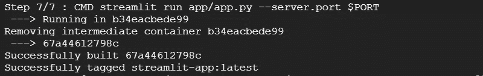

成功构建

`docker build`命令将 docker 文件的每一行视为一个“步骤”,并提供一个终端输出，指示每个步骤何时运行，如上所示。

既然我们的容器是在我们的虚拟机上构建的，我们就可以运行我们的 Streamlit 应用程序了。

*   使用`docker run -p 80:8080 -e PORT=8080 streamlit-app`运行

注意:这将在容器内部的端口 8080 和容器外部的端口 80 上运行应用程序。为了在容器外部引用它，URL 是`[http://localhost/](http://localhost/)`

您可能会收到如下所示的错误。

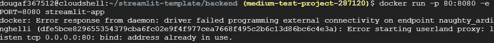

虚拟机告诉我们端口 80 已经被使用

如果是这种情况，将内部端口`80`更改为另一个数字，例如`85`，并运行`docker run -p 85:8080 -e PORT=8080 streamlit-app`。

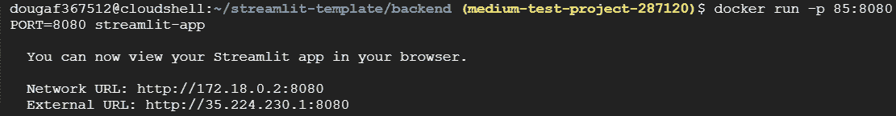

应用程序正在运行

# 部署到 GCP 计算引擎

如果您在本地开发，您将需要安装云软件开发工具包 CLI 工具。

 [## 云 SDK 命令行工具|云 SDK:命令行界面

### 发送反馈 Google Cloud Next '20: OnAir |从 7 月 14 日起每周二按需探索精选内容…

cloud.google.com](https://cloud.google.com/sdk/?utm_source=google&utm_medium=cpc&utm_campaign=na-US-all-en-dr-bkws-all-all-trial-e-dr-1009135&utm_content=text-ad-lpsitelinkCCexp2-any-DEV_c-CRE_79747435927-ADGP_Hybrid+%7C+AW+SEM+%7C+BKWS+%7C+US+%7C+en+%7C+EXA+~+Google+Cloud+SDK-KWID_43700007037826431-kwd-76317487932&utm_term=KW_google%20cloud%20sdk-ST_google+cloud+sdk&gclid=Cj0KCQjw-uH6BRDQARIsAI3I-Uc-oIyaUf1X-nC0P0hd1VOZzMtHMXnZM-qZwD3L6y5lrLdlYtqKaEAaAg-mEALw_wcB) 

如果你在云机器上开发，很可能已经配置了这些工具。打开终端，输入以下命令。

*   运行`gcloud init`选择您的账户和项目

这将多次提示您响应终端中的提示，以选择项目和虚拟机(VM)。

*   运行`export PROJECT=$(gcloud config get-value project)`获取并保存您的项目 id。
*   跑`export GCR_TAG=gcr.io/$PROJECT/my-app`去拿 GCR 的标签。

这允许我们将`GCR_TAG`作为环境变量引用，以便以后重用。

*   运行`gcloud builds submit --tag $GCR_TAG`将构建提交给 GCP 云构建。

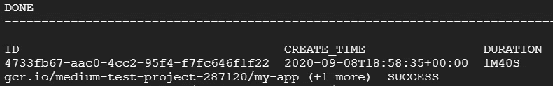

建立成功

这将在云构建中的另一台机器上构建我们的容器。一旦这个构建完成，我们的容器就可以在 Google 容器注册中心(GCR) 中使用我们指定的标签了。

*   运行`echo $GCR_TAG`查看 GCR 标签。

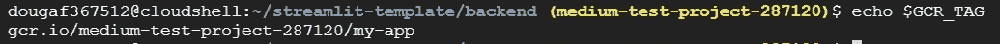

现在，为了将我们的 dockerized 应用程序部署到虚拟机，我们遵循以下步骤。

*   转到 GCP 用户界面中的“计算引擎”并选择“创建实例”

*   在选项中，选中复选框“将容器映像部署到此虚拟机实例”
*   在“容器图像”字段中粘贴 GCR 标签。

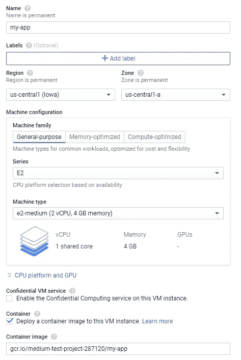

在 GCP 上创建实例

若要公开部署，请选择“允许 HTTP 流量”

*   点击“创建”
*   运行`export GCR_TAG=<GCR TAG>`。

确保用您的标签替换`GCR_TAG`。

*   运行`docker run -p 80:8080 -e PORT=8080 $GCR_TAG`。

您不应该在新虚拟机上遇到任何端口错误。如果确实如此，请务必终止该进程，这样就可以将`80`保持为默认端口。否则，您的本地主机地址将是您指定的内部端口。

如果成功，您将看到两个 URL 填充了您的终端。

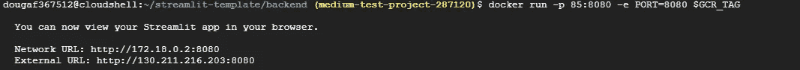

现在，使用 GUI 并单击“连接”下的下拉菜单，然后选择“在浏览器窗口中打开”

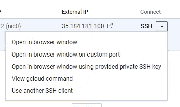

这将打开一个新的终端如下所示。我们再次需要我们的`GCR_TAG`，并且可以用命令`docker image ls`检索它。

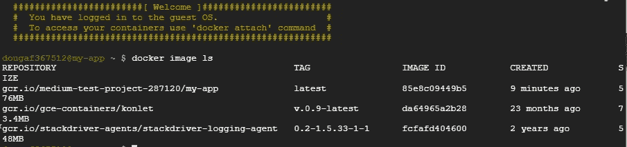

我们的 docker 图像

一旦我们有了`GCR_TAG`，我们使用`export`保存它，然后用行`docker run -p 80:8080 -e PORT=8080 $GCR_TAG`重新运行我们的应用程序。

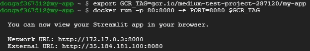

使用 Docker 运行我们的应用程序

请注意，我们无法在终端显示的 URL 中找到我们的应用程序。要查看我们的应用程序的运行情况，我们将使用 GUI 并找到那里显示的 URL。

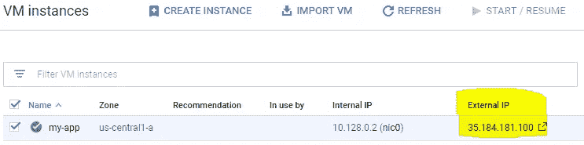

运行应用程序的外部 URL

如果你访问网址，你会看到你的应用程序！请注意，这是公开的。

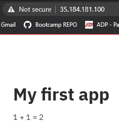

复杂性

请注意，这是“不安全”的，意味着没有 HTTPS 握手发生。如果网站不安全，用户在页面上输入的任何信息(如姓名、地址、信用卡详细信息)都不会受到保护，很容易被窃取。然而，在安全的网站上，代码是加密的，因此任何敏感信息都很难被发现。

当您使用完实例时，一定要关闭它们，因为它们只向您收取运行时间的费用。

## 结论

现在我们知道了如何将一个 streamlit 应用程序 Dockerize 并将其部署到 GCP。Streamlit 非常适合快速 POC 模型和内部仪表盘，现在我们有办法在云中测试我们的 Streamlit 应用程序！

感谢您的阅读！你能部署一个 Streamlit 应用程序吗？