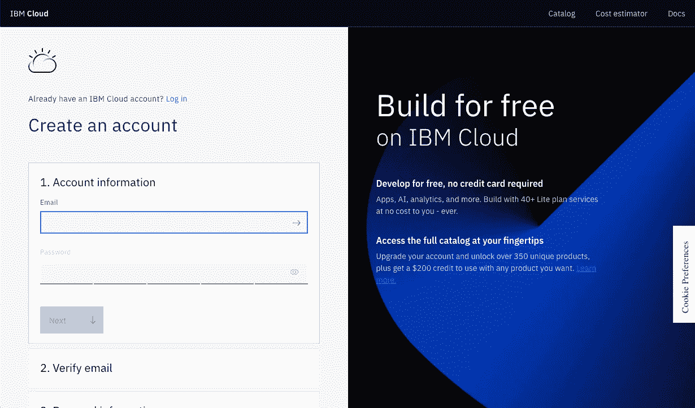
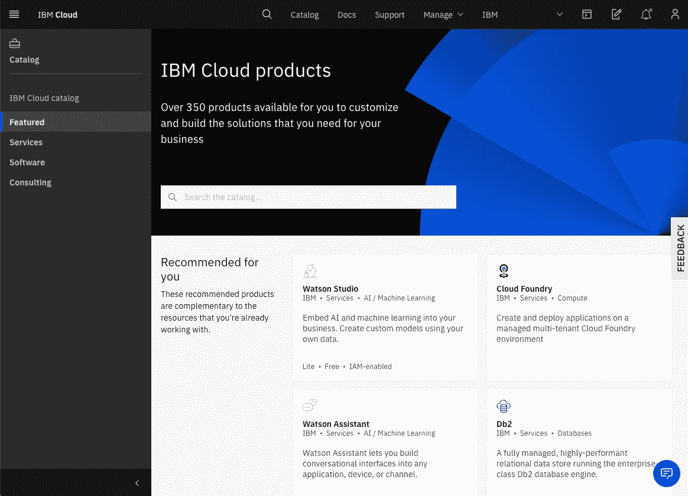
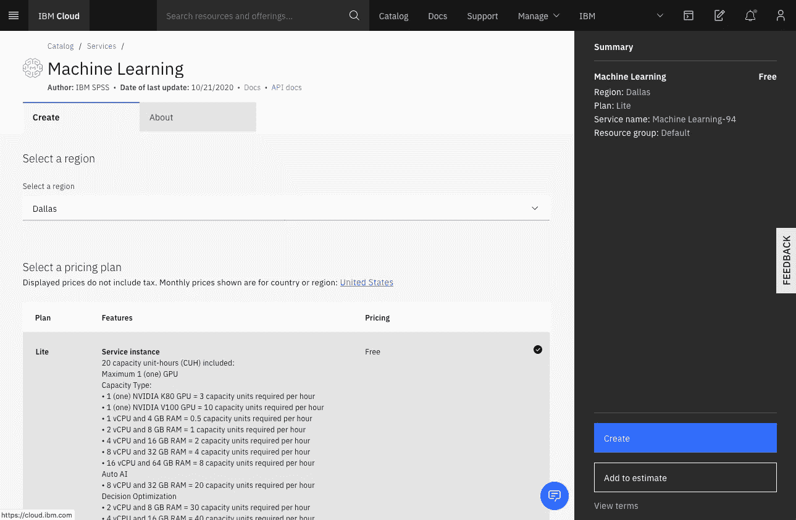
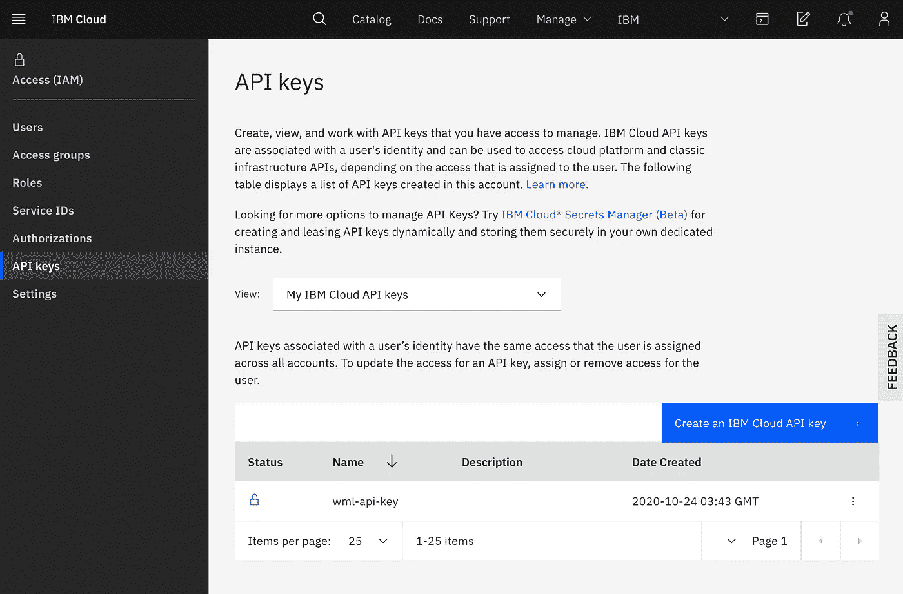
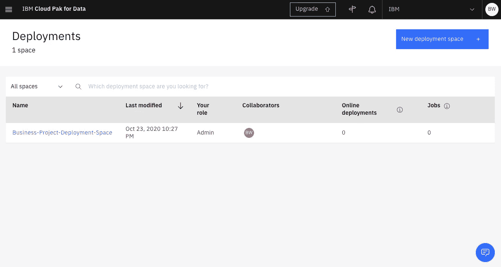

# 从 Jupyter 笔记本部署机器学习模型

> 原文：<https://towardsdatascience.com/deploy-a-machine-learning-model-from-a-jupyter-notebook-9257ae5a5f7c?source=collection_archive---------15----------------------->

## 部署可以而且应该很容易

坦率地说，如果你不能从笔记本中获得你的机器学习模型，它可能不会被使用。本文将帮助您尽快创建模型的部署，以便您可以将业务流程注入到模型中。这是一项重要的技能，因为这意味着你不再依赖软件工程师/开发人员来帮助你。


[斯科特·格雷厄姆](https://unsplash.com/@sctgrhm?utm_source=unsplash&utm_medium=referral&utm_content=creditCopyText)在 [Unsplash](https://unsplash.com/s/photos/business?utm_source=unsplash&utm_medium=referral&utm_content=creditCopyText) 上拍照

为此，我们将使用 Watson 机器学习和 Jupyter 笔记本。我假设您已经有了 Anaconda 或其他可以运行笔记本的环境。以下是我们将遵循的大纲，您可以随意跳过您可能已经完成的步骤:

1.  创建一个 IBM 云帐户。(~2 分钟)
2.  创建 Watson 机器学习(WML)实例。(~2 分钟)
3.  获取 API 密钥。(~1 分钟)
4.  创建一个可以存储模型的部署空间。(~1 分钟)
5.  创建一个机器学习模型。(大约 1 分钟，除非您正在创建自己的模型)
6.  部署您的模型。(~4 分钟)
7.  尝试发送您部署的模型数据。(~2 分钟)

# 创建 IBM 云帐户

访问 IBM Cloud 的[注册页面，并遵循那里的指示。](https://cloud.ibm.com/registration)



# 创建沃森机器学习实例

登录后，这应该是您看到的屏幕。你可以点击顶部横幅中的目录按钮，滚动直到找到机器学习，或者使用搜索栏来找到它。



选择 Watson Machine Learning 后，点击右下角的 create 按钮创建一个免费的 Lite 实例。一定要记住你选择的地区，对我来说就是达拉斯。



如上所述，沃森机器学习每月提供 20 个自由容量单元，在此期间可以对模型进行训练、评估、部署和评分。如果您的预算有限，我建议您在本地环境中培训您的模型，并保存您的容量单位以用于评分。对于不会经常调用的较小型号，这可能就足够了。

# 获取 API 密钥

要获得密钥，请访问您的 IBM Cloud 帐户的 [API 密钥管理页面](https://cloud.ibm.com/iam/apikeys)。然后，您可以单击“Create an IBM Cloud API key”来创建一个新的密钥，并提供密钥名称和描述。我给出了“wml-api-key”作为我的键的名称。



创建 API 密钥后，将其复制并粘贴到笔记本中，以便我们使用。

# 创建部署空间

部署空间是您可以存储和管理所有已部署模型的地方。我建议为每个业务目的准备一个部署空间。访问您的[部署空间页面](https://dataplatform.cloud.ibm.com/ml-runtime/spaces?context=cpdaas)以创建新的部署。



从现在开始，我们将在笔记本上写 python 代码。

# 创建机器学习模型

我将保持简单，为虹膜数据集创建一个 KNN 模型。虽然您应该制作一些与您的业务用例相关的东西，但是这个模型足以演示如何使用 WML。如果您没有制作自己的模型，可以复制并粘贴下面的单元格。

```
import sklearn
from sklearn.datasets import load_irisiris = load_iris()
X = iris.data
Y = iris.target
clf = sklearn.neighbors.KNeighborsClassifier()
clf.fit(X, Y)
```

# 部署您的模型

## 安装 Python SDK

您需要安装 IBM Watson 机器学习 python SDK。您可以通过在命令行中运行`pip install ibm-watson-machine-learning`来做到这一点。你也可以像这样在你的笔记本中运行它自己的单元格:`!pip install ibm-watson-machine-learning`。

## 设置您的客户端

您可以通过导入 Watson Machine 学习包并提供您的 API 键和区域来启动您的代码。如果您不知道应该为 location 提供什么值，您应该使用检查您的实例所在的城市。您通过查阅 [locations 页面找到那个城市和地区。](https://cloud.ibm.com/docs/containers?topic=containers-regions-and-zones#zones-mz)因为我的实例在达拉斯，所以我为下面的位置变量提供了“美国南部”。

```
from ibm_watson_machine_learning import APIClientapi_key = "<your-key>"
location = "<your-region>"
```

这些可以作为凭证提供。

```
wml_credentials = {
    "apikey": api_key,
    "url": '[https://'](/') + location + '.ml.cloud.ibm.com'
}client = APIClient(wml_credentials)
```

## 设置您的部署空间

我们需要获得您的部署空间的 ID。您可以通过运行下面的代码来做到这一点。

```
client.spaces.list()
```

从上面的输出中，您将获得您的部署空间的 ID。使用下面的代码设置您的 APIClient 来使用您的部署空间。

```
client.set.default_space("<ID>")
```

## 发布您的模型

在我们部署我们的模型之前，我们需要发布它。首先，我们必须决定我们想要使用哪个版本的 python，并设置一些元数据。如果你需要弄清楚你使用的是哪个版本的 python，运行`import sys`，然后运行`sys.version`。

如果您还部署了一个基于 sklearn 的模型，您将需要确定它的版本。你可以运行`sklearn.__version__`来解决这个问题。

```
metadata = {
    client.repository.ModelMetaNames.NAME: 'Iris KNN Model',
    client.repository.ModelMetaNames.TYPE: 'scikit-learn_0.22',
    client.repository.ModelMetaNames.SOFTWARE_SPEC_UID: sofware_spec_uid
}published_model = client.repository.store_model(
    model=clf,
    meta_props=metadata,
    training_data=iris.data,
    training_target=iris.feature_names)
```

您将需要获得您发布的模型的 ID。您可以通过运行下面的代码来获得。

```
models_details = client.repository.list_models()
```

## 部署您的模型

要部署您的模型，请使用上面单元格中您发布的模型的 ID，并运行下面的代码。

```
metadata = {
    client.deployments.ConfigurationMetaNames.NAME: "Deployment of Iris KNN Model",
    client.deployments.ConfigurationMetaNames.ONLINE: {}
}

created_deployment = client.deployments.create("<your-published-model-id>", meta_props=metadata)
```

# 测试您的部署

您的模型现在已经部署，我们现在可以向它发送数据并获得响应。首先，我们需要通过运行下面的代码来获取已部署模型的 ID。

```
client.deployments.list()
```

然后，我们可以使用该 ID 并在列表列表中发送观察结果。

```
scoring_payload = {"input_data": [{"values": [[5.1, 3.5, 1.4, 0.2]]}]}
predictions = client.deployments.score("<your-deployment-id>", scoring_payload)
```

在预测变量中，我们现在已经存储了一个类的预测和每个类的概率。

# 结论

如果你的作品要产生巨大的影响，它必须出现在某个地方，而不是 PowerPoint。对于许多数据科学家来说，笔记本是机器学习模型的主要开发环境，如果您不想将模型及其依赖项打包成可以在您的计算机和生产服务器上运行的东西，那么这是一种方法。除了所有这些复杂性之外，就你必须获得的知识而言，这是最简单的工作流程，以使 ML 模型在生产中工作，这可能是在你的业务中采用 AI 的最快方式。