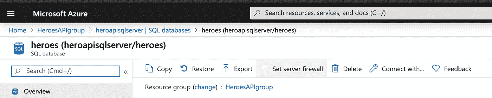
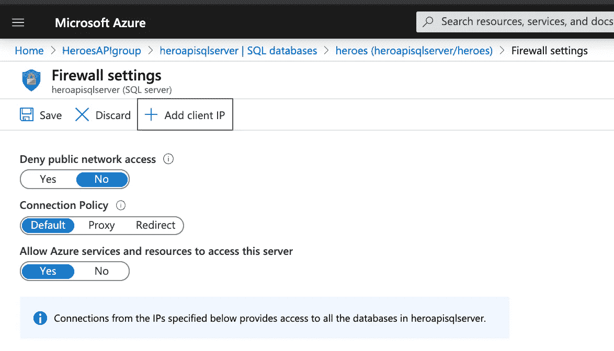
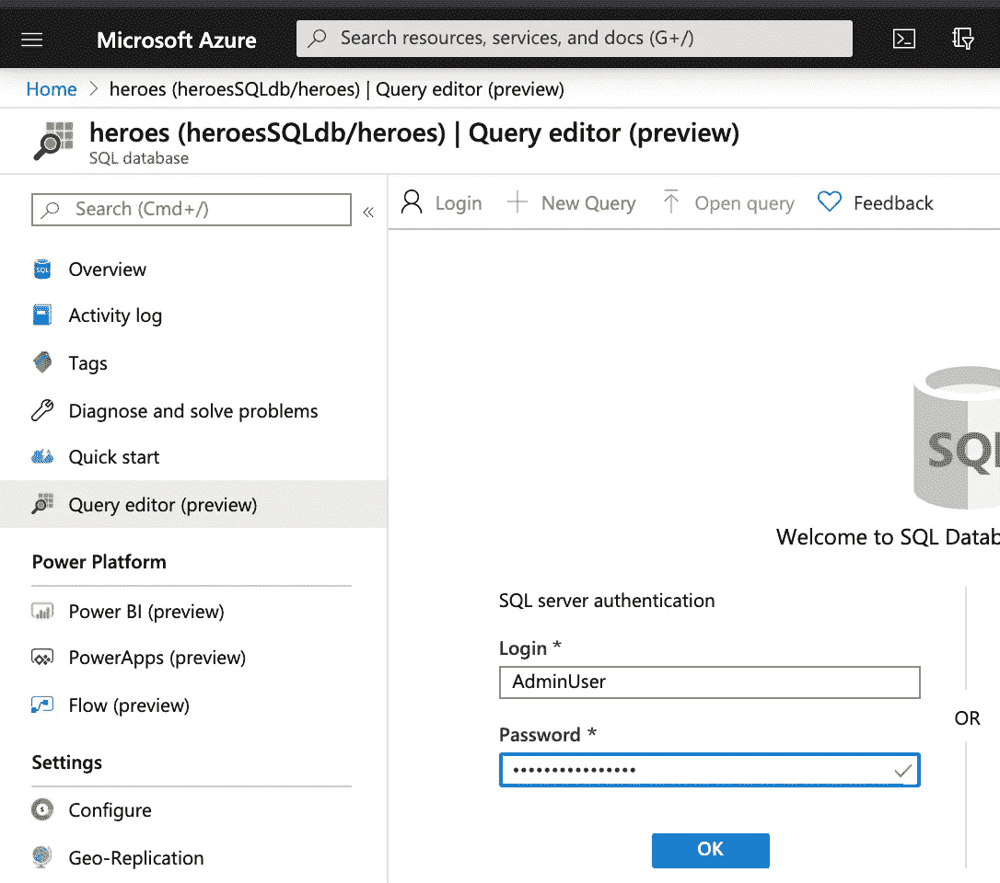
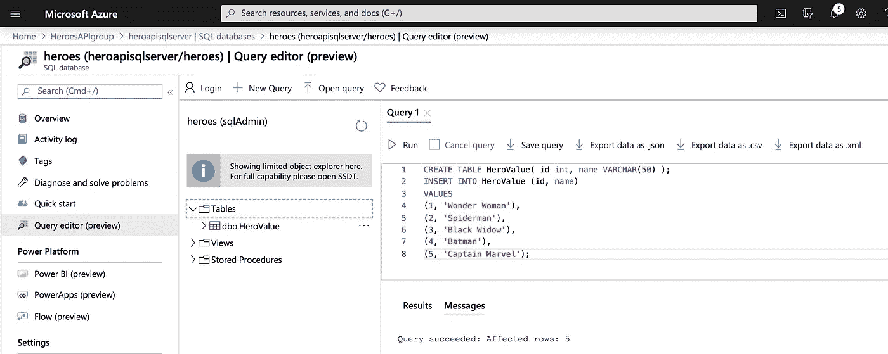
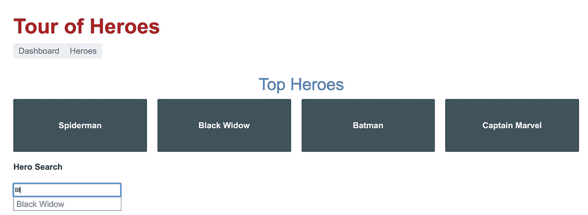

# 将. NET API 部署到 Azure

> 原文：<https://towardsdatascience.com/deploy-a-net-api-to-azure-84ea79d42d1a?source=collection_archive---------17----------------------->

## 创建一个 SQL 数据库，并在云中提供您的 API！


[罗尔尼克](https://unsplash.com/@rollnik?utm_source=unsplash&utm_medium=referral&utm_content=creditCopyText)在 [Unsplash](https://unsplash.com/s/photos/cloud?utm_source=unsplash&utm_medium=referral&utm_content=creditCopyText) 上的照片

# 介绍

本文是致力于为英雄视角之旅教程构建. NET API 的系列文章的第四篇。

到目前为止，我们已经:

1.  [设置我们的环境。](/net-core-api-for-the-angular-tour-of-heroes-app-5895a36d2129)
2.  [构建了一个 MSSQL Docker 容器数据库](/build-a-mssql-docker-container-800166ecca21)用于本地开发。
3.  [为英雄角游 app 写了一个. NET API](/net-core-api-dive-into-c-27dcd4170066) 。

您可以使用 Angular 应用程序的本地开发版本。NET API，以及一个来自于 [my GitHub repo](https://github.com/rchardptrsn/TourOfHeroes-dotNETCore) 的 [Docker MSSQL](https://github.com/rchardptrsn/MSSQL-Docker-Container) 数据库，或者按照本系列的前一篇文章自己构建。

现在，让我们部署我们的。NET API 到 Azure！我必须感谢[这个棒极了的微软教程](https://docs.microsoft.com/en-us/azure/app-service/containers/quickstart-dotnetcore)，它详细介绍了这个过程。

# 文章大纲

1.  设置环境
2.  创建 Azure SQL server
3.  展开。NET API 到 Azure

# 设置您的环境


照片由[卡西·斯马特](https://unsplash.com/@cassiesmart19?utm_source=unsplash&utm_medium=referral&utm_content=creditCopyText)在 [Unsplash](https://unsplash.com/s/photos/sahara?utm_source=unsplash&utm_medium=referral&utm_content=creditCopyText) 拍摄

你需要两个关键的软件:

1.  [Azure 命令行界面](https://docs.microsoft.com/bs-latn-ba/cli/azure/install-azure-cli?view=azure-cli-latest)
2.  [。NET Core](https://dotnet.microsoft.com/download/dotnet-core) —我用的是 3.0.2 版本

当这些都被安装后，把本地版本的。我的 GitHub repo 中的. NET API。从命令行导航到`Heroes.API`目录并运行。NET 核心程序通过运行`dotnet run`。一旦你确认它在你的系统上运行，停止程序。

## 初始化 git 储存库

因为你从 GitHub 下载了这个项目，它带有一个. git 隐藏文件夹，我们需要删除它。从`Heroes.API`向上一层，这样你就可以看到组成整个应用程序的所有 3 个文件夹。显示隐藏的文件夹`.git`文件夹，并从 linux 或 mac 系统中删除或运行`sudo rm -r .git`。

然后，导航回英雄。API 目录。运行`ls`以确保您看到所有预期的文件夹。

我们需要初始化一个新的 git 存储库，并将它推送到 Azure 远程存储库。从`Heroes.API`目录运行:

```
git init 
git add . 
git commit -m "first commit"
```

# 创建 Azure SQL 数据库

通过运行`az login`登录到 Azure CLI。

使用 [az group](https://docs.microsoft.com/en-us/cli/azure/group?view=azure-cli-latest) 命令创建一个名为`HeroesAPIgroup`的资源组来存放您的资源。

```
az group create --name HeroesAPIgroup --location eastus
```

通过运行以下命令，在您的资源组名称`heroesSQLdb`中创建一个 SQL server

```
az sql server create \
--name heroapisqlserver \
--resource-group HeroesAPIgroup \
--location eastus \
--admin-user sqlAdmin \
--admin-password Mystrongpassw0rd
```

完成后，您将获得部署细节的 JSON 输出。

通过运行以下命令为您的服务器配置防火墙:

```
az sql server firewall-rule create \
--resource-group HeroesAPIgroup \
--server heroapisqlserver  \
--name AllowAllIps \
--start-ip-address 0.0.0.0 \
--end-ip-address 0.0.0.0
```

在新创建的 SQL server 上创建一个`heroes`数据库。

```
az sql db create \
--resource-group HeroesAPIgroup \
--server heroapisqlserver   \
--name heroes \
--service-objective S0
```

要向您的`heroes`数据库添加一个表，我们需要登录 Azure 门户，找到您的 **HeroesAPIgroup** 资源组，然后点击您的 **heroes** SQL 数据库。

转到查询编辑器，尝试使用创建 SQL server 时的用户名和密码输入您的 SQL 数据库。它应该会失败，因为根据您的防火墙规则，您的本地 IP 地址没有被授予访问服务器的权限。

返回到您的`heroes`数据库概述。点击**设置服务器防火墙**。



从防火墙设置中，单击添加客户端 IP。现在，您应该能够从您的家庭或办公室 IP 地址位置访问 SQL server。



现在，使用查询编辑器中的用户名和密码进入 SQL 数据库。



登录到 SQL Server 后，运行下面的查询来添加一个表，并将示例数据插入到数据库中。

```
CREATE TABLE HeroValue( id int, name VARCHAR(50) );
INSERT INTO HeroValue (id, name)
VALUES 
(1, 'Wonder Woman'), 
(2, 'Spiderman'), 
(3, 'Black Widow'), 
(4, 'Batman'), 
(5, 'Captain Marvel');
```



我们有数据库！让我们复制出连接字符串以备后用。从 Overview 中，单击连接字符串，并复制。提供了网络连接字符串。我的看起来像这样:

```
Server=tcp:heroapisqlserver.database.windows.net,1433;Initial Catalog=heroes;Persist Security Info=False;User ID=sqlAdmin;Password={your_password};MultipleActiveResultSets=False;Encrypt=True;TrustServerCertificate=False;Connection Timeout=30;
```

用您为管理员选择的密码替换`{your_password}`。

我们不会将这个连接字符串插入到我们的应用程序中。一旦我们部署了应用程序，我们将使用`az webapp config`为应用程序配置一个连接，这将优先于`appsettings.json`中的连接字符串。我们将在创建 web 应用程序后创建这个应用程序级的连接字符串，所以请记住这个连接字符串。

让我们部署该应用程序吧！

# 展开。NET API 到 Azure

我们将需要配置一个*部署用户*，授权他将 git 存储库推送到 Azure。立即创建用户:

```
az webapp deployment user set \
--user-name DeploymentUser420 \
--password DeploymentPassw0rd!
```

如果成功，您将获得 JSON 输出。如果你得到错误，[Azure 文档](https://docs.microsoft.com/en-us/azure/app-service/app-service-web-tutorial-dotnetcore-sqldb)说:如果你得到一个`'Conflict'. Details: 409`错误，改变用户名。如果你得到一个`'Bad Request'. Details: 400`错误，使用一个更强的密码。

## 创建应用服务计划

应用服务计划将决定为运行应用而创建的虚拟机的大小。我们将使用应用服务计划的免费 linux 层。

```
az appservice plan create \
--name HeroesAPIserviceplan \
--resource-group HeroesAPIgroup \
--is-linux \
--sku FREE
```

## 创建 web 应用程序

创建一个符合应用服务计划条款的 web 应用。

首先，我们需要检查哪些运行时可用。运行:

```
az webapp list-runtimes --linux
```

选择适合您代码的`DOTNET|`运行时。我们要用`“DOTNETCORE|3.0”`。使用 [az webapp create](https://docs.microsoft.com/en-us/cli/azure/webapp?view=azure-cli-latest#az-webapp-create) 命令创建 web 应用。我强烈推荐在这个多功能的命令上阅读 Azure 文档。

```
az webapp create \
--resource-group HeroesAPIgroup \
--plan HeroesAPIserviceplan \
--name heroes-api \
--runtime "DOTNETCORE|3.0" \
--deployment-local-git
```

创建应用程序后，首先看到的是 git remote 的 URL。保存这个非常重要！我们将需要这个 URL 来将您的本地 git 存储库推送到 Azure。

我的 git 回购 URL。(不要担心在发布文章之前这个项目会被删除)。

```
Local git is configured with url of '[https://DeploymentUser420@heroes-api.scm.azurewebsites.net/heroes-api.git'](https://DeploymentUser420@heroes-api.scm.azurewebsites.net/heroes-api.git')
```

## 配置连接字符串

还记得设置 SQL server 后保存的连接字符串吗？我们现在将使用它在应用程序级别设置一个连接字符串。这将优先于指向本地 docker mssql 数据库的当前连接字符串。不要忘记将`{your_strong_password}`替换为您的管理员密码。

```
az webapp config connection-string set \
--resource-group HeroesAPIgroup \
--name heroes-api \
--settings MyDbConnection="Server=tcp:heroapisqlserver.database.windows.net,1433;Initial Catalog=heroes;Persist Security Info=False;User ID=sqlAdmin;Password={your_password};MultipleActiveResultSets=False;Encrypt=True;TrustServerCertificate=False;Connection Timeout=30;" \
--connection-string-type SQLServer
```

## 为数据库使用设置环境变量

我们需要设置一个环境变量。NET API 知道在生产环境中连接到 Azure SQL 数据库，而不是用于开发的本地 docker 数据库。

```
az webapp config appsettings set \
--name heroes-api \
--resource-group HeroesAPIgroup \
--settings ASPNETCORE_ENVIRONMENT="Production"
```

现在，我们需要在。NET API 来读取环境变量，并相应地选择 Azure 数据库或 Docker 数据库。

修改`Startup.cs`中的 **ConfigureServices** 以首先查找环境变量`ASPNETCORE_ENVIRONMENT`，如果没有该变量，则选择本地 Docker 数据库。

```
// Use SQL Database if in Azure, otherwise, use SQLite
if(Environment.GetEnvironmentVariable("ASPNETCORE_ENVIRONMENT") == "Production")
    services.AddDbContext<HeroesContext>(options =>
        options.UseSqlServer(
            Configuration.GetConnectionString("MyDbConnection")));
else
    services.AddDbContext<HeroesContext>(options =>
        options.UseSqlServer(
            Configuration.GetConnectionString("DockerDB")));
```

保存您的更改，不要忘记提交 git repo。

```
git add .
git commit -m "connect to SQLDB in Azure"
```

## 从本地 git repo 推送到 Azure

您的应用程序已准备好进行生产部署。让我们将 git 存储库推送到远程 Azure 存储库，我们的 web 应用程序正在寻找该存储库来提供代码。添加创建 web 应用程序后保存的 git repo URL。

```
git remote add azure <deploymentLocalGitUrl-from-create-step>
```

将您的 git repo 推送到 Azure remote repo 来部署您的应用程序。当您运行以下命令时，它会要求您提供凭据。**输入我们创建的部署用户的密码，而不是您的 Azure 登录名！**

```
git push azure master
```

你做到了！您部署了您的应用程序！现在让我们来测试一下。浏览 heroes-api 应用服务概述，并复制 API URL 端点。它应该是这样的:

```
https://heroes-api.azurewebsites.net
```

# 测试来自 Postman 的 API

向`[https://heroes-api.azurewebsites.net/api/Heroes](https://heroes-api.azurewebsites.net/api/Heroes)`发送一个 **GET** 请求，观察所有预装英雄的 JSON 输出！成功！

# 来自英雄角游 App 的测试

打开[英雄之旅 app](https://medium.com/swlh/deploy-an-angular-app-to-azure-955f0c750686?source=friends_link&sk=170255924d9bc3f99a9e5ab13878a4ba) 进入`src/app/hero.service.ts`。

在 HeroService 类下，注释掉本地的 URL。NET API，并用 Azure 的 API URL 端点替换 localhost:5000。您的连接字符串将如下所示:

`*private* heroesUrl = ‘https://heroes-api.azurewebsites.net/api/Heroes';`

通过运行以下命令启动 angular 应用程序:

```
ng serve --open
```

你做到了！你有一个前端，后端和一个数据库！



# 将您的 Angular 应用程序部署到 Azure

要将你的 Angular app 部署到 Azure，可以跳转到[我的文章！](https://medium.com/swlh/deploy-an-angular-app-to-azure-955f0c750686)

确保您记得在 HeroService 中交换连接字符串。

谢谢你读到这里！我希望这篇文章能让你轻松部署到 Azure，如果你需要更多的解释，[这篇 Azure 教程](https://docs.microsoft.com/en-us/azure/app-service/app-service-web-tutorial-dotnetcore-sqldb)真的很详细！