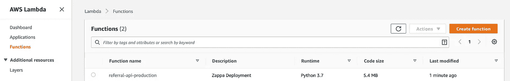
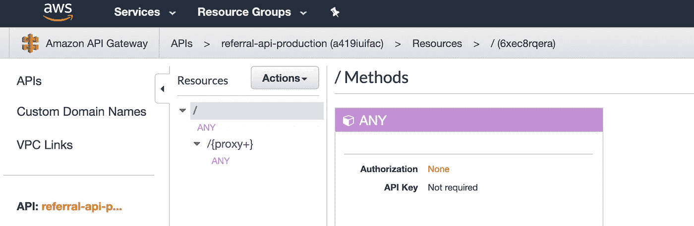
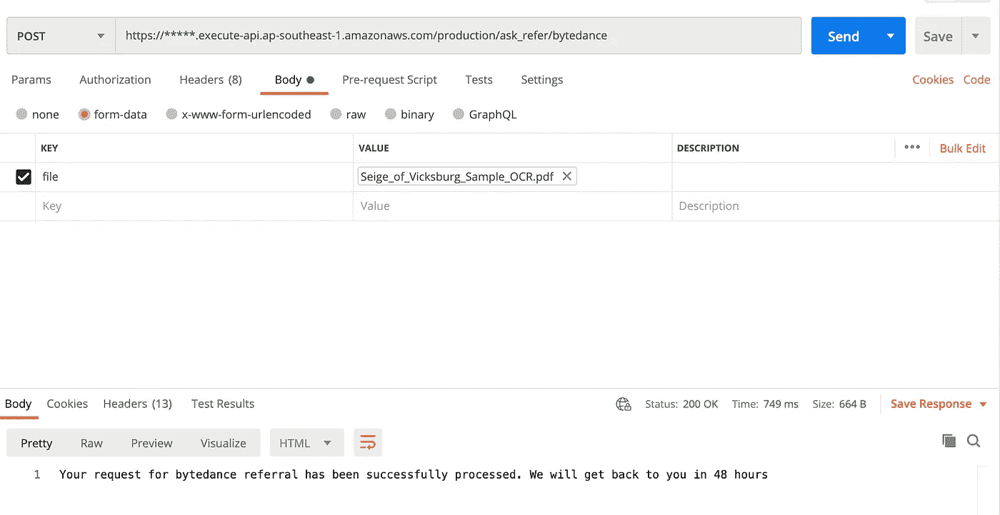
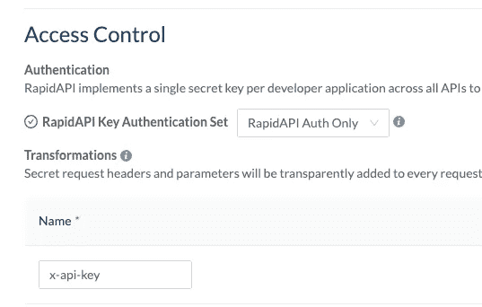

# 在 AWS 上部署 Python API

> 原文：<https://towardsdatascience.com/deploy-a-python-api-on-aws-c8227b3799f0?source=collection_archive---------3----------------------->

## 烧瓶+ Lambda + API 网关

创建我自己的应用程序并将其部署在云上以便每个人都可以使用它的第一个想法让我非常兴奋，这也是我写这篇文章的灵感。如果这个想法也引起了你的兴趣，请继续阅读这篇文章，从这篇文章中，你将一步一步地学习如何部署 python 应用程序。

# 首先，你需要一个应用程序

你需要将你的想法包装在一个应用程序中，或者说是一个 API，它可以处理来自互联网的呼叫。这里的就是一个例子[。这是一个烧瓶应用程序，](https://github.com/MJeremy2017/referral-api)

关键在于`app.py`文件，这个应用程序接收你的简历并帮助你在内部推荐。请注意，我们甚至不需要 docker 文件，AWS Lambda 非常轻量级，您甚至不需要将代码包装在容器中！

# 其次，下载 Zappa

[Zappa](https://github.com/Miserlou/Zappa) ，引自官方文件，它

*让在 AWS Lambda + API Gateway 上构建和部署无服务器、事件驱动的 Python 应用程序(包括但不限于 WSGI web 应用程序)变得极其简单。可以把它想象成 Python 应用程序的“无服务器”网络托管。这意味着无限扩展、零停机、零维护，而成本只是您当前部署的一小部分！*

如果你已经使用 AWS 服务有一段时间了，你会知道在云上部署一个使用多种不同服务和配置的服务不是一件容易的事情，但是 Zappa 来拯救你，用简单的命令(相信我，它真的只有几行！)，所有的起重配置都会完成！

```
pip install zappa
```

顺便说一下，我假设您已经在项目虚拟环境中安装了所有的包，如果没有，请安装

```
virtualenv -p `which python3` env
```

(您需要预装 virtualenv)

现在做

```
zappa init
```

一个一个的检查设置，如果你不明白就用默认的，之后你仍然可以改变它。在这之后，你的根文件夹中会有一个`zappa_setting.json`,我的是这样的

```
{
    "production": {
        "app_function": "app.app",
        "aws_region": "ap-southeast-1",
        "profile_name": "default",
        "project_name": "referral-api",
        "runtime": "python3.7",
        "s3_bucket": "zappa-referral-api-eu2hzy8sf"
    }
}
```

# 第三，让 Zappa 访问你的 AWS

现在你需要去你的 AWS 控制台，但是等等，你说 Zappa 会为我们做所有的 AWS 工作？是的，但是请这样想，在 Zappa 可以代表您做出任何更改之前，它需要访问您的 AWS 资源，这一步是给 Zappa 一个做这些事情的凭证。

您可以遵循这里的步骤[部署-无服务器-应用](https://pythonforundergradengineers.com/deploy-serverless-web-app-aws-lambda-zappa.html)(相信我，这是一个真正的说明性指南，包含您需要的所有映像)。

对于附加到组的策略，请使用此策略！*(上面链接中的那个不能让你更新应用*)

```
{
  "Version": "2012-10-17",
  "Statement": [
    {
      "Effect": "Allow",
      "Action": [
        "iam:AttachRolePolicy",
        "iam:GetRole",
        "iam:CreateRole",
        "iam:PassRole",
        "iam:PutRolePolicy"
      ],
      "Resource": [
        "arn:aws:iam::XXXXXXXXXXXXXXXX:role/*-ZappaLambdaExecutionRole"
      ]
    },
    {
      "Effect": "Allow",
      "Action": [
        "lambda:CreateFunction",
        "lambda:ListVersionsByFunction",
        "logs:DescribeLogStreams",
        "events:PutRule",
        "lambda:GetFunctionConfiguration",
        "cloudformation:DescribeStackResource",
        "apigateway:DELETE",
        "apigateway:UpdateRestApiPolicy",
        "events:ListRuleNamesByTarget",
        "apigateway:PATCH",
        "events:ListRules",
        "cloudformation:UpdateStack",
        "lambda:DeleteFunction",
        "events:RemoveTargets",
        "logs:FilterLogEvents",
        "apigateway:GET",
        "lambda:GetAlias",
        "events:ListTargetsByRule",
        "cloudformation:ListStackResources",
        "events:DescribeRule",
        "logs:DeleteLogGroup",
        "apigateway:PUT",
        "lambda:InvokeFunction",
        "lambda:GetFunction",
        "lambda:UpdateFunctionConfiguration",
        "cloudformation:DescribeStacks",
        "lambda:UpdateFunctionCode",
        "lambda:DeleteFunctionConcurrency",
        "events:DeleteRule",
        "events:PutTargets",
        "lambda:AddPermission",
        "cloudformation:CreateStack",
        "cloudformation:DeleteStack",
        "apigateway:POST",
        "lambda:RemovePermission",
        "lambda:GetPolicy"
      ],
      "Resource": "*"
    },
    {
      "Effect": "Allow",
      "Action": [
        "s3:ListBucketMultipartUploads",
        "s3:CreateBucket",
        "s3:ListBucket"
      ],
      "Resource": "arn:aws:s3:::zappa-*"
    },
    {
      "Effect": "Allow",
      "Action": [
        "s3:PutObject",
        "s3:GetObject",
        "s3:AbortMultipartUpload",
        "s3:DeleteObject",
        "s3:ListMultipartUploadParts"
      ],
      "Resource": "arn:aws:s3:::zappa-*/*"
    }
  ]
}
```

现在您将为 Zappa 创建的凭证添加到您的本地文件(凭证和配置)，我的如下所示

```
[default]
aws_access_key_id = ****
aws_secret_access_key = ****[zappa]
aws_access_key_id = ****
aws_secret_access_key = ****
```

像这样配置

```
[default]
region = ap-southeast-1
output = json[zappa]
region = ap-southeast-1
output = json
```

我专门为 Zappa 创建了一个，因为我相信我们大多数人都会有自己的默认凭证，这个设置可以让你在不同的配置文件之间切换。

现在它已经准备好部署了！

```
export AWS_DEFAULT_PROFILE=zappa
zappa deploy production
```

您会在命令行后面看到您的 API url。现在转到您的 AWS Lambda，您应该会看到我们部署的 API:



在 API Gateway 中，您可以看到:



既然我可以在 postman 上测试公共端点并获得响应:



恭喜你。现在你已经用 Lambda 和 API Gateway 把你的应用完全部署到 AWS 上了！

如果这已经满足了您的需要，您可以就此打住，但是如果您想要分发您的 API 并为其添加限制，您可以继续下一部分。

# Extra1:向 API 添加密钥

您可能已经注意到，到目前为止，我们的 API 是公开可访问的，这意味着任何人都可以访问我们的 API，它很容易受到恶意攻击。为了避免这种不受欢迎的访问，我们需要对我们的 API 使用(使用计划)和凭证(x-api-key)添加额外的限制来限制访问。

要给你的 API 添加一个密钥，请遵循这里的步骤。

# Extra2:通过 RapidAPI 发布您的 API

RapidAPI 是每个人都可以免费向全世界开放和出售他们的 API 的地方，只要有人愿意为此付费。

1.  转到 [RapidAPI](https://a419iuifac.execute-api.ap-southeast-1.amazonaws.com/production) 并点击`Add New API`
2.  填写您的 API 的基本信息
3.  对于 API 的 URL，粘贴我们之前通过 Zappa 部署后获得的 AWS url
4.  在访问控制中添加您的 api 密钥，如下所示



5.添加一个定价计划，您就可以向公众推出它了！

最后，如果你有兴趣，你可以看看我的[推荐 API](https://rapidapi.com/zhangyue9306/api/job-referral/endpoints) 。如果你正在寻找一份新的职业，到目前为止，它可以帮助你找到 Bytedance 公司，并通过内部门户网站进行抓取。

这个帖子最初是受[这个](/develop-and-sell-a-python-api-from-start-to-end-tutorial-9a038e433966)的启发，一个很棒的帖子帮助我开始了这个计划，请随意查看！