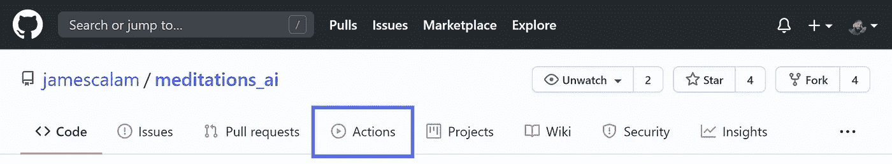
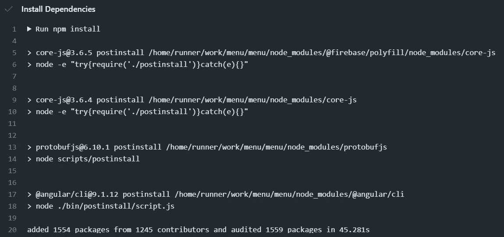
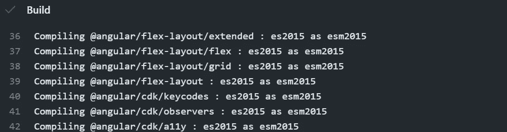
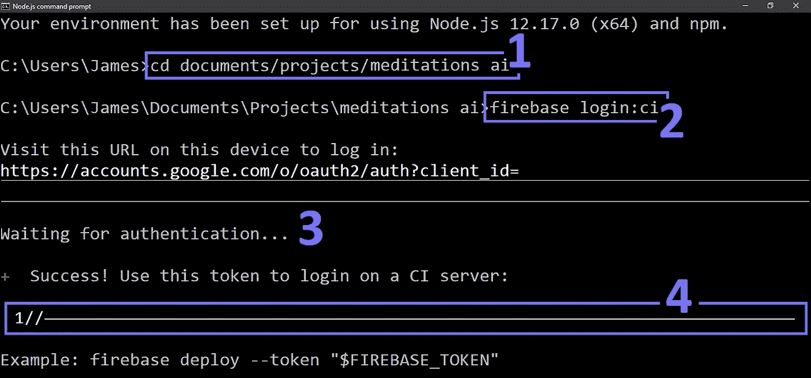
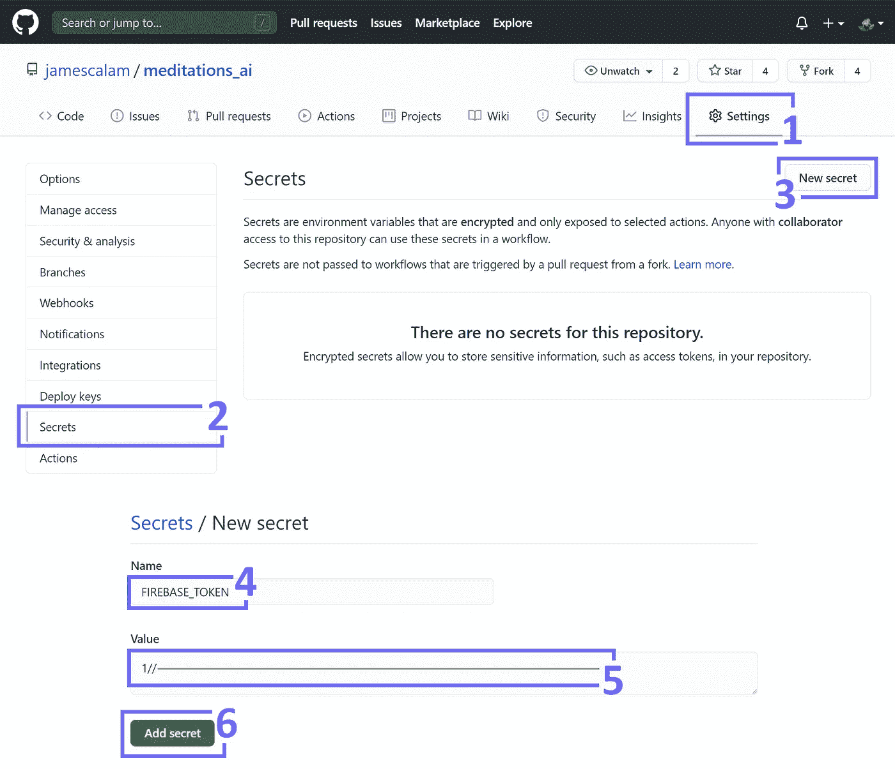
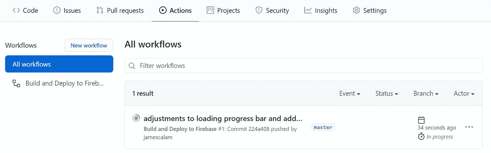
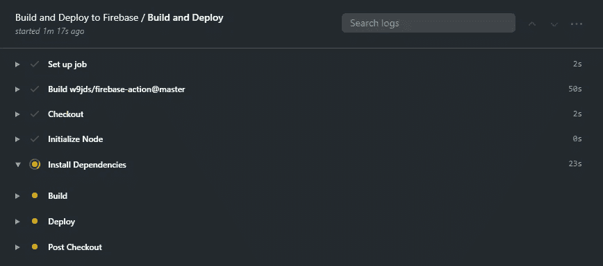
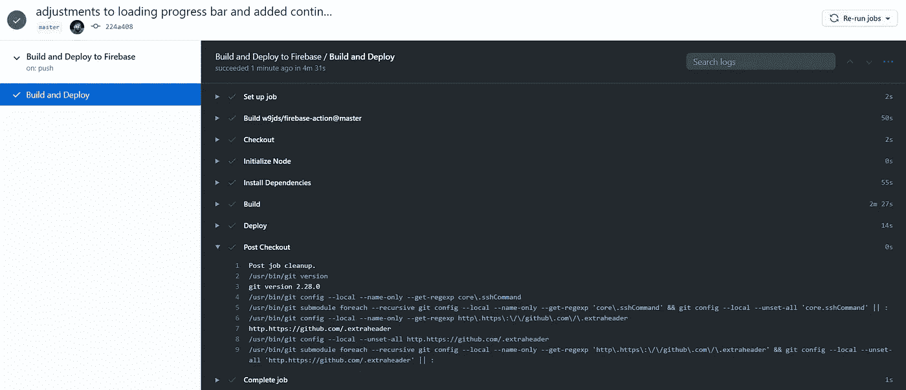

# 从 GitHub 向 Firebase 部署 Angular 应用程序

> 原文：<https://towardsdatascience.com/deploy-angular-apps-to-firebase-from-github-5f5ef0aad396?source=collection_archive---------27----------------------->

## 如何为自动化部署创建简单的 CI/CD 管道


由 [Vadim Sadovski](https://unsplash.com/@vadimsadovski?utm_source=medium&utm_medium=referral) 在 [Unsplash](https://unsplash.com?utm_source=medium&utm_medium=referral) 上拍摄的照片

持续集成、持续交付或 CI/CD。这是开发人员的一个行话，而且有充分的理由。CI/CD 管道允许我们自动化大部分代码部署过程，使其在过程中更快更安全。

CI 部分包括构建、打包和测试我们的应用程序的自动化。在大多数情况下，这是由 Angular 自动完成的。而且，一旦我们编写了单元测试，它们也很容易集成到过程中。

接下来是 CD，我们应用程序的自动交付。在我们的例子中，这是对 Firebase 的部署。

在本文中，我们将使用 GitHub 操作来自动化 CI/CD 管道。这意味着每次我们点击`git push origin master`时，GitHub 会自动启动一个完整的构建、打包、(测试)和部署过程。我们将涵盖:

```
> Deployment Setup
  - Writing Our Deployment (YAML)
  - Secret Keys (With GitHub)
```

# 部署设置

首先，我们假设 Angular 应用程序已经通过常规的`firebase deploy`部署到 Firebase 主机上——如果你还没有这样做，请遵循[这个指南](https://firebase.google.com/docs/hosting/quickstart)。不会超过几分钟！

一旦我们准备好了，我们开始在项目的根目录下创建一个`.github`文件夹。在那里，我们添加了另一个名为`workflows`的文件夹，里面有一个名为`main.yml`的 YAML 文件。



Github Actions(相当于。github \我们项目目录中的工作流)。图片作者。

当目录`.github\workflows`被推送到 GitHub 时，它将被 GitHub 读取并用作 GitHub Actions 文件夹——我们为工作流存储 YAML 文件的地方！

但是什么是 YAML 文件呢？嗯，根据我们亲爱的[维基百科](https://en.wikipedia.org/wiki/YAML) —

> “YAML 是一种人类可读的数据序列化语言。它通常用于配置文件和存储或传输数据的应用程序中。

第一句话的意思是 YAML 是一种我们可以阅读的文件格式！它用于在不同语言或环境之间传输数据(JSON 是另一个例子)。

第二部分是我们需要了解的。这意味着 YAML 是一种提供指令的标准化方式，通常用于配置文件——就像我们的部署配置一样！

## 编写我们的部署

好的，让我们来看看我们将要使用的 YAML 文件。

虽然它看起来很混乱，但是一旦我们将脚本分解成几个部分，它就会变得非常简单。

*   简单来说就是给代码的不同部分命名(这是可选的！).
*   `on: push: branches: - master`，这是我们的触发器。它告诉 GitHub，一旦我们`push`到`master branch`，就触发下面的代码。
*   接下来，我们在`jobs`有我们的执行计划，包括一个`build`阶段。
*   我们在最新的 Ubuntu 机器`ubuntu-latest`上执行一切。
*   现在我们执行计划中的每一个`steps`。
*   我们通过`actions/checkout@master`将我们的活动分支设置为`master`。
*   然后用`actions/setup-node@master`初始化节点，这样我们就可以在下面的步骤中使用`npm`。
*   `npm install`添加了我们所有的应用依赖项，如下所示:



**在 GitHub 动作中安装依赖项**部署阶段。

*   之后，我们用`npm run build`编译我们的应用程序——它被翻译成`ng build`:



**GitHub 操作中部署的构建阶段**。

*   最后，我们使用`w9jds/firebase-action@master`部署我们新构建的应用程序，其中有两个额外的参数:
*   我们传递了`deploy --only hosting`参数，这意味着我们只部署到 Firebase 主机(而不是函数，例如)。
*   我们通过存储在 repo 中的`FIREBASE_TOKEN`密钥传递我们的 Firebase 安全令牌(对我们进行身份验证)(我们将在接下来讨论这一点)。

这涵盖了我们的 YAML 中的所有内容，只不过是我们在部署应用程序时通常会执行的操作——除了指定操作系统！

## 秘密钥匙

唯一缺少的部分就是我们的`FIREBASE_TOKEN`。让我们解决这个问题。



如何使用 Firebase CLI 获取我们的 Firebase 令牌。图片作者。

首先，我们需要获得我们的访问令牌，为此我们只需:

1。打开我们的 CLI 并导航到我们的项目——通过键入`firebase use [project-id]`(上面未显示)确保正确的 Firebase 项目处于活动状态。

2。使用`firebase login:ci`请求我们的 CI(持续集成)访问令牌，这将打开一个新窗口(否则，输入提供的 URL)。

3。在授权窗口中，我们需要登录 Google Cloud 并授权访问我们的帐户。

4。最后，我们收到了一个访问令牌，我们可以使用它将我们的应用程序部署到 Firebase！

现在我们有了令牌，我们需要导航到 GitHub 上的项目 repo 在这里我们可以添加访问令牌。



将 Firebase 令牌添加到项目 repo 的步骤。图片作者。

为此，在项目回购中，我们:

1 /3。从**设置** > **机密**中导航并点击**新机密**。打开新的秘密窗口。

4 /6。输入`FIREBASE_TOKEN`作为秘密名称，输入`login firebase:ci`提供的令牌，点击**添加秘密**！

现在，回到我们的 YAML 文件中，`${{ secrets.FIREBASE_TOKEN }}`允许我们访问刚刚为`FIREBASE_TOKEN`输入的值，而不需要将它存储在我们的回购文件中。

# 部署！

一旦我们设置好了一切，我们就像往常一样将项目推送到 GitHub repo 的主分支。回到我们的 CLI，我们输入如下内容:

```
git add .
git commit -m "Added CI support"
git push -u origin master
```



在 **git 推送 origin master** 之后，我们的 Angular 应用程序被部署到 Firebase。

我们的回购照常推送到 GitHub。要查看我们的部署，我们需要在 GitHub 中打开我们的 repo 并点击 **Actions** 选项卡。我们将看到“所有工作流程”窗口(如上)。



部署进度。

如果我们想更详细地查看我们的部署进度，我们单击我们的部署(在这里我们可以看到我们的提交消息)，在侧栏中，单击**构建和部署**。在这里，我们将能够看到我们的部署正在采取的行动列表。



部署完成！

一旦我们的部署完成，我们将在右上角看到一个绿色的勾号！我们可以通过点击**构建和部署**窗口中每个部署阶段旁边的下拉箭头来查看部署的更多细节。

# 最后几个音符

## 部署生产版本

目前，我们没有部署角度优化的生产构建。就像我们对`ng build`所做的一样——我们将`--prod`添加到`npm run build`以切换到生产版本。

回到我们的 YAML 文件，我们修改`Build`:

```
- name: Build
  uses: npm run build **--prod**
```

## 集成测试

我们也可以合并我们的角度单元测试！就在`— name: Install Dependencies`之后，我们添加`npm test`，就像这样:

```
- name: Install Dependencies
        run: npm install
 **- name: Testing
        run: npm test**
      - name: Build
        run: npm run build
```

# 包扎

我们结束了，我们已经谈了很多了！包括:

*   YAML 脚本，以及如何编写一个将 Angular 应用程序部署到 Firebase 的脚本。
*   从 Firebase CLI 获取我们的`FIREBASE_TOKEN`,并将其作为密钥添加到我们的 GitHub repo 中。
*   在 GitHub 中部署我们的应用程序并查看部署状态！
*   *以及一些关于产品构建和单元测试的额外注释。*

因此，我们建立了一个完全自动化的 CI/CD 管道——只要我们在 GitHub 中推送 master 就会触发！

我希望你喜欢这篇文章。如果您有任何问题、想法或建议，请随时通过 [Twitter](https://twitter.com/jamescalam) 或在下面的评论中联系我们！

感谢阅读！