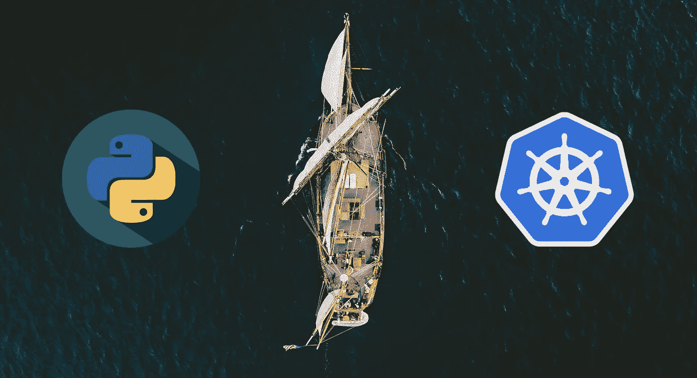

# 将任何 Python 项目部署到 Kubernetes

> 原文：<https://towardsdatascience.com/deploy-any-python-project-to-kubernetes-2c6ad4d41f14?source=collection_archive---------16----------------------->

## 是时候深入 Kubernetes，使用这个成熟的项目模板将您的 Python 项目带到云中了！

[奥斯汀·尼尔](https://unsplash.com/@arstyy?utm_source=unsplash&utm_medium=referral&utm_content=creditCopyText)在 [Unsplash](https://unsplash.com/?utm_source=unsplash&utm_medium=referral&utm_content=creditCopyText) 上的原始照片

随着项目的增长，它可能会变得难以用单个虚拟机或一些简单的 SaaS 解决方案来处理。你可以通过切换到更强大的解决方案来解决这个问题，如 *Kubernetes* 。然而，如果你不熟悉它的概念或者以前从未使用过它，这可能会有点太复杂。因此，为了帮助您——在本文中——我们将介绍您入门并在集群上部署您的 *Python* 项目所需的所有内容——包括集群设置、所有的 *Kubernetes* 清单和一些额外的自动化，以使您的生活更加轻松！

*这是上一篇关于* [*自动化您的 Python 项目*](/automating-every-aspect-of-your-python-project-6517336af9da) *的每一个方面的文章的后续，所以在阅读本文之前，您可能想要检查一下。*

*TL；博士:这是我的储存库，里面有完整的源代码和文档:*[【https://github.com/MartinHeinz/python-project-blueprint】T21](https://github.com/MartinHeinz/python-project-blueprint)

# 舒适的开发设置

为了在你的开发过程中富有成效，你需要有一个舒适的本地开发环境。在这种情况下，这意味着在本地使用简单的 *Kubernetes* ，密切镜像您的真实生产集群，为此，我们将使用*种类*:

*KinD(Kubernetes-in-Docker)*顾名思义，在 *Docker* 容器中运行 *Kubernetes* 集群。它是 *Kubernetes* 维护人员用于 *Kubernetes* v1.11+一致性测试的官方工具。它支持多节点集群以及高可用性集群。因为在 *Docker* 中运行 *K8s* ， *KinD* 可以在 Windows、Mac、Linux 上运行。所以，你可以在任何地方运行它，你只需要安装 Docker。

所以，让我们安装*类*(在 Linux 上——如果你在 Windows 上，在这里看安装信息[):](https://github.com/kubernetes-sigs/kind#installation-and-usage)

这样，我们就可以设置我们的集群了。为此，我们需要以下 YAML 文件:

这份清单描述了我们的星团。它将有 3 个节点—控制平面(`role: control-plane`)和 2 个工作者`role: worker`。我们还为它提供了一些更多的设置和参数，以便以后可以设置入口控制器，这样我们就可以在该集群上拥有 HTTPS。关于这些设置，您需要知道的只是`extraPortMappings`告诉集群将端口从主机转发到节点上运行的入口控制器。

*注意:集群和 Python 应用程序的所有清单都可以在我的仓库* [*中找到，这里是*](https://github.com/MartinHeinz/python-project-blueprint) *中的* `*k8s*` *目录。*

现在，我们需要运行几个命令来启动它:

要创建集群，我们只需要运行第一个命令。之后，我们可以通过运行`cluster-info`和`get nodes`命令来检查是否可以运行。一段时间后，输入这些命令会变得很烦人，所以我们以后会更简单，但这样我们就可以启动并运行集群了。

接下来，我们要为我们的集群设置[入口](https://kubernetes.io/docs/concepts/services-networking/ingress/)。为此，我们必须运行一些`kubectl`命令，使其与*类*一起工作:

首先，我们部署强制性的`ingress-nginx`组件。最重要的是，我们使用*节点端口*来公开 *nginx* 服务，这就是第二个命令所做的。最后一个命令为入口控制器应用一些*类*特定补丁。

# 定义清单

集群就绪后，就该设置和部署我们的应用程序了。为此，我们将使用非常简单的 *Flask* 应用程序— *echo 服务器*:

我选择了 *Flask* 应用程序，而不是一些 CLI 工具(或 *Python* 包)，因为我们需要不会像一些 *Python* 包那样立即终止的应用程序。另外，请注意`host`参数被设置为`0.0.0.0`，如果没有这个参数，当我们通过 *Kubernetes* 服务和入口公开应用程序时，将无法访问它。

接下来我们需要的是这个应用程序的 YAML 清单，让我们把它分成单独的对象:

*   命名空间:

这里没什么好谈的。我们通常不希望在`default`名称空间中部署应用程序，所以我们将使用这个名称空间。

*   配置映射:

这是我们可以为应用程序定义变量的地方。这些来自`data`部分的变量将作为环境变量注入到应用程序容器中。作为一个例子，我包括了`FLASK_ENV`和`FLASK_DEBUG`，当应用程序启动时，它们将被*烧瓶*自动拾取。

*   秘密:

与我们指定纯文本变量的方式相同，我们可以使用 *Secret* 向我们的应用程序添加凭证和密钥之类的东西。但是，不应该将该对象推送到您的存储库中，因为它包含敏感数据。我们可以使用以下命令动态创建它:

*注意:部署应用程序所需的此命令和其他命令列在存储库中的 README 以及底部清单文件* [*中，此处为*](https://github.com/MartinHeinz/python-project-blueprint/blob/master/k8s/app.yaml) *。*

*   部署:

.

现在是最重要的部分——部署。这里的相关部分是指定图像、端口和环境变量的`spec`部分。对于`image`，我们指定来自 *Docker Hub* 的图像。如果我们想使用像 *Artifactory* 这样的私有注册表，我们就必须添加`imagePullSecret`来提供集群获取映像的凭证。可以使用以下命令创建该密码:

这显示了您如何允许从 *GitHub 包注册表*中提取您的映像，不幸的是，由于上述 YAML 中列出的问题，它现在不能与*类*一起工作，但是它可以与您在云中的生产集群一起工作(假设它没有使用*类*)。

如果您想避免每次重新部署应用程序时都将映像推送到远程注册表，那么您可以使用`kind load docker-image martinheinz/python-project-blueprint:flask`将*映像加载到集群中。*

在`image`之后，我们还指定了`ports`。这些是我们的应用程序正在监听的端口，在本例中是`5000`，因为我们的应用程序开始使用`app.run(host='0.0.0.0', port=5000)`。

最后一部分，`envFrom`部分用于从上面显示的*配置图*和*秘密*中注入明文变量和秘密，通过在各自的`Ref`字段中指定它们的名称。

*   服务:

现在，我们已经有了在`port`上监听的应用程序，我们需要*服务*来公开它。所有这些对象定义了在端口`5000`上监听的应用程序应该在端口`443`上的集群节点上公开。

*   入口:

最后一大难题是*入口*——一个管理集群中*服务*外部访问的对象。让我们首先看看`rules`部分——在这种情况下，我们定义我们的主机是`localhost`。我们还将`path`设置为`/`，这意味着发送到`localhost/`的任何请求都属于由之前显示的*服务*及其`port`的名称定义的关联`backend`。

这里的另一部分是`tls`。本节通过指定包含`tls.crt`和`tls.key`的*秘密*为列出的`hosts`提供 HTTPS。让我们创造这个*秘密*:

上面的代码片段首先设置了几个变量，然后使用`openssl`为 TLS 生成证书和密钥文件。最后一个命令创建包含这两个文件的*秘密*。

# 部署应用程序

准备好所有清单后，我们终于可以部署我们的应用程序了:

上面的大多数命令我们已经在前面的章节中看到过了。新功能是`kubectl apply -f app.yaml`，它在我们的集群中创建了所有必要的对象。创建后，我们可以使用`kubectl get all`检查这些对象的存在。最后，我们可以使用`cURL`来检查应用程序是否是可访问的，它是可访问的！这样，我们的应用程序就可以在集群上运行了！

# 简单一点

如果你还没有完全适应所有的`kind`和`kubectl`命令，或者你像我一样懒，不想把它们都打出来，那么我有几个`Make`目标给你——让你的生活更轻松:

*   调出集群:

*   重新部署/重新启动应用程序:

如果集群还没有准备好，那么`make cluster`命令将为您设置集群，如果准备好了，它将为您提供关于它的所有信息。如果您需要检查节点的状态并切换到您的开发名称空间，这很好。

这个非常简单，它所做的只是推出新的部署，因此如果有新的映像，它将部署它，否则它将重新启动您的应用程序。

*   调试:

如果您需要调试您的应用程序，您可能想要查看与应用程序窗格相关的最近事件以及最近(上一小时)的日志。这正是`make cluster-debug`为你做的。

*   获取远程外壳:

如果日志不足以解决您可能遇到的一些问题，并且您决定需要在容器内部探索一下，那么您可以运行`make cluster-rsh`来获得远程 shell。

*   更新清单:

我们以前见过这个命令。它只是重新应用了 YAML 清单，这在您调整 *Kubernetes* 对象的一些属性时非常方便。

# 结论

这篇文章并不是 Kubernetes 的教程，但是我认为它足够让你快速启动并运行你的应用程序。为了学习更多关于 Kubernetes 的知识，我建议在清单中玩一玩，调整一下，改变一下，看看会发生什么。在我看来，这是了解事物如何工作并熟悉`kubectl`命令的好方法。如果您有任何疑问、建议或问题，请随时联系我或在我的[资源库](https://github.com/MartinHeinz/python-project-blueprint)中创建问题。在这个报告中，你还可以找到本文中显示的文档和所有清单。

## 资源

*   [Kubernetes ingress on kind(Docker 中的 Kubernetes)](https://banzaicloud.com/blog/kind-ingress/)
*   [入口设置的种类文件](https://kind.sigs.k8s.io/docs/user/ingress/)

*本文最初发布于*[*martinheinz . dev*](https://martinheinz.dev/blog/20)