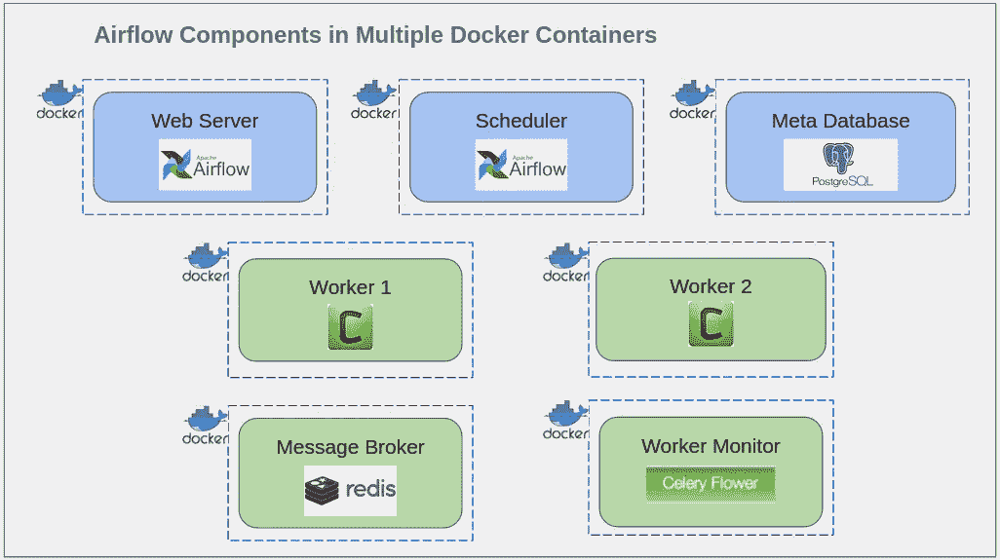
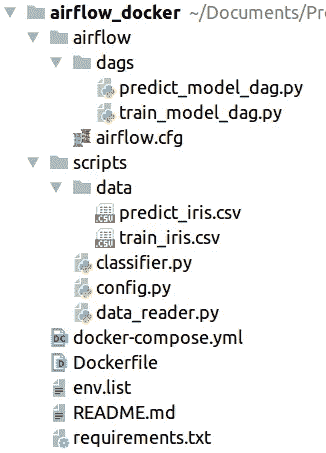
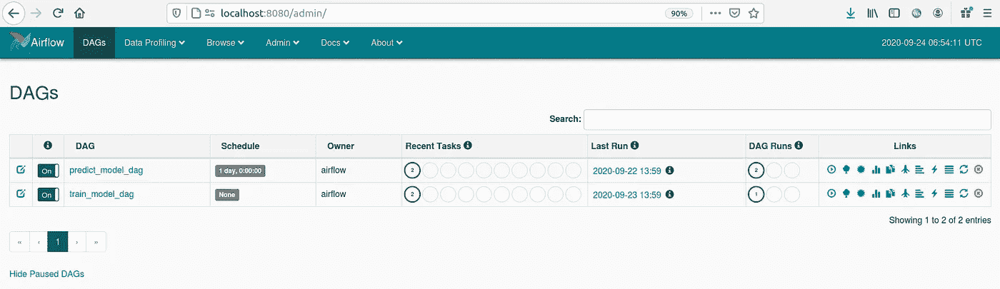
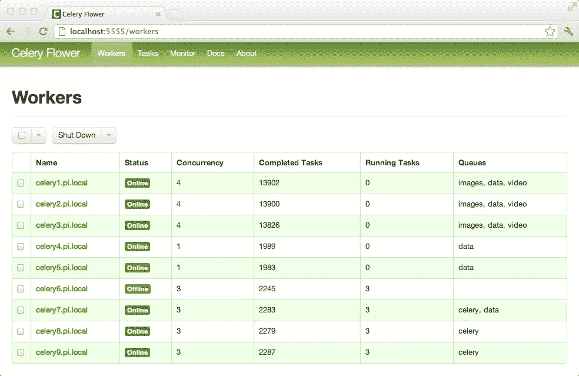

# 在多个 Docker 容器中部署 Apache Airflow

> 原文：<https://towardsdatascience.com/deploy-apache-airflow-in-multiple-docker-containers-7f17b8b3de58?source=collection_archive---------1----------------------->

## 在 Apache Airflow 中编排数据科学模型，使用 Celery Executor 进行扩展，并使用 Docker Compose 部署在多个 Docker 容器中


约书亚·阿拉贡在 [Unsplash](https://unsplash.com/s/photos/laptop-screens?utm_source=unsplash&utm_medium=referral&utm_content=creditCopyText) 上拍摄的照片

当涉及到数据科学模型时，它们会定期运行。例如，如果我们预测下个月的客户流失，模型必须在每个月的最后一天运行。每月手动运行该模型是不可取的。我们可以使用一个调度程序来自动化这个过程。Apache Airflow 是一个理想的工具，因为它允许调度和监控您的工作流。在本文中，我们将讨论如何使用 Docker 部署 Apache Airflow，并保留进一步扩展的空间。熟悉 Apache Airflow 和 Docker 概念将是阅读本文的一个优势。

# 阿帕奇气流简介

气流由 3 个主要部分组成；Web 服务器、调度程序和元数据库。Web 服务器负责用户与应用程序交互的用户界面。调度器负责作业调度，而元数据库存储调度细节。即使气流有几个执行器，芹菜执行器更适合可伸缩性。芹菜执行器 3 额外的组件添加到气流。它们是工作者、消息代理和工作者监视器。Worker 负责执行由调度程序触发的作业。可以有多个工人。这些工作者可以分布在集群实例中。工人的数量可以根据系统的工作量和机器的能力来决定。消息经纪人帮芹菜操作。可以使用监控工具来监控芹菜工人。



阿帕奇气流与芹菜执行器(*图片由作者*)

使用 Docker，我们计划将上述每个组件运行在一个单独的 Docker 容器中。Web 服务器、调度程序和工作人员将使用一个公共的 Docker 映像。这个公共映像对于项目来说是唯一的，我们将讨论构建这个映像的 Dockerfile 文件。所有其他容器将直接使用公开可用的图像。

在本教程中，PostgreSQL 被用作元数据库，Redis 被用作消息代理，而芹菜花被用于监控工人。因为有多个容器，所以使用 Docker Compose 可以很容易地一次性部署所有的容器。

# 项目结构



项目结构:[https://github.com/nishakanthiA/Airflow-Docker](https://github.com/nishakanthiA/Airflow-Docker)(作者*图片*)

该图像显示了我们的项目结构。所有与项目相关的文件都放在脚本文件夹中。所有与气流相关的文件都放在气流文件夹中。与部署相关的其他文件在最外面的目录中。`env.list`包括分类模型所需的环境变量。`requrements.txt`定义要在 python 环境中安装的包，以便运行模型。

`Dockerfile`用于创建供 Airflow web 服务器、调度程序和工作人员使用的图像。`docker-compose.yml`用于定义和启动所有的容器。

提出了一个简单的模型来分类著名的虹膜数据集。我已经在 dags 文件夹中添加了两个带有`PythonOperator`的 DAGs。一个用于训练模型，另一个用于通过已训练的模型获得预测。DAG 到列车模型的定义没有计划间隔。这意味着一旦需要模型训练，它就可以被触发。预测旨在每天检索。因此，生成预测的 DAG 被安排每天运行模型。文件`airflow.cfg`包含气流的配置属性。

# 创建 Docker 图像

要使用 docker 展开气流，参考的最佳图像是[***puck El/docker-air flow***](https://github.com/puckel/docker-airflow)*。(更新:气流现在有了它的官方 Docker 形象)*但是这个形象不能照原样使用；由于一些原因。一个原因是它没有安装我们在项目中使用的所有包。如果我们需要更改 airflow.config 文件中的属性，我们必须将它们作为环境变量传递。由于存在大量变量，这并不容易。因此，我们将使用`puckel/docker-airflow`的基本映像编写一个定制的 docker 文件。除了 message broker、元数据库和 worker monitor 之外，这个映像将用于我们的所有容器中。以下是 Dockerfile 文件。

```
FROM puckel/docker-airflow:1.10.9COPY airflow/airflow.cfg ${AIRFLOW_HOME}/airflow.cfgCOPY requirements.txt /requirements.txt
RUN pip install -r /requirements.txt
```

# 创建 Docker 容器

## 元数据库

让我们首先为元数据库容器定义服务。Docker image `postgres:9.6`用于此。用户凭证和数据库名称应该作为环境变量给出。设置该容器时，数据库名称(POSTGRES_DB=airflow)应与 airflow 配置`sql_alchemy_conn`中的数据库连接字符串兼容。

```
version: '3.7'
services:
    postgres:
        image: postgres:9.6
        environment:
            - POSTGRES_USER=airflow
            - POSTGRES_PASSWORD=airflow
            - POSTGRES_DB=airflow 
```

如果您已经有一个现有的 PostgreSQL 服务器，并且希望使用它，则不需要为元数据库部署额外的容器。为服务器中的气流元数据创建专用数据库。Airflow 将在启动时填充数据库，然后负责维护数据库。可以通过气流配置给出服务器的详细信息。设置服务器细节的一种方法是修改`airflow.cfg`文件中的`sql_alchemy_conn`。另一种方法是把它作为一个环境变量`AIRFLOW__CORE__SQL_ALCHEMY_CONN`。下面是为 PostgreSQL 连接提供的连接字符串的格式。登录服务器的凭证用户名、密码、主机 IP、数据库名应该作为环境变量传递。

```
sql_alchemy_conn =postgresql+psycopg2://$PG_USER:$PG_PASSWORD@$PG_HOST:5432/$PG_DB_NAME
```

这样，我们的第一个容器就变成可选的了。

## 芹菜执行器的消息代理

在这个项目中，我们通过使用多个气流工作者来关注应用程序的可伸缩性。为此，我们可以使用芹菜执行器。在气流配置文件中设置`executor = CeleryExecutor` 。环境变量是`AIRFLOW__CORE__EXECUTOR`T11。

Celery 是一个任务队列实现，Airflow 使用它在后台定期异步运行并行批处理作业。它需要一个像 Redis 和 RabbitMQ 这样的消息代理来传输消息。气流没有这部分，需要外部实现。这里我们用 Redis。我们可以使用 image Docker image `*redis:5.0.5*`

用我们的第二个容器`docker-compose.yml`会是这个样子。

```
version: '3.7'
services:
    postgres:
        image: postgres:9.6
        environment:
            - POSTGRES_USER=airflow
            - POSTGRES_PASSWORD=airflow
            - POSTGRES_DB=airflow
   redis:
        image: redis:5.0.5
```

这里我们也可以使用一个外部 Redis 服务，而不需要创建这个容器。凭证应由气流配置文件中的`broker_url`、`celery_result_backend`给出。

## Airflow Web 服务器



气流用户界面(*图片作者*)

我们的第三个容器是 Aiflow web 服务器，它负责用户界面。对于这个容器，我们将使用以前创建的 Docker 图像。以下是服务“webserver”的 docker 容器配置。

```
**webserver:
    image:** webserver:latest
    **build:
      context:** .
    **restart:** always
    **depends_on:** - postgres
        - redis
    **environment:** - LOAD_EX=n
        - FERNET_KEY=46BKJoQYlPPOexq0OhDZnIlNepKFf87WFwLbfzqDDho=
        - EXECUTOR=Celery
        - PYTHONPATH=/usr/local/airflow
    **env_file:** - env.list
    **volumes:** - ./airflow/dags:/usr/local/airflow/dags
        - ./scripts:/usr/local/airflow/scripts
    **ports:** - **"8080:8080"
    command:** webserver
    **healthcheck:
        test:** [**"CMD-SHELL"**, **"[ -f /usr/local/airflow/airflow-webserver.pid ]"**]
        **interval:** 30s
        **timeout:** 30s
        **retries:** 3
```

每个命令的用法解释如下。

*   构建上下文:指向创建的 Dockerfile。相应映像是在容器启动时构建的
*   重新启动:如果由于任何原因停止了，重新部署容器。
*   依赖于:web 服务器需要与元数据库和消息代理容器通信
*   环境:这些是基本映像 puckel/docker-airflow 请求的列表环境变量。让它们保持原样。您可以自由地添加更多的环境变量，如“PYTHONPATH ”,这些变量将被您自己的程序脚本使用。
*   env_file:可以使用 file 给出环境变量的列表
*   卷:Dag 和程序脚本可以作为卷挂载。这比将文件复制到 Docker 映像中更有效。文件更新后，更改将自动部署到 web 服务器中。不需要构建映像和重新部署容器。
*   端口:要部署的端口。web 服务器正在端口 8080 上运行。
*   command : airflow 命令启动 web 服务器。这是基础映像 puckel/docker-airflow 所要求的。不要修改它。
*   healthcheck:检查容器健康状况的测试

## 气流调度程序

我们的第四个容器是 Aiflow scheduler。除了命令和依赖关系之外，服务配置与 Airflow web 服务器非常相似。命令是启动调度程序的气流命令。调度程序依赖于 web 服务器容器。

```
**scheduler:
    image:** scheduler:latest
    **build:
      context:** .
    **restart:** always
    **depends_on:** - webserver
    **volumes:** - ./airflow/dags:/usr/local/airflow/dags
        - ./scripts:/usr/local/airflow/scripts
    **environment:** - LOAD_EX=n
        - FERNET_KEY=46BKJoQYlPPOexq0OhDZnIlNepKFf87WFwLbfzqDDho=
        - EXECUTOR=Celery
        - PYTHONPATH=/usr/local/airflow
    **command:** scheduler
    **env_file:** - env.list
```

## 气流工人

下一个集装箱是气流工人。命令是启动工作机的气流命令。工作进程依赖于调度器容器。可以有多个工人。这里我加了两个。

```
**worker1:
    image:** worker1:latest
    **build:
      context:** .
    **restart:** always
    **depends_on:** - scheduler
    **volumes:** - ./airflow/dags:/usr/local/airflow/dags
        - ./scripts:/usr/local/airflow/scripts
    **environment:** - FERNET_KEY=46BKJoQYlPPOexq0OhDZnIlNepKFf87WFwLbfzqDDho=
        - EXECUTOR=Celery
        - PYTHONPATH=/usr/local/airflow
    **command:** worker
    **env_file:** - env.list

**worker2:
    image:** worker2:latest
    **build:
      context:** .
    **restart:** always
    **depends_on:** - scheduler
    **volumes:** - ./airflow/dags:/usr/local/airflow/dags
        - ./scripts:/usr/local/airflow/scripts
    **environment:** - FERNET_KEY=46BKJoQYlPPOexq0OhDZnIlNepKFf87WFwLbfzqDDho=
        - EXECUTOR=Celery
        - PYTHONPATH=/usr/local/airflow
    **command:** worker
    **env_file:** - env.list
```

让多个工人在同一台机器上还可以减少作业的执行时间。为了获得更有效和最佳的结果，气流配置文件中的属性`parallelism` 、`dag_concurrency`、`worker_concurrency`和`max_threads`应根据工人数量进行调整。其中一些属性也可以在 DAG 级别进行调整。

工人可以分布在集群中的多台机器上。一台单独的机器将负责每个工人，而所有其他容器可以部署在一台公共机器上。我们可以保留一个单独的 docker-compose 文件来部署工人。主 docker-compose 文件将包含其余容器的服务。以下是 ECS 集群中 AWS EC2 实例中部署的 worker 容器的 docker-compose 文件示例。

```
version: '3.7'
services:
    remote_worker_3:
        image: remote_worker_3:latest
        build:
          context: .
          args:
            github_token: ${GITHUB_TOKEN}
        restart: always
        external_links:
            - redis_1:redis
        networks:
            - sample_project_default
        environment:
            - FERNET_KEY=46BKJoQYlPPOexq0OhDZnIlNepKFf87WFwLbfzqDDho=
            - EXECUTOR=Celery
        volumes:
          - ./sample_project/airflow/dags:/usr/local/airflow/dags
          - ./sample_project/src:/usr/local/airflow/dags/src
        env_file:
            - env.list
        command: worker
        stdin_open: true
        tty: truenetworks:
    sample_project_default:
        external: true
```

网络名称可以通过`docker network ls`命令找到。如果你有兴趣了解更多关于 Docker 网络搜索的信息。

**工人监视器**



芹菜花仪表板([https://flower.readthedocs.io/en/latest/screenshots.html](https://flower.readthedocs.io/en/latest/screenshots.html))

工人的行为可以通过芹菜花来监控。这也是一个可选的容器。以下是花卉容器的配置。

```
**flower:
    image:** flower:latest
    **build:
      context:** .
    **restart:** always
    **depends_on:** - redis
    **environment:** - EXECUTOR=Celery
    **ports:** - **"5555:5555"
    command:** flower
```

# 部署

现在，我们准备用多个 Docker 容器部署我们的气流项目。我们可以使用 docker-compose.yml 文件一次性部署所有的容器。下面是一些有用的 Docker 命令。

*   开始容器:`docker-compose up -d -- build`
*   停止容器: `docker-compose down`
*   查看容器:`docker ps`
*   进入一个容器:`docker exec -it <container-id> bash`
*   查看一个容器的日志:`docker logs <container-id>`
*   监控集装箱:`docker stats`

项目网址:[https://github.com/nishakanthiA/Airflow-Docker](https://github.com/nishakanthiA/Airflow-Docker)