# 用 Python 和 Docker 部署 API

> 原文：<https://towardsdatascience.com/deploy-apis-with-python-and-docker-4ec5e7986224?source=collection_archive---------5----------------------->

## 使用 Flask、Docker 和 Google Cloud 部署 API 的权威指南


照片由[约瑟夫·皮尔森](https://unsplash.com/@josephtpearson?utm_source=medium&utm_medium=referral)在 [Unsplash](https://unsplash.com?utm_source=medium&utm_medium=referral) 拍摄

这里有一些软件开发中的技巧，它们就像闸门一样阻挡着广阔的机会海洋。当学习其中一种技能时，似乎一个全新的世界突然被照亮了。

通过这篇文章，我们将涵盖我认为是这些技能之一。能够编写可部署到互联网并与 API 通信的代码。

构建一个可部署的 API 需要几个子技能，我们将在组装 API 时讨论这些子技能。然而，罗马不是一天建成的，精通(甚至能力)也不是——所以这不是一篇五分钟内从零到英雄的文章。

这篇文章是一个介绍，我们将涵盖要点——不多不少。在本文的最后，我们将拥有一个托管在云上的全功能 API。

简而言之，我们将涵盖—

```
> **Build an** **API** with Flask
> **Package** our app with Docker
> **Deploy** with Google Cloud Platform (GCP)
> **Test** with Postman
```

您可以在这里找到本文[的 GitHub repo。](https://github.com/jamescalam/gcp-api)

# 用 Flask 构建 API

我们创建一个新文件夹，其中包含一个名为`app.py`的 Python 脚本。该脚本将包含我们的 API 代码，其结构如下:

```
importsapp initializationAPI class
    GET method
    POST method
    DELETE methodHTTP mapping
```

如果事情的顺序变得混乱——完整的`app.py`脚本在这一部分的末尾，你可以在 [GitHub 上找到这个项目。](https://github.com/jamescalam/gcp-api)

## 设置

**导入和应用初始化**

在这里，我们在导入中设置了最低限度，并像这样初始化我们的 API flask 应用程序:

```
from flask import Flask
from flask_restful import Resource, Api, reqparse
import pandas as pd
import osapp = Flask(__name__)
api = Api(app)
```

## API 类别

在我们的 API 脚本中，我们需要定义一个包含 HTTP 方法 GET、POST 和 DELETE 的类。

Flask 需要知道这个类是我们 API 的入口点，所以我们用类定义传入`Resource`。我们将创建一个名为`Places`的类:

```
class Places(Resources):
    <methods go here>
```

我们还需要告诉 Flask 这个 API 类的入口点在哪里。例如，如果我们的 API 位于`www.api.com`，我们可能想要指定在`[www.api.com**/places**](http://www.api.com/places.)` [提供`Places`类的入口。](http://www.api.com/places.)

我们可以使用`add_resource`方法来做到这一点:

```
api.add_resource(Places, '/places')
```

这个方法被放在类定义之外，并遵循类定义。

当然，这意味着我们可以在 API 中添加多个类和入口点。这对于更复杂的服务尤其有用——尽管在本文中我们将只讨论其中一个。

为了简单起见，我们将把代码中嵌入的数据作为 Python 字典来操作。看起来是这样的:

```
DATA = {
    'places':
        ['rome',
         'london',
         'new york city',
         'los angeles',
         'brisbane',
         'new delhi',
         'beijing',
         'paris',
         'berlin',
         'barcelona']
}
```

**获取**

我们使用这种方法来获取数据，在我们的例子中，数据就是我们的`DATA`字典。

```
def get(*self*):
    *# return our data and 200 OK HTTP code* return {'data': DATA}, 200
```

**帖子**

POST 方法用于将数据添加到我们的`DATA['places']`列表中。

```
def post(*self*):
    *# parse request arguments* parser = reqparse.RequestParser()
    parser.add_argument('location', *required*=True)
    args = parser.parse_args()*# check if we already have the location in places list* if args['location'] in DATA['places']:
        *# if we do, return 401 bad request* return {
            'message': f"'{args['location']}' already exists."
            }, 401
    else:
        *# otherwise, add the new location to places* DATA['places'].append(args['location'])
        return {'data': DATA}, 200
```

这里发生了什么事？

*   `reqparse`库允许我们解析传递给 POST 请求的参数。例如，如果我们的 places API 位于 web 地址`api.com/places`处，我们可以指定我们要添加的新位置的`location`，如下所示:

```
api.com/places?**location=sydney**
```

*   在取出位置参数后，我们需要检查它是否已经存在于`DATA['places']`中——这是我们用`if`语句完成的。如果数据已经存在，我们简单地返回`409 Conflict`和一条简短的消息，解释所提供的位置已经存在。
*   否则，我们可以将新位置添加到我们的`DATA['places']`列表中，然后返回新的`DATA`和一个`200 OK` HTTP 代码。

**删除**

我们用 DELETE 作为 POST 的一个等价的相反的动作。用户指定要从`DATA['places']`列表中移除的位置。

```
def delete(*self*):
    *# parse request arguments* parser = reqparse.RequestParser()
    parser.add_argument('location', *required*=True)
    args = parser.parse_args()*# check if we have given location in places list* if args['location'] in DATA['places']:
        *# if we do, remove and return data with 200 OK* DATA['places'].remove(args['location'])
        return {'data': DATA}, 200
    else:
        *# if location does not exist in places list return 404* return {
            'message': f"'{args['location']}' does not exist."
            }, 404
```

这里发生了什么事？

作为一个相等且相反的操作，我们稍微修改了 POST 逻辑:

*   我们还是用同样的方法使用`reqparse`。
*   对于 location 参数，我们再次使用相同的`if`语句来检查它是否已经存在于`DATA['places']`中。如果是的话，我们从 T3 中 T2 它，并返回新的 T4 和一个 T5 HTTP 代码。
*   否则，我们返回消息`404 Not Found`，解释所提供的位置在`DATA['places']`中不存在。

## 总共

如果我们将所有这些部分放在一起，我们将得到以下脚本:

# 带 Docker 的包装

下一步，我们将创建一个 Docker 映像。这里有两个相似的术语——图像和容器。

一个**映像**本质上是一个蓝图——而一个**容器**是一个根据蓝图构建的结构/部署。

首先，我们将创建我们的**映像**，然后将它部署到 Google cloud(在那里它将成为一个容器)。

创建我们的 Docker 形象有三个关键步骤:

1.  获取码头工人
2.  设置我们的 docker 文件
3.  建立我们的形象

1。Docker 文档能够比我更好地指导你完成安装过程！你可以在这里找到它们。

关于 Windows 或 Mac 上 Docker 的概述，请查看此视频:

Windows 上的 Docker 为 1:46:21，Mac 上的 Docker 为 1:53:22。

2。因为我们将 API 部署为 docker 容器，所以我们需要在目录中包含一个名为 **Dockerfile** 的容器设置文件。

在我们的 docker 文件中，我们将为三个 Python 库使用`RUN`命令——所有这些都将指定使用一个 **requirements.txt** 文件。

对于我们的简单 API，它看起来像这样:

```
flask
flask-restful
gunicorn
```

在我们的 **Dockerfile，**中，我们概述了我们的形象(容器蓝图)。Docker 将读取提供“构建”指令的`Dockerfile`。

```
FROM python:3.6-slim-busterWORKDIR /app
COPY . .RUN pip install -r requirements.txtCMD exec gunicorn --bind :$PORT --workers 1 --threads 8 --timeout 0 app:app
```

这里发生了什么？

*   我们使用另一个**官方**图像和`FROM python:3.6-slim-buster`初始化我们的图像。这个脚本初始化官方的 Docker Python 3.6‘slim-buster’图像——官方 Python 图像的完整列表在[这里](https://hub.docker.com/_/python)可以找到。
*   接下来，我们将图像中的活动目录设置为带有`WORKDIR /app`的`/app`——这是我们的 Google Cloud 实例所期望的结构。
*   现在我们`COPY`从源文件目录到镜像文件系统的所有东西。在这种情况下，从目录`Dockerfile`所在—到活动图像目录`/app`。
*   我们的依赖关系列表`requirements.txt`现在在镜像文件系统中，我们`RUN pip install`递归地`-r`遍历`requirements.txt`的每一行。实质上就是:

```
pip install flask
pip install flask-restful
pip install gunicorn
```

*   最后，我们使用`[gunicorn](https://gunicorn.org/)`包初始化我们的 HTTP 服务器。我们使用`CMD`指令来执行`gunicorn`并传递几个服务器设置参数。

3。我们的最后一步是构建 Docker 图像，稍后我们将把它上传到 Google 容器注册中心。

要构建映像，请打开 CLI，导航到包含我们的文件的目录，然后键入:

```
docker build -t tut-api .
```

*   这里，`docker build`是 Docker 镜像构建命令。
*   我们使用`-t`标志来指定我们的图像名称。
*   `tut-api`仅仅是我们形象的名称，随便你怎么称呼它。
*   `.`告诉 docker 将当前目录中的所有内容包含在映像中*(别忘了这一点，我几乎每次都这么做)*。

最后，我们可以继续将我们的 API 部署到云中。

# 部署到云

这里，我们将使用谷歌云平台(GCP)的容器注册表来存储我们的 Docker 映像，并使用 Cloud Run 来部署它。

## 项目和容器注册

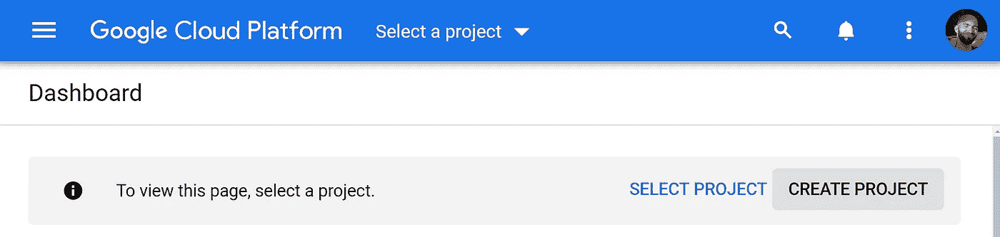

首先，我们需要建立一个项目。我们首先在云控制台中导航到[项目选择器页面，然后点击**创建项目**。](https://console.cloud.google.com/projectselector2/home/dashboard)

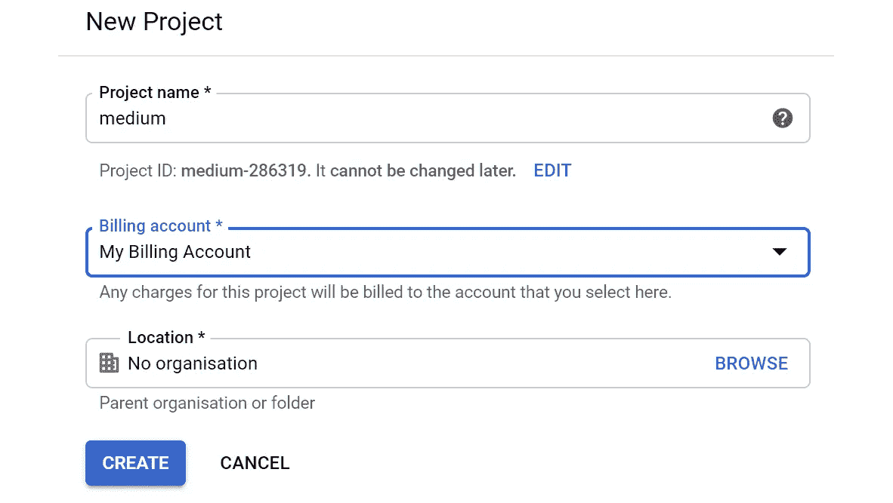

记下**项目 ID** —我们稍后会用到。

这里我们简单地给我们的项目起个名字——我的是 **medium** 。

接下来，我们需要在谷歌控制台中导航到[容器注册表](https://console.cloud.google.com/gcr) (GCR)。如果我们已经正确设置了我们的项目，我们将会看到如下所示的屏幕:

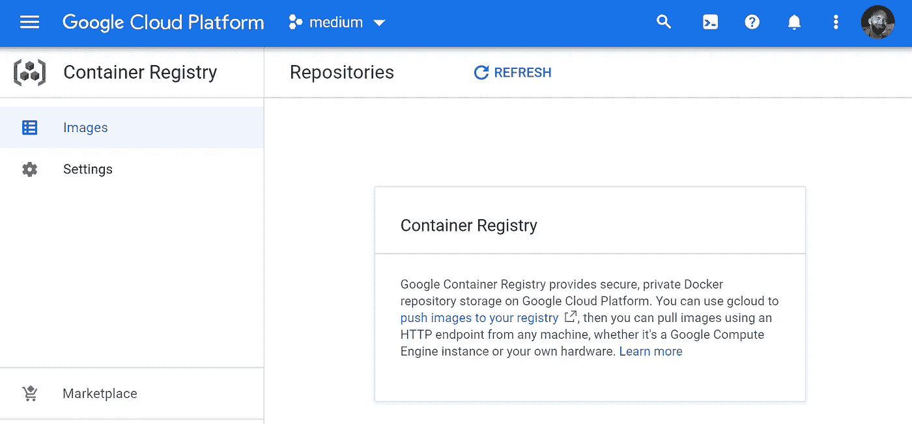

我们的空谷歌容器注册(GCR)屏幕。

## 云构建

我们将使用云构建将我们的映像构建到一个容器中。在我们这样做之前，我们需要为我们的项目启用云构建 API。只需[点击此处](https://console.cloud.google.com/flows/enableapi?apiid=cloudbuild.googleapis.com)并选择您正在进行的项目:

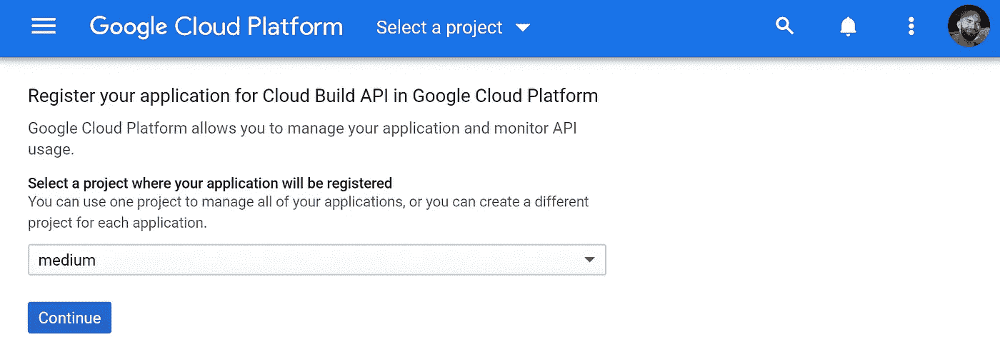

为云构建 API 注册项目。

现在我们有了项目设置，我们需要使用 Google Cloud SDK 将我们的 API Docker 映像推送到 GCR——我们从这里下载。

## 证明

安装完成后，我们需要登录 gcloud。为此，只需在 CMD 提示符(或等效的 CLI)中键入:

```
gcloud auth login
```

该命令将打开我们的 web 浏览器，允许我们像往常一样登录。然后，我们将 Docker 配置为使用我们的凭证:

```
gcloud auth configure-docker
```

## 上传到容器注册表

我们将使用 GCR 来存储我们的形象。为了构建我们的容器并将其保存到注册表中，我们导航到我们的 API 目录并`submit`它:

```
gcloud builds submit --tag gcr.io/[PROJECT-ID]/tut-api
```

*   `gcloud builds submit`是我们用来将图像提交给**云构建**的命令。

我们的注册表位置作为**目标映像**提供，其中:

*   `*gcr.io*` *是* [*GCR 主机名*](https://cloud.google.com/container-registry/docs/pushing-and-pulling#tag_the_local_image_with_the_registry_name) *。*
*   `*[PROJECT-ID]*` *是我们的项目 ID，这是我们在创建项目时看到的——对我来说是* `*medium-286319*` *。*
*   `*tut-api*` *是我们的形象名称。*

现在，如果我们导航回我们的注册表，我们应该会看到我们新上传的 Docker 映像(这可能需要一些时间来构建，请查看您的云构建仪表板):

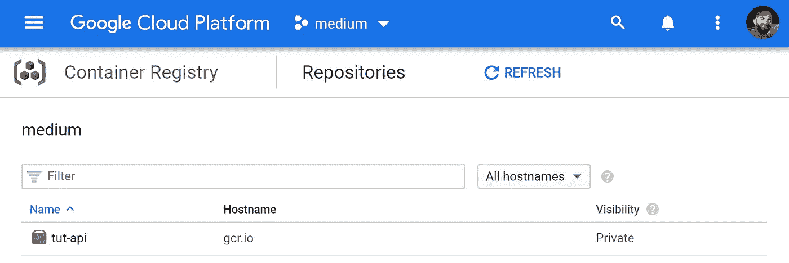

## 使用云运行部署

有了 Docker 容器，我们就可以通过 Cloud Run 将它部署到 web 上。

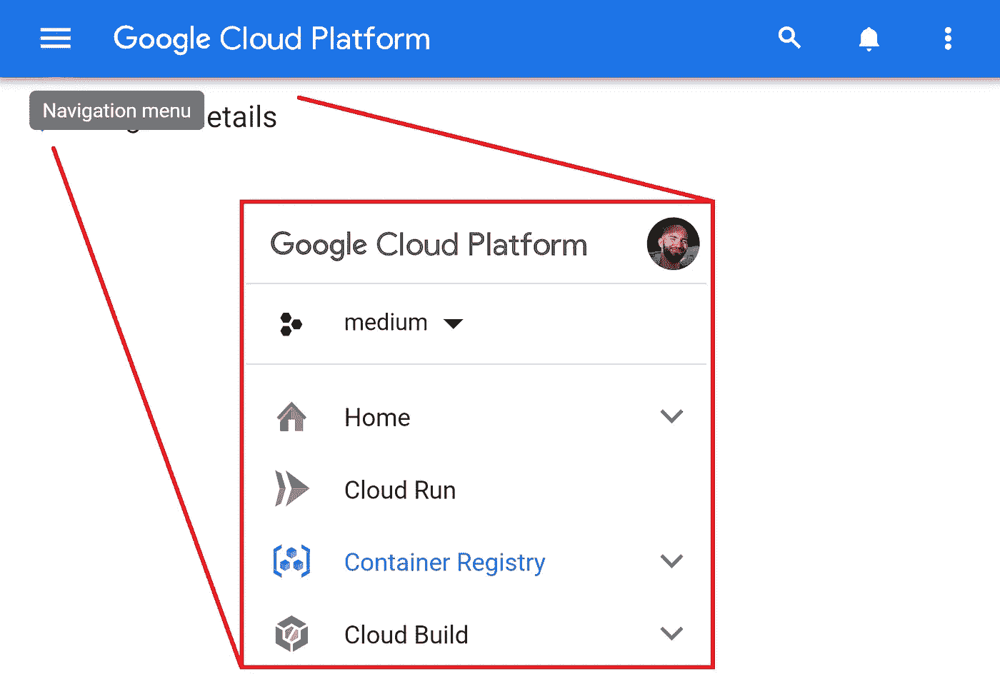

我们通过点击左上角的导航按钮(在 [GCP 控制台](https://console.cloud.google.com/)中)并选择**云运行**来打开云运行控制台。

接下来，我们将看到云运行界面，我们通过单击**创建服务**来部署我们的容器:

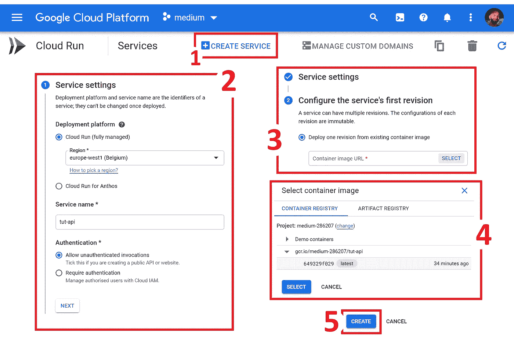

接下来，我们(2)输入我们的首选部署设置，(3–4)选择我们的容器映像，以及(5)创建我们的部署！

在我们的 API 被部署之后，我们可以在云运行控制台的顶部找到 API 的 URL。


**云运行**中 API 的 URL。

# 测试我们的部署

对于测试 API， **Postman** 是你的朋友——在这里找到[下载链接](https://www.postman.com/downloads/)。

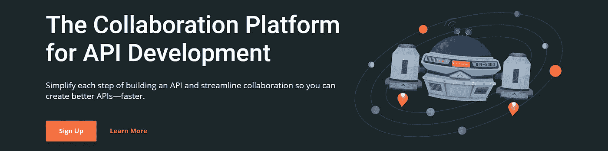

安装完成后，打开 Postman 并输入 API 的网址，例如:

`[https://tut-api-2czbipghsq-ew.a.run.app/](https://tut-api-2abcdefgh-ew.a.run.app/.)`

在我们的代码中，我们将我们的`Places`类的位置指定为`/places`:

```
api.add_resource(Places, '/places')
```

因此，我们知道要访问包含在`Places`中的方法，我们必须将`/places`添加到我们的 API 地址:

`[https://tut-api-2czbipghsq-ew.a.run.app**/places**](https://tut-api-2abcdefgh-ew.a.run.app/places)`

## 得到

对于 GET 请求，这就是我们所需要的—将其输入地址栏，在下拉列表中单击 **GET** ，然后单击 **Send** 。

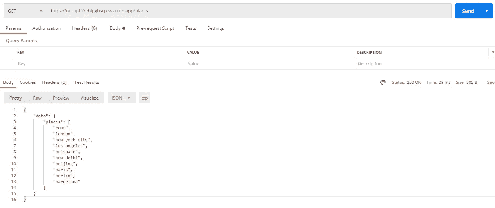

顶栏显示我们正在向[**https://tut-api-2czbipghsq-ew.a.run.app/places**发送一个 **GET** 请求。](https://tut-api-2czbipghsq-ew.a.run.app/places.)底部区域显示我们的**数据**响应，右上角显示**状态:200 OK** 。

让我们也测试一下其他方法——记住为 POST 和 DELETE 请求添加我们的`location`参数，并更新请求类型(在下拉列表中)。

## 邮政

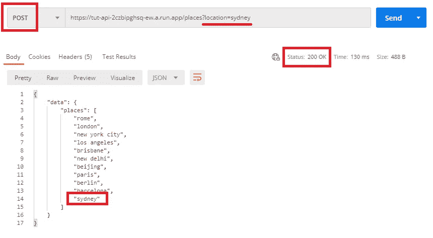

在下拉列表中选择**岗位**，添加**？location=sydney** 到地址栏，点击**发送**。我们将返回我们的**数据**附加 sydney。

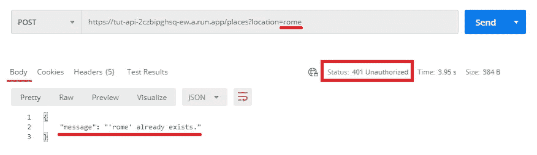

仍然使用 **POST** ，我们将地址栏中的悉尼改为**罗马**，并点击**发送**。我们将返回一个 **401 未授权的** HTTP 代码和一条简单的消息，告诉我们**罗马**已经存在。

## 删除

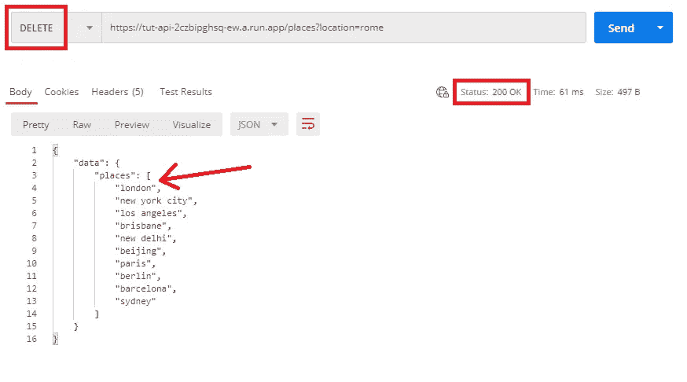

在下拉列表中选择**删除**，我们保留**位置**为**罗马**，点击**发送**。我们将返回删除了**罗马**的**数据**。

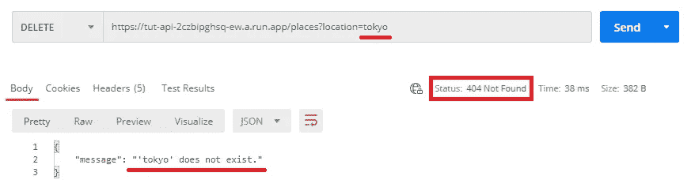

现在，如果我们试图**删除东京**(不存在)——我们将返回一个 **404 Not Found** HTTP 代码，并带有一条消息告诉我们**东京**不存在。

# 打开闸门

这就是这个简单的 API 示例，它内置在 Flask 中，并使用 Docker 部署在 GCP 上。

简而言之，构建一个 API 并将其部署到 web 上是一个极其简单而高效的过程。这并不难，并为我们打开了一片广阔的机会之门。

我希望你喜欢这篇文章——如果你有任何问题或建议，请随时通过 [Twitter](https://twitter.com/jamescalam) 或在下面的评论中联系我们。如果你想要更多这样的内容，我也会在 [YouTube](https://www.youtube.com/c/jamesbriggs) 上发布。

感谢阅读！

如果您喜欢这篇文章，并且有兴趣进一步拓展您在网络技术方面的技能组合，请在此尝试我的数据科学角度介绍:

[](/how-to-use-angular-to-deploy-tensorflow-web-apps-5675b5a042cc) [## 如何使用 Angular 部署 TensorFlow Web 应用程序

### 在角度构建的 web 应用程序中使用 Python 构建的模型

towardsdatascience.com](/how-to-use-angular-to-deploy-tensorflow-web-apps-5675b5a042cc)