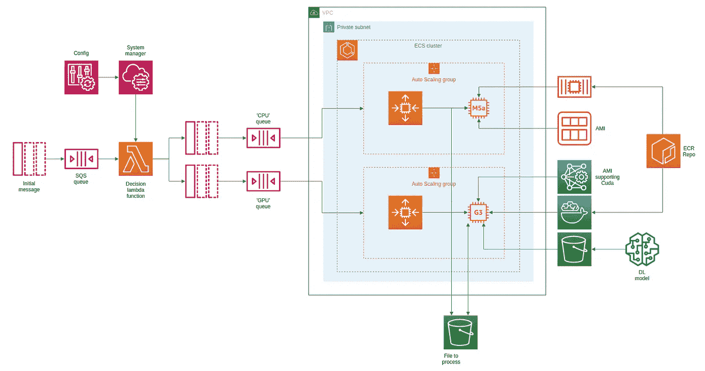

# 使用 CDK 将自动扩展机器学习模型推理堆栈部署到 AWS

> 原文：<https://towardsdatascience.com/deploy-autoscaling-machine-learning-model-inference-stack-to-aws-with-cdk-84d26acf8a99?source=collection_archive---------53----------------------->

## 使用 AWS/CDK 的强大功能，在一个堆栈中部署 ML 模型，该堆栈可以自动扩展，以便在 CPU 或 GPU 上进行推理


来源: [unsplash](https://unsplash.com/photos/jkuR9QteDGY)

几年来，数据科学和机器学习非常性感，许多公司都将“人工智能”作为一种新的强大工具，以黑匣子的形式自动化复杂的任务。在这个领域，深度学习似乎是建立模型来检测和分类图像或文本以及其他酷东西的圣杯。一旦训练好模型，通常将它们部署在小型 web 服务器上，并公开一个简单的 REST API 来对给定的样本执行推理。它通常非常方便，而训练模型需要大量的计算能力和大量的 GPU，推理只需要一个相对低功率的 CPU 来对单个样本进行预测。您可以找到许多关于这种方法的文章和博客帖子；事件开源项目和公司可以使整个事情变得轻松。

然而，在有些情况下，您需要不仅对一个样本，而且对一批样本进行推断。在这种情况下，推理在 CPU 上执行时会花费大量时间，您需要使用 GPU 来并行化作业。使用一个小的网络服务器现在不再适用，因为你不想为一台连接了 GPU 的一直运行的机器付费。例如，假设您必须对上传到您的 S3 存储桶的大文件执行一些预测。你的文件首先被分割成小块，模型根据这些小块进行预测。你想要的是你的栈在一个文件准备好处理的时候自动启动，使用一个有 GPU 的机器，当没有东西要处理的时候关闭整个东西。因为没有可用的无服务器堆栈(将来会有吗？)，我们需要构建一个堆栈来根据我们的需求自动扩展。

# 体系结构

建议的体系结构如下:我们得到一个带有要执行的任务的 SQS 消息。例如，它可能是 S3 上要处理的文件的名称。根据在 AWS 的参数存储中找到的配置参数，该消息被转发到另一个 SQS 队列，一个用于基于 CPU 的堆栈，另一个用于基于 GPU 的堆栈。然后，ECR 集群使用 Cloudwatch 警报来触发两个自动伸缩组的伸缩，一个使用纯 CPU 实例，另一个使用支持 GPU 的实例。然后将结果返回到 S3 桶中。



提议的架构

# 自动化

为了使整个过程更加自动化，我们可以使用 CDK 应用程序。就像 Terraform 或 Kubernetes 提供通过代码构建堆栈一样，CDK 倾向于成为在 AWS 上部署堆栈的参考。你当然可以使用 Cloudformation，但是一想到要使用非常大的 YAML 文件来管理一个堆栈，我就害怕。然而，使用像 Typescript、C#或 Python 这样的现代编程语言要有趣得多。在[存储库源代码](https://github.com/gandroz/deploy_model_ecs_medium)中，您可以找到两个类来构建堆栈:`DeployModelEcsMediumStackCore`和`DeployModelEcsMediumStack`。第一个，顾名思义，构建堆栈的核心，即主 SQS 队列，附加一个 lambda 函数、一个 ECS 集群和一些 IAM 策略的定义。然后`DeployModelEcsMediumStack`类为 CPU 或 GPU 架构构建一个堆栈。SQS 队列和相关指标、具有正确 AMI 的自动扩展组、实例类型和扩展策略，以及具有要检索的正确 ECR 映像的 ECS 任务。

## 串

首先，应该用`ecs.Cluster`构造创建一个集群。在那里，我们创建一个自动扩展组，使用`cluster.addCapacity`静态方法向集群添加一个容量提供者。然后我们需要用构造`ecs.Ec2TaskDefinition`创建一个任务，提供用静态方法`ecs.ContainerImage.fromEcrRepository`检索的正确的 ECR 图像。该映像必须是基于 ECS 优化 AMI 的映像才能正常工作。没有官方的 AWS AMI 支持 ECS 的 GPU，但是你可以找到自定义的。我们还需要注意`gpuCount`属性，当我们要使用 GPU 时，将其设置为`1`。最后，使用构造`ecs.Ec2Service`创建服务，并将其附加到集群。

## 使用堆栈

一旦一切都部署完毕，您所需要做的就是在主 SQS 队列中发送一条消息，其中包含要执行的命令，在我的示例中就是要在 S3 上检索的文件的名称。要决定是使用基于 GPU 的实例还是仅使用 CPU 的实例，我们只需要在系统管理器的参数存储中更改配置。这种消息的一个例子可以是

```
aws sqs send-message --queue-url [https://sqs.ca-central-1.amazonaws.com/1234567890/MediumArticleQueue](https://sqs.ca-central-1.amazonaws.com/1234567890/MediumArticleQueue) --message-body '{"filename": "file_to_process.bin"}'
```

## 行列

在提议的架构中有三个 SQS 队列，但是用户只需要在主队列`[MediumArticleQueue](https://sqs.ca-central-1.amazonaws.com/1234567890/MediumArticleQueue)`中发送一个消息。一旦接收到消息，λ函数被触发，并且关于配置(SSM/参数存储中的参数)，消息被转发到适当的队列，`GPUQueue`用于管理基于 GPU 的实例的自动缩放组，`CPUQueue`用于仅基于 CPU 的实例。

## 密码

这个 CDK 堆栈的 typescript/python 代码在这里发布有点大，但是你可以在这个 [repo](https://github.com/gandroz/deploy_model_ecs_medium) 中找到源代码。请随意复制或分叉代码，只需竖起大拇指或一点点意见将不胜感激。

# 最后一个音符

在源代码中，我定义了警报来缩放自动缩放组，但没有缩放任务计数。原因是在添加 ECS 服务时，我们还用`ecsService.autoScaleTaskCount`方法设置了它的自动伸缩行为。然而，AWS/CDK 没有正确地将任务扩展和实例扩展联系起来，而任务扩展和实例扩展是容量提供者的职责。当您直接在控制台中工作时，可以实现这种行为，但不是通过编程实现的。有一个 [PR](https://github.com/aws/aws-cdk/pull/9192) 来纠正它，但是在这篇文章发表的时候它还不可用。为了以后支持这个特性，我添加了一个注释代码部分来说明当这个特性发布时，代码会是什么样子。