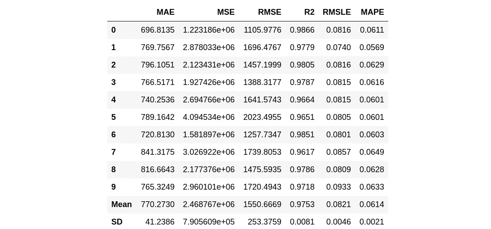
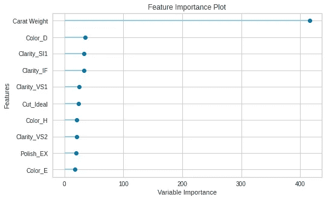
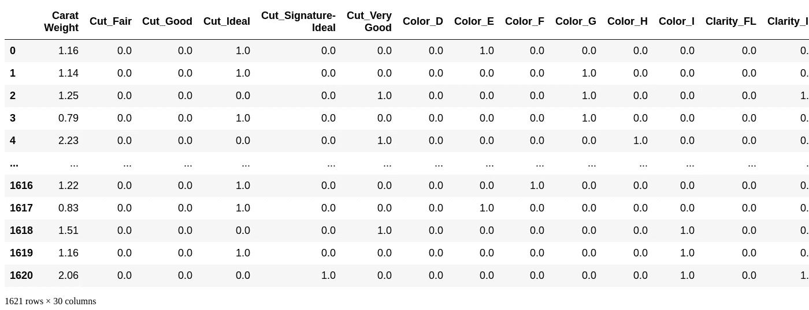

# 使用 PyCaret 构建:在 Microsoft Azure 平台上部署

> 原文：<https://towardsdatascience.com/deploy-azure-7835678c7c86?source=collection_archive---------41----------------------->

## 实用教程

## 将机器学习模型部署到 Microsoft Azure 平台

在这个故事中，我开发了一个工作教程，在微软的 Azure 云平台上部署一个用`pycaret`库训练的模型。在我之前的文章[用 PyCaret 构建:在 Google 云平台](/build-pycaret-deploy-gcp-521415a6c330)上部署中，我们已经学习了如何在 Google 云上部署模型。我们将在本教程中使用相同的示例，并在 Microsoft Azure 平台上部署该模型。


我们学习把用`pycaret`训练的模型部署到微软 Azure 平台上。`pycaret`支持在 AWS 上部署训练有素的模型，但目前不支持 GCP 或 Azure。我遵循了类似于 library 中使用的代码实践，用 [AWS](https://aws.amazon.com/) 部署和加载模型，在微软的 Azure 平台上部署模型。

PyCaret 是 Python 中的一个开源、低代码机器学习库，允许您在几秒钟内从准备数据到在您选择的笔记本环境中部署模型。[来源](https://www.pycaret.org)

PyCaret 是公民数据科学家的 autoML 框架，在其官方文档和主页中使用。这是一个相对较新的库，几个月前发布供公众使用，目前仍在积极开发中。在浏览了一些源代码后，我意识到当前的公开版本缺乏对 Google 和 Azure 云平台的训练/最终模型部署的支持。不过，它支持在 Amazon web services 上部署。

微软 Azure 是另一个非常受欢迎的云服务框架，目标市场不同于谷歌和 AWS。Azure 已经拥有庞大的客户群，并获得了合理的市场份额。在我看来，对于公民数据科学家来说，大概微软 Azure 是最好的起点。让我们学习如何在 Microsoft Azure 上部署模型。

对于本教程，我们将使用[回归教程(REG101) —初级初学者](https://pycaret.org/reg101/)进行模型训练。

## 正在安装 pycaret

```
!pip install pycaret
```

## 安装 Gdrive

我们需要安装 google drive 来读取 colab 环境中的数据。下面是最简单的安装方法。您将被要求输入访问过程生成的令牌。这里是关于[安装 gdrive](https://medium.com/@prajwal.prashanth22/google-colab-drive-as-persistent-storage-for-long-training-runs-cb82bc1d5b71) 的文章的链接

在本教程中，我们将在 Google drive 上本地保存模型。

```
from google.colab import drive
drive.mount('/content/drive')Drive already mounted at /content/drive; to attempt to forcibly remount, call drive.mount("/content/drive", force_remount=True).
```

让我们创建一个目录来本地保存模型。

```
# Create directory on google drive to save models locally. You can use temp paths.
import os
model_dir = '/content/drive/My Drive/azure_deploy_model/'
os.makedirs(model_dir, exist_ok=True)
```

# 获取数据

您可以从这里找到的原始源[](https://github.com/DardenDSC/sarah-gets-a-diamond)**下载数据，并使用 pandas [**(了解如何使用)**](https://pandas.pydata.org/pandas-docs/stable/reference/api/pandas.read_csv.html) 加载数据，或者您可以使用 PyCaret 的数据存储库，使用`get_data()`函数加载数据(这将需要互联网连接)。**

```
from pycaret.datasets import get_data
dataset = get_data('diamond')
```

****

```
#check the shape of data
dataset.shape(6000, 8)data = dataset.sample(frac=0.9, random_state=786).reset_index(drop=True)
data_unseen = dataset.drop(data.index).reset_index(drop=True)

print('Data for Modeling: ' + str(data.shape))
print('Unseen Data For Predictions: ' + str(data_unseen.shape))Data for Modeling: (5400, 8)
Unseen Data For Predictions: (600, 8)
```

# **在 PyCaret 中设置环境**

**让我们使用 pycaret 的设置模块设置建模管道。**

```
from pycaret.regression import *exp_reg101 = setup(data = data, target = 'Price', session_id=123)Setup Successfully Completed!
```

****

## **创建一个轻型 GBM 模型**

**对于本教程，我们使用 pycaret 中实现的许多选项中的轻量级 GBM 对数据进行建模。您可以选择任何您喜欢的模型，但这不是本教程的重点。**

```
lightgbm = create_model('lightgbm')
```

****

## **调谐光梯度增强机**

**让我们来训练这个模型，用 pycaret 的术语来说，这个模型也被称为调整模型。**

```
tuned_lightgbm = tune_model('lightgbm')
```

****

## **残差图**

**下图显示了模型的残差**

```
plot_model(tuned_lightgbm)
```

****

**预测误差图用于绘制目标的预测误差与真实值。**

```
plot_model(tuned_lightgbm, plot = 'error')
```

****

## **特征重要性图**

**特征重要性是非常有用的图，可以看到模型中每个特征的贡献。**

```
plot_model(tuned_lightgbm, plot='feature')
```

****

***分析模型性能的另一种*方法是使用`evaluate_model()`功能，该功能显示给定模型所有可用图的用户界面。它在内部使用`plot_model()`功能。**

```
evaluate_model(tuned_lightgbm)interactive(children=(ToggleButtons(description='Plot Type:', icons=('',), options=(('Hyperparameters', 'param…
```

## **根据测试/保留样本进行预测**

```
predict_model(tuned_lightgbm);
```

****

## **最终确定用于部署的模型**

```
final_lightgbm = finalize_model(tuned_lightgbm)#Final Light Gradient Boosting Machine parameters for deployment
print(final_lightgbm)LGBMRegressor(boosting_type='gbdt', class_weight=None, colsample_bytree=1.0,
              importance_type='split', learning_rate=0.4, max_depth=10,
              min_child_samples=20, min_child_weight=0.001, min_split_gain=0.9,
              n_estimators=90, n_jobs=-1, num_leaves=10, objective=None,
              random_state=123, reg_alpha=0.9, reg_lambda=0.2, silent=True,
              subsample=1.0, subsample_for_bin=200000, subsample_freq=0)predict_model(final_lightgbm)
```

********

## **根据看不见的数据预测**

```
unseen_predictions = predict_model(final_lightgbm, data=data_unseen)
unseen_predictions.head()
```

****

**`Label`列被添加到`data_unseen`集合中。标签是使用`final_lightgbm`模型的预测值。如果您想对预测进行四舍五入，您可以在`predict_model()`中使用`round`参数。**

## **保存模型**

**让我们首先在本地保存模型**

```
model_dir
model_name = 'Final_lightgbm_model''/content/drive/My Drive/azure_deploy_model/'# Saving model to google drive

save_model(final_lightgbm, model_dir + model_name)Transformation Pipeline and Model Successfully Saved
```

## **加载保存的模型**

**为了在将来的某一天在相同或不同的环境中加载已保存的模型，我们将使用 PyCaret 的`load_model()`函数，然后轻松地将已保存的模型应用于新的未知数据进行预测。**

```
saved_final_lightgbm = load_model(model_dir + model_name)Transformation Pipeline and Model Successfully Loaded
```

**一旦模型加载到环境中，您就可以使用相同的`predict_model()`函数简单地使用它来预测任何新数据。下面我们应用了加载模型来预测我们在上面第 13 节中使用的相同的`data_unseen`。**

```
new_prediction = predict_model(saved_final_lightgbm, data=data_unseen)new_prediction.head()
```

****

**注意`unseen_predictions`和`new_prediction`的结果是相同的。**

# **在 Microsoft Azure 上部署训练模型**

**微软 Azure 是最大的云提供商之一，在云即服务上提供机器学习。在我之前的文章中，我已经介绍了将模型部署到 Google 云平台。图书馆已经支持亚马逊网络服务部署。**

**一旦我们有了训练好的模型，下一个任务就是部署它来为客户服务。有各种可用的部署选项，但是在本节中，我将重点关注在 Microsoft Azure 平台上部署它。我尝试使用类似于`pycaret`库中的方法在 AWS 上部署。**

## **先决条件**

**在 Azure cloud 上部署 ml 模型的先决条件是**

*   **熟悉微软 Azure 平台**
*   **Microsoft Azure 帐户**
*   **基本了解存储容器及其命令行工具**
*   **使用 pycaret 的最终训练模型**

> **[阅读快速入门指南:使用 Python v12 SDK 管理 blobs】](https://docs.microsoft.com/en-us/azure/storage/blobs/storage-quickstart-blobs-python?toc=%2Fpython%2Fazure%2FTOC.json)**

```
import os, uuid
from azure.storage.blob import BlobServiceClient, BlobClient, ContainerClient
```

*****AZURE _ STORAGE _ CONNECTION _ STRING***是连接到 AZURE 存储 blob 的身份验证字符串。您可以在您的环境中设置该字符串，并且可以随时使用。另一种选择是，只要需要连接，就输入字符串。**

> **微软 Azure 存储容器相当于谷歌云存储桶**

```
# add the connection string in environment

# Linux
! export AZURE_STORAGE_CONNECTION_STRING="<yourconnectionstring>"

# After you add the environment variable, restart any running programs that will need to read the environment variable. For example, restart your development environment or editor before continuing.

# Retrieve the connection string for use with the application. The storage
# connection string is stored in an environment variable on the machine
# running the application called AZURE_STORAGE_CONNECTION_STRING. If the environment variable is
# created after the application is launched in a console or with Visual Studio,
# the shell or application needs to be closed and reloaded to take the
# environment variable into account.
connect_str_env = os.getenv('AZURE_STORAGE_CONNECTION_STRING')
```

**您可以使用下面的表单在 google colab 中输入您的连接字符串**

```
## Enter connection string when running in google colab
connect_str = 'Enter Connection String Here' #@param {type:"string"}
print(connect_str)
```

**若要创建到 blob 容器的连接，请使用下面的命令创建服务客户端对象。**

```
# Create the BlobServiceClient object which will be used to create a container client
blob_service_client = BlobServiceClient.from_connection_string(connect_str)
```

**我写了/收集了下面的实用程序来从 blobs 上传/下载数据。**

```
def create_container(container_name):

  # Create the container
  container_client = blob_service_client.create_container(container_name)

  return container_client

def upload_blob(container_name, source_file_name, destination_blob_name):

  # Create a blob client using the local file name as the name for the blob
  blob_client = blob_service_client.get_blob_client(container=container_name, blob=destination_blob_name)

  print("\nUploading to Azure Storage as blob:\n\t" + source_file_name)

  # Upload the created file
  with open(source_file_name, "rb") as data:
      blob_client.upload_blob(data)

def download_blob(container_name, source_blob_name, destination_file_name):
  # Download the blob to a local file
  print("\nDownloading blob to \n\t" + destination_file_name)

  # Create a blob client using the local file name as the name for the blob
  blob_client = blob_service_client.get_blob_client(container=container_name, blob=source_blob_name)

  if destination_file_name is not None: 
        with open(destination_file_name, "wb") as download_file:
          download_file.write(blob_client.download_blob().readall())

        print(
            "Blob {} downloaded to {}.".format(
                source_blob_name, destination_file_name
            )
        )
```

## **将模型保存到 Azure 容器**

**使用上面的工具，使用下面的代码将模型上传到 Azure-container。在上传之前，我们创建容器，如果以前没有这样做。**

> **也可以使用 GUI 创建容器。**

```
# Create a unique name for the container
container_name = "pycaret" + str(uuid.uuid4())
container_client = create_container(container_name)

# Save Model Local/google drive and upload to Azure
model_name_azure = 'lightgbm-reg101-azure'
save_model(final_lightgbm, model_name= model_dir + model_name_azure, verbose=False)
model_src = model_dir + model_name_azure +'.pkl'
model_dst = str(model_name)+'.pkl'upload_blob(CLOUD_PROJECT, bucket_name, model_src, model_dst)File /content/drive/My Drive/azure_deploy_model/lightgbm-reg101-azure.pkl uploaded to Final_lightgbm_model.pkl.
```

## **从 Azure 下载预测模型**

**一旦你的模型上传到 Azure，你可以随时下载来执行预测。我遵循一个简单的流程，首先在本地或 google drive 中下载模型，然后使用`load_model`函数加载模型。**

```
print("\nListing blobs...")

# List the blobs in the container
blob_list = container_client.list_blobs()
for blob in blob_list:
    print("\t" + blob.name)

outfile_name = model_dir + 'lightgbm-reg101-azure-downloaded'
model_azure_src = str(model_name)+'.pkl'
download_blob(container_name, model_azure_src, outfile_name + '.pkl')
```

**使用最近从 Azure 下载的模型来执行预测。**

```
# Loading the model for predictions
azure_final_lightgbm = load_model(outfile_name)Transformation Pipeline and Model Successfully Loaded# Predictions from deployed model
new_prediction_azure = predict_model(azure_final_lightgbm, data=data_unseen)new_prediction_azure.head()
```

****

# **谷歌 Colab 笔记本**

**按照下面的谷歌合作笔记本来复制和实践这个指南。**

# **结论**

**在本教程中，我们学习了如何在使用`pycaret`库进行培训时将模型部署到 Microsoft Azure。**

**主要目标是使用`[pycaret](https://github.com/pycaret/pycaret)`的内置实用程序从 Azure 部署和加载模型。以下是一些亮点**

*   **安装 google drive 以保存模型**
*   **用`pycaret`训练回归模型**
*   **保存和加载经过培训/最终确定的模型 Microsoft Azure**
*   **将经过培训/最终确定的模型部署到微软的 Azure 容器**
*   **使用 Azure 部署的模型来执行预测**