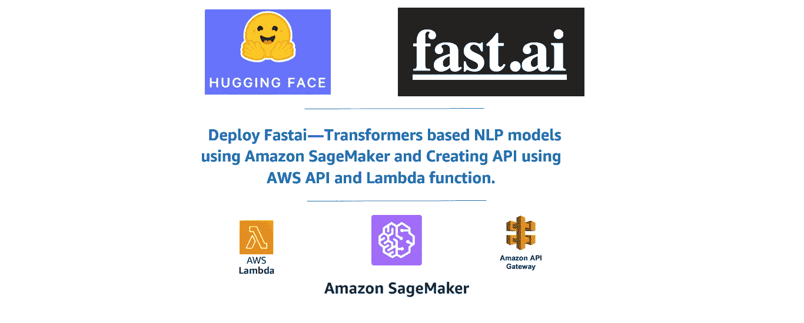
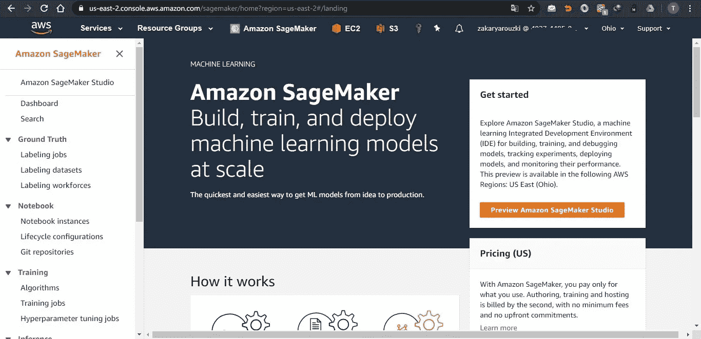
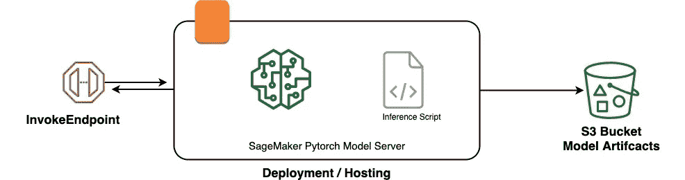
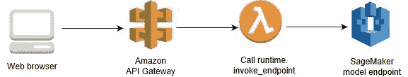
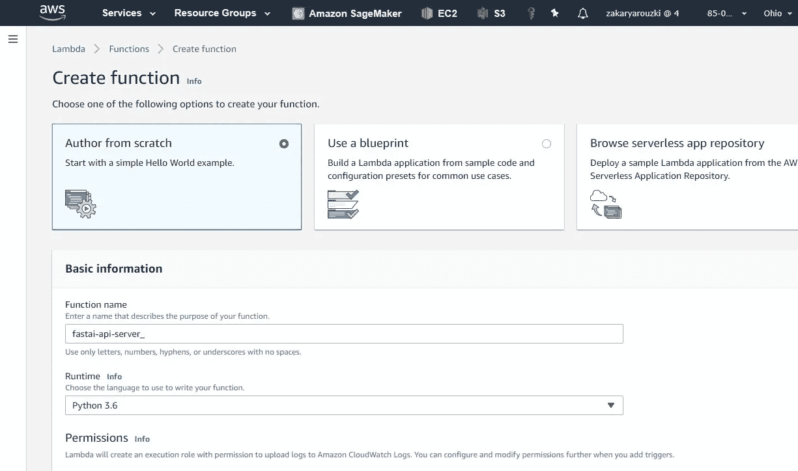
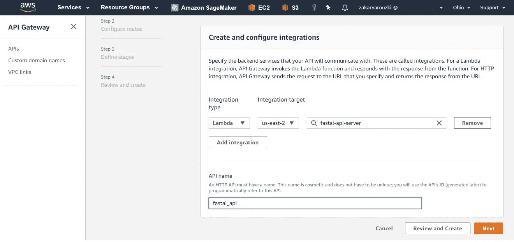
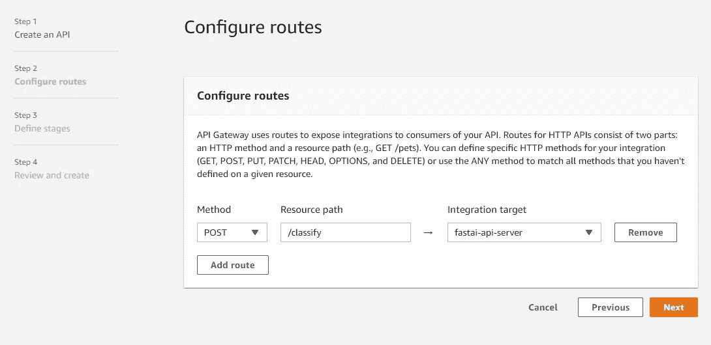
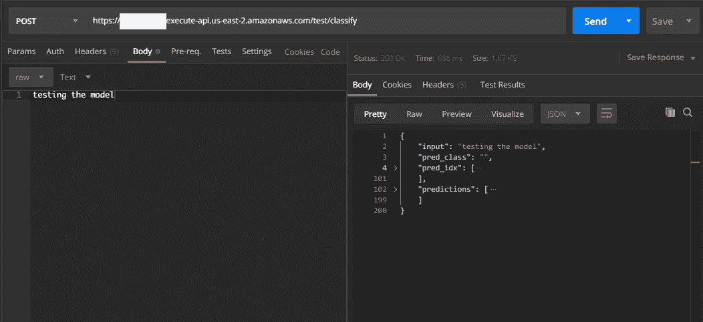

# 使用 Amazon SageMaker 部署 Fastai —基于变压器的 NLP 模型，并使用 AWS API 网关和 Lambda 函数创建 API

> 原文：<https://towardsdatascience.com/deploy-fastai-transformers-based-nlp-models-using-amazon-sagemaker-and-creating-api-using-aws-7ea39bbcc021?source=collection_archive---------21----------------------->

## Fastai-Transformers 模型部署在 AWS SageMaker 上，并作为 AWS API 提供服务。

# 目录

1.  介绍
2.  第 1 部分—导出模型并重新加载它
3.  第 2 部分——使用 Amazon SageMaker 进行部署
4.  第 3 部分——使用 Amazon Lambda 和 Amazon API Gateway 创建模型 API
5.  结论
6.  参考

# 1.介绍

T 何[变形金刚](https://github.com/huggingface/transformers)库由[抱脸](https://huggingface.co)创建。这个库以前被称为 pytorch-transformers 或 pytorch-pretrained-bert，它汇集了 40 多个最先进的预训练 NLP 模型(bert、GPT-2、罗伯塔、CTRL……)。这是一个自以为是的库，专为寻求使用/研究/扩展大规模变压器模型的 NLP 研究人员而建。

该实现提供了有趣的附加工具，如 tokenizer、optimizer 或 scheduler。它可以是自给自足的，但是将它并入 [**fastai**](https://docs.fast.ai) 库提供了与强大的 fastai 工具兼容的更简单的实现，例如**区分学习率**、**逐步解冻**或**倾斜三角形学习率**。这里的重点是轻松获得最先进的结果，并“**让 NLP 再次变得不酷**”。

我假设您已经实现了您的模型，我不打算讨论这一部分，本文将只讨论使用 AWS 服务的部署部分，但是如果您需要查看实现，请查看 Kaggle 上的这个[内核](https://www.kaggle.com/melissarajaram/roberta-fastai-huggingface-transformers)。

# 2.第 1 部分—导出模型并重新加载它

**2.1。** **导出模型**

首先，我们需要使用 fastai 库的学习模块将我们的模型导出为 PKL 文件:

## 2.2.加载模型:

当使用自定义的 transformers 模型(如 Bert)时，您需要重新定义自定义模型的体系结构，以便在加载它时，load_learner()函数会查找特定的函数以用于新的预测。

在加载模型之前，我们需要重新定义我们在培训中使用的定制 transformer 模型。

然后我们可以加载我们的模型并进行预测:

# 3.第 2 部分——使用 Amazon SageMaker 进行部署

用亚马逊自己的话说:

> [*亚马逊 SageMaker*](https://aws.amazon.com/sagemaker/) *为每一个开发者和数据科学家提供了快速构建、训练和部署机器学习模型的能力。Amazon SageMaker 是一个完全托管的服务，涵盖了整个机器学习工作流，以标记和准备您的数据，选择算法，训练模型，调整和优化它以进行部署，进行预测，并采取行动。您的模型以更少的工作量和更低的成本更快地投入生产。*

SageMaker 提供了一个框架来训练和部署您的模型。一切都在 Docker 容器中运行。

AWS SageMaker 的用户界面

因为我们将使用 Amazon SageMaker Python SDK，所以我们需要一个笔记本实例来运行我们的代码。

**3.1。** **使用 SageMaker Python SDK 部署模型**

来自 SageMaker Python SDK 文档:

> Amazon SageMaker Python SDK 是一个开源库，用于在 Amazon SageMaker 上训练和部署机器学习模型。
> 
> 通过 SDK，你可以使用流行的深度学习框架、亚马逊提供的算法或你自己的内置于 SageMaker 兼容的 Docker 图像中的算法来训练和部署模型。

**3.1.1。** **准备环境:**

部署的总体架构如下:

部署架构

将您的模型(PKL 文件)上传到笔记本实例后，我们需要将它压缩，这样我们就可以将它上传到 S3。

然后，我们可以将它上传到 S3 存储，如下所示:

现在我们已经准备好将我们的模型部署到 SageMaker 模型托管服务中。我们将使用 SageMaker Python SDK 和 Amazon SageMaker 开源 PyTorch 容器，因为该容器支持 fast.ai 库。使用一个预定义的 Amazon SageMaker 容器可以很容易地编写一个脚本，然后在 Amazon SageMaker 中运行它。

为了在 SageMaker 中服务模型，我们需要一个实现 4 个方法的脚本: **model_fn，input_fn，predict_fn & output_fn** 。

*   model_fn 方法需要从磁盘上保存的权重中加载 PyTorch 模型。
*   input_fn 方法需要将 invoke 请求体反序列化为我们可以对其执行预测的对象。
*   predict_fn 方法接受反序列化的请求对象，并对加载的模型执行推理。
*   output_fn 方法获取预测结果，并根据响应内容类型将其序列化。

方法 **input_fn** 和 **output_fn** 是可选的，如果省略，SageMaker 将假定输入和输出对象是 NPY 格式类型，内容类型为 application/x-npy。

这是 serve.py 脚本:

另一件事是将这个脚本放在一个文件夹中，并将其命名为 my_src，我们将添加一个需求文本文件；来强制 SageMaker 安装所需的库，比如 Fastai。

我的 requirements.txt 文件仅包含以下内容:

> fastai==1.0.52
> 变压器

你可以在 SageMaker Python SDK 文档[这里](https://sagemaker.readthedocs.io/en/stable/using_pytorch.html#using-third-party-libraries)读到更多关于这个的内容。

**3.1.2。** **部署型号:**

首先，我们需要创建一个 RealTimePredictor 类来接受 JSON/application item 作为输入和输出 JSON。默认行为是接受 NumPy 数组。

我们需要得到 IAM 角色 ARN 给 SageMaker 权限，以读取我们的模型从 S3 人工制品。

我们将把我们的模型部署到实例类型 ml.p2.xlarge。我们将传入我们的服务脚本的名称，例如 serve.py。我们还将传入我们之前上传的模型的 S3 路径。

SageMaker 需要一段时间来为推断准备好端点。

**3.2.3。** **使用 Boto3 调用端点:**

Boto 是 Python 的 Amazon Web Services (AWS) SDK。它使 Python 开发人员能够创建、配置和管理 AWS 服务，如 EC2 和 S3。Boto 提供了一个易于使用的、面向对象的 API，以及对 AWS 服务的底层访问。

# 4.第 3 部分——使用 Amazon Lambda 和 Amazon API Gateway 创建模型 API

我们将使用 API Gateway 和 AWS Lambda 调用 Amazon SageMaker 部署的模型端点。

下图显示了如何使用无服务器架构调用部署的模型。从客户端开始，客户端脚本调用 Amazon API Gateway API 动作并传递参数值。API 网关是向客户端提供 API 的层。此外，它还密封了后端，这样 AWS Lambda 就可以在一个受保护的私有网络中运行。API Gateway 将参数值传递给 Lambda 函数。Lambda 函数解析该值并将其发送到 SageMaker 模型端点。该模型执行预测，并将预测值返回给 AWS Lambda。Lambda 函数解析返回值并将其发送回 API Gateway。API 网关用该值响应客户端。

部署架构

**4.1。**创建亚马逊 Lambda 函数

**AWS Lambda** 是一个事件驱动的无服务器计算平台，由亚马逊提供，作为亚马逊网络服务的一部分。它是一种计算服务，运行代码以响应事件，并自动管理该代码所需的计算资源。

为了创建一个函数，我们指定它的名称和运行时环境(在我们的例子中是 Python 3):

然后，我们使用自定义函数调用使用 Boto3 库的端点，如下所示:

**4.2。** **创建亚马逊 Web API 网关实例:**

Amazon API Gateway 是一个完全托管的服务，使开发人员可以轻松地创建、发布、维护、监控和保护任何规模的 API。

我们创建一个 API 并将其关联到 Lambda 函数作为一个集成，如下所示:

然后我们需要确定 API 的路由，我们将只使用一个路由“/classify”和“POST”作为我们的请求方法。

**4.3。** **测试你的亚马逊 API**

现在我们有了 Lambda 函数、API 网关和测试数据，让我们使用 Postman 来测试它，Postman 是一个用于测试 web 服务的 HTTP 客户端。

当我们部署您的 API 网关时，它提供了如下所示的调用 URL:

[https://{restapi_id}。执行-api。{ region } . Amazon AWS . com/{ stage _ name }/{ resource _ name }](https://{restapi_id}.execute-api.{region}.amazonaws.com/{stage_name}/{resource_name})

在 Postman 中，我们放置调用 URL，并选择 POST 作为请求方法。在 Body 选项卡中，我们放置要分类的文本，如下图所示。

然后我们发送我们的请求，它将返回 JSON item 作为包含模型预测的响应。

使用 postman 测试 API

我们还可以使用 python 中的请求库，如下所示:

# 结论

就是这样。您已经创建了一个由 Amazon SageMaker 部署和托管的模型端点。然后创建了调用端点的无服务器组件(一个 API 网关和一个 Lambda 函数)。现在你知道如何使用无服务器技术调用亚马逊 SageMaker 托管的机器学习模型端点了。

# 参考

 [## 亚马逊 SageMaker

### 这是使用亚马逊 SageMaker 的程序员实用深度学习 fast.ai 课程 v4 的快速入门指南…

course.fast.ai](https://course.fast.ai/start_sagemaker.html)  [## 使用 Amazon API Gateway 和 AWS Lambda | Amazon Web 调用 Amazon SageMaker 模型端点…

### 在 AWS 机器学习研讨会上，客户经常会问，“在我部署了一个端点之后，我该从那里去哪里？”你可以…

aws.amazon.com](https://aws.amazon.com/blogs/machine-learning/call-an-amazon-sagemaker-model-endpoint-using-amazon-api-gateway-and-aws-lambda/)  [## 步骤 6.1:将模型部署到 SageMaker 托管服务

### 要在 SageMaker 托管服务中部署模型，您可以使用 Amazon SageMaker Python SDK 或 AWS SDK

docs.aws.amazon.com](https://docs.aws.amazon.com/sagemaker/latest/dg/ex1-deploy-model.html)