# 在 Google Kubernetes 引擎上部署使用 Streamlit 和 PyCaret 构建的机器学习应用程序

> 原文：<https://towardsdatascience.com/deploy-machine-learning-app-built-using-streamlit-and-pycaret-on-google-kubernetes-engine-fd7e393d99cb?source=collection_archive---------15----------------------->

## 在 Google Kubernetes 引擎上封装和部署 Streamlit 应用程序的循序渐进的初学者指南

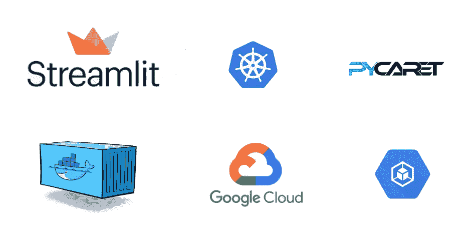

在 Google Kubernetes 引擎上封装和部署 streamlit 应用程序的循序渐进的初学者指南

# 概述

在我们关于在云中部署机器学习管道的[上一篇文章](/build-and-deploy-machine-learning-web-app-using-pycaret-and-streamlit-28883a569104)中，我们展示了如何在 PyCaret 中开发机器学习管道，并在 Heroku PaaS 上部署一个训练有素的模型，作为使用 Streamlit 开源框架构建的 web 应用程序。如果你以前没有听说过 PyCaret，你可以阅读这个[公告](/announcing-pycaret-an-open-source-low-code-machine-learning-library-in-python-4a1f1aad8d46)来了解更多。

在本教程中，我们将使用相同的机器学习管道和 Streamlit 应用程序，并演示如何将它们封装和部署到 Google Kubernetes 引擎上。

在本教程结束时，您将能够在 Google Kubernetes 引擎上构建和托管一个全功能的容器化 web 应用程序。该 web 应用程序可用于使用经过训练的机器学习模型生成在线预测(逐个)和批量预测(通过上传 csv 文件)。最终的应用程序如下所示:

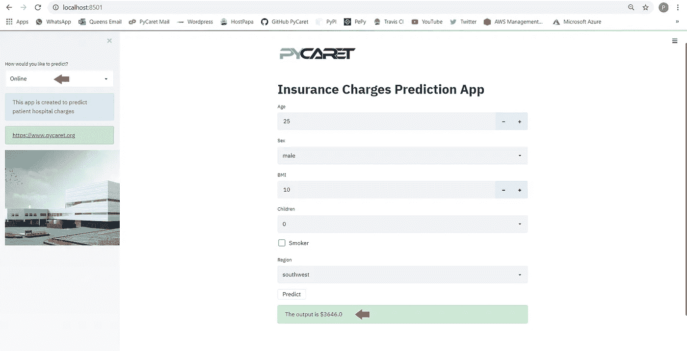

最终应用程序(第 1 页，共 2 页)

# 👉您将在本教程中学到什么

*   什么是容器，什么是 Docker，什么是 Kubernetes，什么是 Google Kubernetes 引擎？
*   建立一个 Docker 图像，并上传到谷歌容器注册(GCR)。
*   在 GCP 上创建一个集群，并以 web 服务的形式部署一个机器学习应用。
*   看看一个使用训练有素的机器学习管道来实时预测新数据点的 web 应用程序。

过去，我们讨论过使用 docker 的容器化以及在 Azure、GCP 和 AWS 等云平台上的部署。如果您有兴趣了解更多相关信息，可以阅读以下教程:

*   [使用 PyCaret 和 Streamlit 构建和部署机器学习 web 应用](/build-and-deploy-machine-learning-web-app-using-pycaret-and-streamlit-28883a569104)
*   [在 AWS Fargate 上部署机器学习管道](/deploy-machine-learning-pipeline-on-aws-fargate-eb6e1c50507)
*   [在 Google Kubernetes 引擎上部署机器学习管道](/deploy-machine-learning-model-on-google-kubernetes-engine-94daac85108b)
*   [在 AWS Web 服务上部署机器学习管道](/deploy-machine-learning-pipeline-on-cloud-using-docker-container-bec64458dc01)
*   [在 Heroku PaaS 上构建和部署您的第一个机器学习 web 应用](/build-and-deploy-your-first-machine-learning-web-app-e020db344a99)

# 💻本教程的工具箱

# PyCaret

PyCaret 是 Python 中的一个开源、低代码机器学习库，用于训练和部署机器学习管道和模型到生产中。PyCaret 可以使用 pip 轻松安装。

```
pip install **pycaret**
```

# 细流

[Streamlit](https://www.streamlit.io/) 是一个开源的 Python 库，可以轻松地为机器学习和数据科学构建漂亮的定制 web 应用。使用 pip 可以轻松安装 Streamlit。

```
pip install **streamlit**
```

# 谷歌云平台

由谷歌提供的谷歌云平台(GCP)是一套云计算服务，运行在谷歌内部用于其最终用户产品(如谷歌搜索、Gmail 和 YouTube)的相同基础设施上。如果你没有 GCP 的账户，你可以在这里注册。如果你是第一次注册，你将获得 1 年的免费学分。

# 让我们开始吧。

在我们进入 Kubernetes 之前，让我们了解一下什么是容器，为什么我们需要一个容器？


[https://www.freepik.com/free-photos-vectors/cargo-ship](https://www.freepik.com/free-photos-vectors/cargo-ship)

您是否遇到过这样的问题:您的代码在您的计算机上运行得很好，但是当一个朋友试图运行完全相同的代码时，却无法运行？如果你的朋友重复完全相同的步骤，他或她应该得到相同的结果，对不对？一个词的答案是 ***环境*。**你朋友的环境和你不一样。

环境包括什么？Python 等编程语言以及所有库和依赖项，以及构建和测试应用程序时使用的确切版本。

如果我们可以创建一个可以转移到其他机器上的环境(例如:你朋友的电脑或者谷歌云平台这样的云服务提供商)，我们就可以在任何地方重现结果。因此，*****容器*** 是一种将应用程序及其所有依赖项打包的软件，因此应用程序可以从一个计算环境可靠地运行到另一个计算环境。**

> *****那 Docker 是什么？*****

****

****Docker** 是一家提供允许用户构建、运行和管理容器的软件(也叫 Docker)的公司。虽然 Docker 的集装箱是最常见的，但还有其他不太出名的*替代品*，如 [LXD](https://linuxcontainers.org/lxd/introduction/) 和 [LXC](https://linuxcontainers.org/) 也提供集装箱解决方案。**

**现在您已经具体了解了容器和 docker，让我们了解 Kubernetes 是什么。**

# **什么是 Kubernetes？**

**Kubernetes 是 Google 在 2014 年开发的一个强大的开源系统，用于管理容器化的应用程序。简而言之，Kubernetes 是一个跨机器集群运行和协调容器化应用的系统。这是一个旨在完全管理容器化应用程序生命周期的平台。**

****

**[丘特尔斯纳普](https://unsplash.com/@chuttersnap?utm_source=medium&utm_medium=referral)在 [Unsplash](https://unsplash.com?utm_source=medium&utm_medium=referral) 上拍照**

# **特征**

**✔️ **负载平衡:**自动在集装箱之间分配负载。**

**✔️ **缩放:**当需求发生变化时，如高峰时间、周末和节假日，通过添加或移除容器来自动放大或缩小。**

**✔️ **存储:**保持存储与应用程序的多个实例一致。**

**✔️ **自我修复**自动重启失败的容器，并杀死不响应用户定义的健康检查的容器。**

**✔️ **自动化部署**你可以自动化 Kubernetes 为你的部署创建新的容器，移除现有的容器，并把它们的所有资源都移植到新的容器中。**

# **有 Docker 为什么还要 Kubernetes？**

**想象一下这样一个场景，您必须在多台机器上运行多个 docker 容器来支持一个企业级 ML 应用程序，无论白天还是晚上都有不同的工作负载。虽然听起来很简单，但手动完成的工作量很大。**

**您需要在正确的时间启动正确的容器，弄清楚它们如何相互通信，处理存储问题，以及处理失败的容器或硬件。这就是 Kubernetes 正在解决的问题，它允许大量的容器和谐地一起工作，减少了操作负担。**

# **什么是 Google Kubernetes 引擎？**

**Google Kubernetes 引擎是 Google 开源的 Kubernetes 在 Google 云平台上的一个实现。简单！**

**其他受欢迎的 GKE 替代品是亚马逊 ECS 和 T2 微软 Azure Kubernetes 服务。**

# **最后一次，你明白吗？**

*   ****容器**是一种打包应用程序及其所有依赖项的软件，因此应用程序可以从一个计算环境可靠地运行到另一个计算环境。**
*   **Docker 是一个用于构建和管理容器的软件。**
*   **Kubernetes 是一个开源系统，用于在集群环境中管理容器化的应用程序。**
*   ****Google Kubernetes 引擎**是开源的 Kubernetes 框架在 Google 云平台上的实现。**

**在本教程中，我们将使用谷歌 Kubernetes 引擎。为了跟进，你必须有一个谷歌云平台账户。[点击此处](https://console.cloud.google.com/getting-started)免费报名。**

# **设置业务环境**

**一家保险公司希望通过使用住院时的人口统计和基本患者健康风险指标来更好地预测患者费用，从而改善其现金流预测。**

****

***(* [*数据来源*](https://www.kaggle.com/mirichoi0218/insurance#insurance.csv) *)***

# **目标**

**使用训练有素的机器学习模型和管道，构建支持在线(逐个)以及批量预测的 web 应用程序。**

# **任务**

*   **使用 PyCaret 训练、验证和开发机器学习管道。**
*   **构建一个前端 web 应用程序，具有两个功能:(一)在线预测和(二)批量预测。**
*   **创建 Dockerfile 文件**
*   **在 Google Kubernetes 引擎上部署 web 应用程序。一旦部署，它将成为公开可用的，并可以通过网址访问。**

# **👉任务 1 —模型训练和验证**

**培训和模型验证是在集成开发环境(IDE)或笔记本电脑中进行的，可以在本地机器上进行，也可以在云上进行。如果您以前没有使用过 PyCaret，[单击此处](/announcing-pycaret-an-open-source-low-code-machine-learning-library-in-python-4a1f1aad8d46)了解更多关于 PyCaret 的信息，或者在我们的[网站](https://www.pycaret.org/)上查看[入门教程](https://www.pycaret.org/tutorial)。**

**在本教程中，我们进行了两个实验。第一个实验是使用 PyCaret 中的默认预处理设置进行的。第二个实验具有一些额外的预处理任务，例如**缩放和归一化、自动特征工程和将宁滨连续数据分成区间**。参见第二个实验的设置代码:**

```
****# Experiment No. 2**from **pycaret.regression** import *****r2 = **setup**(data, target = 'charges', session_id = 123,
           normalize = True,
           polynomial_features = True, trigonometry_features = True,
           feature_interaction=True, 
           bin_numeric_features= ['age', 'bmi'])**
```

**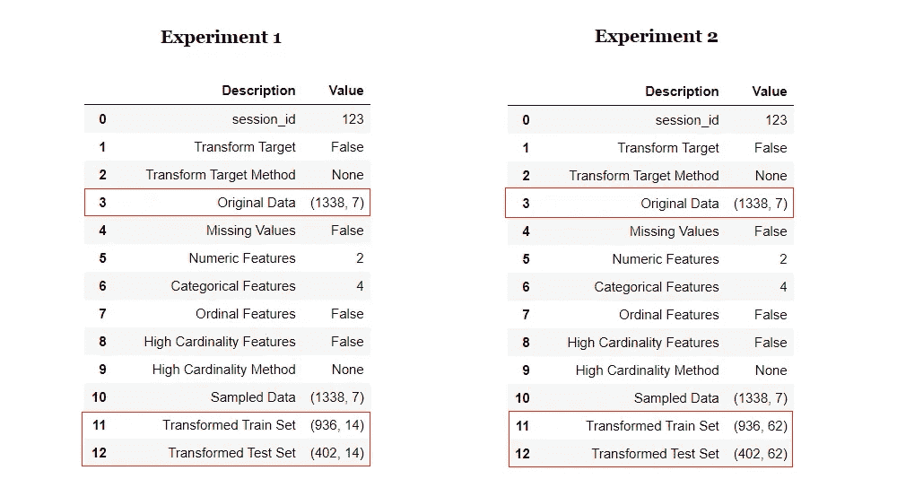**

**两个实验的信息网格比较**

**神奇的事情只发生在几行代码中。请注意，在**实验 2** 中，转换后的数据集有 62 个用于训练的特征，这些特征仅来自原始数据集中的 6 个特征。所有的新特性都是 PyCaret 中的转换和自动特性工程的结果。**

**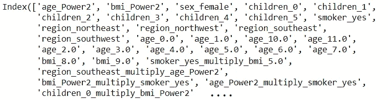**

**转换后数据集中的列**

**PyCaret 中模型定型的示例代码:**

```
**# Model Training and Validation 
lr = **create_model**('lr')**
```

**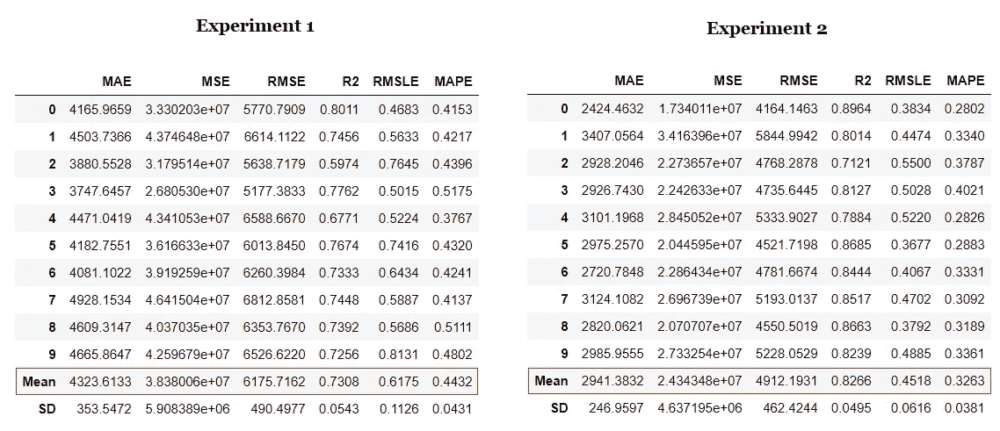**

**线性回归模型的 10 倍交叉验证**

**注意转换和自动特征工程的影响。R2 不费吹灰之力就增加了 10%。我们可以比较两个实验的线性回归模型的**残差图**，并观察转换和特征工程对模型的**异方差**的影响。**

```
**# plot residuals of trained model **plot_model**(lr, plot = 'residuals')**
```

**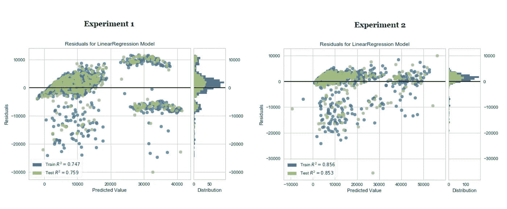**

**线性回归模型的残差图**

**机器学习是一个迭代的过程。迭代的次数和其中使用的技术取决于任务的关键程度，以及预测错误时的影响。在医院的 ICU 中实时预测患者结果的机器学习模型的严重性和影响远远超过为预测客户流失而建立的模型。**

**在本教程中，我们只执行了两次迭代，第二次实验中的线性回归模型将用于部署。然而，在这个阶段，模型仍然只是笔记本/ IDE 中的一个对象。要将其保存为可以传输到其他应用程序并由其他应用程序使用的文件，请执行以下代码:**

```
**# save transformation pipeline and model 
**save_model**(lr, model_name = 'deployment_28042020')**
```

**当您在 PyCaret 中保存一个模型时，基于在 **setup()** 函数中定义的配置的整个转换管道被创建。所有的相互依赖都是自动编排的。查看存储在“deployment_28042020”变量中的管道和模型:**

****

**使用 PyCaret 创建的管道**

**我们已经完成了培训和模型选择。最终的机器学习管道和线性回归模型现在保存为 pickle 文件(deployment_28042020.pkl ),该文件将在 web 应用程序中用于生成对新数据点的预测。**

# **👉任务 2 —构建前端 web 应用程序**

**现在，我们的机器学习管道和模型已经准备好开始构建一个前端 web 应用程序，它可以在新的数据点上生成预测。该应用程序将通过 csv 文件上传支持“在线”以及“批量”预测。让我们将应用程序代码分成三个主要部分:**

# **页眉/布局**

**该部分导入库，加载训练模型，并创建一个基本布局，顶部有一个徽标，一个 jpg 图像，边栏上有一个下拉菜单，用于在“在线”和“批量”预测之间切换。**

**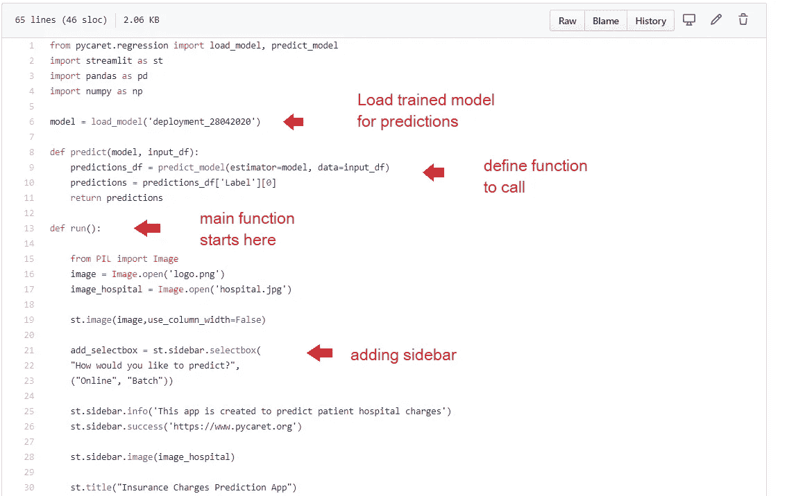**

**app.py —代码片段第 1 部分**

# **在线预测**

**本节处理初始 app 功能，在线逐一预测。我们使用 streamlit 小部件，如*数字输入、文本输入、下拉菜单和复选框*来收集用于训练模型的数据点，如年龄、性别、身体质量指数、儿童、吸烟者、地区。**

**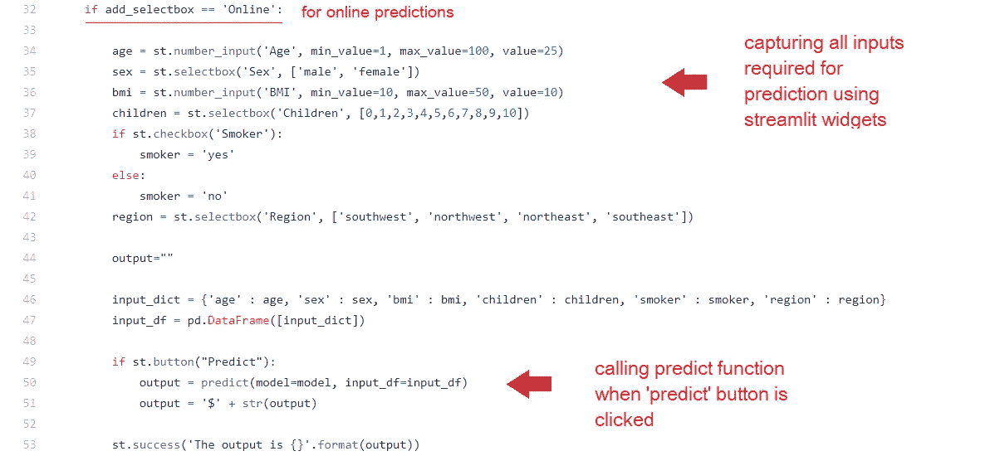**

**app.py —代码片段第 2 部分**

# **批量预测**

**批量预测是该应用的第二层功能。streamlit 中的 **file_uploader** 小部件用于上传 csv 文件，然后从 PyCaret 调用原生的 **predict_model()** 函数来生成预测，使用 streamlit 的 write()函数显示这些预测。**

****

**app.py —代码片段第 3 部分**

**如果您还记得上面的任务 1，我们最终确定了一个线性回归模型，该模型根据从 6 个原始特征中提取的 62 个特征进行了训练。web 应用程序的前端有一个输入表单，只收集六个特征，即年龄、性别、bmi、儿童、吸烟者、地区。**

**我们如何将新数据点的这 6 个特征转换成用于训练模型的 62 个特征？我们不需要担心这一部分，因为 PyCaret 通过编排转换管道自动处理这一部分。当您在使用 PyCaret 定型的模型上调用 predict 函数时，在从定型模型生成预测之前，会自动(按顺序)应用所有转换。**

**在 Heroku 上发布应用程序之前的最后一步是在本地测试 web 应用程序。打开 Anaconda 提示符，导航到您的项目文件夹并执行以下代码:**

```
****streamlit** run app.py**
```

****

**简化应用测试—在线预测**

**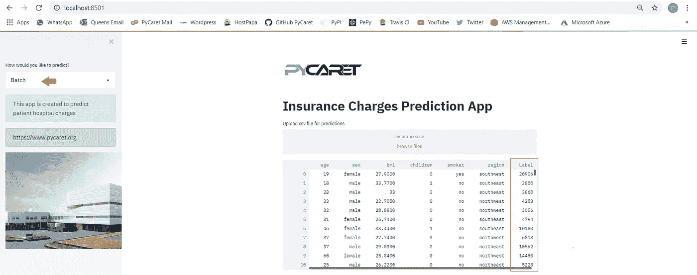**

**简化应用测试—批量预测**

**现在我们有了一个全功能的 web 应用程序，我们可以开始在 Google Kubernetes 引擎上封装和部署应用程序了。**

# **👉任务 3 —创建 Dockerfile 文件**

**为了将我们的应用程序进行容器化部署，我们需要一个 docker 映像，它在运行时成为一个容器。使用 docker 文件创建 docker 映像。Dockerfile 只是一个包含一组指令的文件。该项目的 docker 文件如下所示:**

**Dockerfile 文件**

**这个 Dockerfile 文件的最后一部分(从第 23 行开始)是特定于 Streamlit 的，通常不需要。Dockerfile 区分大小写，必须与其他项目文件位于项目文件夹中。**

# **👉任务 4 —在 GKE 部署洗钱渠道:**

**如果你想继续，你必须从 GitHub 中派生出这个[库](https://github.com/pycaret/pycaret-streamlit-google)。**

**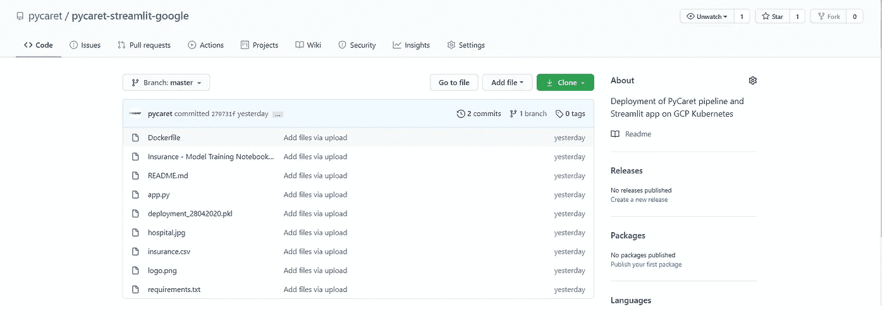**

**[https://github.com/pycaret/pycaret-streamlit-google](https://github.com/pycaret/pycaret-streamlit-google)**

**按照以下简单的 10 个步骤在 GKE 集群上部署应用程序。**

## **步骤 1 —在 GCP 控制台中创建新项目**

**登录您的 GCP 控制台，然后转到“管理资源”**

**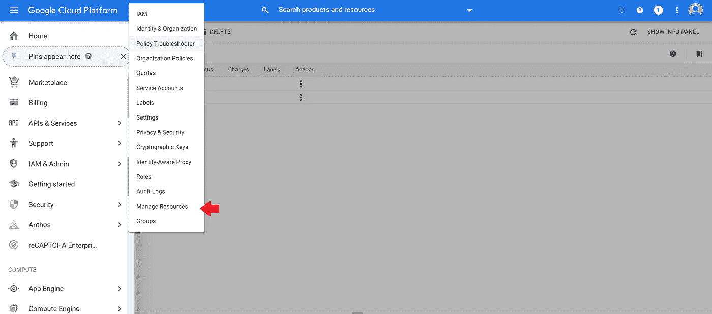**

**谷歌云平台控制台→管理资源**

**点击**创建新项目****

**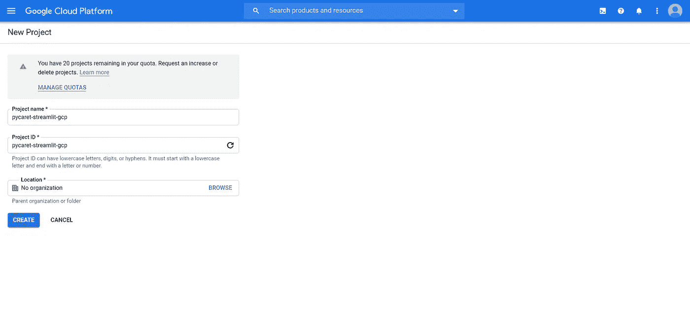**

**Google 云平台控制台→管理资源→创建新项目**

## **步骤 2 —导入项目代码**

**点击控制台窗口右上角的**激活云壳**按钮，打开云壳。**

**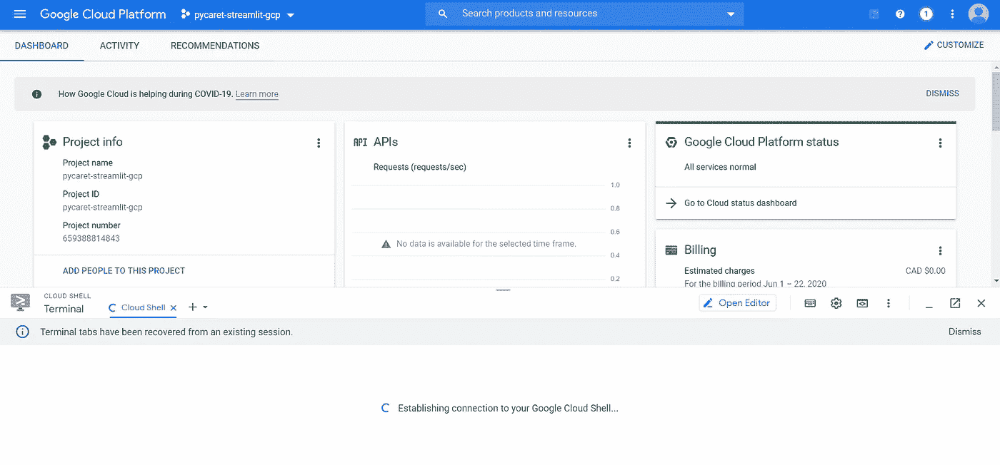**

**谷歌云平台(项目信息页面)**

**在 Cloud Shell 中执行以下代码来克隆本教程中使用的 GitHub 存储库。**

```
**git clone [https://github.com/pycaret/pycaret-streamlit-google.git](https://github.com/pycaret/pycaret-streamlit-google.git)**
```

## **步骤 3-设置项目 ID 环境变量**

**执行以下代码来设置 PROJECT_ID 环境变量。**

```
**export PROJECT_ID=**pycaret-streamlit-gcp****
```

**pycaret-streamlit-gcp 是我们在上面的步骤 1 中选择的项目的名称。**

## **步骤 4 —构建 docker 映像**

**通过执行以下代码，构建应用程序的 docker 映像并标记它以便上传:**

```
**docker build -t gcr.io/${PROJECT_ID}/insurance-streamlit:v1 .**
```

**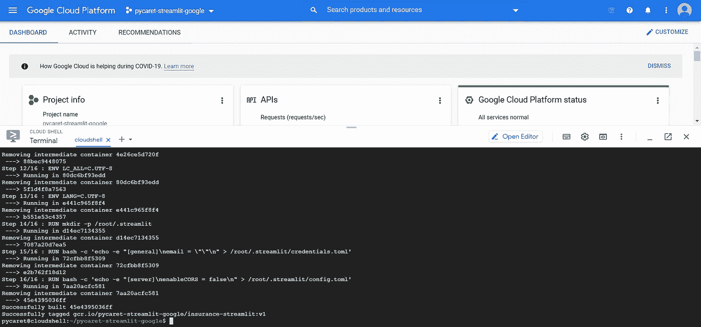**

**docker 构建成功时返回的消息**

**您可以通过运行以下代码来检查可用的图像:**

```
****docker** images**
```

## **步骤 5 —上传容器图像**

1.  **认证到[容器注册表](https://cloud.google.com/container-registry)(您只需要运行一次):**

```
**gcloud auth configure-docker**
```

**2.执行以下代码将 docker 图像上传到 Google 容器注册表:**

```
**docker push gcr.io/${PROJECT_ID}/insurance-streamlit:v1**
```

## **步骤 6 —创建集群**

**现在容器已经上传，您需要一个集群来运行容器。一个集群由一个运行 Kubernetes 的计算引擎 VM 实例池组成。**

1.  **为 gcloud 工具设置项目 ID 和计算引擎区域选项:**

```
**gcloud config set project $PROJECT_ID 
gcloud config set compute/zone **us-central1****
```

**2.通过执行以下代码创建一个集群:**

```
**gcloud container clusters create **streamlit-cluster** --num-nodes=2**
```

**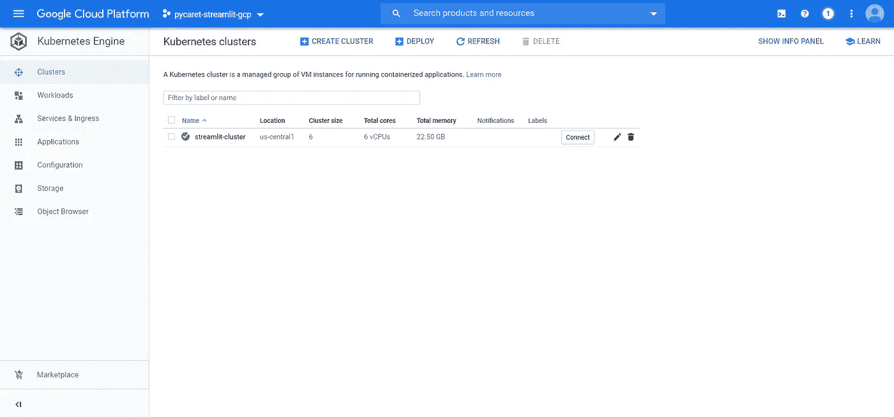**

**谷歌云平台→ Kubernetes 引擎→集群**

## **步骤 7 —部署应用程序**

**要在 GKE 集群上部署和管理应用程序，您必须与 Kubernetes 集群管理系统通信。执行以下命令来部署应用程序:**

```
**kubectl create deployment insurance-streamlit --image=gcr.io/${PROJECT_ID}/insurance-streamlit:v1**
```

## **步骤 8 —将您的应用程序公开到互联网上**

**默认情况下，您在 GKE 上运行的容器不能从互联网上访问，因为它们没有外部 IP 地址。执行以下代码，将应用程序公开给 internet:**

```
**kubectl expose deployment insurance-streamlit --type=LoadBalancer --port 80 --target-port **8501****
```

## **步骤 9 —检查服务**

**执行下面的代码来获取服务的状态。 **EXTERNAL-IP** 是您可以在浏览器中查看已发布应用的网址。**

```
**kubectl get service**
```

## **第 10 步—在网址上查看应用程序的运行情况**

**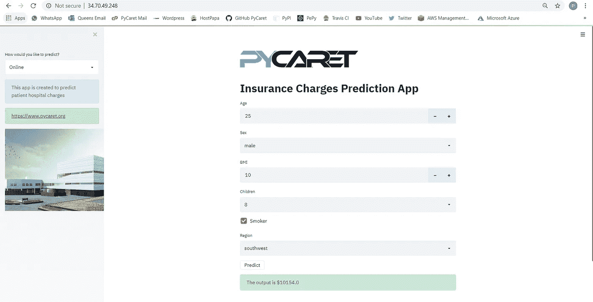**

**发布于[https://34.70.49.248](https://34.70.49.248)的应用程序—第 1 页**

**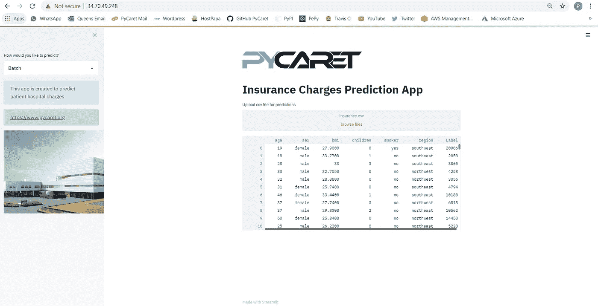**

**发布于[https://34.70.49.248](https://34.70.49.248)的应用程序—第 2 页**

****注意:**在这篇文章发表时，该应用程序将从公共地址中删除，以限制资源消耗。**

**[链接到本教程的 GitHub 库](https://github.com/pycaret/pycaret-streamlit-google)**

**[微软 Azure 部署 GitHub 知识库链接](https://www.github.com/pycaret/pycaret-azure-deployment)**

**[链接到 Heroku 部署的 GitHub 库](https://www.github.com/pycaret/deployment-heroku)**

# **PyCaret 2.0.0 来了！**

**我们收到了来自社区的大力支持和反馈。我们正在积极改进 PyCaret，并准备我们的下一个版本。 **PyCaret 2.0.0 会更大更好**。如果您想分享您的反馈并帮助我们进一步改进，您可以[在网站上填写此表格](https://www.pycaret.org/feedback)或者在我们的 [GitHub](https://www.github.com/pycaret/) 或 [LinkedIn](https://www.linkedin.com/company/pycaret/) 页面上发表评论。**

**关注我们的 [LinkedIn](https://www.linkedin.com/company/pycaret/) 并订阅我们的 [YouTube](https://www.youtube.com/channel/UCxA1YTYJ9BEeo50lxyI_B3g) 频道，了解更多关于 PyCaret 的信息。**

# **想了解某个特定模块？**

**从第一个版本 1.0.0 开始，PyCaret 有以下模块可供使用。点击下面的链接，查看 Python 中的文档和工作示例。**

**[分类](https://www.pycaret.org/classification)
[回归](https://www.pycaret.org/regression) [聚类](https://www.pycaret.org/clustering)
异常检测
[自然语言处理](https://www.pycaret.org/nlp)
[关联规则挖掘](https://www.pycaret.org/association-rules)**

# **另请参见:**

**笔记本中的 PyCaret 入门教程:**

**[分类](https://www.pycaret.org/clf101)
回归 聚类
[异常检测](https://www.pycaret.org/anom101)
[自然语言处理](https://www.pycaret.org/nlp101)
[关联规则挖掘](https://www.pycaret.org/arul101)**

# **你愿意投稿吗？**

**PyCaret 是一个开源项目。欢迎每个人都来投稿。如果您愿意投稿，请随意处理[未决问题](https://github.com/pycaret/pycaret/issues)。dev-1.0.1 分支上的单元测试接受拉请求。**

**如果你喜欢 PyCaret，请给我们 GitHub 回购的⭐️。**

**中:【https://medium.com/@moez_62905/ **

**领英:[https://www.linkedin.com/in/profile-moez/](https://www.linkedin.com/in/profile-moez/)**

**推特:[https://twitter.com/moezpycaretorg1](https://twitter.com/moezpycaretorg1)**