# 使用 Streamlit 和 Polyaxon 将机器学习应用程序部署到 Kubernetes

> 原文：<https://towardsdatascience.com/deploy-machine-learning-applications-to-kubernetes-using-streamlit-and-polyaxon-49bf4b963515?source=collection_archive---------31----------------------->

## 使用 [Polyaxon](http://github.com/polyaxon/polyaxon) 在 [Azure Kubernetes(AKS)](https://docs.microsoft.com/en-us/azure-stack/user/azure-stack-kubernetes-aks-engine-overview) 上训练、分析和部署容器化 [Streamlit](https://www.streamlit.io/) 机器学习应用的分步指南。

# 本指南的学习目标

*   集装箱、 [Kubernetes](https://kubernetes.io/) 、 [Streamlit](https://www.streamlit.io/) 和 [Polyaxon](https://github.com/polyaxon/polyaxon) 简介。
*   创建一个 Kubernetes 集群并使用[舵](https://helm.sh/docs/intro/install/)部署 [Polyaxon](https://github.com/polyaxon/polyaxon) 。
*   如何在 Kubernetes 集群上运行的 [Jupyter 笔记本](https://jupyter.org/)上探索数据集。
*   如何在 Kubernetes 上使用 [Polyaxon](https://github.com/polyaxon/polyaxon) 训练一个机器学习模型的多个版本。
*   如何保存一个机器学习模型？
*   如何使用 [Polyaxon](https://github.com/polyaxon/polyaxon) UI 分析模型？
*   如何使用 [Streamlit](http://www.streamlit.io) 通过用户界面展示模型并进行新的预测。

# 本指南所需的工具

## 什么是容器？

容器是一个标准的软件单元，它将代码及其所有依赖项打包，以便应用程序能够快速可靠地从一个计算环境运行到另一个计算环境。 [Docker](https://www.docker.com/) 是一个工具，旨在通过使用容器来更容易地创建、部署和运行应用程序。

在我们的指南中，我们将使用容器来打包我们的代码和依赖项，并轻松地将它们部署在 Kubernetes 上。

## **什么是 Kubernetes？**

Kubernetes 是一个强大的开源分布式系统，用于管理容器化的应用程序。简而言之，Kubernetes 是一个在机器集群上运行和编排容器化应用的系统。这是一个旨在完全管理容器化应用程序生命周期的平台。

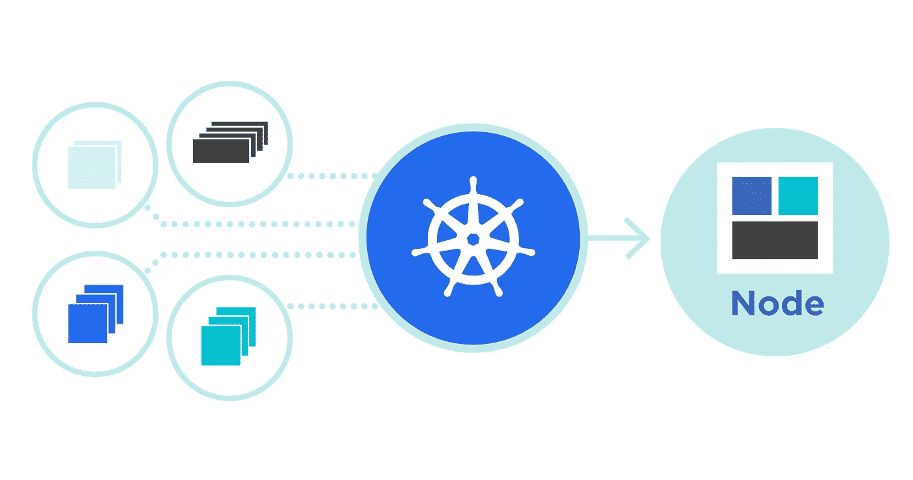

[Kubernetes](https://kubernetes.io/)

**我为什么要用 Kubernetes？**

*   ***负载平衡* :** 自动在集装箱之间分配负载。
*   **缩放:**当需求变化时，如高峰时间、周末和节假日，通过添加或移除容器来自动放大或缩小。
*   **存储:**保持存储与应用程序的多个实例一致。
*   **自我修复**自动重启失败的容器，并杀死不响应用户定义的健康检查的容器。
*   **自动化部署**您可以自动化 Kubernetes 为您的部署创建新的容器，删除现有的容器，并将它们的所有资源应用到新的容器中。

## 什么是 Streamlit？

Streamlit 是一个开源框架，用来创建一个交互式的、漂亮的可视化应用。全部用 python！

Streamlit 提供了许多有用的特性，对数据驱动项目的可视化非常有帮助。

**使用 Streamlit 的 Face-GAN 浏览器示例**

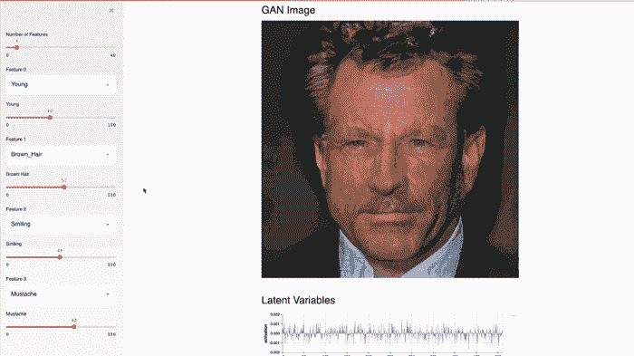

这个 Streamlit 应用程序使用[邵伯关的 TL-GAN](https://blog.insightdatascience.com/generating-custom-photo-realistic-faces-using-ai-d170b1b59255) 演示了 [NVIDIA 名人脸 GAN](https://research.nvidia.com/publication/2017-10_Progressive-Growing-of) 模型。

为什么我应该使用 Streamlit？

*   创建交互式用户界面的简单易行的方法
*   不需要开发经验
*   在数据驱动的项目中使用不同的功能很有趣:)
*   全面的文档

## 什么是 Polyaxon？

[Polyaxon](https://github.com/polyaxon/polyaxon) 是一个开源的云本机机器学习平台，它提供了简单的接口来训练、监控和管理模型。

Polyaxon 运行在 Kubernetes 之上，允许扩展和缩减集群的资源，并提供工具来自动化实验过程，同时跟踪关于模型、配置、参数和代码的信息。

**我为什么要用 Polyaxon？**

*   自动跟踪关键模型度量、超参数、可视化、工件和资源，以及版本控制代码和数据。
*   通过 CLI、dashboard、SDK 或 REST API 调度作业和实验，最大限度地提高集群的利用率。
*   使用优化算法有效地运行并行实验，并找到最佳模型。
*   可视化、搜索和比较实验结果、超参数、训练数据和源代码版本，以便您可以快速分析哪些有效，哪些无效。
*   持续开发、验证、交付和监控模型，以创造竞争优势。
*   根据需要扩展您的资源，并在任何平台(AWS、Microsoft Azure、Google 云平台和本地硬件)上运行作业和实验。

## 什么是头盔？

[Helm](https://helm.sh/docs/) 是 Kubernetes 的包管理器，它允许我们部署和管理像 Polyaxon 这样的云原生项目的生命周期。

## 蓝色库伯内特服务

在本教程中，我们将使用 [Azure Kubernetes 服务(AKS)](https://azure.microsoft.com/en-us/services/kubernetes-service/) ，这是 Azure 上的一个完全托管的 Kubernetes 服务。如果您没有 Azure 帐户，您可以在此注册一个免费帐户[。](https://azure.microsoft.com/en-us/free/)

在以后的帖子中，我们将提供在**谷歌云平台** (GKE) **、** **AWS** (EKS)和一个带有 **Minikube** 的**本地集群**上运行本指南的类似说明。

# 设置工作空间

本教程的目的是获得在 Kubernetes 上运行机器学习实验和部署的实践经验。让我们从创建工作空间开始。

## 步骤 1 —使用 AKS 部署 Kubernetes 集群

让我们在 AKS 上创建一个简单的 [Kubernetes 集群，它只有一个节点:](https://docs.microsoft.com/en-us/azure-stack/user/azure-stack-kubernetes-aks-engine-deploy-cluster?view=azs-2005)

```
az aks create --resource-group myResourceGroup --name streamlit-polyaxon --node-count 1 --enable-addons monitoring --generate-ssh-keys
```

要确保您在正确的集群上，您可以执行以下命令

```
az aks get-credentials --resource-group myResourceGroup --name streamlit-polyaxon
```

## 步骤 2 —安装头盔

在您的本地机器上安装 [Helm](https://helm.sh/docs/intro/install/) 以便能够管理 Polyaxon 以及您可能想要在 Kubernetes 上运行的其他云原生项目。

```
curl -fsSL -o get_helm.sh [https://raw.githubusercontent.com/helm/helm/master/scripts/get-helm-3](https://raw.githubusercontent.com/helm/helm/master/scripts/get-helm-3)chmod 700 get_helm.sh./get_helm.sh
```

## 第 3 步-添加多轴图表到头盔

```
helm repo add polyaxon https://charts.polyaxon.com
```

## 步骤 4—安装 Polyaxon CLI

```
pip install -U polyaxon
```

## 步骤 5—将 Polyaxon 部署到 Kubernetes

```
polyaxon admin deploy
```

## 步骤 6—等待部署进入就绪状态

```
kubectl get deployment -n polyaxon -w
```

这大约需要 3 分钟:

```
NAME                         READY   UP-TO-DATE   AVAILABLE   AGE
polyaxon-polyaxon-api        1/1     1            1           3m17s
polyaxon-polyaxon-gateway    1/1     1            1           3m17s
polyaxon-polyaxon-operator   1/1     1            1           3m17s
polyaxon-polyaxon-streams    1/1     1            1           3m17s
```

## 步骤 7-公开 Polyaxon API 和 UI

Polyaxon 提供了一个简单的命令，以安全的方式在本地主机上公开仪表板和 API:

```
polyaxon port-forward
```

## 步骤 8-在 Polyaxon 上创建一个项目

在不同于用于显示仪表板的终端会话中，运行:

```
polyaxon project create --name=streamlit-app
```

您应该看到:

```
Project `streamlit-app` was created successfully.
You can view this project on Polyaxon UI: [http://localhost:8000/ui/root/streamlit-app/](http://localhost:8000/ui/root/streamlit-app/)
```

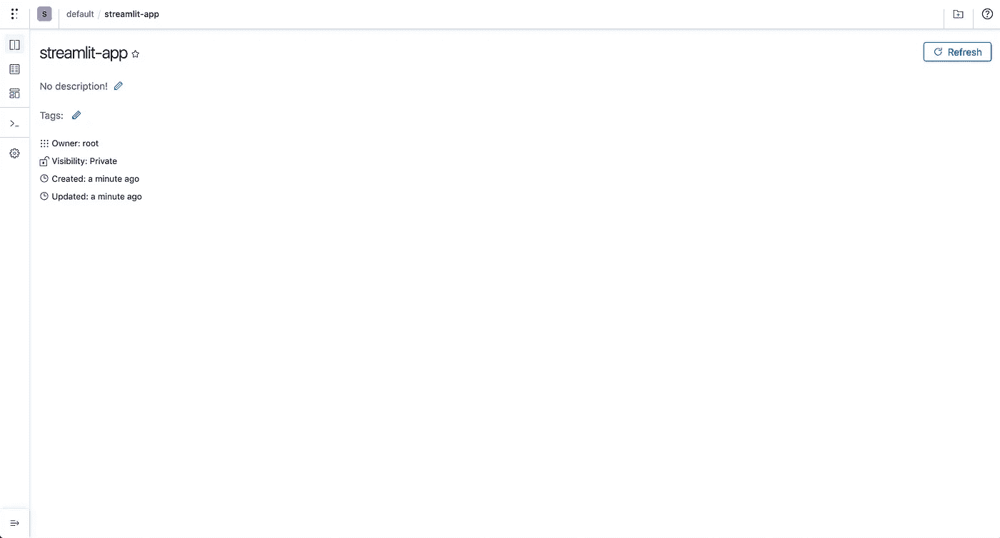

Polyaxon 的 Streamlit 项目

现在我们可以进入下一部分:训练和分析模型。

# 训练机器学习模型

在本教程中，我们将训练一个模型来根据其特征对鸢尾花进行分类。

虹膜特征:萼片，花瓣，长度和宽度

## 探索数据集

我们将首先在 Kubernetes 集群上运行的笔记本会话中探索 iris 数据集。

让我们启动一个新的笔记本会话，并等待它进入运行状态:

```
polyaxon run --hub jupyterlab -w
```

Polyaxon 提供了一系列高效的组件，称为 hub，并允许使用一个命令启动一个笔记本会话。在后台，Polyaxon 将创建一个 Kubernetes 部署和一个 headless 服务，并将使用 Polyaxon 的 API 公开该服务。更多细节请查看 Polyaxon 的[开源中心](https://github.com/polyaxon/polyaxon-hub)。

几秒钟后，笔记本电脑将开始运行。

> 注意:如果您停止了上一个命令，您总是可以通过执行以下命令来获取上一个(缓存的)正在运行的操作:
> 
> polyaxon 运营服务

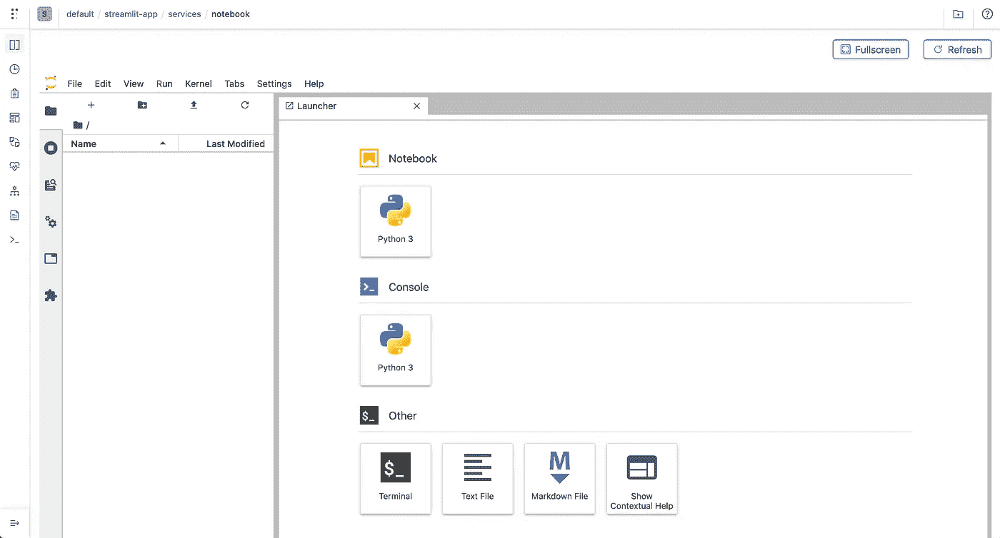

运行在 Polyaxon 上的 Jupyter 实验室

让我们创建一个新笔记本，并从检查数据集的功能开始:

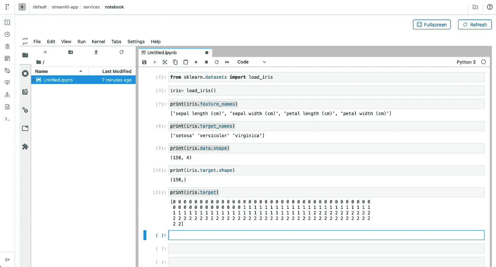

探索数据集

执行的命令:

```
from sklearn.datasets import load_irisiris= load_iris()print(iris.feature_names)
print(iris.target_names)
print(iris.data.shape)
print(iris.target.shape)
print(iris.target)
```

数据集是关于鸢尾花的种类:

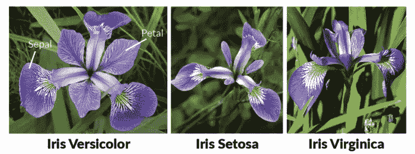

鸢尾花数据集

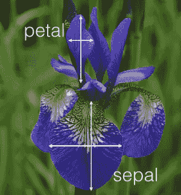

鸢尾花属性

## 探索模型

scikit-learn 提供了不同类别的算法，在本教程的范围内，我们将使用 [**最近邻**](https://scikit-learn.org/stable/modules/neighbors.html) **s** 算法。

在我们创建一个健壮的脚本之前，我们将在笔记本会议中尝试一个简单的模型:

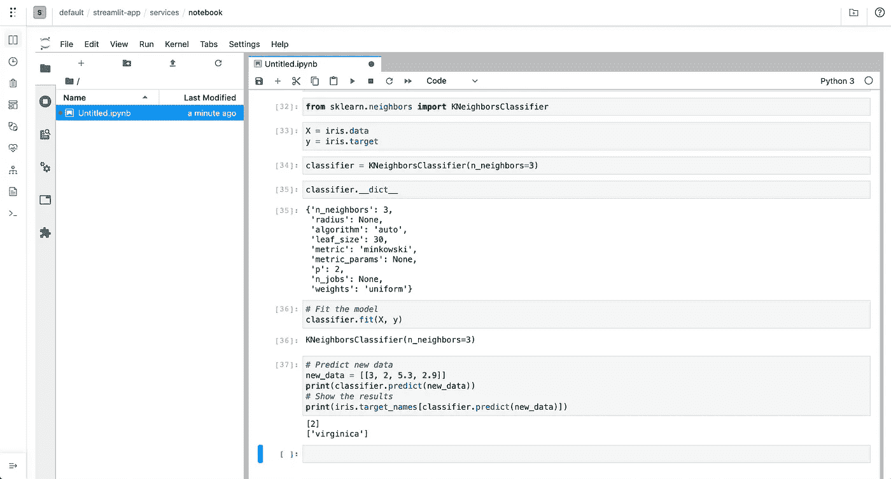

探索模型

执行的命令:

```
from sklearn.neighbors import KNeighborsClassifierX = iris.data
y = iris.targetclassifier = KNeighborsClassifier(n_neighbors=3)# Fit the model
classifier.fit(X, y)# Predict new data
new_data = [[3, 2, 5.3, 2.9]]
print(classifier.predict(new_data))
# Show the results
print(iris.target_names[classifier.predict(new_data)])
```

在这种情况下，我们使用`n_neighbors=3`和完整的数据集来训练模型。

为了探索我们的模型的不同变体，我们需要为我们的模型制作一个脚本，并对输入和输出进行参数化，以方便地更改参数，如`n_neighbors`。我们还需要建立一些估计模型的**性能的严格方法。**

一种实用的方法是创建一个评估程序，在该程序中，我们将数据集分成**训练和测试**。我们在训练集上训练模型，并在测试集上评估它。

scikit-learn 提供了分割数据集的方法:

```
from sklearn.model_selection import train_test_splitX_train, X_test, y_train, y_test = train_test_split(X, y, test_size=0.3, random_state=1012)
```

## 生产模型训练

现在我们已经建立了一些实践，让我们创建一个接受参数、训练模型并保存结果分数的函数:

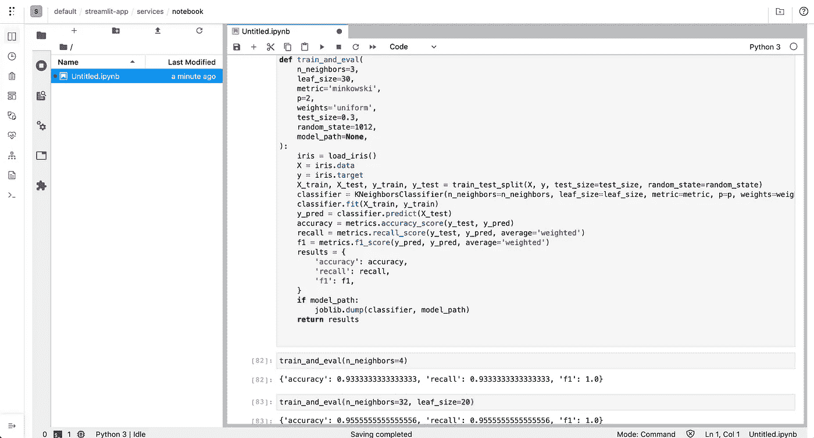

生产就绪模型

执行的命令:

```
from sklearn.model_selection import train_test_split
from sklearn.neighbors import KNeighborsClassifier
from sklearn import metrics
from sklearn.datasets import load_iristry:
    from sklearn.externals import joblib
except:
    passdef train_and_eval(
    n_neighbors=3,
    leaf_size=30,
    metric='minkowski',
    p=2,
    weights='uniform',
    test_size=0.3,
    random_state=1012,
    model_path=None,
):
    iris = load_iris()
    X = iris.data
    y = iris.target
    X_train, X_test, y_train, y_test = train_test_split(X, y, test_size=test_size, random_state=random_state)
    classifier = KNeighborsClassifier(n_neighbors=n_neighbors, leaf_size=leaf_size, metric=metric, p=p, weights=weights)
    classifier.fit(X_train, y_train)
    y_pred = classifier.predict(X_test)
    accuracy = metrics.accuracy_score(y_test, y_pred)
    recall = metrics.recall_score(y_test, y_pred, average='weighted')
    f1 = metrics.f1_score(y_pred, y_pred, average='weighted')
    results = {
        'accuracy': accuracy,
        'recall': recall,
        'f1': f1,
    }
    if model_path:
        joblib.dump(classifier, model_path)
    return results
```

现在我们有了一个脚本，它接受参数来评估基于不同输入的模型，保存模型并返回结果，但这仍然是非常手动的，对于更大和更复杂的模型来说，这是非常不切实际的。

## 用 Polyaxon 进行实验

我们将创建一个脚本并使用 Polyaxon 运行模型，而不是通过手动更改笔记本中的值来运行模型。我们还将使用 [Polyaxon 的跟踪模块](https://polyaxon.com/docs/experimentation/tracking/)记录结果指标和模型。

我们将要训练的模型的代码可以在这个 [github repo](https://github.com/polyaxon/polyaxon-examples/tree/master/in_cluster/sklearn/iris) 中找到。

使用默认参数运行示例:

```
polyaxon run --url=[https://raw.githubusercontent.com/polyaxon/polyaxon-examples/master/in_cluster/sklearn/iris/polyaxonfile.yml](https://raw.githubusercontent.com/polyaxon/polyaxon-examples/master/in_cluster/sklearn/iris/polyaxonfile.yml) -l
```

使用不同的参数运行:

```
polyaxon run --url=[https://raw.githubusercontent.com/polyaxon/polyaxon-examples/master/in_cluster/sklearn/iris/polyaxonfile.yml](https://raw.githubusercontent.com/polyaxon/polyaxon-examples/master/in_cluster/sklearn/iris/polyaxonfile.yml) -l -P n_neighbors=50
```

## 安排多个平行实验

我们不会手动更改参数，而是通过探索一系列配置来自动完成这一过程:

```
polyaxon run --url=[https://raw.githubusercontent.com/polyaxon/polyaxon-examples/master/in_cluster/sklearn/iris/hyper-polyaxonfile.yml](https://raw.githubusercontent.com/polyaxon/polyaxon-examples/master/in_cluster/sklearn/iris/hyper-polyaxonfile.yml) --eager
```

您将看到 CLI 创建了几个并行运行的实验:

```
Starting eager mode...
Creating 15 operations
A new run `b6cdaaee8ce74e25bc057e23196b24e6` was created
...
```

## 分析实验

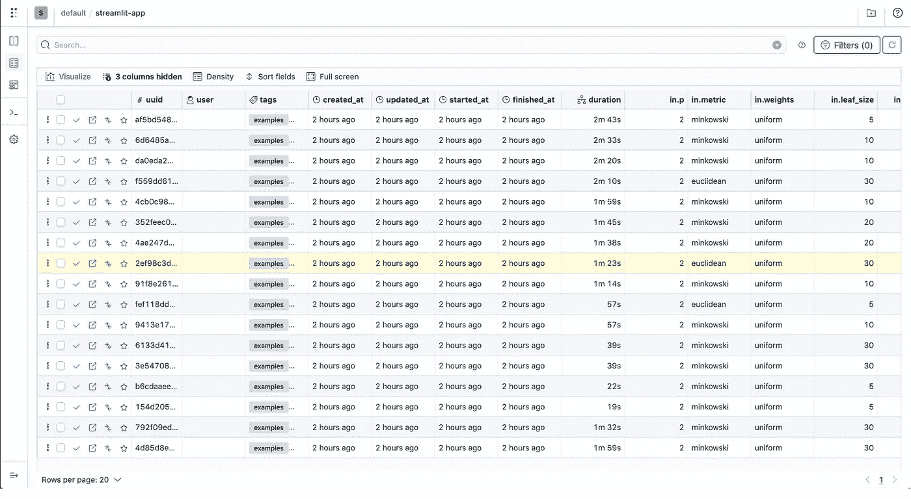

在 Polyaxon 上并行运行多个实验

根据实验的准确度对实验进行分类

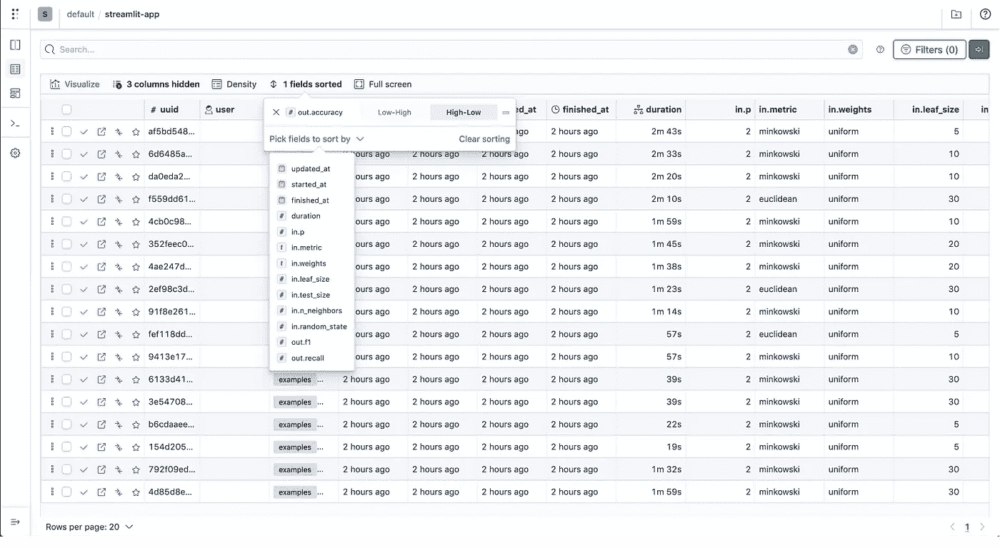

分类实验

比较`accuracy`和`n_neighbors`

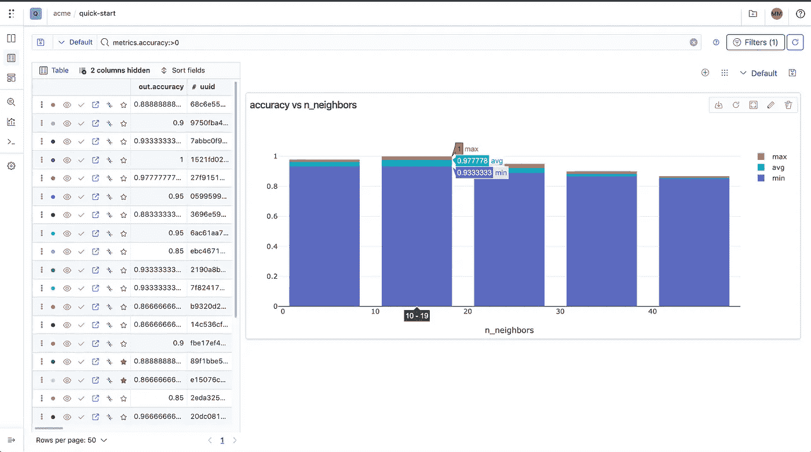

可视化精度和 n 个邻居

## 通过准确性选择最佳模型

在我们的脚本中，我们使用 Polyaxon 在每次运行实验时记录一个模型:

```
# Logging the model
tracking.log_model(model_path, name="iris-model", framework="scikit-learn")
```

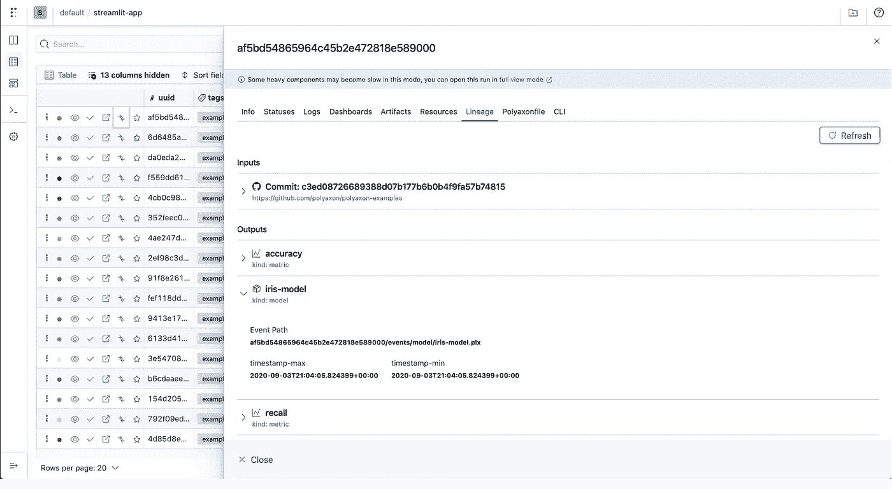

模型谱系

## 将模型部署为虹膜分类应用程序

我们将部署一个简单的 streamlit 应用程序，它将加载我们的模型并显示一个应用程序，该应用程序根据特征进行预测，并显示与 flower 类对应的图像。

```
import streamlit as st
import pandas as pd
import joblib
import argparse

from PIL import Image

def load_model(model_path: str):
    model = open(model_path, "rb")
    return joblib.load(model)

if __name__ == '__main__':
    parser = argparse.ArgumentParser()
    parser.add_argument(
        '--model-path',
        type=str,
    )
    args = parser.parse_args()

    setosa = Image.open("images/iris-setosa.png")
    versicolor = Image.open("images/iris-versicolor.png")
    virginica = Image.open("images/iris-virginica.png")
    classifier = load_model(args.model_path)
    print(classifier)

    st.title("Iris flower species Classification")
    st.sidebar.title("Features")
    parameter_list = [
        "Sepal length (cm)",
        "Sepal Width (cm)",
        "Petal length (cm)",
        "Petal Width (cm)"
    ]
    sliders = []
    for parameter, parameter_df in zip(parameter_list, ['5.2', '3.2', '4.2', '1.2']):
        values = st.sidebar.slider(
            label=parameter,
            key=parameter,
            value=float(parameter_df),
            min_value=0.0,
            max_value=8.0,
            step=0.1
        )
        sliders.append(values)

    input_variables = pd.DataFrame([sliders], columns=parameter_list)

    prediction = classifier.predict(input_variables)
    if prediction == 0:

    elif prediction == 1:
        st.image(versicolor)
    else:
        st.image(virginica)
```

让我们用 Polyaxon 来安排应用程序

```
polyaxon run --url=[https://raw.githubusercontent.com/polyaxon/polyaxon-examples/master/in_cluster/sklearn/iris/streamlit-polyaxonfile.yml](https://raw.githubusercontent.com/polyaxon/polyaxon-examples/master/in_cluster/sklearn/iris/streamlit-polyaxonfile.yml) -P uuid=86ffaea976c647fba813fca9153781ff
```

注意，在您的用例中，uuid `86ffaea976c647fba813fca9153781ff`会有所不同。

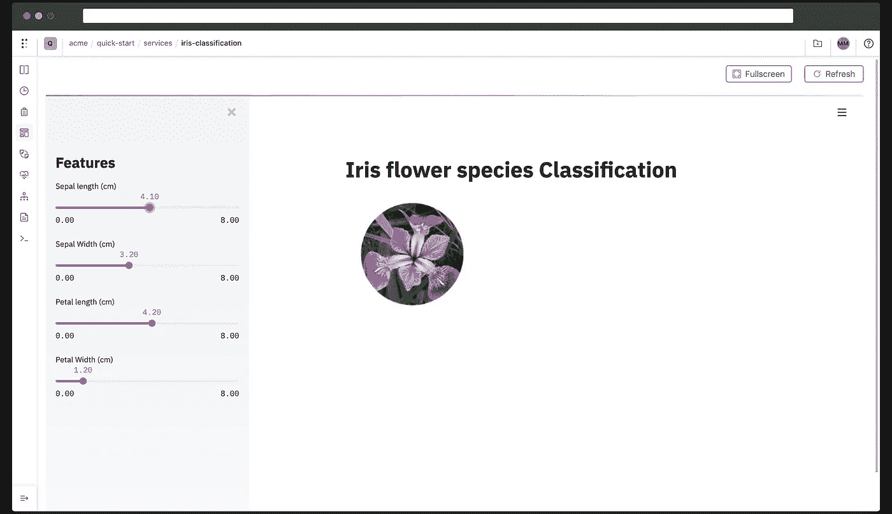

在 Polyaxon 上运行的 Streamlit 分类应用程序

# 结论

在本教程中，我们经历了使用 Kubernetes、Streamlit 和 Polyaxon 训练和部署简单分类应用程序的端到端过程。

你可以在这个 [repo](https://github.com/polyaxon/polyaxon-examples/tree/master/in_cluster/sklearn/iris) 里找到这个教程的源代码。