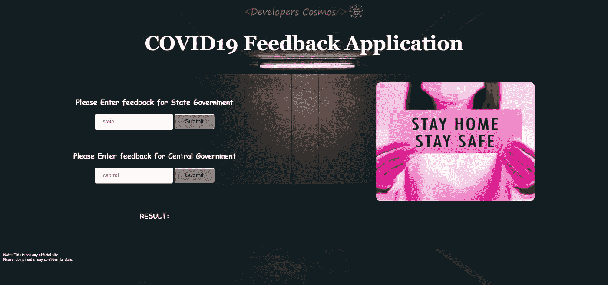
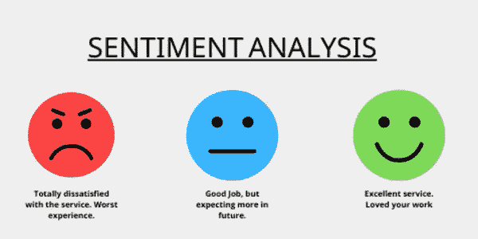
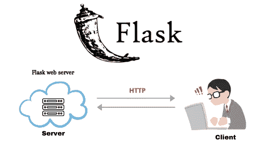
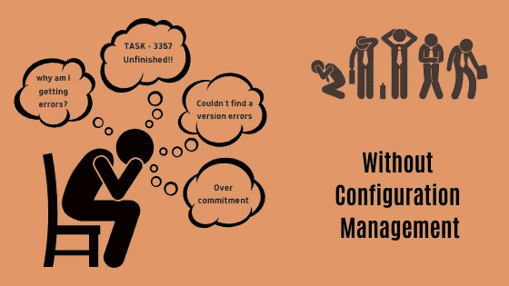
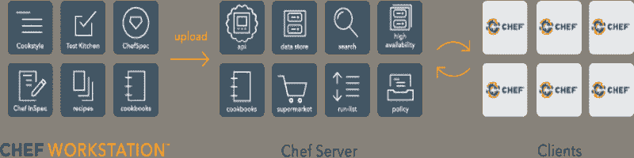
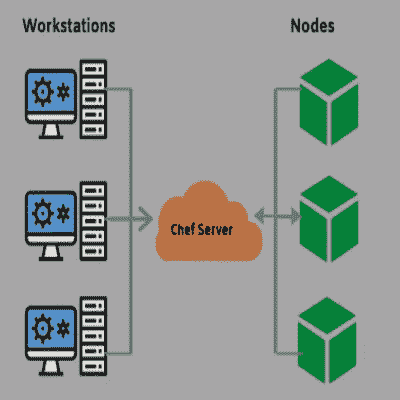
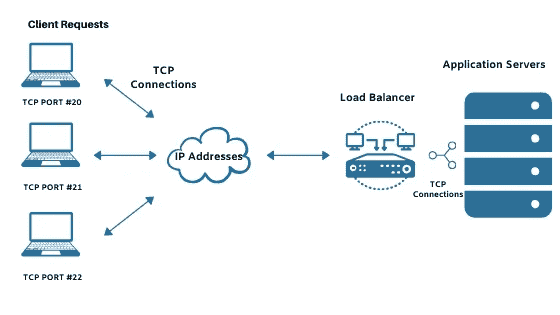

# 使用 Chef 部署机器学习应用程序

> 原文：<https://towardsdatascience.com/deploy-machine-learning-applications-using-chef-826a0e894649?source=collection_archive---------62----------------------->

## 机器学习

## 使用配置管理工具 Chef 部署模型概述

作为一名数据科学家，您可能遇到过依赖性问题、对环境不熟悉，或者如何使用 TensorFlow 等工具配置基础架构和版本问题。当我试图在其他主机上运行一个经过训练的模型时，我遇到了同样的问题。然后，这个世界很友好地向我介绍了 Chef——一个为我们完成繁琐任务的配置管理工具。让我向你解释我们从基础开始使用的步骤和工具。那么为什么要等呢？我们开始吧！



COVID19 反馈申请主页(作者照片)

使用情绪分析开发了一个简单的应用程序，以了解人们对国家和中央政府在新冠肺炎事件后采取的措施有多满意。点击此处访问应用程序[。](https://feedbackcovid.herokuapp.com/)

## 背景

我使用了 Flask、VADER 情绪分析、谷歌计算引擎、Chef——一个配置管理工具&负载平衡器来完成这项任务。*你兴奋吗？趁还不算太晚，让我们深潜吧！*


这是开始的好时机。(使用 Canva 设计)

## 用于情感分析的机器学习模型

在这个项目中，我使用了 VADER 情绪分析器来检测对州和中央政府所采取的措施的满意度。VADER (Valence Aware 字典和情感推理器)是一个基于规则的情感分析工具，专门针对社交媒体中表达的情感，适用于不同领域的文本。



情感分析。(使用 Canva 设计)

## 网络服务器

web 服务器可以是软件应用程序，也可以是硬件，它在任务启动时负责后端活动。根据应用程序的不同，您可以使用不同类型的 web 服务器。对于这个应用程序，我使用了 Flask，这是一个用 Python 编写的微型 web 框架。下面的代码片段显示了我们如何从用户那里获取输入，并将它们呈现给我们的 flask 服务器。



Flask 服务器—客户端。(使用 Canva 设计)

我们将运行 **Flask 服务器**作为**服务**。服务通过在系统打开和关闭时自动允许程序启动和停止来帮助用户在后台运行某个程序。

现在，运行在 flask 服务器上的模型已经准备好了，让我们深入了解软件团队在生产环境中开发和部署大型应用程序时可能面临的错综复杂的问题。

## 演示没有配置管理的生活

如果没有配置管理，组织可能会面临各种挑战。让我们考虑一个软件开发者试图实现一个新的特性，并且在这个过程中安装了几个包或者软件并且成功地部署了一个代码。这位开发人员没有系统地安排依赖关系，并向他的团队成员承诺，他将在以后使用适当的文档来完成这项工作。


管理(使用 Canva 制作)

但赶时间的压力让他忘记了安排一切，让未来的队友更好地破译一切。他达到了他的目标，他的老板和队友暂时感到满意，他继续前进。另一个开发人员被指定完成项目的后续任务。新的开发者现在只能靠自己去理解一切，试图揭开那里到底发生了什么的神秘面纱。可能会发生这样的情况，他宁愿根本不碰服务器的配置，担心他可能会失去什么！



开发者的问题。(使用 Canva 设计)

上述情况正是配置管理帮助您避免的。作为开发人员，我们理解文档的重要性，不想让其他开发人员对发生的事情一无所知。相反，我们会赞成一个项目，为我们提供以下细节。

我们在运行什么服务？这些服务处于什么状态？
他们是如何走到现在的状态的？
变化的目的是什么？
*配置管理*帮助我们得到这些答案。


使用 Canva 制作

所以 SCM(软件配置管理)很神奇，懂！但是，我们如何做到这一点，并利用我们的优势所有功能呢？你看，这并不困难，我们有很多工具来实现 SCM，其中很少是 Ansible、Puppet、Juju、SaltStack 和 Chef。在我们的应用程序中，正在使用 Chef，所以让我们开始学习 Chef 的故事吧！

## 厨师

*   chef 是一家公司，是用 Ruby 和 Erlang 写的一个配置管理工具的名字。老实说，厨师这个名字和它的作用非常相关。厨师通常会写下食谱，拿走所有的配料，然后开始准备菜肴。类似地，在我们的软件配置管理工具——Chef 的情况下，也在做同样的事情，但是有不同的术语和结果。它由三个重要部分组成，即工作站、Chef 服务器和节点。



厨师 Infra。(来源— [Chefdoc](https://docs.chef.io/chef_overview/) )

*   还有一种称为 **chef-client** 的东西，它充当在 chef 管理下的每个节点(您很快就会理解这个术语)上本地运行的代理。当 chef-client 运行时，它将执行使节点进入预期状态所需的所有步骤。既然 chef-clients 已经在节点上设置好了，让我们开始理解这三个重要的片段是做什么的。

## 厨师—工作站

*   这是仓库，基站，后台，准备室，或者任何你想叫它的地方。我们应用程序的完整代码在这里开发和测试，然后使用 chef 命令工具(Chef 开发工具包)进行配置。chef-server 收到的所有请求都由工作站处理(批准/拒绝/修改)。
*   我们在工作站开发的东西被称为**配方**。因此，菜谱是一种管理“系统组件”(也称为资源)的方式，它通过安装包、运行程序以及在需要时创建、编辑或删除文件来实现。
*   在所有的下载和开发完成后，所有的代码和文件都按照期望的顺序排列，并存储在**食谱**中。
*   一旦烹饪书里的食谱准备好了，就使用工具**厨房**进行测试，看看是否一切就绪。一旦满意，我们使用 **Knife 将包含资源和食谱的食谱以及支持的组件上传到 Chef 服务器。**

## 主厨—服务员

Chef 服务器充当信息中心。Chef 为我们提供了自己的托管服务器，随时可供使用。Chef 服务器精确地连接了工作站和所有节点。我们从工作站接收食谱、食谱、策略和其他有用的组件，chef-server 会将我们的食谱分发到任何与其连接的受管**节点**。



主厨服务器。(使用 Canva 设计)

## Chef 节点

*   节点是由 Chef 管理的任何机器，它可以是物理、虚拟或云网络设备。如上所述，节点使用 chef-client 服务从 chef-server 获取并应用食谱，这个过程称为**聚合**。当一个节点聚合时，它与服务器同步，并且每当它被触发时，它将更新任何策略。为此，我们首先需要启动节点(创建虚拟机)。我使用谷歌云平台(GCP)的谷歌计算引擎在云中创建节点/虚拟机。节点也可以是任何公共计算机，而不仅仅是云。
*   为了在 chef 服务器和节点之间建立成功的通信，必须完成**引导**。要添加这些凭证和所有需求，我们只需使用以下单一命令引导该节点安装所有组件。

```
knife bootstrap FQDN -x user -P password — sudo -N nodename -r “recipe[cookbookname]”
```

## 负载平衡器

如果在同一个实例中传递了太多的请求，ML 模型可能需要相当长的时间才能给出输出。我们经常看到一条消息，上面写着“服务器忙”。为了避免这种情况，我们使用了负载平衡器。根据需要创建几个服务器，负载平衡器帮助将流量重定向到密度较低的服务器或节点。下面的图片将帮助你更好地描绘它。



负载平衡。(使用 Canva 设计)

作为一名数据科学家，您不必担心编写厨师代码。我已经创建了一个 Chef cookbook，它需要一个到您的应用程序的 GitHub 库的链接作为输入。使用在任何云服务上创建的节点的 FQDN 运行上面的命令。就是这样，您的应用程序将处于生产环境中！

完整的代码和食谱可以在这里找到。

## 结论

为了避免各种 ML 工具/包的版本问题，并花一些时间开发模型，维护一本 Chef cookbook 是一个好的实践。第一次可能会花一些时间，但是以后您可以将同一本书用于任何其他应用程序。希望我能给你一个清晰的关于 Chef 的概念，以及它在 ML 模型的成功部署中的作用。我会很快再见到你，为你带来更多关于不同技术的有趣解释！
如果您想联系，**在** [**LinkedIn**](https://www.linkedin.com/in/ritheesh-baradwaj-yellenki-8a6988173/) **上联系我。**