# 在 Google Kubernetes 引擎上部署机器学习管道

> 原文：<https://towardsdatascience.com/deploy-machine-learning-model-on-google-kubernetes-engine-94daac85108b?source=collection_archive---------7----------------------->

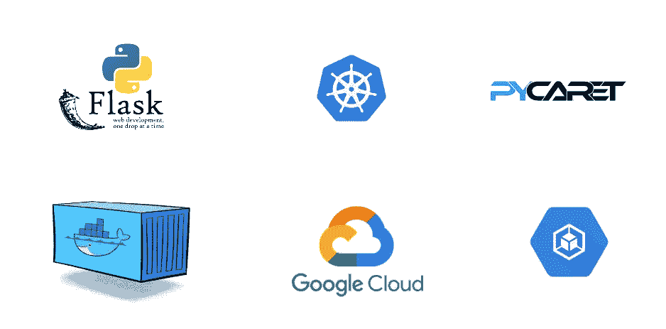

在 Google Kubernetes 引擎上封装和部署 ML 管道的循序渐进的初学者指南

# 概述

在我们关于在云中部署机器学习管道的[上一篇文章](/deploy-machine-learning-pipeline-on-cloud-using-docker-container-bec64458dc01)中，我们展示了如何用 PyCaret 开发机器学习管道，用 Docker 将其容器化，并作为使用 Microsoft Azure web App 服务的 Web 应用。如果你以前没有听说过 PyCaret，请阅读这个[公告](/announcing-pycaret-an-open-source-low-code-machine-learning-library-in-python-4a1f1aad8d46)以了解更多信息。

在本教程中，我们将使用我们之前构建和部署的相同的机器学习管道和 Flask 应用程序。这次我们将演示如何在 Google Kubernetes 引擎上封装和部署机器学习管道。

# 👉本教程的学习目标

*   了解什么是容器，什么是 Docker，什么是 Kubernetes，什么是 Google Kubernetes 引擎？
*   建立一个 Docker 图像，并上传到谷歌容器注册(GCR)。
*   使用 Flask app 作为 web 服务创建集群和部署机器学习管道。
*   看看一个使用训练有素的机器学习管道来实时预测新数据点的 web 应用程序。

之前我们展示了[如何在 Heroku PaaS 上部署 ML 管道](/build-and-deploy-your-first-machine-learning-web-app-e020db344a99)和[如何在 Azure Web 服务上使用 Docker 容器部署 ML 管道。](/deploy-machine-learning-pipeline-on-cloud-using-docker-container-bec64458dc01)

本教程将涵盖整个工作流程，从构建 docker 图像开始，将其上传到 Google Container Registry，然后将预训练的机器学习管道和 Flask 应用程序部署到 Google Kubernetes 引擎(GKE)上。

# 💻本教程的工具箱

# PyCaret

[PyCaret](https://www.pycaret.org/) 是 Python 中的开源、低代码机器学习库，用于训练和部署机器学习管道和模型到生产中。PyCaret 可以使用 pip 轻松安装。

```
pip install pycaret
```

# 瓶

Flask 是一个允许你构建 web 应用的框架。web 应用程序可以是商业网站、博客、电子商务系统，也可以是使用训练好的模型从实时提供的数据中生成预测的应用程序。如果你没有安装 Flask，你可以使用 pip 来安装。

# 谷歌云平台

由谷歌提供的谷歌云平台(GCP)是一套云计算服务，运行在谷歌内部用于其最终用户产品(如谷歌搜索、Gmail 和 YouTube)的相同基础设施上。如果你没有 GCP 的账户，你可以在这里注册。如果你是第一次注册，你将获得 1 年的免费学分。

# 让我们开始吧。

在我们进入 Kubernetes 之前，让我们了解一下什么是容器，为什么我们需要一个容器？


【https://www.freepik.com/free-photos-vectors/cargo-ship 号

您是否遇到过这样的问题:您的代码在您的计算机上运行得很好，但是当一个朋友试图运行完全相同的代码时，却无法运行？如果你的朋友重复完全相同的步骤，他或她应该得到相同的结果，对不对？一个词的答案是 ***环境*。**你朋友的环境和你不一样。

环境包括什么？→编程语言，如 Python 和所有的库和依赖项，以及构建和测试应用程序所使用的确切版本。

如果我们可以创建一个可以转移到其他机器上的环境(例如:你朋友的电脑或者谷歌云平台这样的云服务提供商)，我们就可以在任何地方重现结果。因此，*****容器*** 是一种将应用程序及其所有依赖项打包的软件，因此应用程序可以从一个计算环境可靠地运行到另一个计算环境。**

> **那 Docker 是什么？**

****

**Docker 是一家提供允许用户构建、运行和管理容器的软件(也称为 Docker)的公司。虽然 Docker 的集装箱是最常见的，但也有其他不太出名的选择，如提供集装箱解决方案的 LXD 和 LXC。**

**现在您已经具体了解了容器和 docker，让我们了解 Kubernetes 是什么。**

# **什么是 Kubernetes？**

**Kubernetes 是 Google 在 2014 年开发的一个强大的开源系统，用于管理容器化的应用程序。简而言之，Kubernetes 是一个跨机器集群运行和协调容器化应用的系统。这是一个旨在完全管理容器化应用程序生命周期的平台。**

****

**由 [Unsplash](https://unsplash.com?utm_source=medium&utm_medium=referral) 上的 [chuttersnap](https://unsplash.com/@chuttersnap?utm_source=medium&utm_medium=referral) 拍摄**

# **特征**

**✔️ **负载平衡:**自动在集装箱之间分配负载。**

**✔️ **扩展:**当需求变化时，如高峰时间、周末和节假日，通过添加或删除容器来自动扩展或缩小。**

**✔️ **存储:**保持存储与应用程序的多个实例一致。**

**✔️ **自我修复**自动重启失败的容器，并杀死不响应用户定义的健康检查的容器。**

**✔️ **自动化部署**您可以自动化 Kubernetes 来为您的部署创建新的容器，删除现有的容器，并将它们的所有资源应用到新的容器中。**

# **有 Docker 为什么还要 Kubernetes？**

**想象一下这样一个场景，您必须在多台机器上运行多个 docker 容器来支持一个企业级 ML 应用程序，无论白天还是晚上都有不同的工作负载。虽然听起来很简单，但手动完成的工作量很大。**

**您需要在正确的时间启动正确的容器，弄清楚它们如何相互通信，处理存储问题，以及处理失败的容器或硬件。这就是 Kubernetes 正在解决的问题，它允许大量的容器和谐地一起工作，减少了操作负担。**

> **将 **Docker 与 Kubernetes 相提并论是错误的。**这是两种不同的技术。Docker 是一个允许你容器化应用程序的软件，而 Kubernetes 是一个容器管理系统，允许创建、扩展和监控成百上千个容器。**

**在任何应用程序的生命周期中，Docker 用于在部署时打包应用程序，而 kubernetes 用于在生命周期的其余时间管理应用程序。**

**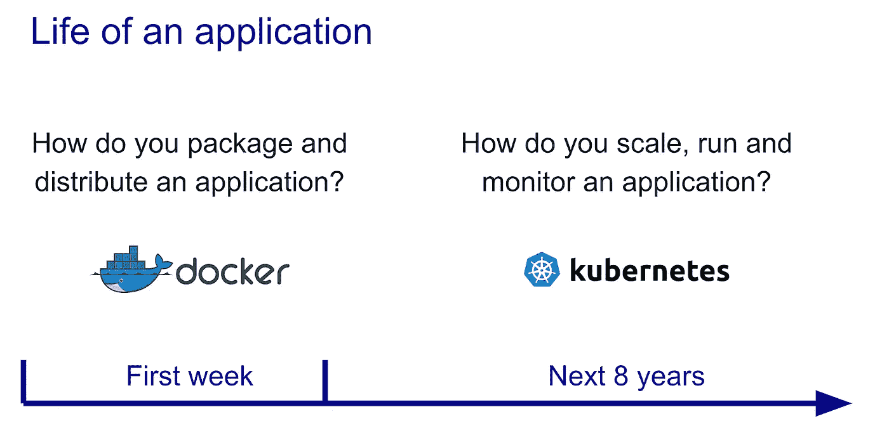**

**通过 Kubernetes / Docker 部署的应用程序的生命周期**

# **什么是 Google Kubernetes 引擎？**

**Google Kubernetes 引擎是 Google 开源 Kubernetes 在 Google 云平台上的实现。简单！**

**其他受欢迎的 GKE 替代品有亚马逊 ECS 和微软 Azure Kubernetes 服务 T21。**

# **最后一次，你明白吗？**

*   ****容器**是一种打包应用程序及其所有依赖项的软件，因此应用程序可以从一个计算环境可靠地运行到另一个计算环境。**
*   ****Docker** 是一款用于构建和管理容器的软件。**
*   ****Kubernetes** 是一个在集群环境中管理容器化应用的开源系统。**
*   ****Google Kubernetes 引擎**是开源的 Kubernetes 框架在 Google 云平台上的实现。**

**在本教程中，我们将使用谷歌 Kubernetes 引擎。为了跟进，你必须有一个谷歌云平台账户。[点击这里](https://console.cloud.google.com/getting-started)免费报名。**

# **设置业务环境**

**一家保险公司希望通过使用住院时的人口统计和基本患者健康风险指标来更好地预测患者费用，从而改善其现金流预测。**

****

***(* [*数据源*](https://www.kaggle.com/mirichoi0218/insurance#insurance.csv) *)***

# **目标**

**构建和部署一个 web 应用程序，将患者的人口统计和健康信息输入到基于 web 的表单中，然后输出预测的收费金额。**

# **任务**

*   **为部署培训和开发机器学习管道。**
*   **使用 Flask 框架构建 web 应用程序。它将使用经过训练的 ML 管道实时生成对新数据点的预测。**
*   **建立一个 docker 图像，并上传到谷歌容器注册(GCR)的容器。**
*   **创建集群并在 Google Kubernetes 引擎上部署应用程序。**

**由于我们已经在最初的教程中介绍了前两个任务，我们将快速回顾它们，然后集中讨论上面列表中的其余项目。如果您有兴趣了解更多关于使用 PyCaret 在 Python 中开发机器学习管道以及使用 Flask 框架构建 web 应用程序的信息，请阅读本教程。**

# **👉开发机器学习管道**

**我们正在使用 Python 中的 PyCaret 进行训练，并开发一个机器学习管道，它将作为我们 web 应用程序的一部分。机器学习管道可以在集成开发环境(IDE)或笔记本中开发。我们使用笔记本运行了以下代码:**

**当您在 PyCaret 中保存一个模型时，基于在 **setup()** 函数中定义的配置的整个转换管道被创建。所有的相互依赖都是自动编排的。查看存储在“deployment_28042020”变量中的管道和模型:**

****

**使用 PyCaret 创建的机器学习管道**

# **👉构建 Web 应用程序**

**本教程的重点不是构建 Flask 应用程序。这里讨论它只是为了完整性。现在我们的机器学习管道已经准备好了，我们需要一个 web 应用程序，它可以连接到我们训练过的管道，以实时生成对新数据点的预测。我们已经使用 Python 中的 Flask 框架创建了 web 应用程序。该应用程序有两个部分:**

*   **前端(使用 HTML 设计)**
*   **后端(使用 Flask 开发)**

**这是我们的 web 应用程序的外观:**

**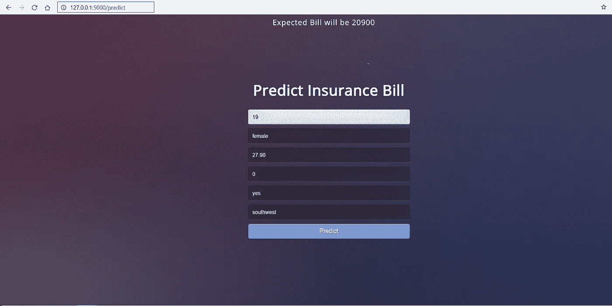**

**本地计算机上的 Web 应用程序**

**如果到目前为止你还没有跟上，没问题。您可以简单地从 GitHub 派生这个[存储库](https://github.com/pycaret/pycaret-deployment-google)。此时，您的项目文件夹应该是这样的:**

**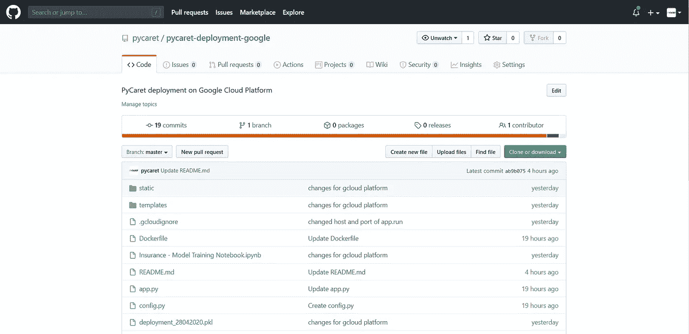**

**https://www.github.com/pycaret/pycaret-deployment-google**

**现在我们有了一个全功能的 web 应用程序，我们可以开始在 Google Kubernetes 引擎上封装和部署应用程序了。**

# **在 Google Kubernetes 引擎上部署 ML 管道的 10 个步骤:**

## **👉步骤 1 —在 GCP 控制台中创建新项目**

**登录您的 GCP 控制台，然后转到“管理资源”**

****

**谷歌云平台控制台→管理资源**

**点击**创建新项目****

**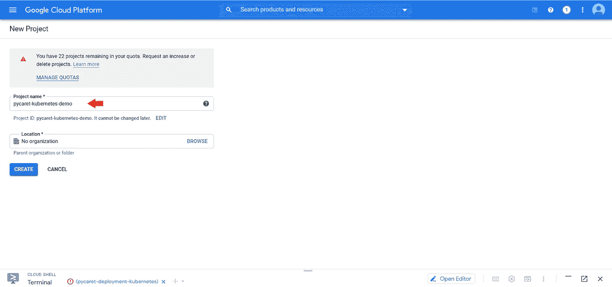**

**Google 云平台控制台→管理资源→创建新项目**

## **👉步骤 2 —导入项目代码**

**点击控制台窗口顶部的**激活云壳**按钮打开云壳。**

**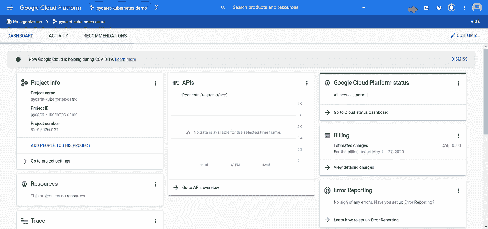**

**谷歌云平台(项目信息页面)**

**在 Cloud Shell 中执行以下代码来克隆本教程中使用的 GitHub 存储库。**

```
**git clone https://github.com/pycaret/pycaret-deployment-google.git**
```

**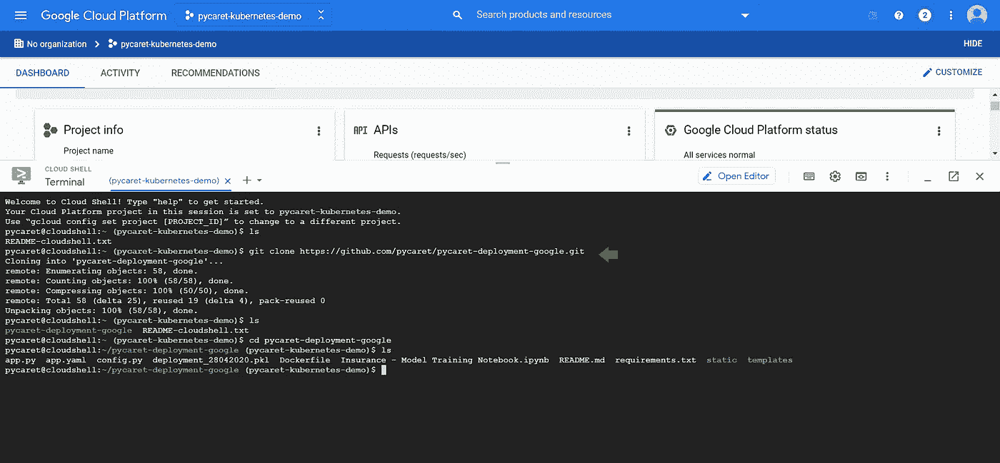**

**git 克隆[https://github.com/pycaret/pycaret-deployment-google.git](https://github.com/pycaret/pycaret-deployment-google.git)**

## **👉步骤 3-设置项目 ID 环境变量**

**执行以下代码来设置 PROJECT_ID 环境变量。**

```
**export PROJECT_ID=**pycaret-kubernetes-demo****
```

***py caret-kubernetes-demo*是我们在上面的步骤 1 中选择的项目的名称。**

## **👉步骤 4—构建 docker 映像**

**通过执行以下代码，构建应用程序的 docker 映像并标记它以便上传:**

```
**docker build -t gcr.io/${PROJECT_ID}/insurance-app:v1 .**
```

**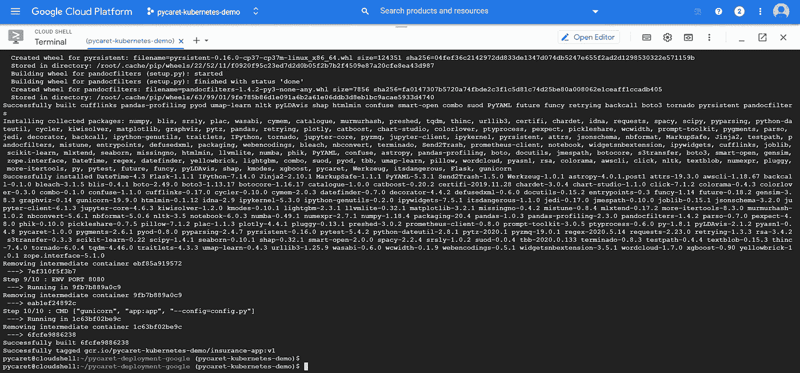**

**docker 构建成功时返回的消息**

**您可以通过运行以下代码来检查可用的图像:**

```
**docker images**
```

**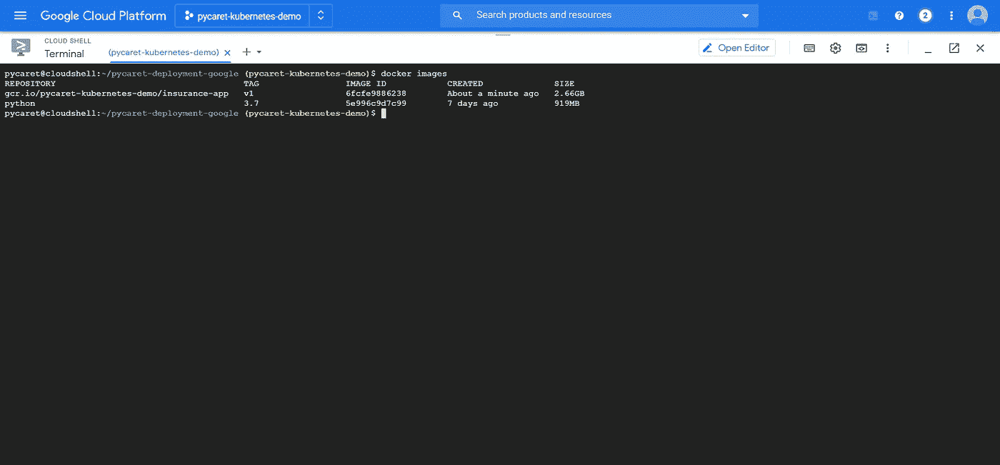**

**云壳上“docker images”命令的输出**

## **👉步骤 5—上传容器图像**

1.  **认证到[容器注册表](https://cloud.google.com/container-registry)(您只需要运行一次):**

```
**gcloud auth configure-docker**
```

**2.执行以下代码将 docker 图像上传到 Google 容器注册表:**

```
**docker push gcr.io/${PROJECT_ID}/insurance-app:v1**
```

## **👉步骤 6—创建集群**

**现在容器已经上传，您需要一个集群来运行容器。一个集群由一个运行 Kubernetes 的计算引擎 VM 实例池组成。**

1.  **为 gcloud 工具设置项目 ID 和计算引擎区域选项:**

```
**gcloud config set project $PROJECT_ID 
gcloud config set compute/zone **us-central1****
```

**2.通过执行以下代码创建一个集群:**

```
**gcloud container clusters create **insurance-cluster** --num-nodes=2**
```

**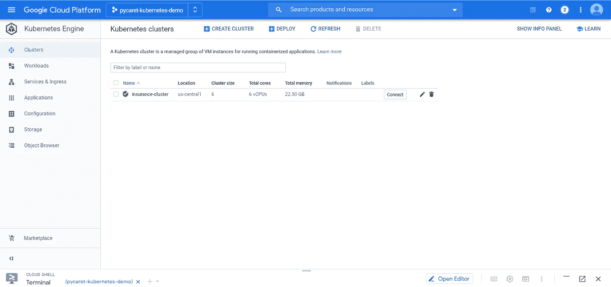**

**谷歌云平台→ Kubernetes 引擎→集群**

## **👉步骤 7—部署应用程序**

**要在 GKE 集群上部署和管理应用程序，您必须与 Kubernetes 集群管理系统通信。执行以下命令来部署应用程序:**

```
**kubectl create deployment insurance-app --image=gcr.io/${PROJECT_ID}/insurance-app:v1**
```

**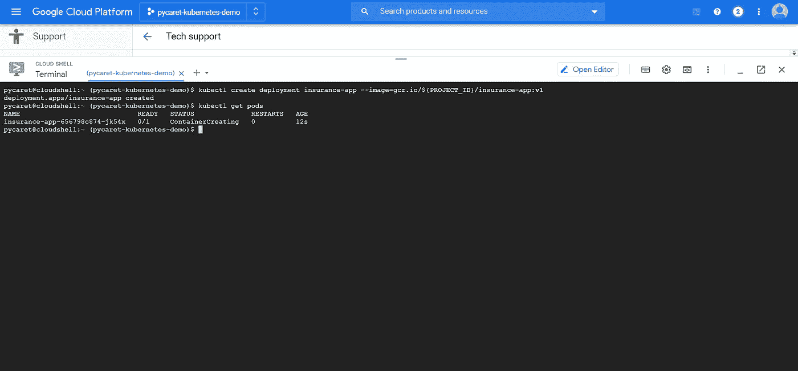**

**通过 kubectl 创建部署时返回的输出**

## **👉步骤 8—将您的应用程序公开到互联网上**

**默认情况下，您在 GKE 上运行的容器不能从互联网上访问，因为它们没有外部 IP 地址。执行以下代码，将应用程序公开给 internet:**

```
**kubectl expose deployment insurance-app --type=LoadBalancer --port 80 --target-port 8080**
```

## **👉步骤 9—检查服务**

**执行下面的代码来获取服务的状态。 **EXTERNAL-IP** 是您可以在浏览器中查看已发布应用的网址。**

```
**kubectl get service**
```

**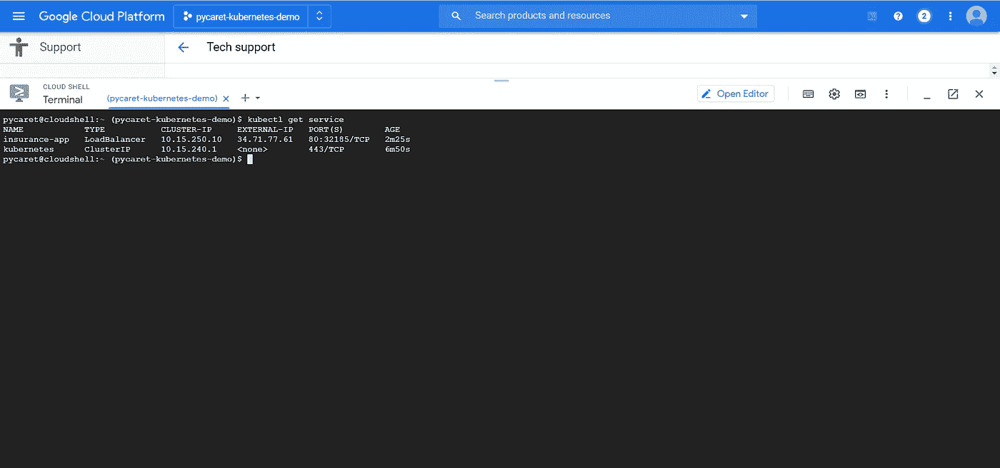**

**云壳→ kubectl 获取服务**

**👉第 10 步——在 http://34.71.77.61:8080 的[上查看应用程序的运行情况](http://34.71.77.61:8080)**

**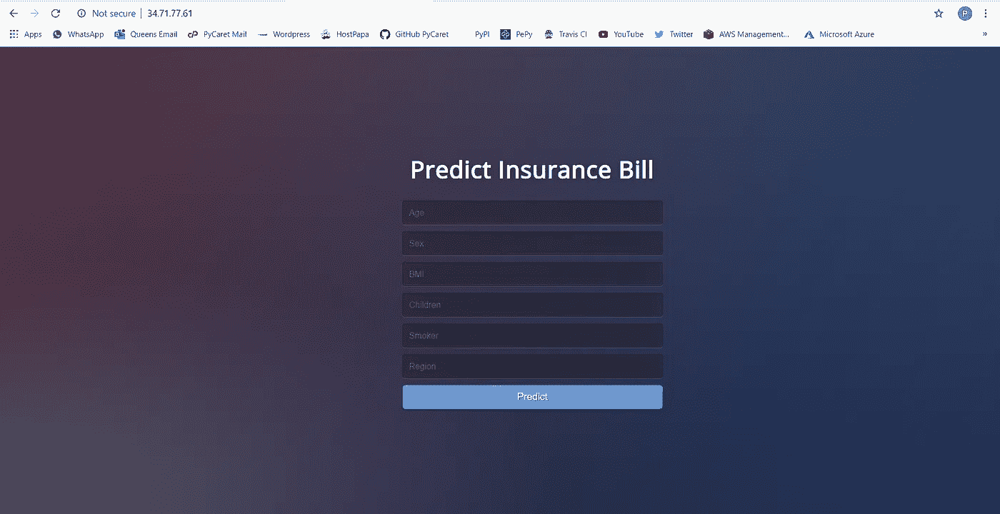**

**最终应用上传至 http://34.71.77.61:8080**

****注意:**在这篇文章发表时，该应用程序将从公共地址中删除，以限制资源消耗。**

**[链接到本教程的 GitHub 库](https://www.github.com/pycaret/pycaret-deployment-google)**

**[链接到微软 Azure 部署的 GitHub 仓库](https://www.github.com/pycaret/pycaret-azure-deployment)**

**[链接到 Heroku 部署的 GitHub 存储库](https://www.github.com/pycaret/deployment-heroku)**

# **PyCaret 1.0.1 来了！**

**我们收到了来自社区的大力支持和反馈。我们正在积极改进 PyCaret，并准备我们的下一个版本。 **PyCaret 1.0.1 会更大更好**。如果您想分享您的反馈并帮助我们进一步改进，您可以[在网站上填写此表格](https://www.pycaret.org/feedback)或者在我们的 [GitHub](https://www.github.com/pycaret/) 或 [LinkedIn](https://www.linkedin.com/company/pycaret/) 页面上发表评论。**

**关注我们的 [LinkedIn](https://www.linkedin.com/company/pycaret/) 并订阅我们的 [YouTube](https://www.youtube.com/channel/UCxA1YTYJ9BEeo50lxyI_B3g) 频道，了解更多关于 PyCaret 的信息。**

# **想了解某个特定模块？**

**从第一个版本 1.0.0 开始，PyCaret 有以下模块可供使用。点击下面的链接，查看 Python 中的文档和工作示例。**

**[分类](https://www.pycaret.org/classification)
回归
聚类
[异常检测](https://www.pycaret.org/anomaly-detection) [自然语言处理](https://www.pycaret.org/nlp)
[关联规则挖掘](https://www.pycaret.org/association-rules)**

# **另请参见:**

**笔记本中的 PyCaret 入门教程:**

**[聚类](https://www.pycaret.org/clu101)
[异常检测](https://www.pycaret.org/anom101)
[自然语言处理](https://www.pycaret.org/nlp101)
[关联规则挖掘](https://www.pycaret.org/arul101)
[回归](https://www.pycaret.org/reg101)
[分类](https://www.pycaret.org/clf101)**

# **你愿意投稿吗？**

**PyCaret 是一个开源项目。欢迎每个人都来投稿。如果您愿意投稿，请随意处理[未决问题](https://github.com/pycaret/pycaret/issues)。dev-1.0.1 分支上的单元测试接受拉请求。**

**如果你喜欢 PyCaret，请给我们 GitHub 回购的⭐️。**

**中:[https://medium.com/@moez_62905/](https://medium.com/@moez_62905/machine-learning-in-power-bi-using-pycaret-34307f09394a)**

**领英:[https://www.linkedin.com/in/profile-moez/](https://www.linkedin.com/in/profile-moez/)**

**推特:【https://twitter.com/moezpycaretorg1 T43**