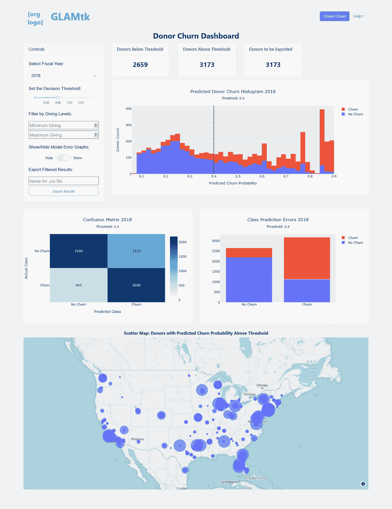
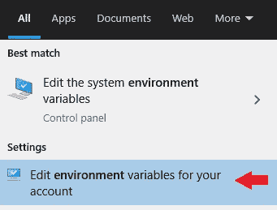

# 无需管理员权限即可安全部署机器学习模型

> 原文：<https://towardsdatascience.com/deploy-machine-learning-models-safely-without-needing-admin-privileges-96c8f98e6823?source=collection_archive---------78----------------------->

## 通过诗歌和 Dash 分享您的本地见解


照片由[普里西拉·杜·普里兹](https://unsplash.com/@priscilladupreez?utm_source=medium&utm_medium=referral)在 [Unsplash](https://unsplash.com?utm_source=medium&utm_medium=referral) 拍摄

# 将洞察力转化为行动

恭喜你！你在工作中牵头的机器学习项目已经完成。你花了几个月的时间与利益相关者讨论业务问题，将业务问题转化为数据问题，获取和探索数据，当你看到数据一团糟时清理数据，[选择合适的指标](/why-you-should-stop-using-the-roc-curve-a46a9adc728)，并构建和调整机器学习模型，为你带来出色的结果。你完了！

除了…你不是为一个科技巨头工作，你的同事不是程序员，你是唯一一个知道如何从你建立的模型中获得预测的人。你可能不想在可预见的未来导出和发送 CSV 文件，但是你绝对不能在面向公众的云服务上建立你的模型和相关的个人身份信息。同样不言而喻的是，您不被信任管理凭证，您不被允许在您的组织的单点登录门户后保护您自己的 web 服务器，并且您没有预算来购买企业解决方案。

您开始这个项目的目标是帮助您的团队成员更高效、更有效、更经济地完成他们的工作，但是他们需要实际使用您构建的东西来实现这些目标。这篇文章将介绍如何将一款 [Dash](https://plotly.com/dash/) 应用发给你的同事，而不需要管理员证书，以及如何消除摩擦，以便他们可以轻松使用它。

## 虚拟环境

我使用[诗歌](https://python-poetry.org)为我的项目创建虚拟环境和管理依赖关系。它在 Windows 上运行良好，文档也很棒。在其他计算机上安装您的依赖项就像共享您的`pyproject.toml`文件一样简单。

本指南的其余部分假设你也使用诗歌。

## 为什么是 Dash？

Dash 与 Plotly 相结合，可以轻松创建具有交互式可视化功能的 web 应用程序，以探索和导出机器学习模型的结果。



例如，我构建了一个 web 应用程序，允许最终用户控制模型的大量输入并导出结果。用户可以更改:要建模的会计年度、二元分类模型的决策阈值以及最小和最大捐赠/销售阈值。该应用程序还显示人们在[散点图](https://plotly.com/python/scattermapbox/)上的位置，并允许最终用户根据地理位置选择要导出的人。每当控制盒中的任何东西发生变化，应用程序中的每个数字都会立即更新。

最终产品使非技术人员可以轻松地从机器学习模型中获得结果，并在自己的工作流程中使用这些结果。

如何构建 Dash 应用程序的细节超出了本文的范围，但我会在以后的文章中解释我是如何做的。

# 前期投资

不幸的是，指导您的同事安装 Python 并确保正确设置路径变量的初始时间投资是无法回避的。但是你只需要做这一步一次，我保证这是值得的。

## 编写一个批处理脚本来启动应用程序

向非技术用户部署 web 应用的一个重要方面是减少产品发布过程中的摩擦。终端用户不想记住启动应用程序所需的命令，坦率地说，他们也不应该记住。令人欣慰的是，通过编写一个带有三行代码的批处理脚本(一个带有后缀`.bat`的文件),可以自动启动 Dash 应用程序。将这些命令复制到新的记事本文件中:

```
@echo off
start [http://127.0.0.1:8050/](http://127.0.0.1:8050/)
poetry run python path\to\app_script.py
```

将`path\to\app_script.py`替换为从项目根目录到启动 Dash 应用程序的脚本的路径。将该文件保存在项目的根目录下，并将其命名为类似于`dashboard.bat`的名称。

该脚本首先在默认 web 浏览器的新选项卡中打开默认 Dash 应用程序 URL，然后运行包含 Dash 应用程序的 Python 脚本。这意味着 web 浏览器会说网站不可用，直到支持 Dash 的 Flask 服务器启动并运行。一旦服务器启动(这可能需要 5-10 秒)，用户应该刷新浏览器来加载应用程序。

双击刚刚创建的批处理脚本，确保它能够工作。该文件将是您的团队进入应用程序的入口点。

## 与同事共享文件

这一步有一些灵活性，取决于有多少人在开发应用程序，有多少人在使用应用程序，以及你计划多久更新一次。如果您不是唯一的开发人员，正在与一个大型团队共享，或者需要频繁更新，您可能更喜欢自动化程度更高的方法。

然而，我是唯一的开发人员，我与五个人共享我的 web 应用程序，每年可能不会有超过几次更新。我决定将项目(包括 Python 文件、[保存的 XGBoost 模型](https://xgboost.readthedocs.io/en/latest/tutorials/saving_model.html)和用于模型的数据文件)复制到 Google Drive 文件夹，尽管任何文件共享服务都可以类似地工作。

该文件夹的内容可能如下所示:

```
.
├── dashboard.bat
├── glamtk
│   ├── dashboard
│   │   ├── assets
│   │   │   ├── logo.png
│   │   │   └── styles.css
│   │   ├── __init__.py
│   │   ├── app.py
│   │   ├── glossary.py
│   │   ├── index.py
│   │   ├── layout.py
│   │   ├── load_models.py
│   │   └── navbar.py
│   ├── data
│   │   ├── models
│   │   │   ├── churn_xgboost_2014
│   │   │   ├── churn_xgboost_2015
│   │   │   ├── churn_xgboost_2016
│   │   │   ├── churn_xgboost_2017
│   │   │   ├── churn_xgboost_2018
│   │   │   └── churn_xgboost_2019
│   │   ├── processed
│   │   │   ├── features.csv
│   │   │   └── geolocation.csv
│   │   └── raw
│   │       ├── ...
├── pyproject.toml
```

与所有相关人员共享该文件夹，并要求他们下载其中的内容。最好添加一个说明，告诉他们您将很快完成安装😁

## 安装 Python

在 Windows 电脑上安装 Python 和创建虚拟环境曾经是一项耐心(和故障排除)的练习，但自从微软将 Python 添加到微软商店以来，这个过程变得容易多了。

1.  通过打开开始菜单(按键盘上的 Windows 键)并键入“store”来打开 Microsoft store。
2.  在右上角的搜索框中键入“python ”,然后单击 Python 3.8。
3.  单击安装。安装时商店会提示你登录，但你**不需要**。关闭提示继续。

Python 现在安装好了！

## 装诗

一旦您的同事安装了诗歌，他们就可以使用您的`pyproject.toml`文件下载您的项目所需的所有依赖项。

1.  打开开始菜单，输入“powershell ”,然后按回车键，打开 Powershell。
2.  根据诗歌的网站，复制这个命令，粘贴到 Powershell 中，然后按 enter: `(Invoke-WebRequest -Uri https://raw.githubusercontent.com/python-poetry/poetry/master/get-poetry.py -UseBasicParsing).Content | python`
3.  安装完成后，关闭 Powershell。打开一个新的命令提示符(开始菜单->键入“cmd”并按 enter)并输入命令`poetry --version`。如果得到类似`Poetry version 1.0.0`的结果，那么继续第 7 步。但是，如果命令返回错误，请继续下一步。
4.  打开开始菜单，输入“环境”。这里有两个非常相似的选项:“编辑系统环境变量”和“编辑您的帐户的环境变量”。由于我们没有管理员凭据，请务必为您的帐户选择**编辑环境变量**。(见下图。)
5.  双击用户变量部分中的“路径”，单击新建，并将其粘贴到文本框:`%USERPROFILE%\.poetry\bin`
6.  **这很重要:**在“编辑环境变量”窗口和“环境变量”窗口中点击确定。如果您没有在两个窗口中都单击 OK，新的 path 变量将不会被保存。
7.  通过在命令提示符窗口中输入以下命令来更改 poems 的默认缓存目录:`poetry config cache-dir "%USERPROFILE%\pypoetry\Cache"`。
8.  关闭命令提示符窗口。

诗词现装！



确保选择正确的环境变量选项！

## 安装应用程序

由于您的同事已经下载了您共享的文件，现在是时候安装您的应用程序的依赖项了。

1.  打开一个新的命令提示窗口，通过键入`mkdir <project>`并按 enter 键为应用程序创建一个文件夹，用您的项目名称替换<项目>。因为我的项目叫做 GLAMtk，所以我让我的团队类型为`mkdir glamtk`。这个新文件夹将位于每个人的用户文件夹中，用户文件夹位于`C:\Users\<username>`。
2.  解压缩从 Google drive(或其他服务)下载的存档文件夹，并将内容复制到刚刚创建的文件夹中。使用上面的示例文件树，用户可以复制`dashboard.bat`、`glamtk`文件夹和`pyproject.toml`。
3.  在命令提示符窗口中，通过键入`cd <project>`并按 enter 键打开您在步骤 1 中创建的文件夹。
4.  通过键入`poetry install`并按 enter 键安装所需的依赖项。这将需要一段时间，取决于您的项目有多少依赖项。

您的应用程序现在可以使用了！让每个人通过双击`dashboard.bat`来检查它是否工作。

# 未来更新

这种方法允许您轻松地向团队发送更新。只要不引入新的依赖项或更改启动 Dash 应用程序的 Python 脚本，更新应用程序就像用新版本替换项目文件夹一样简单。批处理脚本仍将工作，并且依赖项已经安装。

如果您确实更改了 Dash 应用程序的入口点或向您的应用程序添加了依赖项，请遵循上面针对诗歌和/或批处理脚本的相应步骤。

# 包扎

这篇文章介绍了如何以 Dash 应用程序的形式向 Windows 计算机上的最终用户提供机器学习模型，而无需管理员凭据。

这需要相当大的前期投资，尤其是如果你带领许多人通过 Zoom 的这些步骤，但要考虑到这是对你未来计划和团队效率的投资。最终用户将能够使用你花了很长时间创建的机器学习模型，而你不需要亲自处理每个请求。

欢迎在下面留下评论——我很乐意听到你使用过的替代部署方法，或者对这篇文章中的任何其他内容的想法。感谢阅读！