# 在 AWS Fargate 上部署机器学习管道

> 原文：<https://towardsdatascience.com/deploy-machine-learning-pipeline-on-aws-fargate-eb6e1c50507?source=collection_archive---------7----------------------->

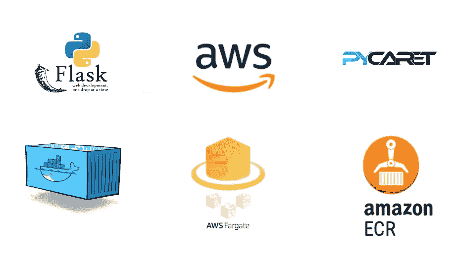

在 AWS Fargate 上封装和部署 ML pipeline serverless 的循序渐进的初学者指南

# 概述

在我们关于在云中部署机器学习管道的[上一篇文章](/deploy-machine-learning-model-on-google-kubernetes-engine-94daac85108b)中，我们展示了如何用 PyCaret 开发机器学习管道，用 Docker 将其容器化，并使用 Google Kubernetes 引擎将其作为 web 应用程序。如果你以前没有听说过 PyCaret，请阅读这个[公告](/announcing-pycaret-an-open-source-low-code-machine-learning-library-in-python-4a1f1aad8d46)以了解更多信息。

在本教程中，我们将使用我们之前构建和部署的相同的机器学习管道和 Flask 应用程序。这次我们将演示如何使用 AWS Fargate 无服务器地封装和部署机器学习管道。

# 👉本教程的学习目标

*   什么是容器？Docker 是什么？什么是 Kubernetes？
*   什么是亚马逊弹性容器服务(ECS)？
*   什么是 AWS Fargate 和无服务器部署？
*   构建一个 Docker 映像并将其推送到 Amazon 弹性容器注册中心。
*   使用 AWS 管理的基础设施(如 AWS Fargate)创建和执行任务定义。
*   看看一个使用训练有素的机器学习管道来实时预测新数据点的 web 应用程序。

本教程将涵盖整个工作流程，从在本地构建 docker 映像开始，将其上传到 Amazon Elastic Container Registry，创建一个集群，然后使用 AWS 管理的基础设施(即 AWS Fargate)定义和执行任务。

过去，我们已经讨论过在其他云平台上的部署，比如 Azure 和 Google。如果你有兴趣了解更多，你可以阅读下面的故事:

*   [在谷歌 Kubernetes 引擎上部署机器学习管道](/deploy-machine-learning-model-on-google-kubernetes-engine-94daac85108b)
*   [在 AWS Web 服务上部署机器学习管道](/deploy-machine-learning-pipeline-on-cloud-using-docker-container-bec64458dc01)
*   [在 Heroku PaaS 上构建和部署您的第一个机器学习 web 应用](/build-and-deploy-your-first-machine-learning-web-app-e020db344a99)

# 💻本教程的工具箱

# PyCaret

[PyCaret](https://www.pycaret.org/) 是 Python 中的开源、低代码机器学习库，用于训练和部署机器学习管道和模型到生产中。PyCaret 可以使用 pip 轻松安装。

```
pip install pycaret
```

# 瓶

Flask 是一个允许你构建网络应用的框架。web 应用程序可以是商业网站、博客、电子商务系统，也可以是使用训练好的模型从实时提供的数据中生成预测的应用程序。如果你没有安装 Flask，你可以使用 pip 来安装。

# Windows 10 家庭版 Docker 工具箱

[Docker](https://www.docker.com/) **容器用于打包应用程序及其所有必需的组件，如库和其他依赖项，并作为一个包发送出去。如果你之前没用过 docker，本教程还涵盖了在 **Windows 10 Home** 上安装 Docker 工具箱(legacy)。在[之前的教程](/deploy-machine-learning-pipeline-on-cloud-using-docker-container-bec64458dc01)中，我们介绍了如何在 **Windows 10 Pro edition** 上安装 Docker Desktop。**

# 亚马逊网络服务(AWS)

亚马逊网络服务(AWS)是由亚马逊提供的一个全面且广泛采用的云平台。它拥有来自全球数据中心的超过 175 项全功能服务。如果你以前没用过 AWS，你可以[注册](https://aws.amazon.com/)免费账号。

# ✔️Let's 开始吧…..

# 什么是容器？

在我们开始使用 AWS Fargate 实现之前，让我们了解一下什么是容器，为什么我们需要容器？


[https://www.freepik.com/free-photos-vectors/cargo-ship](https://www.freepik.com/free-photos-vectors/cargo-ship)

您是否遇到过这样的问题:您的代码在您的计算机上运行得很好，但是当一个朋友试图运行完全相同的代码时，却无法运行？如果你的朋友重复完全相同的步骤，他或她应该得到相同的结果，对不对？一个词的答案是 ***环境*。**你朋友的环境和你不一样。

环境包括什么？Python 等编程语言以及所有库和依赖项，以及构建和测试应用程序时使用的确切版本。

如果我们可以创建一个可以转移到其他机器上的环境(例如:你朋友的电脑或者谷歌云平台这样的云服务提供商)，我们就可以在任何地方重现结果。因此，*****容器*** 是一种将应用程序及其所有依赖项打包的软件，因此应用程序可以从一个计算环境可靠地运行到另一个计算环境。**

# **Docker 是什么？**

**Docker 是一家提供软件(也叫 **Docker** )的公司，允许用户构建、运行和管理容器。虽然 Docker 的集装箱是最常见的，但还有其他不太出名的替代品，如 LXD 的[和 LXC 的](https://linuxcontainers.org/lxd/introduction/)。**

****

**现在，您已经从理论上了解了什么是容器，以及 Docker 如何用于容器化应用程序，让我们想象一个场景，其中您必须在一组机器上运行多个容器，以支持一个企业级机器学习应用程序，该应用程序在白天和晚上都有不同的工作负载。这在现实生活中很常见，尽管听起来很简单，但手动完成的工作量很大。**

**您需要在正确的时间启动正确的容器，弄清楚它们如何相互通信，处理存储考虑事项，处理失败的容器或硬件以及数以百万计的其他事情！**

**管理成百上千个容器以保持应用程序正常运行的整个过程被称为**容器编排**。先不要纠结于技术细节。**

**在这一点上，您必须认识到管理现实生活中的应用程序需要不止一个容器，并且管理所有的基础设施以保持容器正常运行是繁琐的、手动的和管理负担。**

**这就把我们带到了 T21。**

# **什么是 Kubernetes？**

**Kubernetes 是谷歌在 2014 年开发的一个开源系统，用于管理容器化的应用程序。简而言之，Kubernetes 是一个跨机器集群运行和协调容器化应用的系统。**

****

**[丘特尔斯纳](https://unsplash.com/@chuttersnap?utm_source=medium&utm_medium=referral)在 [Unsplash](https://unsplash.com?utm_source=medium&utm_medium=referral) 上拍照**

**虽然 Kubernetes 是谷歌开发的开源系统，但几乎所有主要的云服务提供商都将 Kubernetes 作为托管服务提供。比如:亚马逊**提供的**亚马逊弹性 Kubernetes 服务(EKS)** ，谷歌**提供的**谷歌 Kubernetes 引擎**，微软提供的 **Azure Kubernetes 服务(AKS)** 。**

**到目前为止，我们已经讨论并理解了:**

**✔️一 ***集装箱*****

**✔️码头工人**

**✔️·库伯内特**

**在介绍 AWS Fargate 之前，只剩下一件事要讨论，那就是亚马逊自己的容器编排服务**亚马逊弹性容器服务(ECS)。****

# **AWS 弹性集装箱服务**

**亚马逊弹性容器服务(Amazon ECS)是亚马逊自己开发的容器编排平台。ECS 背后的思想类似于 Kubernetes *(两者都是编排服务)*。**

**ECS 是 AWS 本地服务，这意味着它只能在 AWS 基础设施上使用。另一方面， **EKS** 基于 Kubernetes，这是一个开源项目，用户可以在多云(AWS、GCP、Azure)甚至本地运行。**

**亚马逊还提供基于 Kubernetes 的容器编排服务，称为**亚马逊弹性 Kubernetes 服务(亚马逊 EKS)。**尽管 ECS 和 EKS 的目的非常相似，即*编排容器化的应用程序*，但在定价、兼容性和安全性方面还是有相当大的差异。没有最佳答案，解决方案的选择取决于使用案例。**

**无论您使用哪种容器编排服务(ECS 或 EKS ),都有两种方法可以实现底层基础架构:**

1.  **手动管理集群和底层基础设施，如虚拟机/服务器/(在 AWS 中也称为 EC2 实例)。**
2.  **无服务器—完全不需要管理任何东西。只需上传容器就可以了。← **这是 AWS Fargate。****

**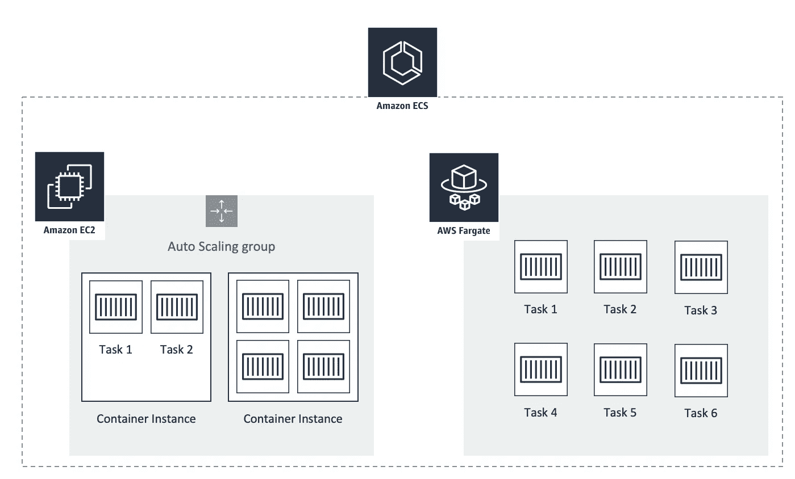**

**亚马逊 ECS 底层基础设施**

# **AWS Fargate —集装箱的无服务器计算**

**AWS Fargate 是一个用于容器的无服务器计算引擎，它与亚马逊弹性容器服务(ECS)和亚马逊弹性库本内特服务(EKS)一起工作。Fargate 使您可以轻松地专注于构建应用程序。Fargate 消除了供应和管理服务器的需要，允许您为每个应用程序指定和支付资源，并通过设计应用程序隔离来提高安全性。**

**Fargate 分配适当的计算量，消除了选择实例和扩展集群容量的需要。您只需为运行容器所需的资源付费，因此不存在过度配置和为额外的服务器付费的问题。**

**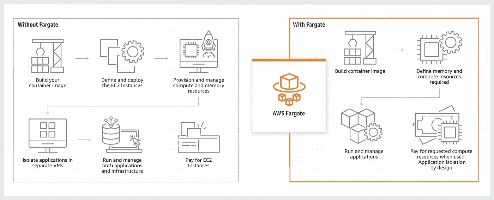**

**AWS Fargate 如何工作—[https://aws.amazon.com/fargate/](https://aws.amazon.com/fargate/)**

**对于哪种方法更好，没有最佳答案。选择无服务器还是手动管理 EC2 集群取决于使用案例。有助于这一选择的一些要点包括:**

****ECS EC2(人工进近)****

*   **你全押在 AWS 上。**
*   **您有专门的运营团队来管理 AWS 资源。**
*   **您在 AWS 上已经有了足迹，即您已经在管理 EC2 实例**

****AWS 法盖特****

*   **您没有庞大的运营团队来管理 AWS 资源。**
*   **你不想要操作责任或想要减少它。**
*   **您的应用程序是无状态的*(无状态应用程序不保存在一个会话中生成的客户端数据，以便在下一个与该客户端的会话中使用)*。**

# **设置业务环境**

**一家保险公司希望通过使用住院时的人口统计和基本患者健康风险指标来更好地预测患者费用，从而改善其现金流预测。**

****

***(* [*数据源*](https://www.kaggle.com/mirichoi0218/insurance#insurance.csv) *)***

# **目标**

**构建和部署一个 web 应用程序，将患者的人口统计和健康信息输入到基于 web 的表单中，然后输出预测的收费金额。**

# **任务**

*   **为部署培训和开发机器学习管道。**
*   **使用 Flask 框架构建 web 应用程序。它将使用经过训练的 ML 管道实时生成对新数据点的预测。**
*   **构建一个 Docker 映像并将其推送到 Amazon 弹性容器注册中心。**
*   **创建并执行任务，使用 AWS Fargate 无服务器基础架构部署应用程序。**

**由于我们已经在最初的教程中介绍了前两个任务，我们将快速回顾它们，然后集中讨论上面列表中的其余项目。如果您有兴趣了解更多关于使用 PyCaret 在 Python 中开发机器学习管道以及使用 Flask 框架构建 web 应用程序的信息，请阅读本教程。**

# **👉开发机器学习管道**

**我们正在使用 Python 中的 PyCaret 进行训练，并开发一个机器学习管道，它将作为我们 web 应用程序的一部分。机器学习管道可以在集成开发环境(IDE)或笔记本中开发。我们使用笔记本运行了以下代码:**

**当您在 PyCaret 中保存一个模型时，基于在 **setup()** 函数中定义的配置的整个转换管道被创建。所有的相互依赖都是自动编排的。查看存储在“deployment_28042020”变量中的管道和模型:**

**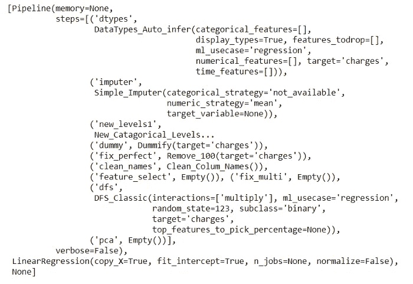**

**使用 PyCaret 创建的机器学习管道**

# **👉构建 Web 应用程序**

**本教程的重点不是构建 Flask 应用程序。这里讨论它只是为了完整性。现在我们的机器学习管道已经准备好了，我们需要一个 web 应用程序，它可以连接到我们训练过的管道，以实时生成对新数据点的预测。我们已经使用 Python 中的 Flask 框架创建了 web 应用程序。该应用程序有两个部分:**

*   **前端(使用 HTML 设计)**
*   **后端(使用 Flask 开发)**

**这是我们的 web 应用程序的外观:**

**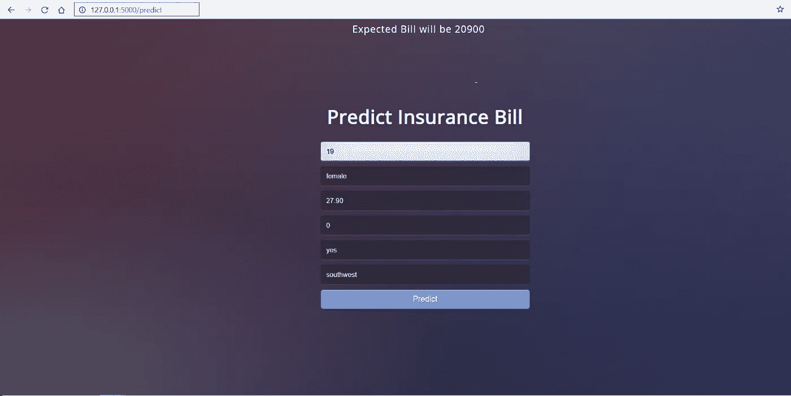**

**本地计算机上的 Web 应用程序**

**如果到目前为止你还没有跟上，没问题。您可以简单地从 GitHub 派生这个[存储库](https://www.github.com/pycaret/pycaret-deployment-aws)。此时，您的项目文件夹应该是这样的:**

# **使用 AWS Fargate 部署 ML 管道的 10 个步骤:**

## **👉步骤 1 —安装 Docker 工具箱(适用于 Windows 10 家庭版)**

**为了在本地构建 docker 映像，您需要在您的计算机上安装 Docker。如果你使用的是 64 位 Windows 10:Pro、Enterprise 或 Education (Build 15063 或更高版本)，你可以从 [DockerHub](https://hub.docker.com/editions/community/docker-ce-desktop-windows/) 下载 Docker Desktop。**

**然而，如果你使用的是 Windows 10 Home，你需要从 [Dockers GitHub 页面](https://github.com/docker/toolbox/releases)安装旧版 Docker 工具箱的最新版本(v19.03.1)。**

**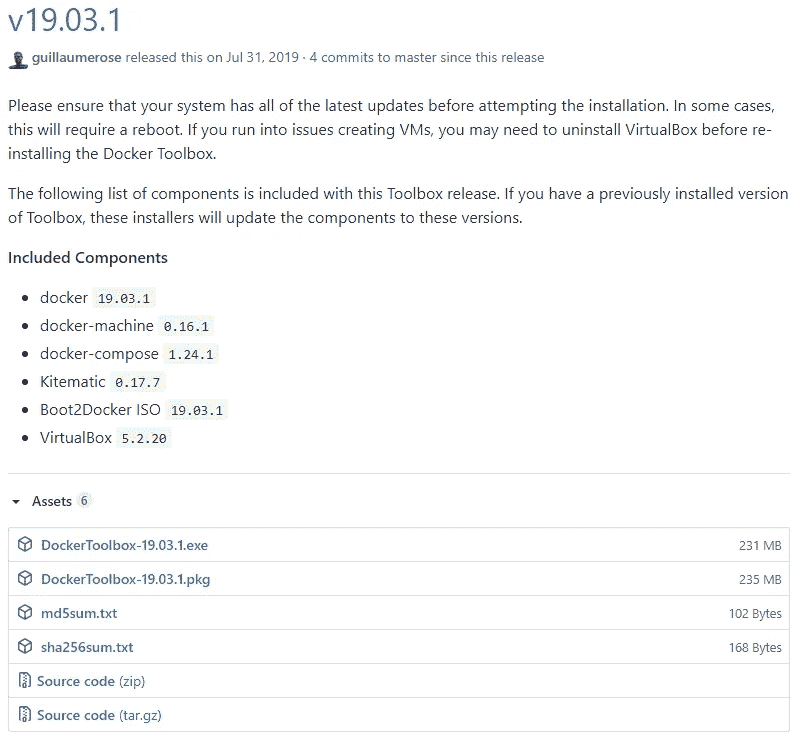**

**[https://github.com/docker/toolbox/releases](https://github.com/docker/toolbox/releases)**

**下载并运行**DockerToolbox-19.03.1.exe**文件。**

**检查安装是否成功的最简单方法是打开命令提示符并键入“docker”。它应该打印帮助菜单。**

**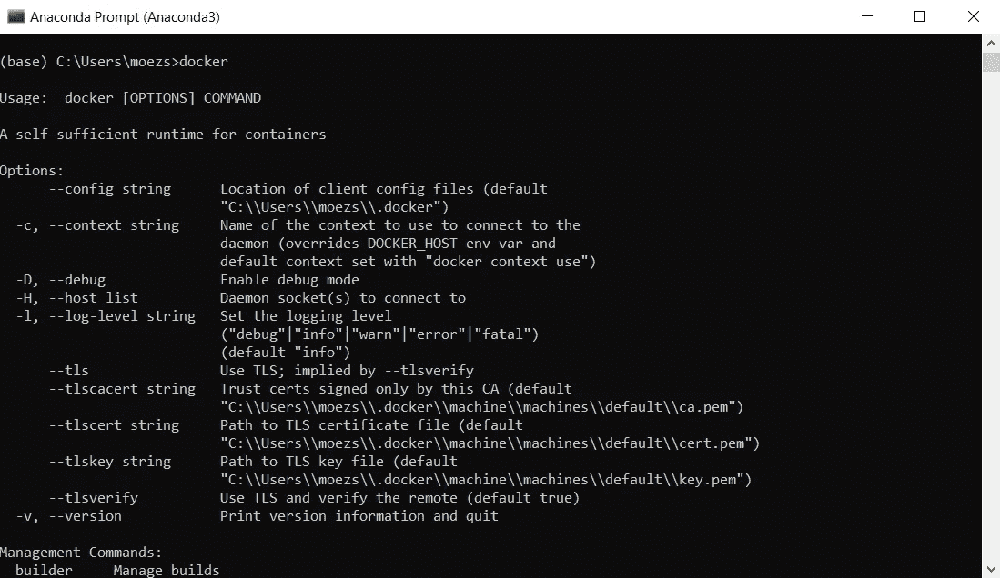**

**Anaconda 提示检查 docker**

## **👉步骤 2—创建 Dockerfile 文件**

**创建 Docker 映像的第一步是在项目目录中创建 Docker 文件。Dockerfile 只是一个包含一组指令的文件。该项目的 docker 文件如下所示:**

**Dockerfile 区分大小写，必须与其他项目文件位于项目文件夹中。Dockerfile 没有扩展名，可以使用任何文本编辑器创建。您可以从这个 [GitHub 资源库](https://www.github.com/pycaret/pycaret-deployment-aws)下载这个项目中使用的 Dockerfile。**

## **👉步骤 3—在弹性容器注册中心(ECR)中创建一个存储库**

****(a)登录您的 AWS 控制台并搜索弹性容器注册表:****

**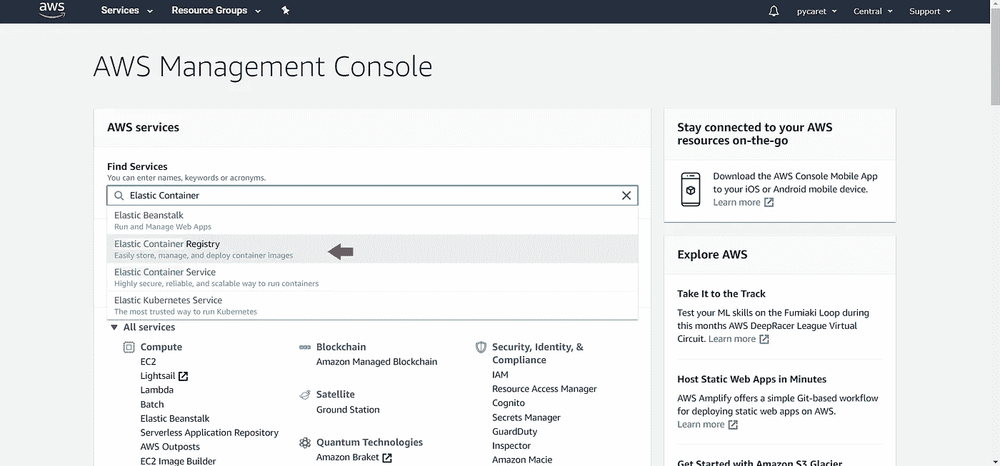**

**AWS 控制台**

****(b)创建一个新的存储库:****

****

**在 Amazon 弹性容器注册表上创建新的存储库**

**对于这个演示，我们已经创建了“py caret-deployment-AWS-repository”。**

****(c)点击【查看推送命令】:****

**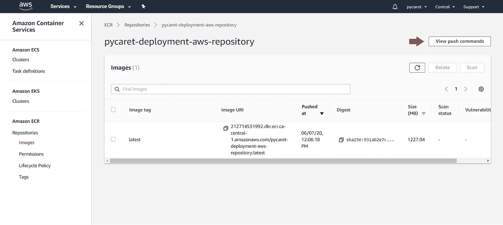**

**py caret-部署-AWS-存储库**

****(d)复制推送命令:****

**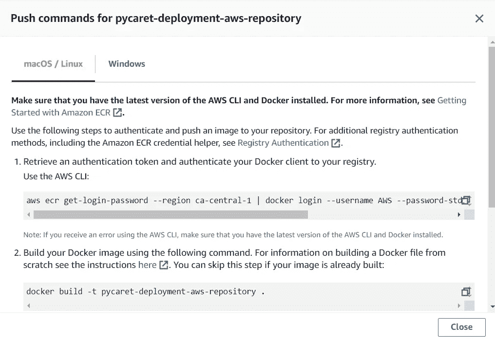**

**py caret-deployment-AWS-repository 的推送命令**

## **👉步骤 4—执行推送命令**

**使用 Anaconda 提示符导航到您的项目文件夹，并执行您在上一步中复制的命令。下面的代码仅用于演示，可能无法正常工作。要获得正确的代码来执行，您必须从存储库中的“查看推送命令”中获得代码的副本。**

**在执行这些命令之前，您必须位于 docker 文件和其余代码所在的文件夹中。**

```
****Command 1**
aws ecr get-login-password --region ca-central-1 | docker login --username AWS --password-stdin 212714531992.dkr.ecr.ca-central-1.amazonaws.com**Command 2**
docker build -t pycaret-deployment-aws-repository .**Command 3**
docker tag pycaret-deployment-aws-repository:latest 212714531992.dkr.ecr.ca-central-1.amazonaws.com/pycaret-deployment-aws-repository:latest**Command 4**
docker push 212714531992.dkr.ecr.ca-central-1.amazonaws.com/pycaret-deployment-aws-repository:latest**
```

## **👉第 5 步—检查您上传的图像**

**单击您创建的存储库，您将看到上一步中上传的图像的图像 URI。复制图像 URI(这将需要在下面的第 7 步)。**

**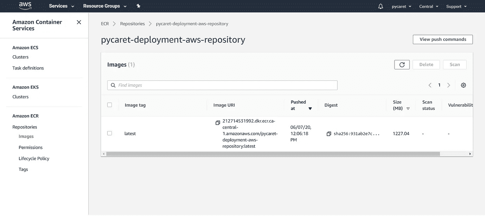**

## **👉步骤 6 —创建和配置集群**

****(a)点击左侧菜单上的“集群”:****

****

**创建集群—步骤 1**

****(b)选择“仅联网”并点击下一步:****

****

**选择仅网络模板**

****(c)配置集群(输入集群名称)并点击创建:****

**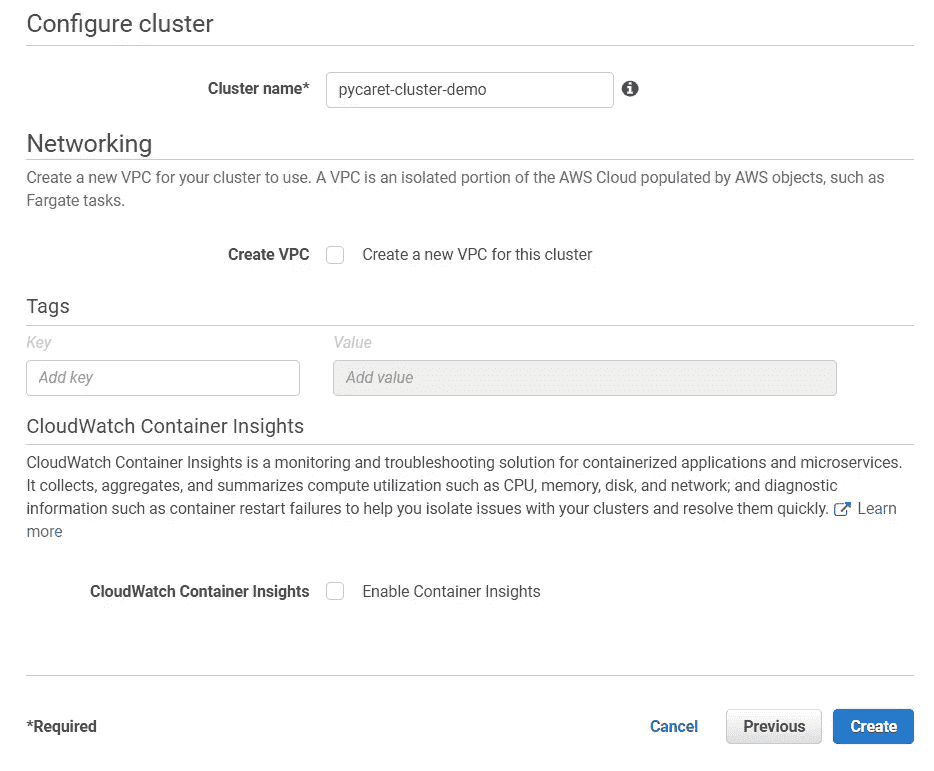**

**配置集群**

****(d)集群创建:****

****

**集群已创建**

## **👉步骤 7-创建新的任务定义**

**在 Amazon ECS 中运行 Docker 容器需要一个**任务**定义。您可以在**任务**定义中指定的一些参数包括:Docker 图像，用于您的**任务**中的每个容器。每个**任务**或者一个**任务**中的每个容器使用多少 CPU 和内存。**

****(a)点击“创建新的任务定义”:****

****

**创建新的任务定义**

****(b)选择“FARGATE”作为发射类型:****

****

**选择启动类型兼容性**

****(c)详细填写:****

**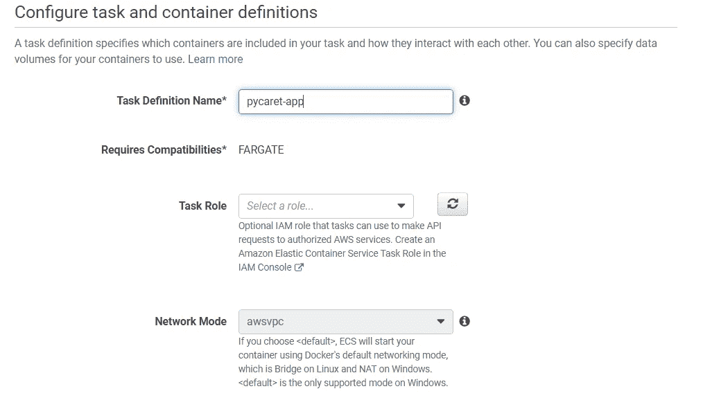**

**配置任务和容器定义(第 1 部分)**

**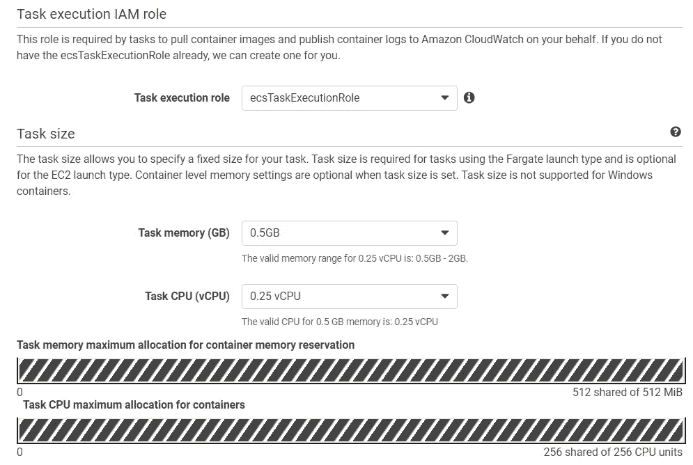**

**配置任务和容器定义(第 2 部分)**

****(d)点击“添加容器”并填写详细信息:****

**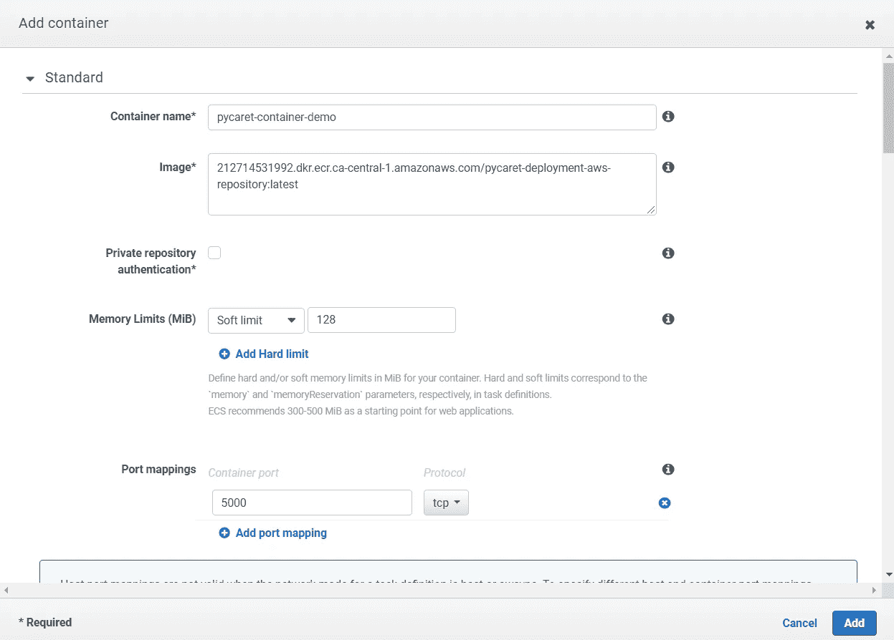**

**在任务定义中添加容器**

****(e)点击右下角的“创建任务”。****

****

## **👉步骤 8-执行任务定义**

**在步骤 7 中，我们创建了一个启动容器的任务。现在我们将通过点击动作下的**“运行任务”**来执行任务。**

****

**执行任务定义**

****(a)点击“切换到发射类型”将类型更改为 Fargate:****

**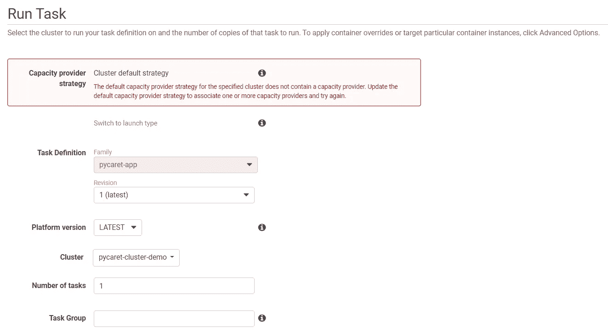**

**运行任务—第 1 部分**

****(b)从下拉列表中选择 VPC 和子网:****

**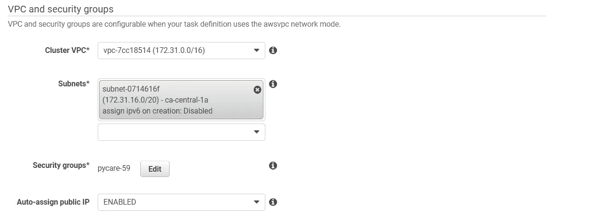**

**运行任务—第 2 部分**

****(c)点击右下角的“运行任务”:****

**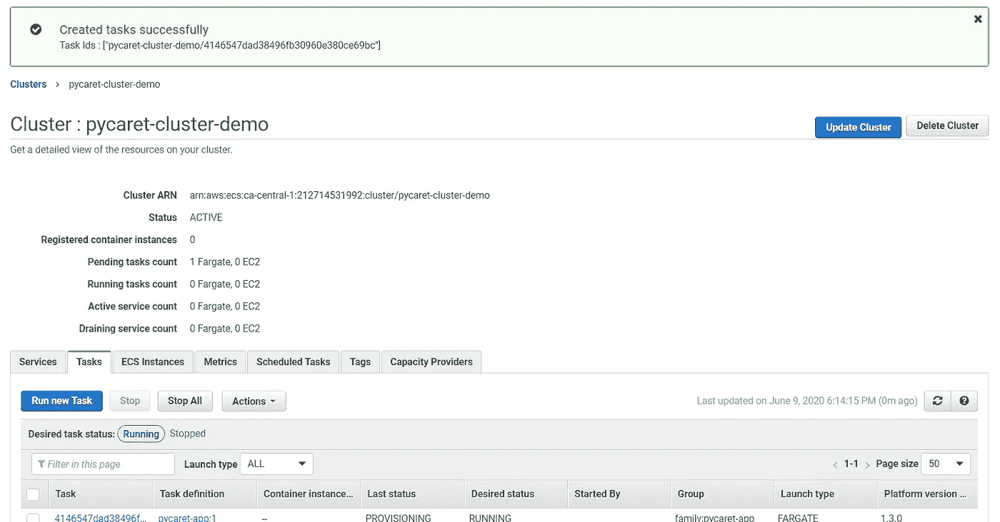**

**任务创建成功**

## **👉步骤 9-从网络设置中允许入站端口 5000**

**在我们看到我们的应用程序在公共 IP 地址上运行之前，最后一步是通过创建一个新规则来允许端口 5000。为此，请遵循以下步骤:**

****(a)点击任务****

****

****(b)点击 ENI Id:****

**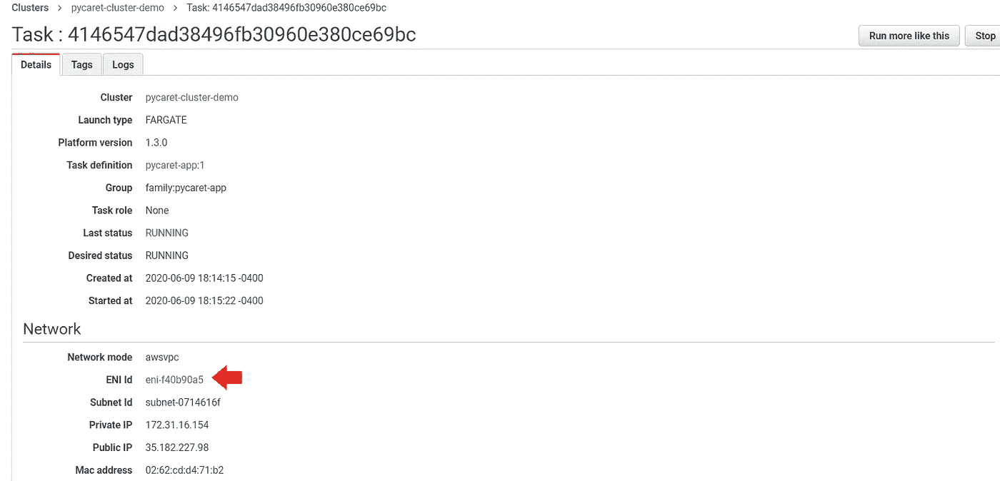**

****(c)点击安全组****

**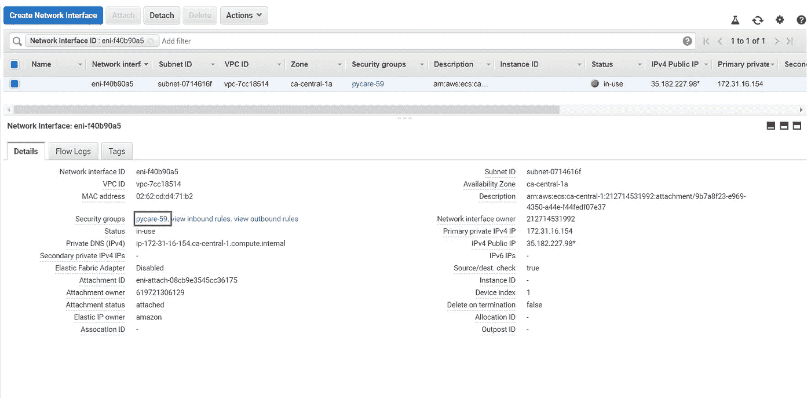**

****(d)点击【编辑入站规则】****

**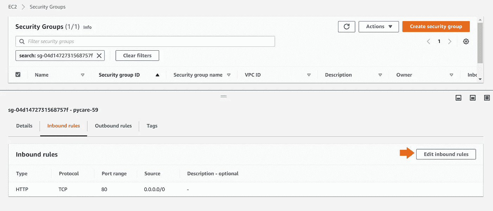**

****(e)添加端口 5000 的自定义 TCP 规则****

****

## **👉步骤 10——查看应用程序的运行情况**

**使用端口 5000 的公共 IP 地址访问应用程序。**

**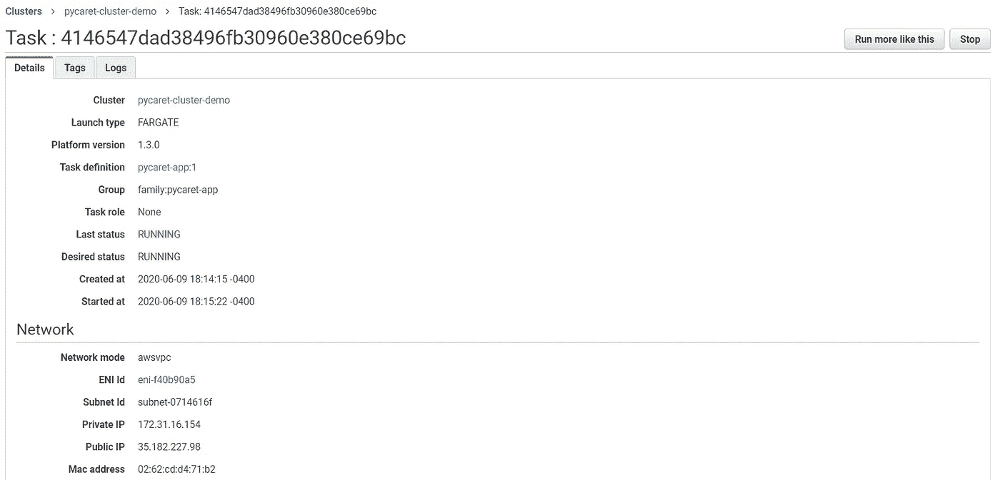**

**任务定义日志**

**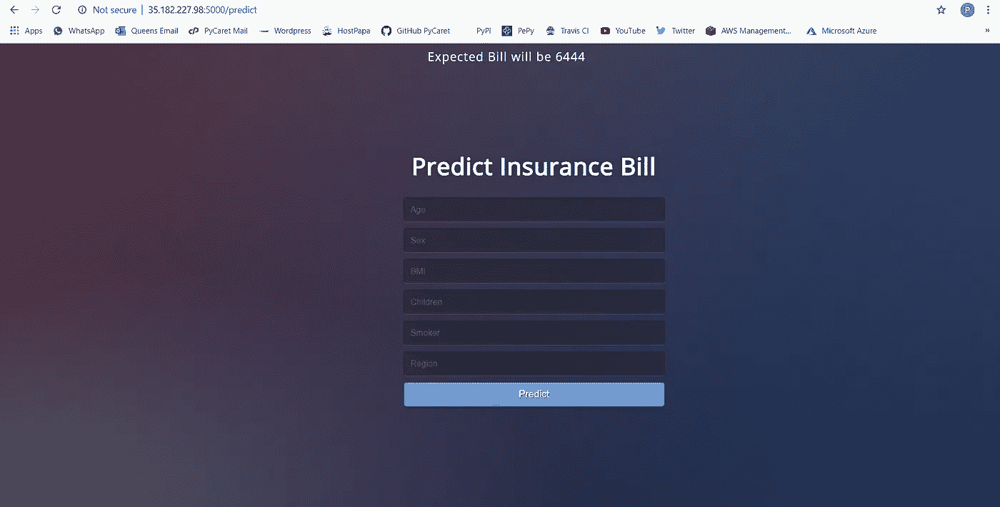**

**最终应用上传到 http://35.182.227.98:5000**

****注意:**在这篇文章发表时，该应用程序将从公共地址中删除，以限制资源消耗。**

# **PyCaret 2.0.0 来了！**

**我们收到了来自社区的大力支持和反馈。我们正在积极改进 PyCaret，并准备我们的下一个版本。 **PyCaret 2.0.0 会更大更好**。如果您想分享您的反馈并帮助我们进一步改进，您可以[在网站上填写此表格](https://www.pycaret.org/feedback)或者在我们的 [GitHub](https://www.github.com/pycaret/) 或 [LinkedIn](https://www.linkedin.com/company/pycaret/) 页面上发表评论。**

**关注我们的 [LinkedIn](https://www.linkedin.com/company/pycaret/) 并订阅我们的 [YouTube](https://www.youtube.com/channel/UCxA1YTYJ9BEeo50lxyI_B3g) 频道，了解更多关于 PyCaret 的信息。**

# **想了解某个特定模块？**

**从第一个版本 1.0.0 开始，PyCaret 有以下模块可供使用。点击下面的链接，查看 Python 中的文档和工作示例。**

**[分类](https://www.pycaret.org/classification)
[回归](https://www.pycaret.org/regression) [聚类](https://www.pycaret.org/clustering)
[异常检测](https://www.pycaret.org/anomaly-detection) [自然语言处理](https://www.pycaret.org/nlp)
[关联规则挖掘](https://www.pycaret.org/association-rules)**

# **另请参见:**

**笔记本中的 PyCaret 入门教程:**

**[聚类](https://www.pycaret.org/clu101)
异常检测 自然语言处理
[关联规则挖掘](https://www.pycaret.org/arul101)
[回归](https://www.pycaret.org/reg101)
[分类](https://www.pycaret.org/clf101)**

# **你愿意投稿吗？**

**PyCaret 是一个开源项目。欢迎每个人都来投稿。如果您愿意投稿，请随意处理[未决问题](https://github.com/pycaret/pycaret/issues)。dev-1.0.1 分支上的单元测试接受拉请求。**

**如果你喜欢 PyCaret，请给我们 GitHub 回购的⭐️。**

**中:【https://medium.com/@moez_62905/ **

**领英:[https://www.linkedin.com/in/profile-moez/](https://www.linkedin.com/in/profile-moez/)**

**推特:[https://twitter.com/moezpycaretorg1](https://twitter.com/moezpycaretorg1)**