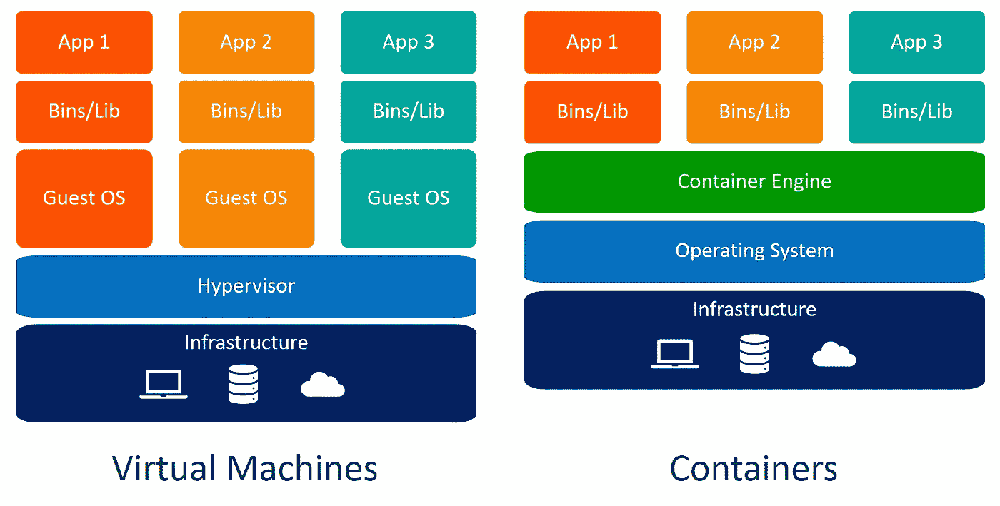
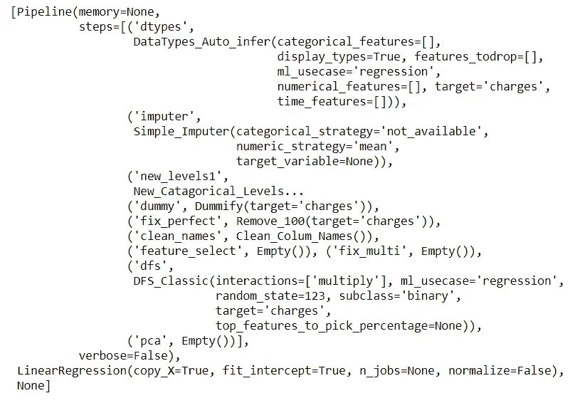
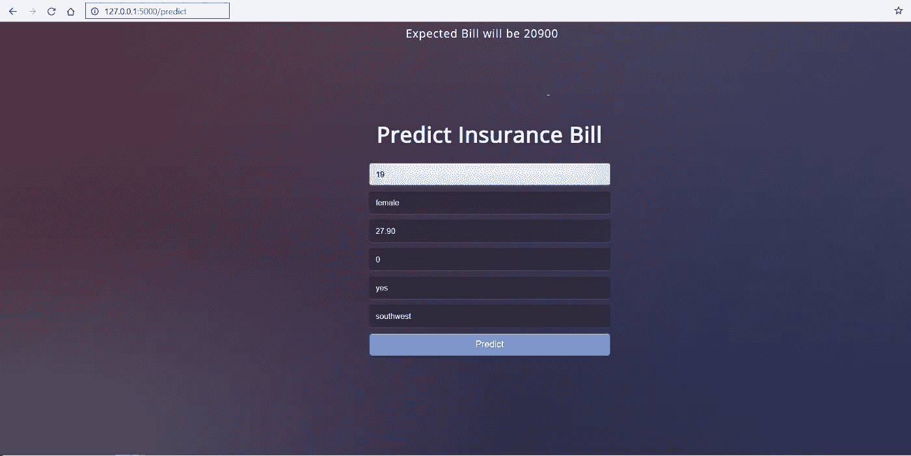

# 使用 Docker 容器在云上部署机器学习管道

> 原文：<https://towardsdatascience.com/deploy-machine-learning-pipeline-on-cloud-using-docker-container-bec64458dc01?source=collection_archive---------2----------------------->


# **重述**

在我们的[上一篇文章](/build-and-deploy-your-first-machine-learning-web-app-e020db344a99)中，我们展示了如何使用 Python 中的 PyCaret 和 Flask 框架开发机器学习管道并将其部署为 web 应用。如果你以前没有听说过 PyCaret，请阅读这个[公告](/announcing-pycaret-an-open-source-low-code-machine-learning-library-in-python-4a1f1aad8d46)以了解更多信息。

在本教程中，我们将使用我们之前构建和部署的相同的机器学习管道和 Flask 应用程序。这次我们将演示如何使用[微软 Azure web App 服务](https://azure.microsoft.com/en-us/services/app-service/web/)将机器学习管道部署为 Web 应用。

为了在微软 Azure 上部署机器学习管道，我们必须将我们的管道封装在一个名为**“Docker”**的软件中。如果你不知道容器化是什么意思，*没问题*——本教程就是关于这个的。

# 👉本教程的学习目标

*   什么是容器？Docker 是什么？我们为什么需要它？
*   在本地计算机上构建一个 Docker 文件，并将其发布到[Azure Container Registry(ACR)](https://azure.microsoft.com/en-us/services/container-registry/)。
*   使用我们上传到 ACR 的容器在 Azure 上部署一个 web 服务。
*   看看一个使用训练有素的机器学习管道实时预测新数据点的 web 应用程序。

在我们的上一篇文章中，我们讨论了模型部署的基础以及为什么需要它。如果您想了解更多关于模型部署的信息，请点击这里阅读我们的上一篇文章。

本教程将涵盖从本地构建容器到将其推送到 Azure Container Registry，然后将我们预先训练好的机器学习管道和 Flask 应用部署到 Azure Web 服务的整个工作流程。


工作流程:创建映像→在本地构建容器→推送至 ACR →在云上部署应用

# 💻本教程的工具箱

# PyCaret

[PyCaret](https://www.pycaret.org/) 是 Python 中的开源、低代码机器学习库，用于训练和部署机器学习管道和模型到生产中。PyCaret 可以使用 pip 轻松安装。

```
pip install **pycaret**
```

# 瓶

Flask 是一个允许你构建网络应用的框架。web 应用程序可以是商业网站、博客、电子商务系统，也可以是使用训练好的模型从实时提供的数据中生成预测的应用程序。如果你没有安装 Flask，你可以使用 pip 来安装。

# **码头工人**

[Docker](https://www.docker.com/) 是一款工具，旨在通过使用容器来简化应用程序的创建、部署和运行。容器用于打包应用程序及其所有必需的组件，如库和其他依赖项，并作为一个包发送出去。如果你之前没有用过 docker，本教程也涵盖了在 Windows 10 上安装 docker 的内容。

# **微软 Azure**

[微软 Azure](https://azure.microsoft.com/en-ca/overview/what-is-azure/) 是一套云服务，用于在一个庞大的全球网络上构建、管理和部署应用。其他经常用于部署 ML 管道的云服务有[亚马逊 Web 服务(AWS)](https://aws.amazon.com/) 、[谷歌云](https://cloud.google.com)、 [IBM 云](https://www.ibm.com/cloud)和[阿里云](https://www.alibabacloud.com/)。我们将在未来的教程中介绍其中的大部分。

如果你以前没有使用过微软 Azure，你可以在这里注册一个免费账户。当你第一次注册时，你可以获得前 30 天的免费积分。通过遵循本教程，您可以在构建自己的 web 应用程序时利用这些信用。

# 什么是容器，我们为什么需要它？

您是否遇到过这样的问题:您的 python 代码(*或任何其他代码*)在您的计算机上运行良好，但当您的朋友试图运行完全相同的代码时，却无法运行？如果你的朋友重复完全相同的步骤，他们应该得到相同的结果，对不对？一个词的答案是 ***环境*。**你朋友的 Python 环境和你的不一样。

环境包括什么？→ Python ( *或您使用过的任何其他语言*)以及构建和测试应用程序时使用的所有库和依赖项的确切版本。

如果我们能够以某种方式创建一个可以转移到其他机器上的环境(例如:你朋友的电脑或者像微软 Azure 这样的云服务提供商)，我们就可以在任何地方重现结果。因此，****容器**是一种打包应用程序及其所有依赖项的软件，这样应用程序就可以从一个计算环境可靠地运行到另一个计算环境。**

> **"想想**容器，当你想到容器的时候**"**

****

**[https://www.freepik.com/free-photos-vectors/cargo-ship](https://www.freepik.com/free-photos-vectors/cargo-ship)**

**这是数据科学中理解容器最直观的方式。**它们就像船上的集装箱**一样，目标是将一个集装箱的*内容*与其他集装箱隔离开来，这样它们就不会混淆。这正是容器在数据科学中的用途。**

**现在我们已经理解了容器背后的隐喻，让我们看看为我们的应用程序创建一个隔离环境的替代选项。一个简单的替代方法是为每个应用程序准备一台单独的机器。**

**(1 台机器= 1 个应用=无冲突=一切都好)**

**使用一台单独的机器很简单，但是它并没有超过使用容器的好处，因为为每个应用程序维护多台机器是很昂贵的，这是一个难以维护和难以扩展的噩梦。简而言之，在现实生活的很多场景中并不实用。**

**创建隔离环境的另一种方法是**虚拟机。容器在这里也更受欢迎，因为它们需要更少的资源，非常便携，而且运行速度更快。****

****

**虚拟机与容器**

**你能看出虚拟机和容器之间的区别吗？使用容器时，不需要客户操作系统。想象一下在一台虚拟机上运行 10 个应用程序。这将需要 10 个客户操作系统，而使用容器时则不需要。**

## **我理解容器，但是 Docker 是什么？**

**Docker 是一家提供允许用户构建、运行和管理容器的软件(也称为 Docker)的公司。虽然 Docker 的集装箱是最常见的，但也有其他不太出名的选择，如提供集装箱解决方案的 LXD 和 T21。**

**在本教程中，我们将使用 **Docker Desktop for Windows** 来创建一个我们将在 Azure Container Registry 上发布的容器。然后我们将使用该容器部署一个 web 应用程序。**

****

## **Docker 图像与 Docker 容器**

**docker 图片和 docker 容器有什么区别？这是到目前为止最常被问到的问题，所以让我们马上澄清这个问题。有许多可用的技术定义，但是，直观地认为 docker 图像是一个基于哪个容器被创建的模具。图像本质上是容器的快照。**

**如果你喜欢稍微技术性一点的定义，那么考虑一下这个:当 Docker 图像在 Docker 引擎上运行时，它们在运行时成为容器。**

## ****打破炒作:****

**说到底，docker 只是一个包含几行指令的文件，保存在您的项目文件夹下，文件名为***【docker file】***。**

**另一种思考 docker 文件的方式是，它们就像你在自己的厨房里发明的食谱。当你和其他人分享这些食谱，他们按照完全相同的指示，他们就能做出同样的菜。类似地，您可以与他人共享您的 docker 文件，然后他人可以基于该 docker 文件创建图像并运行容器。**

**既然您已经理解了容器、docker 以及我们为什么应该使用它们，那么让我们快速设置一下业务上下文。**

# **设置业务环境**

**一家保险公司希望通过使用住院时的人口统计和基本患者健康风险指标来更好地预测患者费用，从而改善其现金流预测。**

****

***(* [*数据源*](https://www.kaggle.com/mirichoi0218/insurance#insurance.csv) *)***

# **目标**

**构建和部署一个 web 应用程序，将患者的人口统计和健康信息输入到基于 web 的表单中，然后输出预测的收费金额。**

# **任务**

*   **为部署培训和开发机器学习管道。**
*   **使用 Flask framework 构建 web 应用程序。它将使用经过训练的 ML 管道实时生成对新数据点的预测。**
*   **创建一个 docker 图像和容器。**
*   **将容器发布到 Azure 容器注册表(ACR)上。**
*   **通过发布到 ACR，在容器中部署 web 应用程序。一旦部署，它将成为公开可用的，可以通过一个网址访问。**

**由于我们已经在上一个教程中介绍了前两个任务，我们将快速回顾它们，并将重点放在上面列表中的剩余任务上。如果你有兴趣了解更多关于使用 PyCaret 在 Python 中开发机器学习管道和使用 Flask framework 构建 web app 的信息，可以阅读我们的[上一篇教程](/build-and-deploy-your-first-machine-learning-web-app-e020db344a99)。**

# **👉开发机器学习管道**

**我们正在使用 Python 中的 PyCaret 进行训练，并开发一个机器学习管道，它将作为我们 web 应用程序的一部分。机器学习管道可以在集成开发环境(IDE)或笔记本中开发。我们使用笔记本运行了以下代码:**

**[https://gist . github . com/py caret/ab 3838d 63 C2 6482 a 43 CEE cef 38 a 718 f](https://gist.github.com/pycaret/ab3838d63c2c6482a43ceecef38a718f)**

**当您在 PyCaret 中保存一个模型时，基于在 **setup()** 函数中定义的配置的整个转换管道被创建。所有的相互依赖都是自动编排的。查看存储在“deployment_28042020”变量中的管道和模型:**

****

**使用 PyCaret 创建的机器学习管道**

# **👉构建 Web 应用程序**

**本教程的重点不是构建 Flask 应用程序。这里讨论它只是为了完整性。现在我们的机器学习管道已经准备好了，我们需要一个 web 应用程序，它可以连接到我们训练过的管道，以实时生成对新数据点的预测。我们已经使用 Python 中的 Flask 框架创建了 web 应用程序。该应用程序有两个部分:**

*   **前端(使用 HTML 设计)**
*   **后端(使用 Flask 开发)**

**这是我们的 web 应用程序的外观:**

****

**本地计算机上打开的 Web 应用程序**

**如果你想看看这个 web 应用的运行情况，[点击这里](https://pycaret-insurance.herokuapp.com/)在 Heroku 上打开一个已部署的 web 应用(*打开*可能需要几分钟)。**

**如果你没有跟上，没问题。您可以简单地从 GitHub 派生这个[库](https://github.com/pycaret/deployment-heroku)。如果你不知道怎么叉一个回购，请[看这个](https://help.github.com/en/github/getting-started-with-github/fork-a-repo)官方 GitHub 教程。此时，您的项目文件夹应该是这样的:**

****

**[https://github.com/pycaret/deployment-heroku](https://github.com/pycaret/deployment-heroku)**

**现在我们已经有了一个功能齐全的 web 应用程序，我们可以开始使用 Docker 将应用程序容器化的过程。**

# **在 docker 容器中部署 ML 管道的 10 个步骤:**

## **👉**步骤 1 —安装 Docker 桌面 Windows 版****

**你可以在 Mac 上使用 Docker 桌面，也可以在 Windows 上使用。根据你的操作系统，你可以从[这个链接](https://docs.docker.com/docker-for-windows/install/)下载 Docker 桌面。在本教程中，我们将使用 Docker 桌面。**

****

**[https://hub . docker . com/editions/community/docker-ce-desktop-windows/](https://hub.docker.com/editions/community/docker-ce-desktop-windows/)**

**检查安装是否成功的最简单方法是打开命令提示符并键入“docker”。它应该打印帮助菜单。**

****

**命令提示符**

## **👉**第二步——安装 Kitematic****

**Kitematic 是一个直观的图形用户界面(GUI ),用于在 Windows 或 Mac 上运行 Docker 容器。你可以从 [Docker 的 GitHub 库](https://github.com/docker/kitematic/releases)下载 Kitematic。**

****

**[https://github.com/docker/kitematic/releases](https://github.com/docker/kitematic/releases)**

**下载完成后，只需将文件解压缩到所需的位置。**

## **👉步骤 3 —创建 Dockerfile 文件**

**创建 Docker 映像的第一步是创建 Docker 文件。Dockerfile 只是一个包含一组指令的文件。该项目的 docker 文件如下所示:**

**[https://gist . github . com/py caret/1ba 72057 c 21 df 43 ad 78 fa 5086d 06143 f](https://gist.github.com/pycaret/1ba72057c21df43ad78fa5086d06143f)**

**Dockerfile 区分大小写，必须与其他项目文件位于项目文件夹中。Dockerfile 没有扩展名，可以使用任何编辑器创建。我们使用了 [Visual Studio 代码](https://code.visualstudio.com/)来创建它。**

## **👉步骤 4-创建 Azure 容器注册中心**

**如果你没有微软 Azure 账号或者之前没用过，可以免费[注册](https://azure.microsoft.com/en-ca/free/search/?&ef_id=EAIaIQobChMIm8Onqp6i6QIViY7ICh2QVA2jEAAYASAAEgK9FvD_BwE:G:s&OCID=AID2000061_SEM_EAIaIQobChMIm8Onqp6i6QIViY7ICh2QVA2jEAAYASAAEgK9FvD_BwE:G:s&dclid=CK6R8aueoukCFVbJyAoduGYLcQ)。当你第一次注册时，你可以获得前 30 天的免费积分。你可以利用这个积分在 Azure 上构建和部署一个 web 应用。注册后，请遵循以下步骤:**

*   **登录[https://portal.azure.com](https://portal.azure.com)。**
*   **点击创建资源。**
*   **搜索容器注册表，然后单击创建。**
*   **选择订阅、资源组和注册表名称(在我们的例子中: **pycaret.azurecr.io** 是我们的注册表名称)**

****

**[https://portal.azure.com](https://portal.azure.com)→登录→创建资源→容器注册**

## **👉步骤 5—构建 Docker 映像**

**一旦在 Azure portal 中创建了注册表，第一步就是使用命令行构建 docker 映像。导航到项目文件夹并执行以下代码。**

```
docker build -t pycaret.azurecr.io/pycaret-insurance:latest . 
```

****

**使用 anaconda 提示符构建 docker 映像**

*   ****pycaret.azurecr.io** 是您在 Azure portal 上创建资源时获得的注册表名称。**
*   ****pycaret-insurance** 是图像的名称， **latest** 是标签。这可以是你想要的任何东西。**

## **👉步骤 6—从 docker 映像运行容器**

**既然已经创建了映像，我们将在本地运行一个容器并测试应用程序，然后将它推送到 Azure Container Registry。要在本地运行容器，请执行以下代码:**

```
docker run -d -p 5000:5000 pycaret.azurecr.io/pycaret-insurance
```

**一旦该命令成功执行，它将返回所创建容器的 ID。**

****

**本地运行 docker 容器**

## **👉步骤 7 —在本地机器上测试容器**

**打开 Kitematic，您应该能够看到一个应用程序启动并运行。**

****

**kite matic——用于在 Mac 和 Windows 操作系统上管理容器的 GUI**

**你可以在你的网络浏览器中访问 localhost:5000 来查看这个应用程序。它应该会打开一个网络应用程序。**

****

**在本地容器(本地主机:5000)上运行的应用程序**

**确保一旦你这样做了，你停止使用 Kitematic 的应用程序，否则，它将继续利用你的电脑资源。**

## **👉步骤 8-验证 Azure 凭据**

**将容器上传到 ACR 之前的最后一步是在本地机器上验证 azure 凭证。为此，请在命令行中执行以下代码:**

```
docker login pycaret.azurecr.io
```

**系统将提示您输入用户名和密码。用户名是您的注册表的名称(在这个例子中用户名是“pycaret”)。您可以在您创建的 Azure 容器注册表资源的访问键下找到您的密码。**

****

**portal.azure.com→Azure 容器注册表→访问密钥**

## **👉步骤 9—将容器推送到 Azure 容器注册中心**

**现在您已经向 ACR 进行了身份验证，您可以通过执行以下代码将您创建的容器推送到 ACR:**

```
docker push pycaret.azurecr.io/pycaret-insurance:latest
```

**根据容器的大小，push 命令可能需要一些时间来将容器传输到云。**

## **👉步骤 10——创建一个 Azure Web 应用程序，并查看您的模型的运行情况**

**要在 Azure 上创建 web 应用程序，请按照以下步骤操作:**

*   **在[https://portal.azure.com](https://portal.azure.com)上登录。**
*   **点击创建资源。**
*   **搜索 Web 应用程序，然后单击创建。**
*   **将您推入的 ACR 图像(上面的步骤 9)链接到您的应用程序。**

****

**portal.azure.com→Web 应用程序→创建→基础**

****

**portal.azure.com→Web App→创建→ Docker**

****轰！！这款应用现在已经在 Azure Web Services 上运行了。****

****

**https://pycaret-insurance2.azurewebsites.net**

****注意:**在这篇文章发表时，[https://pycaret-insurance2.azurewebsites.net](https://pycaret-insurance2.azurewebsites.net)的应用将被移除，以限制资源消耗。**

**[**链接到本教程的 GitHub 资源库。**](https://github.com/pycaret/pycaret-deployment-azure)**

**[**链接到 GitHub 仓库进行 Heroku 部署。**](https://www.github.com/pycaret/deployment-heroku) ***(不带 docker)*****

# **下一个教程**

**在下一个部署机器学习管道的教程中，我们将更深入地使用谷歌云和微软 Azure 上的 Kubernetes 服务来部署机器学习管道。**

**关注我们的 [LinkedIn](https://www.linkedin.com/company/pycaret/) 并订阅我们的 [Youtube](https://www.youtube.com/channel/UCxA1YTYJ9BEeo50lxyI_B3g) 频道，了解更多关于 PyCaret 的信息。**

# **重要链接**

**[用户指南/文档](https://www.pycaret.org/guide)
[GitHub 资源库](https://www.github.com/pycaret/pycaret) [安装 PyCaret](https://www.pycaret.org/install)
[笔记本教程](https://www.pycaret.org/tutorial)
[贡献于 PyCaret](https://www.pycaret.org/contribute)**

# **PyCaret 1.0.1 来了！**

**我们收到了来自社区的大力支持和反馈。我们正在积极改进 PyCaret，并准备我们的下一个版本。 **PyCaret 1.0.1 会更大更好**。如果您想分享您的反馈并帮助我们进一步改进，您可以[在网站上填写此表格](https://www.pycaret.org/feedback)，或者在我们的 [GitHub](https://www.github.com/pycaret/) 或 [LinkedIn](https://www.linkedin.com/company/pycaret/) 页面上发表评论。**

# **想了解某个特定模块？**

**从第一个版本 1.0.0 开始，PyCaret 有以下模块可供使用。点击下面的链接，查看 Python 中的文档和工作示例。**

**[分类](https://www.pycaret.org/classification)
回归
聚类
[异常检测](https://www.pycaret.org/anomaly-detection) [自然语言处理](https://www.pycaret.org/nlp)
[关联规则挖掘](https://www.pycaret.org/association-rules)**

# **另请参见:**

**笔记本中的 PyCaret 入门教程:**

**[聚类](https://www.pycaret.org/clu101)
[异常检测](https://www.pycaret.org/anom101)
[自然语言处理](https://www.pycaret.org/nlp101)
[关联规则挖掘](https://www.pycaret.org/arul101)
[回归](https://www.pycaret.org/reg101)
[分类](https://www.pycaret.org/clf101)**

# **你愿意投稿吗？**

**PyCaret 是一个开源项目。欢迎每个人都来投稿。如果您愿意投稿，请随意处理[未决问题](https://github.com/pycaret/pycaret/issues)。dev-1.0.1 分支上的单元测试接受拉请求。**

**如果你喜欢 PyCaret，请给我们 GitHub 回购的⭐️。**

**中:[https://medium.com/@moez_62905/](https://medium.com/@moez_62905/machine-learning-in-power-bi-using-pycaret-34307f09394a)**

**领英:[https://www.linkedin.com/in/profile-moez/](https://www.linkedin.com/in/profile-moez/)**

**推特:【https://twitter.com/moezpycaretorg1 T43**