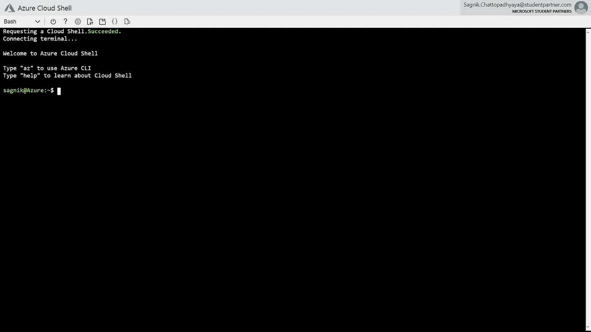
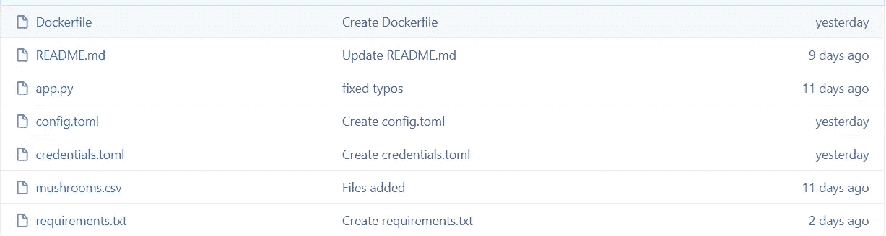
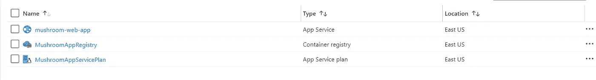
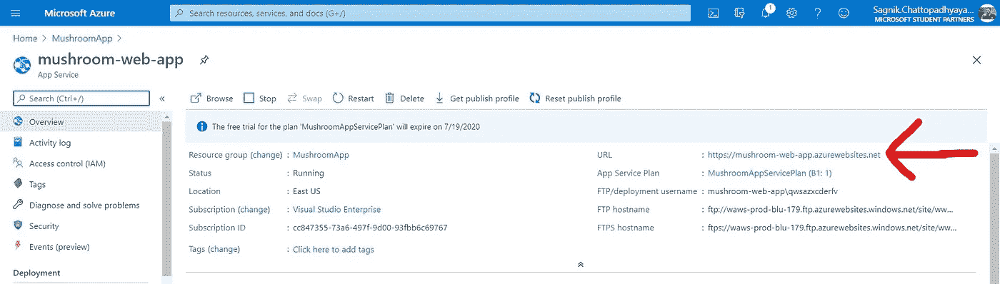
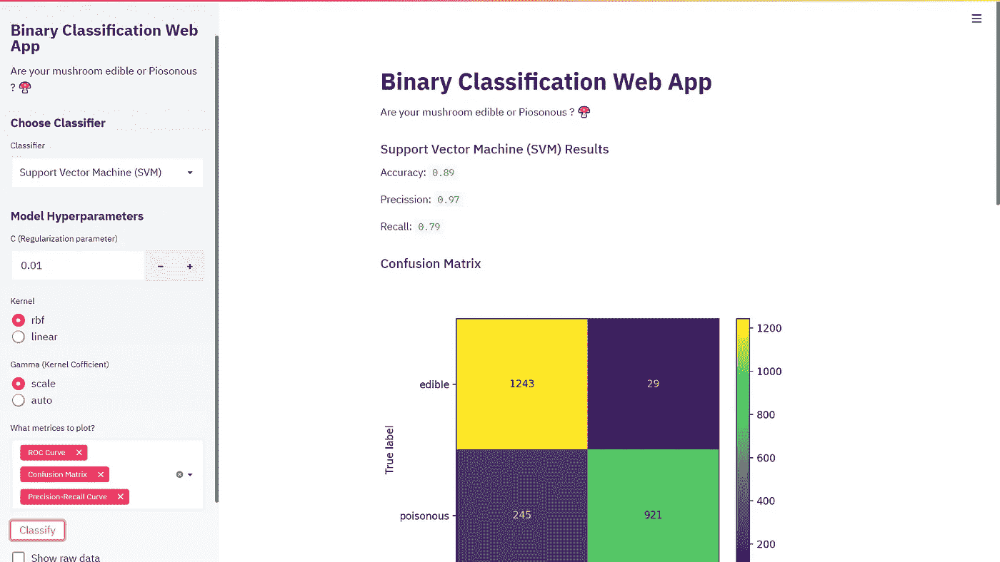

# 在 Azure 上部署机器学习 Web 应用程序

> 原文：<https://towardsdatascience.com/deploy-machine-learning-web-app-on-azure-df7c2faa7fec?source=collection_archive---------30----------------------->

## 使用 Azure Docker 容器将机器学习模型部署为 Web 应用程序的详细指南


照片由[安迪·凯利](https://unsplash.com/@askkell) 上**[Unsplash.com](https://unsplash.com/photos/0E_vhMVqL9g)**

**作为一名机器学习工程师，你的角色不仅限于构建模型，还包括使模型可部署。后期由 DevOps 团队处理。在这个故事中，我将一步一步地向您展示如何在 Azure 上部署 ML 分类 Web 应用程序。本文是由[微软学生合作伙伴](https://studentambassadors.microsoft.com/en-us)(印度)项目发起的 MSP 开发者故事的一部分。**

## ****流线****

**首先，您需要先构建一个 web 应用程序。为此，您可以使用 [*Streamlit*](https://docs.streamlit.io/en/latest/) 。这是一个基于 python 的开源框架，可以帮助你在几个小时内显示文本、图表、地图、数据框架、构建交互界面等等。第一步，你只需要在本地机器上构建一个 *app.py* 文件，并确保它看起来像预期的那样。**

**通过在 shell 中从保存 app.py 文件的文件夹运行`streamlit run app.py`来启动您的 Streamlit 应用程序。每当保存 app.py 文件时，本地 web 应用程序都会自动更新。**

**在本地机器上完成构建后，下一个任务是将它部署到实际的互联网上，供其他人随时查看。现在你不能使用 GitHub pages，因为 Streamlit web app 是一个非静态网站。但是你肯定可以使用 GitHub 库来将其部署到 Azure。**

**看看 GitHub 中的 [*我的代码，你就会明白做一个 Streamlit web app 是多么简单。*](https://github.com/sagnik20/ML-WebApp-using-Streamlit/blob/master/app.py)**

**Streamlit 的[入门](https://streamlit.io/docs/getting_started.html)教程将有助于学习 API，因此我将直接跳到 Streamlit web 应用程序的部署。**

**对于这个例子，我将发布一个二元分类模型，显示蘑菇是可食用的还是有毒的。我将使用[蘑菇数据集](https://archive.ics.uci.edu/ml/datasets/Mushroom)，你可以在我的 GitHub 上找到数据集[。](https://github.com/sagnik20/ML-WebApp-using-Streamlit/blob/master/mushrooms.csv)**

## ****建造码头集装箱****

**在您准备好发布 web 应用程序之后，您将在 Azure 容器注册中心创建一个 Docker 容器。该容器将包含运行 web 应用程序所需的所有文件。**

**我将完全使用 [Azure Shell](https://shell.azure.com/) ，但是你可以使用 [Azure Portal](https://portal.azure.com/) 或者在你的本地机器上安装 [Azure CLI](https://docs.microsoft.com/en-us/cli/azure/install-azure-cli?view=azure-cli-latest) 。使用 Azure Shell 或 Azure CLI 是完全一样的，不同的是一个你将从浏览器使用，另一个你将从终端使用。**

**一旦你打开 Azure Shell，你将被要求登录你的 Azure 帐户。但是，如果您使用的是 Azure CLI，请键入以下命令:**

```
az login
```

**在您登录到您的 shell 后，您可以看到类似这样的内容。**

****

**来源:打开我的个人资料截图**

**接下来，您需要一个资源组来保存您的容器注册表和 Web App 服务。为此，请键入以下内容**

```
az group create -l eastus -n MushroomApp
```

**如果你使用 Azure Portal，那么按照他们的[文档来构建资源组](https://docs.microsoft.com/en-us/azure/azure-resource-manager/management/manage-resource-groups-portal#create-resource-groups)。**

**这里的位置是**美国东部**，名字是 **MushroomApp** 。您可以将其命名为不同的名称，但请确保在接下来的步骤中进行适当的更改。**

**然后，您将在资源组下构建容器注册表。**

```
az acr create --name MushroomAppRegistry --resource-group MushroomApp --sku basic --admin-enabled true
```

**如果[您正在使用门户](https://docs.microsoft.com/en-us/azure/container-registry/container-registry-get-started-portal#create-a-container-registry)，请确保选择在上一步中创建的 *MushroomApp* 资源组。**

## ****Dockerfile、config 文件和 requirements.txt****

**回到你的 GitHub 库，添加几个有助于 web 应用运行的文件。首先，我们将制作 docker 文件。这将是 Docker 运行的指令。**

**关于编写 Dockerfile 的最佳实践，请参阅它们的官方文档。**

**[](https://docs.docker.com/develop/develop-images/dockerfile_best-practices/) [## 编写 docker 文件的最佳实践

### 本文档涵盖了构建高效映像的推荐最佳实践和方法。Docker 构建图像…

docs.docker.com](https://docs.docker.com/develop/develop-images/dockerfile_best-practices/) 

下面给出了可以用于这个项目的 docker 文件的代码。

对于配置文件，你需要 *config.toml* 和 *credentials.toml。*我推荐从他的 [awesome-streamlit 存储库中复制](https://github.com/MarcSkovMadsen/awesome-streamlit/tree/master/.streamlit) [MarcSkovMadsen](https://github.com/MarcSkovMadsen/awesome-streamlit/commits?author=MarcSkovMadsen) 的 config.toml 和 credentials.toml 文件。

接下来，您需要 *requirements.txt* 来添加运行 Web 应用程序所需安装的库。下面是 requirements.txt，我将在这个故事中使用。

```
streamlit
pandas
numpy
scikit-learn
matplotlib
```

在进入下一步之前，请确保您的 GitHub 存储库中有所有这些文件。



继续下一步之前需要的文件

接下来，我们将构建 docker 映像并保存到 Azure 容器注册表。

```
az acr build --registry MushroomAppRegistry --resource-group MushroomApp --image mushroom-app *<SOURCE_LOCATION>*
```

用您的 Git 克隆链接替换上面代码中的<source_location>。对于这个故事，我将使用的链接是[*https://github.com/sagnik20/ML-WebApp-using-Streamlit.git*](https://github.com/sagnik20/ML-WebApp-using-Streamlit.git)*。*</source_location>

如果构建成功，您可以看到类似于以下内容的输出: **Run ID: ca1 在 2m26s 后成功**。

如果您希望在容器注册表中看到图像，请登录到 Azure 门户并导航到您的资源组，单击您的容器注册表，然后在服务刀片下单击存储库。

## **从容器映像部署 Web 应用**

你需要为你的 Web 应用创建一个应用服务计划。这将决定运行 Web 应用程序的虚拟机的大小。sku 的默认值是 B1，仅是 Free 上面的第一层。我们将利用这一点。

所有可用的定价等级有:F1(免费)、D1(共享)、B1(基本小型)、B2(基本中型)、B3(基本大型)、S1(标准小型)、P1V2(高级 V2 小型)、PC2(高级集装箱小型)、PC3(高级集装箱中型)、PC4(高级集装箱大型)、I1(独立小型)、I2(独立中型)、I3(独立大型)。选择一个你需要的。

```
az appservice plan create -g MushroomApp -n MushroomAppServicePlan -l eastus --is-linux --sku B1
```

运行以上代码创建您的应用服务计划。

通过运行以下命令，从容器注册表中的 docker 容器创建 Azure Web App。

```
az webapp create -g MushroomApp -p MushroomAppServicePlan -n census-web-app -i mushroomappregistry.azurecr.io/mushroom-app:latest
```

或者你也可以从门户网站做同样的事情[。](https://docs.microsoft.com/en-us/learn/modules/deploy-run-container-app-service/5-exercise-deploy-web-app?pivots=javascript)

现在，您应该可以在资源组中看到 3 个资源。



要查看您的新网站，请转到蘑菇-网络-应用程序资源，然后单击下图右上角的 URL。



第一次查看时，会有冷启动延迟，大约 5 分钟后可能会没有响应。返回到资源，再次单击 URL，您的 web 应用程序将出现在您的浏览器中！

## **重新部署您的网络应用**

如果您需要对您的 *app.py* 文件进行任何更改，那么您可以通过重新部署您的 web 应用程序来轻松查看您的更改。再次运行下面的代码，替换 *<源位置>再次*。上面你已经做过一次了。

```
az acr build --registry MushroomAppRegistry --resource-group MushroomApp --image mushroom-app *<SOURCE_LOCATION>*
```

您可以添加功能或进行更改，只需重新部署 webapp 即可看到这些更改。

我构建的最终 web 应用程序看起来像这样👇



web 应用程序的屏幕截图

您也可以从:[https://mushroom-web-app.azurewebsites.net/](https://mushroom-web-app.azurewebsites.net/)查看并与之互动(抱歉，该链接暂时无效)。

# 结论

我们已经成功地使用 Docker 和 Azure 将我们的机器学习模型部署为 Web 应用程序。完整代码可以在我的 [GitHub Repo](https://github.com/sagnik20/ML-WebApp-using-Streamlit/tree/master) 上找到。** 

**感谢您的阅读！**

**我是 **Sagnik Chattopadhyaya** ，计算机科学大一新生(有机会)。推特: [@sagnik_20](https://twitter.com/sagnik_20?s=08) 。YouTube: [学习溢出](https://youtube.com/c/learnoverflow)**

**希望你能从这个故事中吸取教训。❤**

**快乐学习！🐱‍💻**