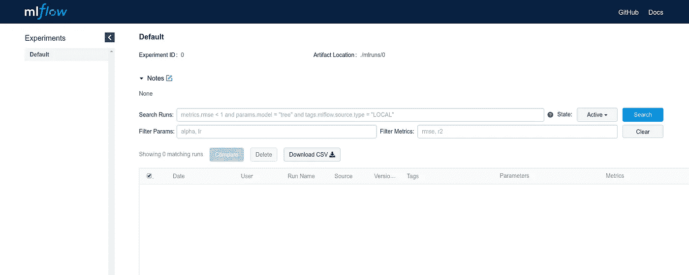

# 使用 docker compose 部署 MLflow

> 原文：<https://towardsdatascience.com/deploy-mlflow-with-docker-compose-8059f16b6039?source=collection_archive---------2----------------------->

## 机器学习

## 借助 docker-compose 轻松部署 MLflow，跟踪您的机器学习体验


[https://unsplash.com/](https://unsplash.com/)

在建立和训练机器学习模型的过程中，跟踪每个实验的结果非常重要。对于深度学习模型，TensorBoard 是一个非常强大的工具，可以记录训练表现，跟踪梯度，调试模型等等。我们还需要跟踪相关的源代码，尽管 Jupyter 笔记本很难版本化，但我们绝对可以使用 git 这样的 VCS 来帮助我们。然而，我们还需要一个工具来帮助我们跟踪实验环境、超参数的选择、用于实验的数据集、结果模型等。正如其网站上所述，MLflow 是为此目的而专门开发的

> MLflow 是一个管理 ML 生命周期的开源平台，包括实验、再现和部署。
> 
> [—https://mlflow.org/](https://mlflow.org/)

为此，MLflow 提供了组件`MLflow Tracking`，这是一个 web 服务器，允许跟踪我们的实验/运行。

在这篇文章中，我将展示设置这样一个跟踪服务器的步骤，我将逐步添加组件，这些组件最终将被收集到 docker-compose 文件中。如果 MLflow 必须部署在远程服务器上，例如 EC2 上，docker 方法特别方便，而不必在每次需要新服务器时手动配置服务器。

# **基本本地服务器**

安装 MLflow 服务器的第一步很简单，我们只需要安装 python 包。我假设 python 已经安装在您的机器上，并且您可以创建一个虚拟环境。为此，我发现 conda 比 pipenv 更方便

```
$ conda create -n mlflow-env python=3.7
$ conda activate mlflow-env
(mlflow-env)$ pip install mlflow
```

从这非常基本的第一步开始，我们的 MLflow 跟踪服务器就可以使用了，剩下的就是使用以下命令启动它:

```
(mlflow-env)$ mlflow server
```



*在* `[*http://localhost:5000*](http://localhost:5000*)`找到跟踪服务器 UI

我们还可以指定主机地址，告诉服务器监听所有公共 IP。虽然这是一种非常不安全的方法(服务器未经认证和加密)，但我们还需要在反向代理(如 NGINX)或虚拟专用网络中运行服务器来控制访问。

```
(mlflow-env)$ mlflow server — host 0.0.0.0
```

这里的`0.0.0.0` IP 告诉服务器监听所有传入的 IP。

# **使用 AWS S3 作为工件商店**

我们现在有一个正在运行的服务器来跟踪我们的实验和运行，但是为了更进一步，我们需要指定存储工件的服务器。为此，MLflow 提供了几种可能性:

*   亚马逊 S3
*   Azure Blob 存储
*   谷歌云存储
*   ftp 服务器
*   SFTP 服务器
*   网络文件系统
*   HDFS

因为我的目标是在云实例上托管 MLflow 服务器，所以我选择使用亚马逊 S3 作为工件商店。我们所需要的只是稍微修改一下命令来运行服务器

```
(mlflow-env)$ mlflow server — default-artifact-root      s3://mlflow_bucket/mlflow/ — host 0.0.0.0
```

其中`mlflow_bucket`是先前创建的 S3 桶。这里你会问“我的 S3 桶到底是怎么访问的？”。嗯，简单看一下[文件](https://www.mlflow.org/docs/latest/tracking.html#artifact-stores)呵呵

> MLflow 从您机器的 IAM 角色(一个~/中的配置文件)获取访问 S3 的凭证。aws/credentials 或环境变量 AWS_ACCESS_KEY_ID 和 AWS_SECRET_ACCESS_KEY，具体取决于哪一个可用。
> 
> —h[ttps://www . ml flow . org/docs/latest/tracking . html](https://www.mlflow.org/docs/latest/tracking.html#artifact-stores)

所以更实际的做法是使用 IAM 角色，特别是如果我们想在 AWS EC2 实例上运行服务器。概要文件的使用与环境变量的使用非常相似，但是为了便于说明，我将使用环境变量，这将在使用 docker-compose 时进一步解释。

# **使用后端存储**

## **SQLite 服务器**

所以我们的追踪服务器在 S3 上储存了艺术品，没问题。但是，超参数、注释等仍然存储在主机上的文件中。文件可以说不是一个好的后端存储，我们更喜欢数据库后端。MLflow 支持各种数据库方言(本质上与 SQLAlchemy 相同):`mysql`、`mssql`、`sqlite`和`postgresql`。

首先，我喜欢使用 SQLite，因为它是文件和数据库之间的妥协，因为整个数据库存储在一个文件中，可以很容易地移动。语法与 SQLAlchemy 相同:

```
(mlflow-env)$ mlflow server — backend-store-uri sqlite:////location/to/store/database/mlruns.db — default-artifact-root s3://mlflow_bucket/mlflow/ — host 0.0.0.0
```

## **MySQL 服务器**

请记住，我们希望使用 docker 容器，将这些文件存储在本地并不是一个好主意，因为我们会在每次重启容器后丢失数据库。当然，我们仍然可以在 EC2 实例上挂载一个卷和一个 EBS 卷，但是使用一个专用的数据库服务器会更简洁。为此，我喜欢使用 MySQL。因为我们将使用 docker 进行部署，所以让我们推迟 MySQL 服务器的安装(因为它将是一个来自官方 docker 映像的简单 docker 容器),并专注于 MLflow 的使用。首先，我们需要安装我们想要用来与 MySQL 交互的 python 驱动程序。我喜欢`pymysql`是因为它安装非常简单，非常稳定，并且有据可查。因此，在 MLflow 服务器主机上，运行以下命令

```
(mlflow-env)$ pip install pymysql
```

现在我们可以根据 SQLAlchemy 的语法更新命令来运行服务器

```
(mlflow-env)$ mlflow server — backend-store-uri mysql+pymysql://mlflow:strongpassword@db:3306/db — default-artifact-root s3://mlflow_bucket/mlflow/ — host 0.0.0.0
```

这里我们假设我们的服务器名是`db`，它监听端口`3306`。我们还使用用户`mlflow`和非常强的密码`strongpassword`。同样，它在生产环境中不是很安全，但是当使用 docker-compose 部署时，我们可以使用环境变量。

# **NGINX**

如前所述，我们将在反向代理 NGINX 后面使用 MLflow 跟踪服务器。为此，我们将再次使用一个官方的 docker 映像，并简单地用以下内容替换默认配置`/etc/nginx/nginx.conf`

nginx.conf

如果需要进一步定制，您可以使用这个基本配置文件。最后，我们将对存储在`/etc/nginx/sites-enabled/mlflow.conf`中的 MLflow 服务器进行配置

mlflow.conf

请注意用于引用 MLflow 应用程序`[http://web:5000](http://web:5000.)` [的 URL。](http://web:5000.)ml flow 服务器使用端口`5000`，应用程序将在 docker-compose 服务中运行，其名称将为`web`。

# **集装箱化**

如前所述，我们希望在 docker 容器中运行所有这些。该架构很简单，由三个容器组成:

*   一个 MySQL 数据库服务器，
*   一种 MLflow 服务器，
*   反向代理 NGINX

对于数据库服务器，我们将使用官方的 MySQL 镜像，不做任何修改。

对于 MLflow 服务器，我们可以在 debian slim 映像上构建一个容器。Dockerfile 文件非常简单:

MLflow 跟踪服务器容器的 Dockerfile

最后，NGINX 反向代理也是基于官方图片和之前的配置

NGINX 的 Dockerfile

# **用 docker-compose 收集**

现在我们已经设置好了，是时候把它们收集到 docker-compose 文件中了。然后，只需一个命令就可以启动我们的 MLflow 跟踪服务器，这非常方便。我们的 docker-compose 文件由三个服务组成，一个用于后端，即 MySQL 数据库，一个用于反向代理，一个用于 MLflow 服务器本身。看起来像是:

docker-compose.yml

首先要注意的是，我们构建了两个自定义网络来隔离前端(MLflow UI)和后端(MySQL 数据库)。只有`web`服务，即 MLflow 服务器可以与两者对话。其次，因为我们不想在容器关闭时丢失所有数据，所以 MySQL 数据库的内容是一个名为`dbdata`的挂载卷。最后，这个 docker-compose 文件将在 EC2 实例上启动，但是因为我们不想硬编码 AWS 键或数据库连接字符串，所以我们使用环境变量。这些环境变量可以直接位于主机上，或者位于 docker-compose 文件所在目录下的一个`.env`文件中。剩下的工作就是构建和运行容器

```
$ docker-compose up -d --build 
```

`-d`选项告诉我们想要在守护模式下执行容器，而`--build`选项表明我们想要在运行它们之前构建 docker 映像(如果需要的话)。

仅此而已！我们现在有了一个完美运行的远程 MLflow 跟踪服务器，可以在我们的团队之间共享。多亏了 docker-compose，只需一个命令就可以轻松地将该服务器部署到任何地方。

机器学习快乐！