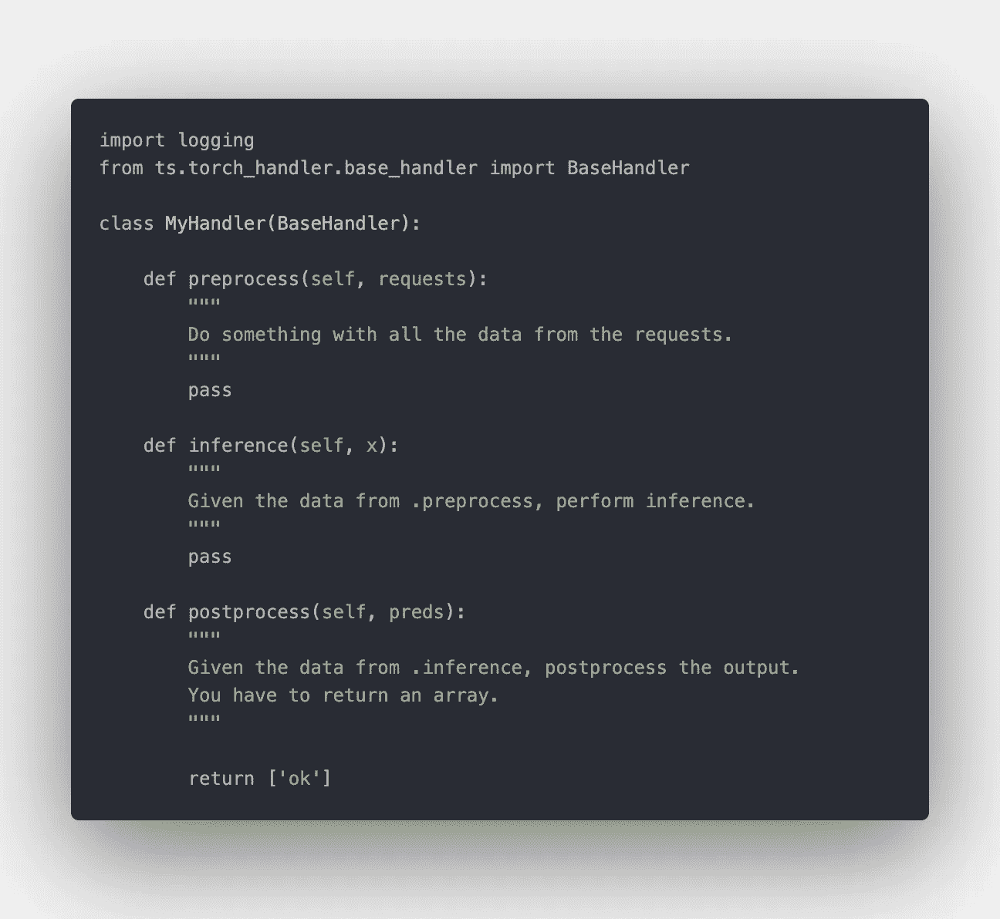
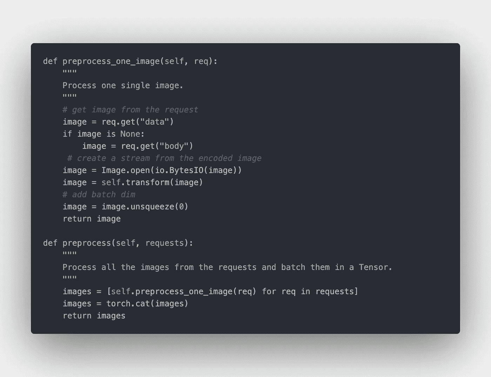
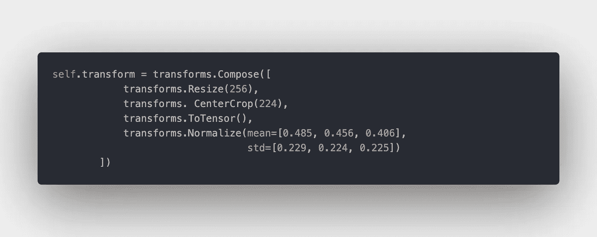
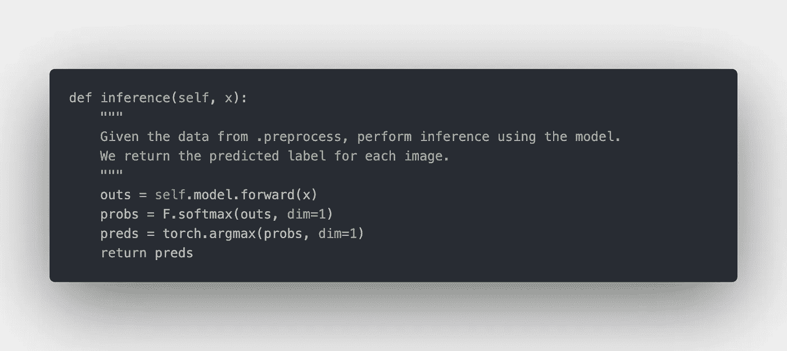
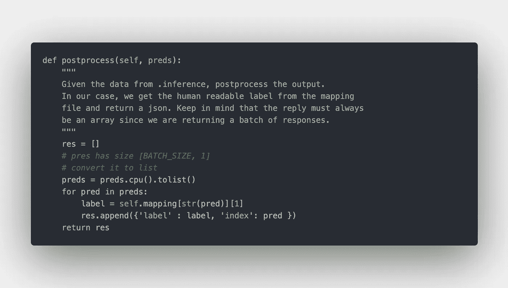
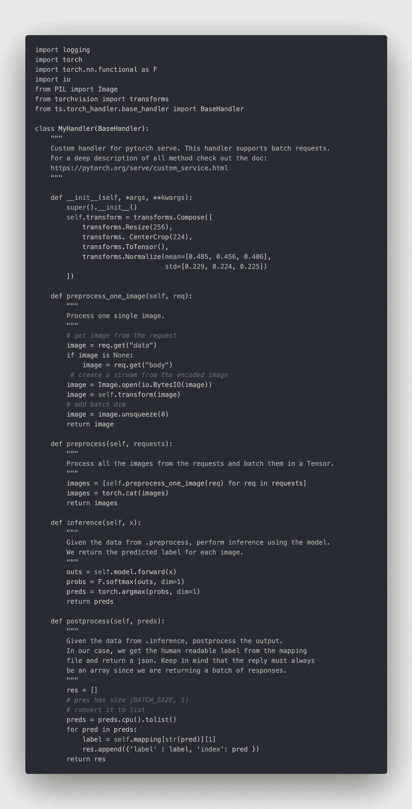
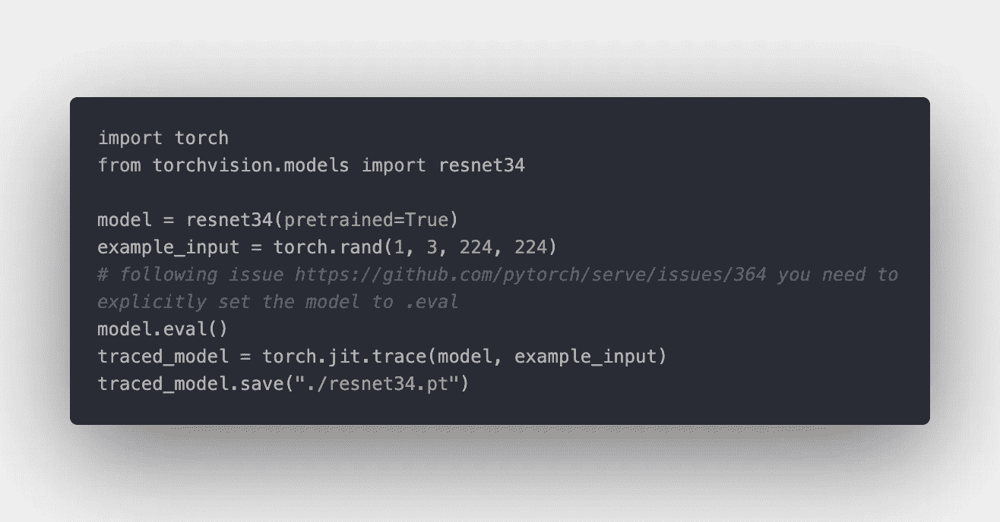
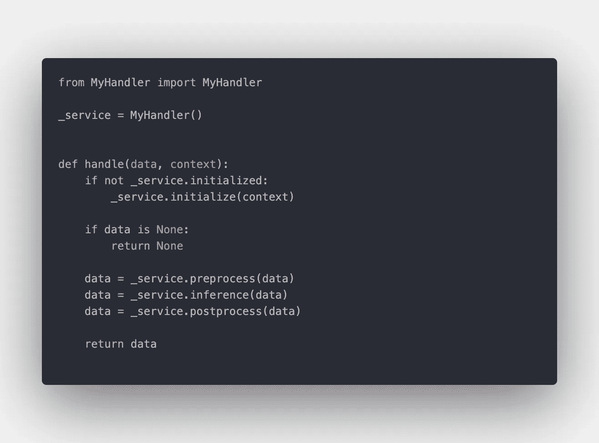

# 在 PyTorch 中部署模型🚀

> 原文：<https://towardsdatascience.com/deploy-models-and-create-custom-handlers-in-torchserve-fc2d048fbe91?source=collection_archive---------9----------------------->


由 SpaceX 在 Unsplash 上拍摄的照片

## 火炬来救援了！

*本文中使用的所有代码都是* [*这里的*](https://github.com/FrancescoSaverioZuppichini/torchserve-tryout)

最近，PyTorch 推出了名为`torchserve.`的新生产框架来适当地服务于模型，因此，不多说了，让我们来介绍一下今天的路线图:

1.  用 Docker 安装
2.  导出您的模型
3.  定义处理程序
4.  为我们的模型服务

为了展示 torchserve，我们将提供经过全面培训的 ResNet34 来执行图像分类。

# 用 Docker 安装

*公文* [*此处*](https://github.com/pytorch/serve/blob/master/README.md##install-torchserve)

安装 torchserve 最好的方法是用 docker。你只需要调出图像。

您可以使用以下命令保存最新的图像。

```
docker pull pytorch/torchserve:latest
```

所有的标签都可以在[这里](https://hub.docker.com/r/pytorch/torchserve/tags)

更多关于 docker 和 torchserve [这里](https://github.com/pytorch/serve#quick-start-with-docker)

# 经理人

*正式文件* [*此处*](https://github.com/pytorch/serve/blob/master/docs/custom_service.md)

处理程序负责使用您的模型从一个或多个 HTTP 请求中做出预测。

**默认处理程序**

Torchserve 支持以下默认处理程序

1.  `image_classifier`
2.  `object_detector`
3.  `text_classifier`
4.  `image_segmenter`

但是请记住，它们都不支持批处理请求！

**自定义处理程序**

torchserve 公开了一个丰富的接口，可以做几乎所有你想做的事情。An `Handler`只是一个必须有三个功能的类

*   预处理
*   推理
*   后处理

你可以创建自己的类或者子类`BaseHandler`。子类化`BaseHandler`的主要优点是可以在`self.model`访问加载的模型。下面的代码片段显示了如何子类化`BaseHandler`



子类化 BaseHandler 以创建您自己的处理程序

回到我们的图像分类例子。我们需要

*   从每个请求中获取图像并对其进行预处理
*   从模型中获得预测
*   发回回复

**预处理**

`.preprocess`函数接受一组请求。假设我们向服务器发送一个图像，可以从请求的`data`或`body`字段访问序列化的图像。因此，我们可以遍历所有请求，并单独预处理每幅图像。完整的代码如下所示。



预处理每个请求中的每个图像

`self.transform`是我们的预处理改造，没什么花哨的。对于在 ImageNet 上训练的模型，这是一个经典的预处理步骤。



我们的转变

在我们对每个请求中的每个图像进行预处理后，我们将它们连接起来以创建 pytorch 张量。

**推论**



对我们的模型进行推理

这一步非常简单，我们从`.preprocess`函数中得到张量，并提取每幅图像的预测。

**后处理**

现在我们有了对每幅图像的预测，我们需要向客户端返回一些东西。 **Torchserve 总是期望返回一个数组。** `BaseHandler`也会自动打开一个映射为`index -> label`的`.json`文件(我们稍后会看到如何提供这样的文件)并存储在`self.mapping`。我们可以为每个预测返回一个带有`label`和`index`类的字典数组



把所有东西都包起来，我们光荣的训练员看起来像



因为所有的处理逻辑都封装在一个类中，所以你可以很容易地对它进行单元测试！

# 导出您的模型

*公文* [*此处*](https://github.com/pytorch/serve/tree/master/model-archiver#creating-a-model-archive)

Torchserve 期望提供一个`.mar`文件。简而言之，这个文件就是你的模型和所有的依赖关系。创建一个需要首先导出我们的训练模型。

**导出模型**

有三种方法可以导出 torchserve 的模型。到目前为止，我发现的最好的方法是`trace`模型并存储结果。通过这样做，我们不需要添加任何额外的文件到 torchserve。

让我们看一个例子，我们将部署一个经过全面训练的 ResNet34 模型。



为此，我们:

*   加载模型
*   创建一个虚拟输入
*   使用`torch.jit.trace`通过模型追踪输入
*   保存模型

**创造。标记文件**

*公文* [*此处*](https://github.com/pytorch/serve/blob/master/model-archiver/README.md)

你需要安装`torch-model-archiver`

```
git clone https://github.com/pytorch/serve.git
cd serve/model-archiver
pip install .
```

然后，我们准备通过使用下面的命令来创建`.mar`文件

```
torch-model-archiver --model-name resnet34 \--version 1.0 \--serialized-file resnet34.pt \--extra-files ./index_to_name.json,./MyHandler.py \--handler my_handler.py  \--export-path model-store -f
```

按顺序。变量`--model-name`定义了我们模型的最终名称。这非常重要，因为它将是负责其预测的端点的名称空间。也可以指定一个`--version`。`--serialized-file`指向我们之前创建的存储的`.pt`模型。`--handler`是一个 python 文件，我们在其中调用我们的自定义处理程序。一般来说，它看起来总是这样:



my_handler.py

它公开了一个`handle`函数，我们从这个函数调用定制处理程序中的方法。您可以使用默认名称来使用默认句柄(例如`--handler image_classifier`)。

在`--extra-files`中，您需要传递您的处理程序正在使用的所有文件的路径。在我们的例子中，我们必须将路径添加到包含所有人类可读标签名称的`.json`文件和包含`MyHandler.`类定义的`MyHandler.py`文件中

一件小事，如果你传递一个`index_to_name.json`文件，它将被自动加载到处理程序中，并且可以在`self.mapping`访问。

`--export-path`是存储`.mar`文件的地方，我还添加了`-f`来覆盖其中的所有内容。

如果一切顺利，您应该会看到`resnet34.mar`被存储到`./model-store`中。

# 为我们的模型服务

这是一个简单的步骤，我们可以用所有需要的参数运行 torchserve docker 容器

```
docker run --rm -it \-p 3000:8080 -p 3001:8081 \-v $(pwd)/model-store:/home/model-server/model-store pytorch/torchserve:0.1-cpu \torchserve --start --model-store model-store --models resnet34=resnet34.mar
```

我将容器端口 8080 和 8081 分别绑定到 3000 和 3001(8080/8081 已经在我的机器上使用)。然后，我从`./model-store`(我们存储`.mar`文件的地方)到容器默认的`model-store`文件夹创建一个卷。最后，我通过填充`model-store`路径和一个键值对列表来调用`torchserve`，在这个列表中，我们为每个`.mar`文件指定了模型名称。

在这一点上，torchserve 有一个端点`/predictions/resnet34`，我们可以通过发送图像来获得预测。这可以使用`curl`来完成

```
curl -X POST [http://127.0.0.1:3000/predictions/resnet34](http://127.0.0.1:3000/predictions/resnet34) -T inputs/kitten.jpg
```


kitten.jpg .[来源](https://pixabay.com/it/photos/gatto-tabby-all-aperto-animali-1506960/)

回应

```
{
  "label": "tiger_cat",
  "index": 282
}
```

成功了！🥳

# 摘要

概括地说，在本文中，我们讨论了:

*   用 docker 安装火炬服务器
*   默认和自定义处理程序
*   模型档案生成
*   用 docker 服务最终模型

这里所有的代码都是

如果你喜欢这篇文章和 pytorch，你可能也会对我的其他文章感兴趣

[](/pytorch-deep-learning-template-6e638fc2fe64) [## PyTorch 深度学习模板

### 一个干净简单的模板来启动你的下一个 dl 项目🚀🚀

towardsdatascience.com](/pytorch-deep-learning-template-6e638fc2fe64) [](/pytorch-how-and-when-to-use-module-sequential-modulelist-and-moduledict-7a54597b5f17) [## Pytorch:如何以及何时使用模块、顺序、模块列表和模块指令

### Pytorch 1.5 更新

towardsdatascience.com](/pytorch-how-and-when-to-use-module-sequential-modulelist-and-moduledict-7a54597b5f17) 

感谢您的阅读。

弗朗西斯科