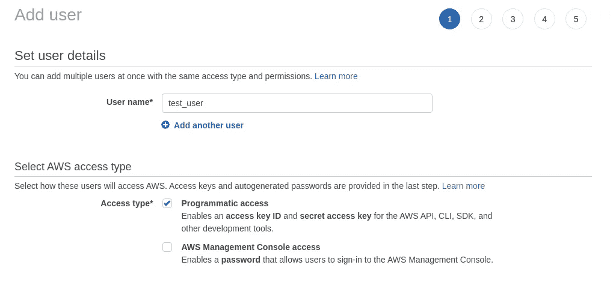
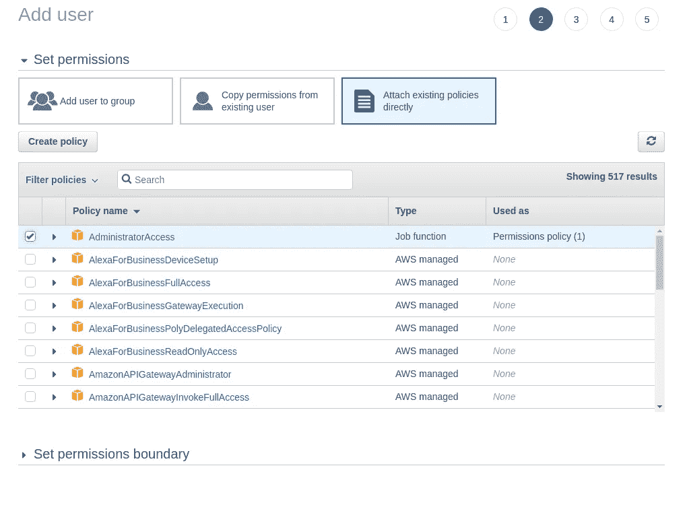
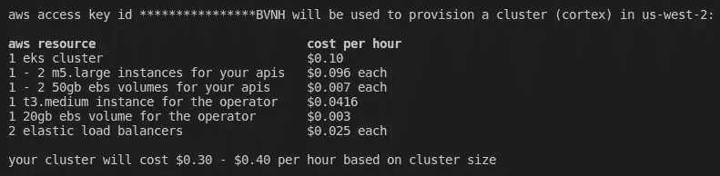

# 在 AWS 上部署、监控和扩展机器学习模型

> 原文：<https://towardsdatascience.com/deploy-monitor-and-scale-machine-learning-models-on-aws-408dfd397422?source=collection_archive---------27----------------------->

## Cortex 如何帮助数据科学家将他们的机器学习模型投入生产。


泰勒·维克在 [Unsplash](https://unsplash.com/s/photos/data-center?utm_source=unsplash&utm_medium=referral&utm_content=creditCopyText) 上的照片

部署健壮的和可扩展的机器学习解决方案仍然是一个相当手工和复杂的过程，需要大量的人工参与和努力。因此，新产品和服务需要很长时间才能上市，或者在原型状态下被放弃，从而降低了行业内的兴趣。**那么，我们如何才能促进将机器学习模型投入生产的过程呢？**

Cortex 是一个开源平台，用于将机器学习模型部署为生产 web 服务。它利用强大的 AWS 生态系统根据需要部署、监控和扩展与框架无关的模型。其主要特点可归纳如下:

*   **框架无关:** Cortex 支持任何一段 python 代码；TensorFlow、PyTorch、scikit-learn、XGBoost 都是由库支持的，就像任何其他 python 脚本一样。
*   **自动伸缩:** Cortex 自动伸缩您的 API，以处理生产工作负载。
*   **CPU / GPU 支持:** Cortex 可以运行在使用 AWS IaaS 作为其底层基础设施的 CPU 或 GPU 环境上。
*   **Spot 实例:** Cortex 支持 EC2 spot 实例以降低成本。
*   **滚动更新:** Cortex 在不停机的情况下将任何更新应用于模型。
*   **日志流式传输:** Cortex 保存来自已部署模型的日志，并使用类似 docker 的熟悉语法将它们流式传输到您的 CLI。
*   **预测监控:** Cortex 监控网络指标，跟踪预测。
*   **最小配置:** Cortex 部署配置被定义为一个简单的 YAML 文件。

在这个故事中，我们使用 Cortex 在 AWS 上部署一个图像分类模型作为 web 服务。那么，事不宜迟，我们来介绍一下 Cortex。

> [学习率](https://mailchi.mp/d2d2d4a109b5/learning-rate-newsletter)是为那些对 AI 和 MLOps 的世界感到好奇的人准备的时事通讯。你会在每周五收到我关于最新人工智能新闻和文章的更新和想法。在这里订阅！

# 将您的模型部署为 Web 服务

对于这个例子，我们使用了 [fast.ai](https://pypi.org/project/fastai/) 库，并从相关 [MOOC](https://course.fast.ai/) 的第一门课程中借用了 pets 分类模型。接下来的部分将介绍 Cortex 的安装和 pets 分类模型作为 web 服务的部署。

## 装置

如果您还没有这样做，那么您应该做的第一件事就是在 AWS 上创建一个新的用户帐户，并提供编程访问。为此，选择`IAM`服务，然后从右侧面板选择`Users`，最后按下`Add User`按钮。为您的用户命名，然后选择`Programmatic access`。



接下来，在`Permissions`屏幕中选择`Attach existing policies directly`选项卡并选择`AdministratorAccess`。



您可以将标签页留空，查看并创建您的用户。最后，记下**访问密钥 ID** 和**秘密访问密钥。**

当您在 AWS 控制台上时，您还可以创建一个`S3`桶，来存储训练好的模型和您的代码可能产生的任何其他工件。你可以给这个桶取任何你喜欢的名字，只要它是一个唯一的名字。对于这个故事，我们创建了一个名为`cortex-pets-model`的桶。

下一步，我们必须在系统上安装 Cortex CLI 并启动 Kubernetes 集群。要安装 Cortex CLI，请运行以下命令:

```
bash -c “$(curl -sS https://raw.githubusercontent.com/cortexlabs/cortex/0.14/get-cli.sh)"
```

> 通过访问相应的[文档](https://www.cortex.dev/)部分，检查您是否安装了最新版本的 Cortex CLI

我们现在准备设置我们的集群。使用 Cortex 创建 Kubernetes 集群很简单。只需执行下面的命令:

```
cortex cluster up
```

Cortex 将要求您提供一些信息，例如您的 AWS 键、您想要使用的区域、您想要启动的计算实例以及它们的数量。Cortex 还会让您知道使用您选择的服务将支付多少费用。整个过程可能需要 20 分钟。



## 训练您的模型

Cortex 不关心你如何创建或训练你的模型。对于这个例子，我们使用 fast.ai 库和[牛津-IIIT Pet 数据集](https://www.robots.ox.ac.uk/~vgg/data/pets/)。该数据集包含 37 种不同品种的狗和猫。因此，我们的模型应该将每张图片分为这 37 个类别。

创建一个`trainer.py`文件，如下图所示。

在本地运行脚本，就像任何其他 python 脚本一样:`python trainer.py`。但是，一定要提供您的 AWS 凭证和`S3` bucket 名称。这个脚本获取数据，处理它们，符合预先训练的 ResNet 模型，并上传到`S3`。当然，您可以扩展这个脚本，使用多种技术使模型更加准确——更复杂的架构、有区别的学习率、针对更多时期的训练——但这与我们这里的目标无关。如果您想进一步了解 ResNet 架构，请阅读下面的文章。

[](/xresnet-from-scratch-in-pytorch-e64e309af722) [## Pytorch 中从头开始的 xResNet

### 从你的 ResNet 架构中挤出一点额外的东西。

towardsdatascience.com](/xresnet-from-scratch-in-pytorch-e64e309af722) 

## 部署您的模型

既然我们已经在`S3`上训练并存储了我们的模型，下一步就是将它作为 web 服务部署到生产中。为此，我们创建一个 python 脚本，名为`predictor.py`，如下图所示:

该文件定义了一个预测器类。当它被实例化时，它从`S3`中检索模型，将其加载到内存中，并定义一些必要的转换和参数。在推断过程中，它从给定的`URL`中读取图像，并返回预测类的名称。预测器的接口正是如此。一个用于初始化的`__init__`方法和一个用于接收有效载荷并返回结果的`predict`方法。

预测器脚本有两个附带文件。记录库依赖关系的`requirements.txt`文件(如 pytorch、fastai、boto3 等。)和一个 YAML 配置文件。最低配置如下所示:

在这个 YAML 文件中，我们定义了运行哪个脚本进行推理，在哪个设备(例如 CPU)上运行，以及在哪里找到训练好的模型。文档中提供了更多选项。

最后，项目的结构应该遵循下面的层次结构。请注意，这只是最低要求，但是如果您已经为部署准备好了模型，您可以提交`trainer.py`。

```
- Project name
    |----trainer.py
    |----predictor.py
    |----requirements.txt
    |----cortex.yaml
```

准备就绪后，您可以简单地运行`cortex deploy`，几秒钟后，您的新端点就可以接受请求了。执行`corted get pets-classifier`监控端点并查看更多详细信息。

```
status   up-to-date   requested   last update   avg request   2XX   
live     1            1           13m           -             -endpoint: [http://a984d095c6d3a11ea83cc0acfc96419b-1937254434.us-west-2.elb.amazonaws.com/pets-classifier](http://a984d095c6d3a11ea83cc0acfc96419b-1937254434.us-west-2.elb.amazonaws.com/pets-classifier)
curl: curl [http://a984d095c6d3a11ea83cc0acfc96419b-1937254434.us-west-2.elb.amazonaws.com/pets-classifier?debug=true](http://a984d095c6d3a11ea83cc0acfc96419b-1937254434.us-west-2.elb.amazonaws.com/pets-classifier?debug=true) -X POST -H "Content-Type: application/json" -d [@sample](http://twitter.com/sample).jsonconfiguration
name: pets-classifier
endpoint: /pets-classifier
predictor:
  type: python
  path: predictor.py
  config:
    bucket: cortex-pets-model
    device: cpu
    key: model.pkl
compute:
  cpu: 200m
autoscaling:
  min_replicas: 1
  max_replicas: 100
  init_replicas: 1
  workers_per_replica: 1
  threads_per_worker: 1
  target_replica_concurrency: 1.0
  max_replica_concurrency: 1024
  window: 1m0s
  downscale_stabilization_period: 5m0s
  upscale_stabilization_period: 0s
  max_downscale_factor: 0.5
  max_upscale_factor: 10.0
  downscale_tolerance: 0.1
  upscale_tolerance: 0.1
update_strategy:
  max_surge: 25%
  max_unavailable: 25%
```

剩下的就是用`curl`和一只博美犬的图像来测试它:

```
curl [http://a984d095c6d3a11ea83cc0acfc96419b-1937254434.us-west-2.elb.amazonaws.com/pets-classifier](http://a984d095c6d3a11ea83cc0acfc96419b-1937254434.us-west-2.elb.amazonaws.com/pets-classifier?debug=true) -X POST -H "Content-Type: application/json" -d '{"url": "[https://i.imgur.com/HPRQ28l.jpeg](https://i.imgur.com/HPRQ28l.jpeg)"}'
```

## 打扫

当我们完成服务和集群时，我们应该释放资源以避免额外的成本。Cortex 让这一切变得简单:

```
cortex delete pets-classifier
cortex cluster down
```

# 结论

在这个故事中，我们看到了如何使用 Cortex，这是一个开源平台，用于将机器学习模型部署为生产 web 服务。我们训练了一个图像分类器，将其部署在 AWS 上，监控其性能并对其进行测试。

对于更高级的概念，如预测监控、滚动更新、集群配置、自动扩展等，请访问官方文档[网站](https://www.cortex.dev/)，以及该项目的 GitHub [页面](https://github.com/cortexlabs/cortex)。

> **我叫 Dimitris Poulopoulos，是希腊比雷埃夫斯大学***[**BigDataStack**](https://bigdatastack.eu/)***的机器学习研究员和博士(c)。我曾为欧洲委员会、欧盟统计局、国际货币基金组织、欧洲中央银行、经合组织和宜家等主要客户设计和实施人工智能和软件解决方案。如果你有兴趣阅读更多关于机器学习、深度学习和数据科学的帖子，请在 twitter 上关注我的****[](https://medium.com/@dpoulopoulos)****[**LinkedIn**](https://www.linkedin.com/in/dpoulopoulos/)**或**[**@ james2pl**](https://twitter.com/james2pl)**。********