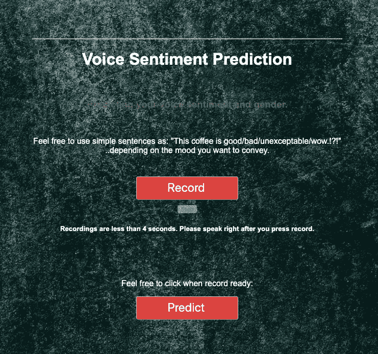
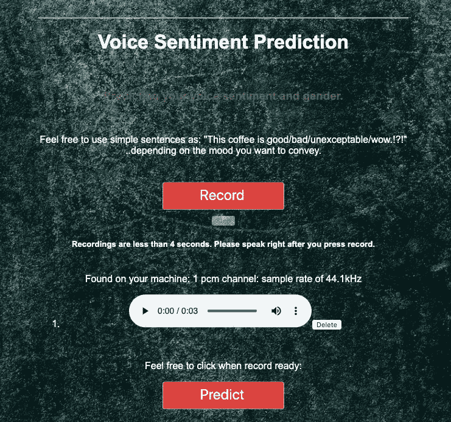
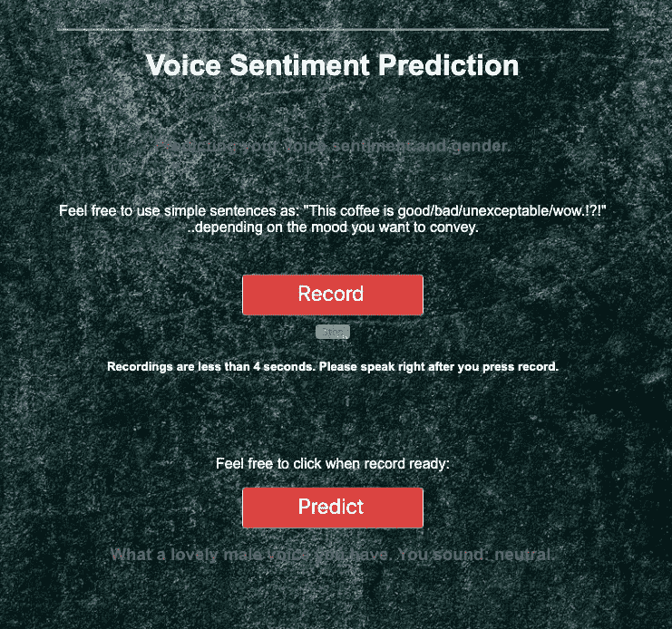

# 使用 Flask、Docker 和 AWS Beanstalk 部署神经网络

> 原文：<https://towardsdatascience.com/deploy-neural-network-with-flask-docker-and-aws-beanstalk-6fd34373497a?source=collection_archive---------32----------------------->

## 如何部署预测语音情感的机器学习多类分类 Keras 模型？



第一部分:
构建 NN 模型，Flask 应用程序，包括用于录音机的 Html、CSS、js。

第二部分:
如何为你的 Docker 镜像选择合适的配置。

第三部分:
在 AWS 弹性豆茎上部署以及如何调整录音笔。

以上所有内容也包含常见的故障排除。其中一些你会在我的 [StackOverflow](https://stackoverflow.com/users/11541027/daniel-moraite) 上找到。

**第一部分** :
为什么要声情并茂？由于过去十年技术的指数增长，生活方式发生了变化，人们要求更快、更容易地使用服务。许多公司确实续签了合同，并且只通过一个电话就获得了合法有效的客户协议。更不用说所有的营销，客户成功和销售使用。从语音输入/电话中预测客户的情绪变得非常必要。

现在我们来看看语音情感模型。
用于训练模型的数据集:在受控环境中包含不同的说话者，主要是演员，并且确实传达了以下情绪，对于女性和男性:**愤怒、厌恶、恐惧、高兴、中立、悲伤、惊讶**。(14 节课——因为把女声和男声分开训练总是明智的)。

为了从音频中提取和转换数据特征(梅尔频率倒谱系数: *MFCC* ),我使用了 *LibROSA* 。使用Keras 建立**模型**:*顺序*带 *Conv1D* 层带*批处理规范化*、 *Dropout、*和 *MaxPooling1D* 。请随意试用我的 [Kaggle 内核](https://www.kaggle.com/dannydoeslight/voice-sentiment-a-quick-look)。

**Flask 应用**:向用户请求数据，并保存为 WAV 文件，以便以后处理和预测。这里需要记住几件事:

*   确保您的应用程序文件的名称是: *application.py* 和`application=FLASK(__name__)`
*   当谈到 Keras 和 Flask 时:你会发现 **Keras 不是线程安全的**，你需要使用`model._make_predict_function()` 为什么会这样，如何解决，在[我的 StackOverflow 解决方案](https://stackoverflow.com/questions/53391618/tensor-tensorpredictions-softmax0-shape-1000-dtype-float32-is-not-an/59238039#59238039)上找到它(这里你得到了使用上述方法的优点和缺点[。](https://stackoverflow.com/questions/40850089/is-keras-thread-safe/59237758#59237758)

在我的 [Github repo](https://github.com/DanielMoraite/NN-Deploy-with-Docker-and-AWS-Beanstalk) 中找到**录音机**的 Html、CSS 和 **js** 。可以在 recapp.js 中修改录音时间，只要记住 1 秒=1000 毫秒:`setTimeout(function(){console.log("Recording:time up");stopRecording();},4000);`



**第二部分** :
我首先用 AWS Beanstalk 部署了 Flask 应用程序，发现服务器错误日志并不是那么详细和清晰，所以我发现 Docker 错误日志非常有用。

当然，Docker 附带了许多其他的一体化工具和功能，使得构建环境变得更加简单和紧凑。

这将帮助您在构建 Docker 映像和处理故障排除时做出正确的选择:

*   从一开始就考虑容器/图像大小的限制，并为 python 图像选择正确的版本。你将在你的 docker 文件中设置这个:`FROM python:3.6-slim`(注意:现在将避免 Alpine Linux，因为一些不合适的东西:更少的库，不同的 C 库，等等。).选择最精简版本的唯一问题是，你可能需要安装一些库/依赖项。而且可能相当麻烦… python 依赖项，如 LibROSA、GCC 等的声音文件..
*   您可能需要安装系统软件包，为此，您将需要安装 sudo。附注:当提示 Y/N 时，不要忘记使用 *-y* ，否则如果没有键盘输入，安装将中止。
*   对于音频安装 *libsndfile1-dev* (这应该可以解决 Linux 和 Ubuntu 的所有问题)。
*   确保在一次运行中运行所有内容，以避免创建中间映像:

```
RUN apt-get update && \
      apt-get -y --no-install-recommends install sudo && \
      sudo apt-get -y --no-install-recommends install libsndfile1-dev && \
      pip install --no-cache-dir -r requirements.txt && \
      sudo rm -rf /var/lib/apt/lists/*
```

*   要确保软件包不安装主动提供的依赖项:
    - `sudo --no-install-recommends` 或`pip instal --no-deps #no dependencies` 尽管这在处理 Tensorflow 和 Keras(如 Scikit-learn、SciPy 等)时可能会很麻烦。)
    - `pip instal --no-cache-dir`有助于额外的缓存，
    -也有助于清理剩菜:`sudo rm -rf /var/lib/apt/lists/*`
*   docker 文件中的其他行应该涵盖申请的其余部分，如:

```
WORKDIR /deploy/   # pick your working directory
COPY . .           # useful for copying all folders and subfoldersEXPOSE 5000        # set port 5000 for Flask app
CMD [“python”, “application.py”]  #application to be run
```



亚马逊网络服务和弹性豆茎看起来是个不错的选择。

我已经遵循了创建单个容器 docker 环境[的所有说明。](https://docs.aws.amazon.com/elasticbeanstalk/latest/dg/single-container-docker.html)

如果你使用 AWS 控制台，事情就很简单了。如果您使用 AWS/EB CLI，请确保在安装 EB CLI 后设置路径:

```
echo 'export PATH="/Users/Daniel/.ebcli-virtual-env/executables:$PATH"' >> ~/.bash_profile && source ~/.bash_profile
```

您在 beanstalk 中创建新的应用程序和环境，上传 docker 应用程序文件夹内容的归档/zip。从控制台中，您可以修改容量、想要使用的*实例*、环境类型*(负载平衡、自动伸缩)等等。*

现在我们来看看故障排除:

*   现在所有问题都已解决并部署完毕，您可以访问 AWS beanstalk **Http** 链接，该链接将您带到您的应用程序，您可能会发现您的语音应用程序运行得非常好，只是您可以通过 web 浏览器请求访问您用户的麦克风。答案很简单:确保你在 https 上运行它。
*   然后 **OpenSSL** 注册并获得**密钥**以及自己签署 **RSA** (仅用于开发目的)。并将所有内容添加到 docker 下的 YAML 或 JSON 文件中。ebextensions”文件夹。(在我的 [GitHub](https://github.com/DanielMoraite/NN-Deploy-with-Docker-and-AWS-Beanstalk) 上找到)
*   如果你是 Mac 用户，遇到 __MACOSX/错误，只需[在命令行`zip -d Archive.zip __MACOSX/\*`中对你的文档执行](https://stackoverflow.com/questions/29051274/configuring-ssl-on-elastic-beanstalk-single-instance/59459665#59459665)操作
*   如果你得到的错误为*配置文件。应用程序版本…中的 ebextensions/filename.config 包含无效的 YAML 或 JSON。YAML 异常:无效的 Yaml:在解析"<阅读器>"行*…等中的块映射时。:确保您的 RSA 密钥行对齐并且与 YAML 兼容。
*   为 HTTPS 配置 AWS Beanstalk 单实例 SSL 的结论(针对 Docker env):在花时间搞清楚 YAML 和制表符与空格(或者在键页脚后没有空格，或者..)在我的编辑器( *Atom/Packages/Whitespace* )，甚至将 YAML 转换为 JSON(*Atom/Packages/YAML _ JSON 转换器*)中，我已经意识到**初始密钥被破解**，不得不 ***生成一个新的集合！！！***

以上所有代码和指令都可以通过我的 [StackOverflow](https://stackoverflow.com/questions/29051274/configuring-ssl-on-elastic-beanstalk-single-instance/59459665#59459665) response 找到。

我希望这有所帮助(并且**为你节省了几天的辛苦工作**)现在你的应用程序运行顺利，你也喜欢这些预测。我的 Github 上提供的模型给出了略低于 *50%的准确度*——尽管乍一看这对于多类分类来说是相当好的。

保重，祝大家 2020 年*，*

指数级增长和创新的新十年！！！

丹尼尔（男子名）