# 在 Heroku 上部署 Python Tesseract OCR

> 原文：<https://towardsdatascience.com/deploy-python-tesseract-ocr-on-heroku-bbcc39391a8d?source=collection_archive---------13----------------------->

## 如何在 Heroku 上创建 OpenCV + Tesseract OCR 的一步一步的方法(包括截图和代码)


在数据科学领域工作了近五年后，我意识到，我们中的许多人专注于并强调提高算法的准确性，而不是专注于算法在现实生活中的可用性。这通常会导致业务团队和数据科学团队之间期望管理的差异。而且，即使我们创造了一个最复杂的算法，它也没有用，直到有效地部署在核心源。在这篇博客中，我们将学习如何在 Heroku 平台上使用 Python 编写的 Tesseract & OpenCV 部署 OCR。

# 但是首先，什么是 Heroku？

Heroku 是一个云平台，一种支持多种编程语言的服务。支持 Java、Node.js、Scala、Clojure、Python、PHP、Go 等多种编码语言。它为开发人员提供了跨大多数语言以相似的方式构建、运行和扩展应用程序的功能。
简而言之——我们可以使用 Heroku 将我们的 python 模型部署到生产环境中，这样它可以被任何人使用，并且不依赖于我的桌面或操作系统。

*那么我们实际上要做什么？*

# 索引

1.  在 Python 上创建一个 Tesseract OCR + OpenCV 代码
2.  冻结依赖关系
3.  创建 Procfile
4.  创建 Aptfile
5.  配置 Heroku 帐户
6.  把代码复制到 Heroku 服务器上
7.  添加构建包和配置文件
8.  测试我们的 OCR 应用程序

# **在 Python 上创建一个 Tesseract OCR + OpenCV 代码**

上面提到的代码执行以下操作:
→输入:图像文件(。jpg，。png 等)
→ OpenCV:读取图像
→ Tesseract:对图像执行 OCR&打印出文本
→ FastAPI:将上面的代码包装起来，创建一个可部署的 API

```
###########pythoncode.py###############import numpy as np
import sys, os
from fastapi import FastAPI, UploadFile, File
from starlette.requests import Request
import io
import cv2
import pytesseract
import re
from pydantic import BaseModeldef read_img(img):
 pytesseract.pytesseract.tesseract_cmd = ‘/app/.apt/usr/bin/tesseract’
 text = pytesseract.image_to_string(img)
 return(text)

app = FastAPI()class ImageType(BaseModel):
 url: str[@app](http://twitter.com/app).post(“/predict/”) 
def prediction(request: Request, 
 file: bytes = File(…)):if request.method == “POST”:
 image_stream = io.BytesIO(file)
 image_stream.seek(0)
 file_bytes = np.asarray(bytearray(image_stream.read()), dtype=np.uint8)
 frame = cv2.imdecode(file_bytes, cv2.IMREAD_COLOR)
 label = read_img(frame)
 return label
 return “No post request found”
```

*pytesserac . pytesserac . tesserac _ cmd = '/app/。' apt/usr/bin/tesseract' —* 这是一行非常重要的代码，不要忘记将它添加到您的代码中。

# 冻结依赖关系

我们需要将项目相关的依赖项(使用的库)保存在 *requirements.txt* —快速快捷方式中

```
pip freeze > requirements.txt
```

# 创建 Procfile

***Procfile****—*Heroku 应用包含一个 proc file，指定应用在启动时执行的命令。您可以使用 Procfile 来声明各种**过程类型**，包括:

*   你的应用程序的 web 服务器
*   多种类型的工作进程
*   单一进程，如时钟
*   部署新版本之前要运行的任务

```
web: gunicorn -w 4 -k uvicorn.workers.UvicornWorker pythoncode:app
```

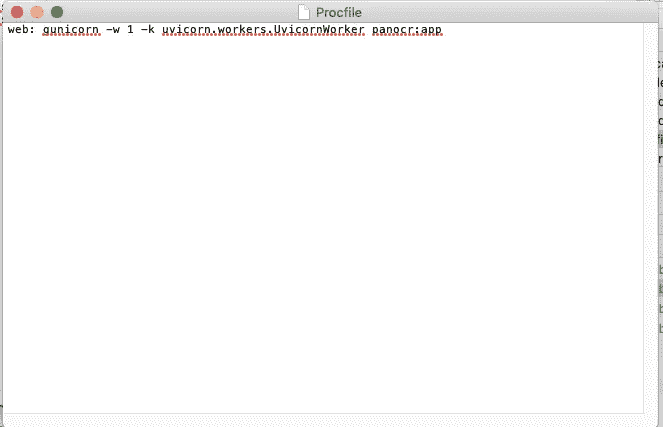

*注意，有* ***没有*** *扩展名的 Procfile*

# 创建 Aptfile

Heroku 不支持几个 python 包。为了让他们在 Heroku 上工作，我们需要使用*构建包*。*(我们将为宇宙魔方创建一个)。*然后通过在应用程序的`Aptfile`中包含任何 APT 包来使用这个包。当我们部署您的应用程序时，buildpack 会在 dyno 上安装这些包。

出于我们的目的，我们将在 Aptfile 中添加以下内容

```
tesseract-ocr
tesseract-ocr-eng
```

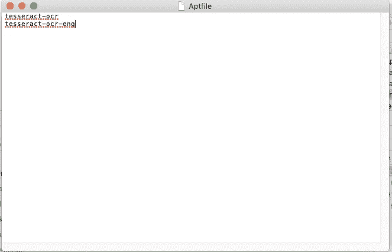

*注意 Aptfile* 有 ***没有*** *扩展名*

*注意:我们将在 Heroku 控制台*上添加宇宙魔方***build pack***

*最后，将所有这些文件保存在一个文件夹中*

*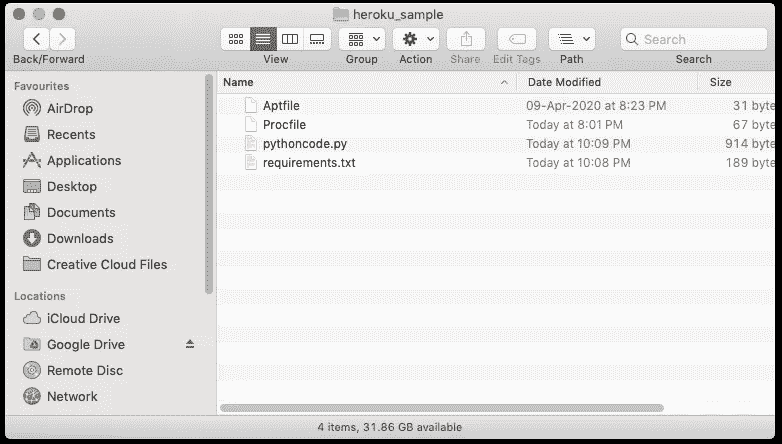*

# *配置 Heroku 帐户*

*→创建新账户或登录 https://id.heroku.com/login*

**

*→创建一个新的应用程序，并为其命名*

*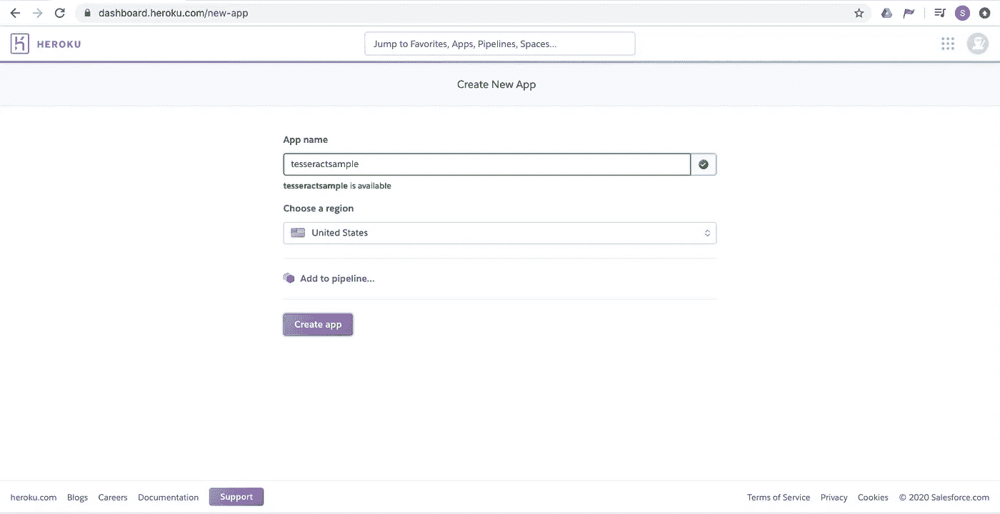*

*→您应该已经登录控制台*

*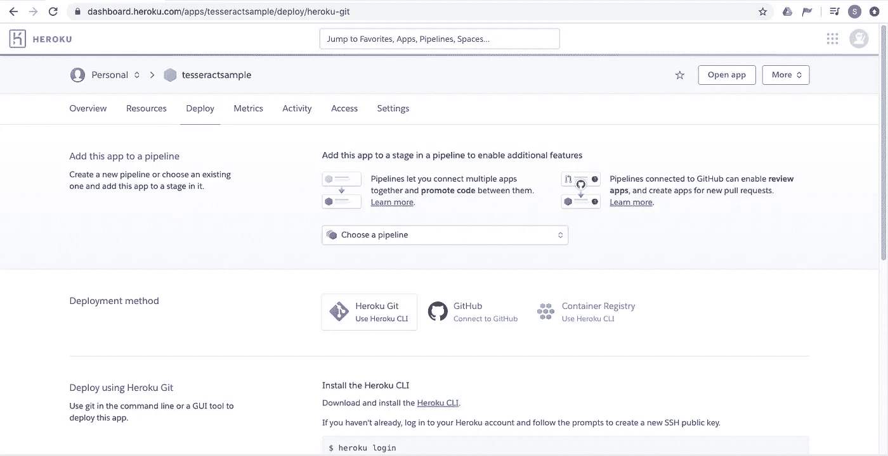*

# *把代码复制到 Heroku 服务器上*

*我使用 Heroku CLI(命令行界面)在 Heroku 上推送代码，但是你也可以使用 Github。Github 对代码的推送次数有每日限制，因此我更喜欢使用 CLI。*

*Heroku 为用户非常清晰地描述了步骤*

*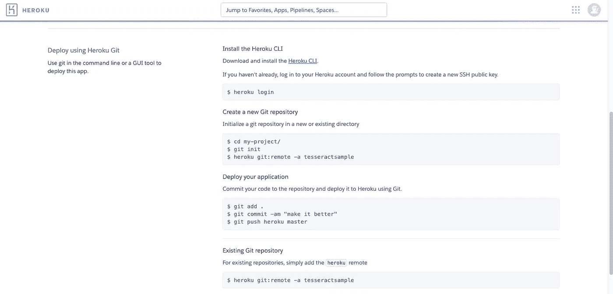*

*这将与命令行中的以下内容相关联-*

```
*$ heroku login
$ cd /Users/shirishgupta/Desktop/Heroku/heroku_sample/
$ git init
$ heroku git:remote -a tesseractsample*
```

*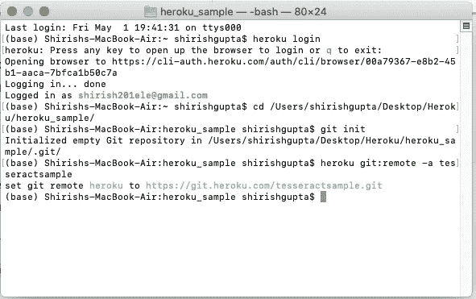*

```
*$ git add .
$ git commit -am "make it better"
$ git push heroku master*
```

*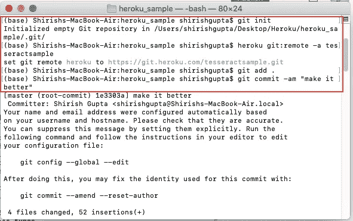**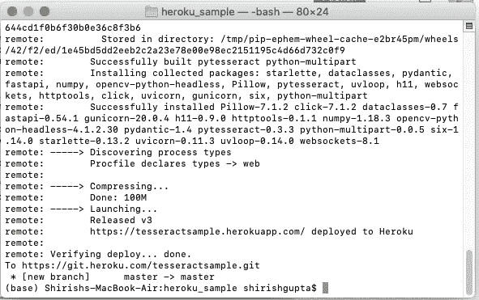*

*这表明应用程序已经部署，但我们仍然需要做一件事，才真正使它工作。*

# *添加**构建包***

*→在 Heroku 控制台中，转到**设置** →添加以下构建包*

```
*[https://github.com/heroku/heroku-buildpack-apt](https://github.com/heroku/heroku-buildpack-apt)*
```

*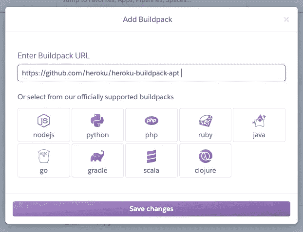*

*→添加宇宙魔方配置文件*

```
*TESSDATA_PREFIX = ./.apt/usr/share/tesseract-ocr/4.00/tessdata*
```

*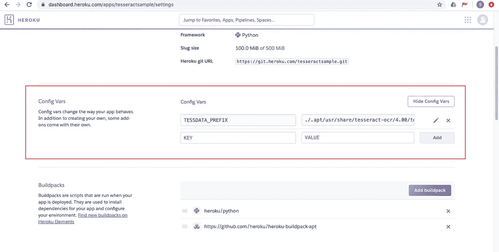*

****提示——在 heroku 终端*** 中输入以下内容，找到宇宙魔方的正确路径*

```
*$ heroku run bash
$ find -iname tessdata*
```

*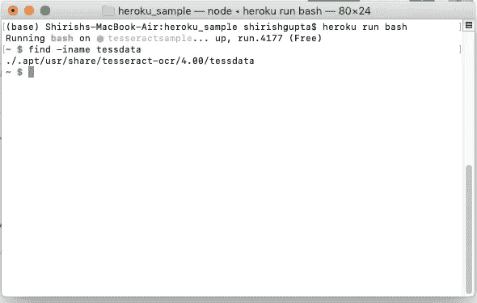*

# *测试我们的 OCR 应用程序*

*完成所有步骤后，我们就可以开始测试 OCR 了。前往 heroku consule:
***打开 App***或输入**'**[**https://tesseractsample.herokuapp.com/docs**](https://tesseractsample.herokuapp.com/docs)**'***

***输入图像***

**

*样本图像*

***输出图像***

*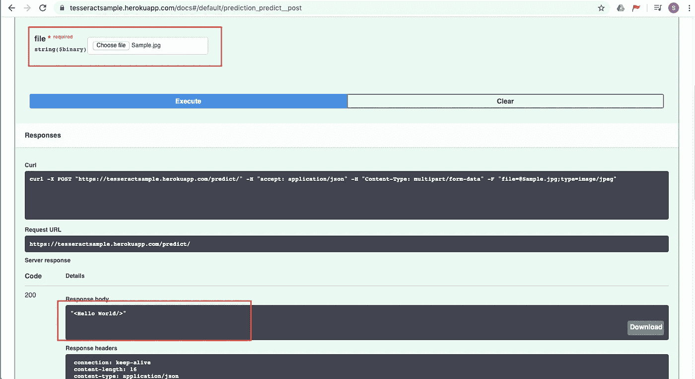*

*输出结果*

*暂时结束了。有什么想法来改善这一点或希望我尝试任何新的想法？请在评论中给出你的建议。再见。*

*查看博客- ***使用 AWS EC2 实例*** 部署 Python + Tesseract + OpenCV Fast API*

*[](/deploy-python-tesseract-opencv-fast-api-using-aws-ec2-instance-ed3c0e3f2888) [## 使用 AWS EC2 实例部署 Python + Tesseract + OpenCV 快速 API

### 关于如何创建 AWS EC2 实例并为…部署代码的分步方法(包括截图和代码)

towardsdatascience.com](/deploy-python-tesseract-opencv-fast-api-using-aws-ec2-instance-ed3c0e3f2888)*