# 使用 AWS EC2 实例部署 Python + Tesseract + OpenCV 快速 API

> 原文：<https://towardsdatascience.com/deploy-python-tesseract-opencv-fast-api-using-aws-ec2-instance-ed3c0e3f2888?source=collection_archive---------24----------------------->

## 关于如何创建 AWS EC2 实例并为生产目的部署代码的分步方法(包括截图和代码)

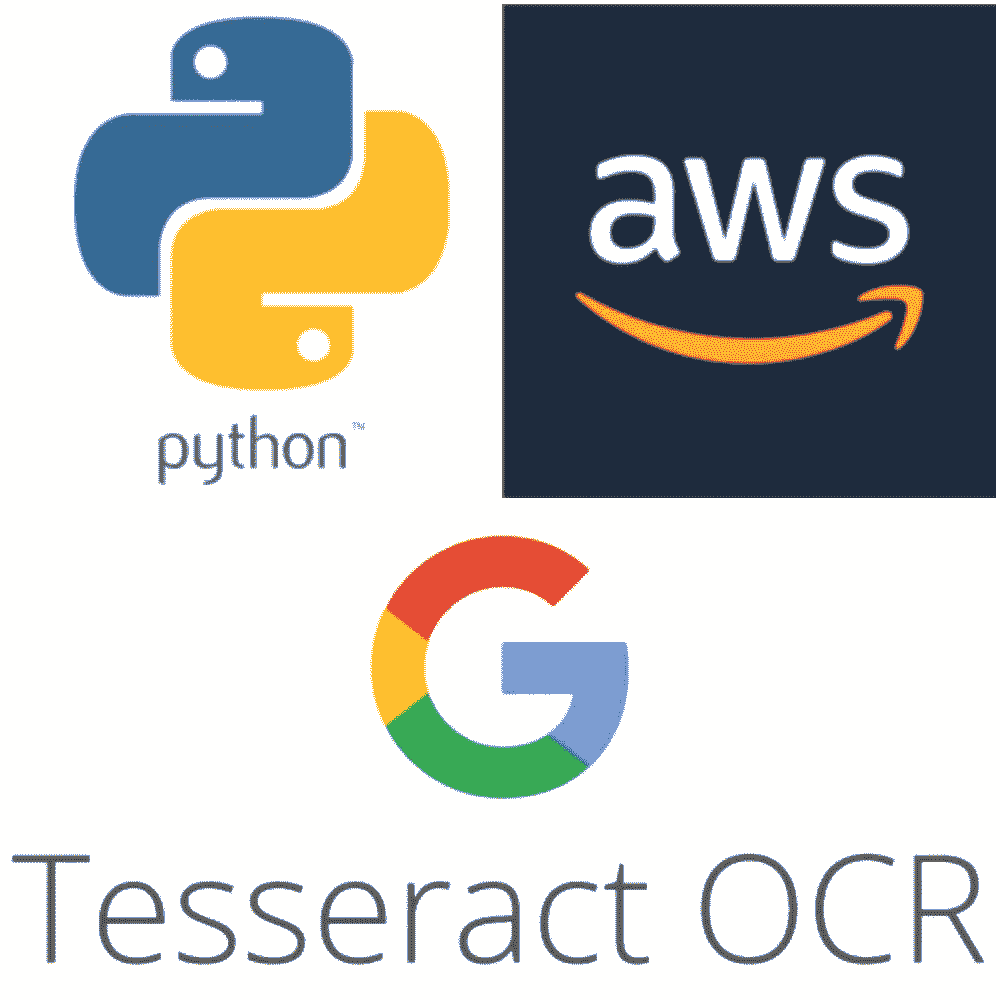

作为数据科学家，我们可能有足够的能力构建非常复杂和错综复杂的数据科学算法，但如果说我们大多数人缺乏一项技能，那就是**部署**。除非部署，否则我们的模型和简单的演示一样好。为了扩展甚至投入生产，它需要作为 API 部署或嵌入到现有系统中。在本文中，我们将学习如何创建一个简单的 OCR 算法，并在 AWS EC2 实例上实时部署它。

# **首先是基础——什么是宇宙魔方？**

除了明显的复仇者联盟的参考，宇宙魔方是各种操作系统的光学字符识别引擎。它是一个自由软件，在 Apache 许可下发布，版本 2.0，自 2006 年以来一直由 Google 赞助开发。2006 年，Tesseract 被认为是当时最精确的开源 OCR 引擎之一。

# 什么是 EC2 实例？

亚马逊弹性计算云(Amazon **EC2** )是一个在云中提供安全、可调整计算能力的 web 服务。它旨在使开发人员更容易进行网络规模的云计算。Amazon EC2 的简单 web 服务接口允许您以最小的摩擦获得和配置容量。

# 索引

在这篇博客中，我们将更多地关注如何在 AWS EC2 实例上部署 python + tesseract + openCV 模型，而不是实际的准确性。不同的步骤。
**1。如何配置一个 AWS 账户
2？安全组
3。SSH 到 EC2 实例
4。安装不同的依赖关系
5。将 Python 代码复制到 EC2**
**6。在服务器**上运行应用程序

# 配置 AWS 帐户

在 AWS 上创建一个新账户非常容易。
→进入“[https://signin.aws.amazon.com/](https://signin.aws.amazon.com/)”
→“创建一个新的 AWS 帐户”
→输入必要的信息，如名字、电子邮件地址、密码，就完成了。

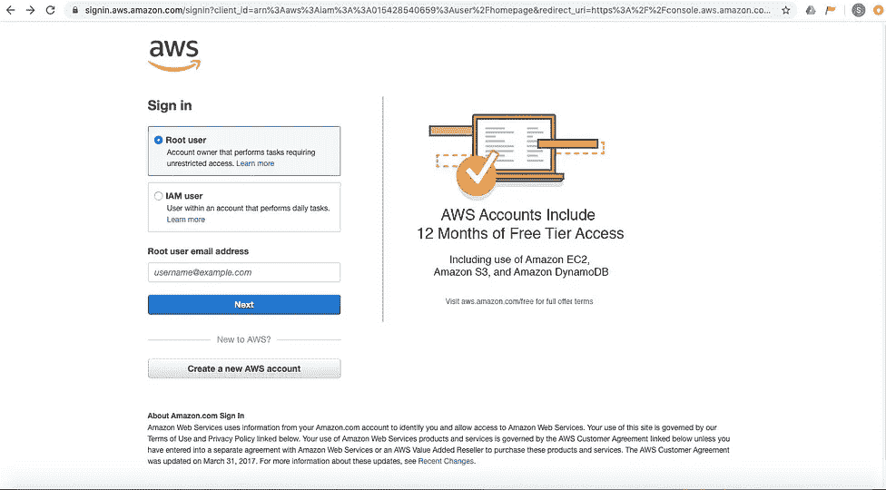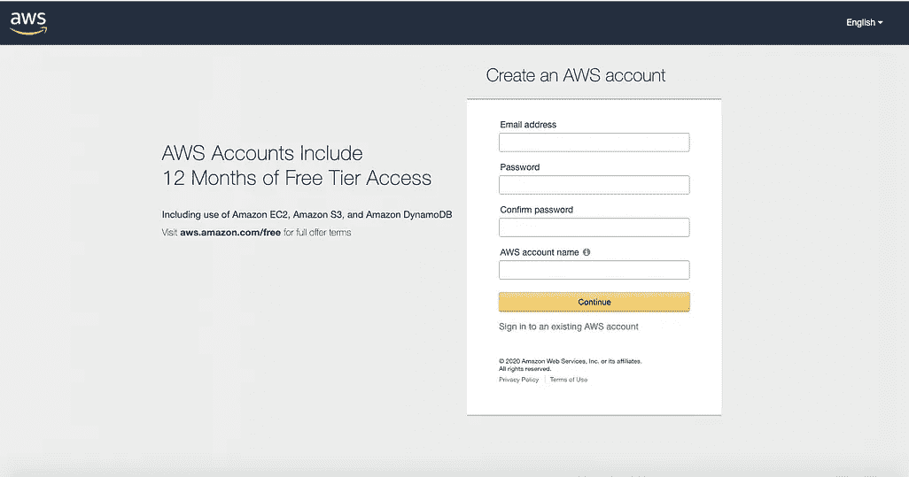

> *您可以免费访问 AWS 账户 12 个月，包括 EC2 instance、Lambda、S3 buckets 和 Sagemaker。有关限额的更多信息，您可以查看:****aws.amazon.com/free***

# 创建 EC2 实例

登录后，通过找到控制台部分进入控制台，或在 URL
中输入[https://console.aws.amazon.com/](https://console.aws.amazon.com/)→在“查找服务”下输入“EC2”

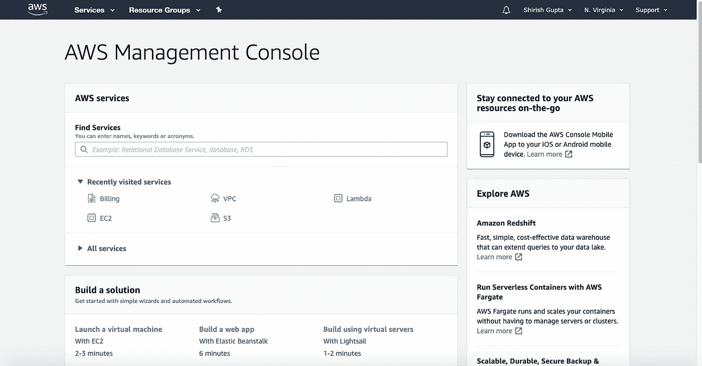

→“启动新实例”

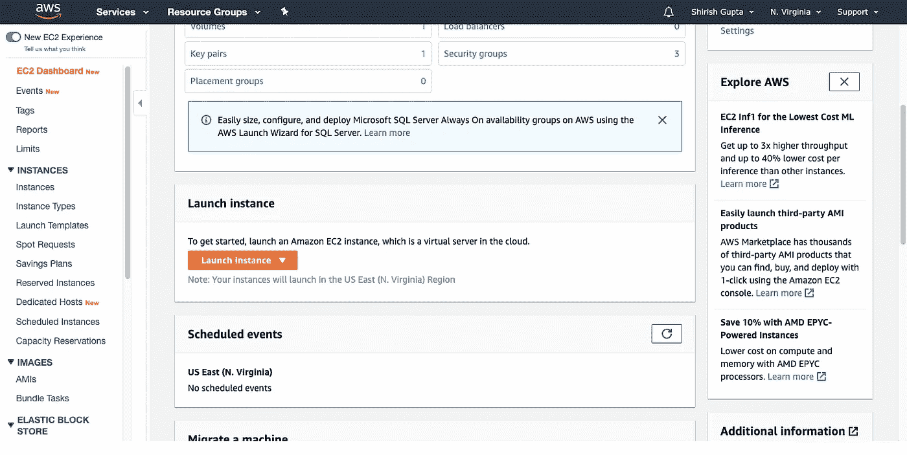

→在“仅自由层”下选择“ **Ubuntu Server 18.04 LTS (HVM)，SSD 卷类型”**

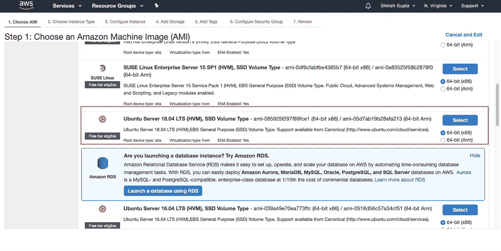

→实例类型为“t2.micro”。提供 1 个 vCPU 支持和 1gb RAM，足以支持中小型算法。

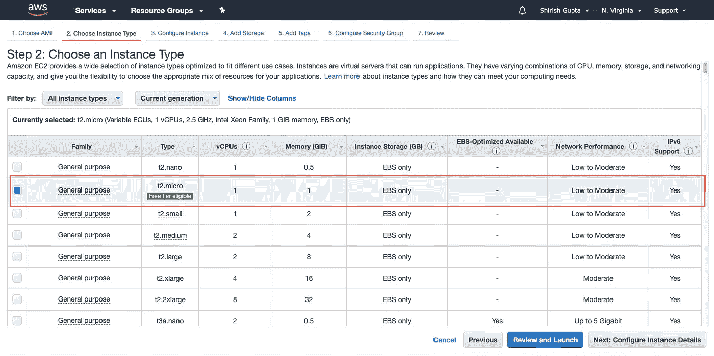

→您可以将其余功能保留为默认，并启动 EC2 实例。它将要求您创建一个“私有”和“公共”密钥对。这对可以帮助您从笔记本电脑连接到 EC2 实例。因此，创建一个新的一对，并将其安全地保存在某个地方。(我们很快就会需要它)

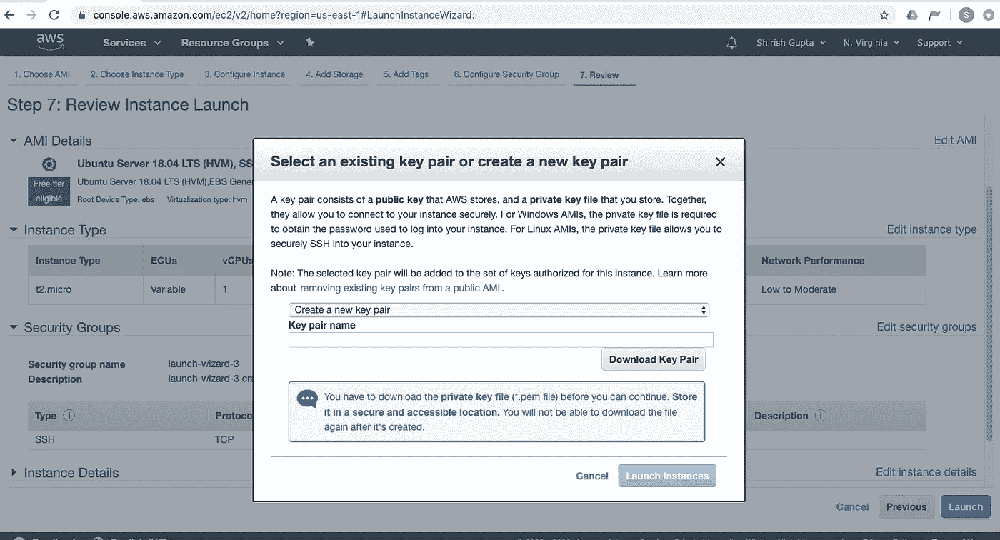

> V oila！您已经创建了您的第一个 EC2 实例。恭喜你！

# 安全组

> 只有端口 22 对入站和出站流量开放。这就是我们能够 SSH 到 EC2 实例的原因。(稍后会有更多相关内容)。但是我们希望我们的代码通过 HTTP 类型的端口 80 运行。

要进行此更改，请导航到控制台部分的安全组，并在两个入站规则中添加以下内容
→ Port = 80
→ Type = HTTP

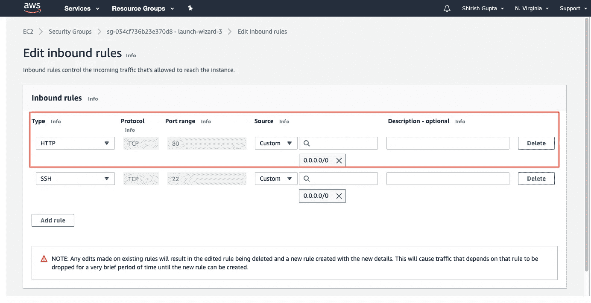

现在可以通过端口 80 访问代码

现在我们已经创建了 EC2 实例，您可以转到 EC2 控制台并检查它是否正在运行。这个屏幕需要几样东西。
**1。实例状态** —告诉我们实例是否正在运行。(当你不在做任何事情的时候，记得停止它，否则它会一直消耗空闲层的时间)
**2。公共 DNS IPv4
3。IPv4 公共 IP**

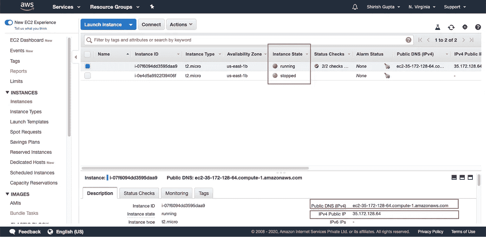

# SSH 到 EC2 实例

*接下来是 SSH 进入 EC2 实例。但是首先——什么是 SSH？*

> SSH 协议(也称为安全 Shell)是一种从一台计算机安全远程登录到另一台计算机的方法。它为强认证提供了几个备选选项，并通过强加密保护了通信的安全性和完整性。这里，SSH 将用于将我们的本地 pc 或笔记本电脑连接到基于 linux 的 EC2 实例

步骤:
→复制 *IPv4 公共 IP
→在 MAC 或 Windows 上打开终端
→前往您拥有“密钥对”的目录
→更改 pem 文件的权限，使其可以“读取”
→ssh-I<keypairfile . PEM>Ubuntu @<IP v4 公共 IP >*

示例:如果密钥对名称为“Pair.pem”

```
chmod 400 Pair.pem
ssh -i Pair.pem ubuntu@35.172.128.64
```

您现在位于 AWS 的 Linux 终端中

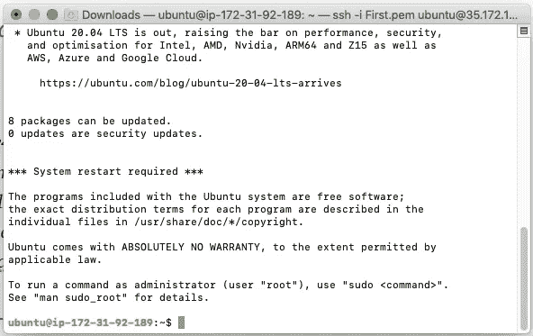

# 安装不同的依赖项

一旦进入 Linux 终端——我们需要下载与我们的 Python 代码相关的所有不同的库。

```
sudo apt-get update
sudo apt install python3-pip
sudo apt-get install libsm6 libxrender1 libfontconfig1 libice6 nginx gunicorn
pip3 install numpy==1.17.2 fastapi==0.54.1 starlette==0.13.2 opencv-python-headless==4.1.2.30 pytesseract==0.3.3 matplotlib==3.1.1 pydantic==1.4 uvicorn==0.11.3 gunicorn==20.0.4 python-multipart==0.0.5
```

> *非常重要* —将宇宙魔方下载到系统中

```
sudo apt update
sudo apt install tesseract-ocr
sudo apt install libtesseract-dev
```

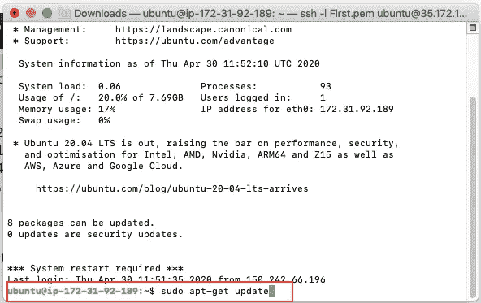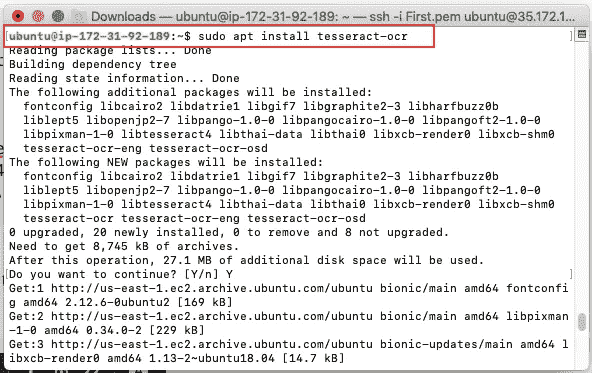

以类似的方式下载其他库

# 将 Python 代码复制到 EC2

首先在实例中创建新目录。这是我们复制 Python 脚本的地方。

```
mkdir PythonDir
cd PythonDir
```

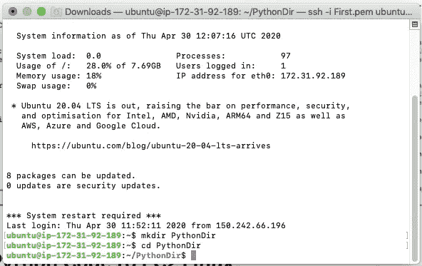

现在打开一个新的终端，输入以下内容:

```
scp -i ~/Pair.pem ~/Desktop/pythoncode.py  ubuntu@ec2-35-172-128-64.compute-1.amazonaws.com:~/PythonDir/
```

上述代码将使用公共 DNS 访问 EC2 实例，并将代码从您的系统复制到 EC2 实例中的目录

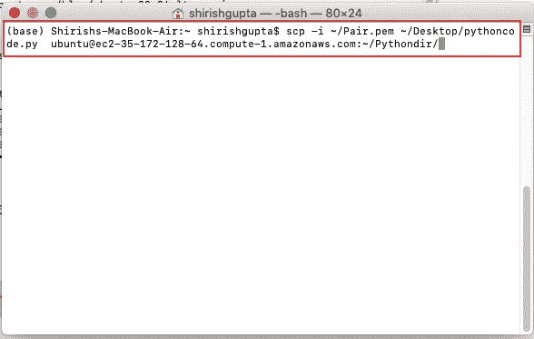

> 不要担心——找到下面的 *pythoncode.py*

```
#####pythoncode.py#####import numpy as np
import sys, os
from fastapi import FastAPI, UploadFile, File
from starlette.requests import Request
import io
import cv2
import pytesseract
from pydantic import BaseModeldef read_img(img):
 text = pytesseract.image_to_string(img)
 return(text)

app = FastAPI()class ImageType(BaseModel):
 url: str[@app](http://twitter.com/app).post(“/predict/”) 
def prediction(request: Request, 
 file: bytes = File(…)):if request.method == “POST”:
 image_stream = io.BytesIO(file)
 image_stream.seek(0)
 file_bytes = np.asarray(bytearray(image_stream.read()), dtype=np.uint8)
 frame = cv2.imdecode(file_bytes, cv2.IMREAD_COLOR)
 label = read_img(frame)
 return label
 return “No post request found”
```

接下来——我们需要配置 nginx 服务器。为此，首先从目录中出来，(这里: *PythonDir* )并创建一个新的配置文件。

```
cd /etc/nginx/sites-enabled/
sudo vim myApp
```

配置“myApp”文件。80 是网络服务器应该连接的端口。

```
server{
       listen 80;
       server_name 35.172.128.64;
       location / {
                   proxy_pass [http://127.0.0.1:8000](http://127.0.0.1:8000/)
                  }
       }
```

重新启动 ngnix 终端以反映更改。

```
sudo service nginx restart
```

# ***加成:Vim 编辑提示***

对于第一次使用 Vim editor 的人来说，它可能会非常令人沮丧。这里有一些快捷方式:

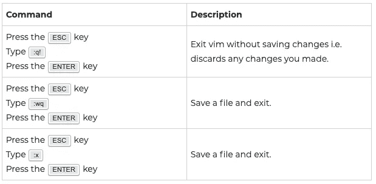

# 最后—在服务器上运行应用程序

转到应用程序目录并输入以下内容来启动应用程序服务器。

```
cd PythonDir
gunicorn -w 1 -k uvicorn.workers.UvicornWorker pythoncode:app
```

瞧，服务器已经启动，我们可以测试应用程序了。在 35.172.128.64/docs 身上测试一下

*样本图像*


输出

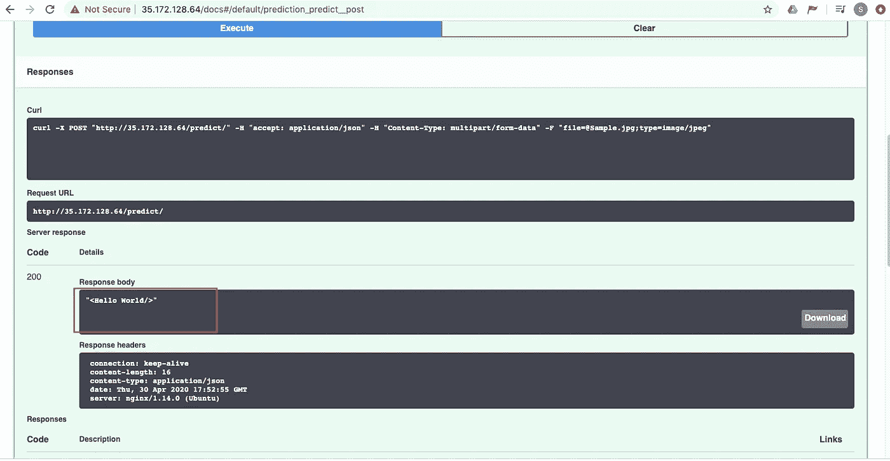

暂时结束了。有什么想法来改善这一点或希望我尝试任何新的想法？请在评论中给出你的建议。
***附:如何在 Heroku 上部署 Python+tessera CT+OpenCV API***

[](/deploy-python-tesseract-ocr-on-heroku-bbcc39391a8d) [## 在 Heroku 上部署 Python Tesseract OCR

### 如何在 Heroku 上创建 OpenCV + Tesseract OCR 的一步一步的方法(包括截图和代码)

towardsdatascience.com](/deploy-python-tesseract-ocr-on-heroku-bbcc39391a8d)