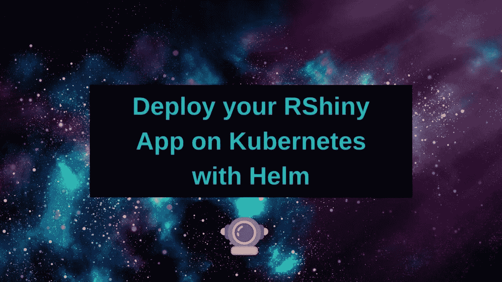

# 用舵图在 Kubernetes 上部署 RShiny

> 原文：<https://towardsdatascience.com/deploy-rshiny-on-kubernetes-with-a-helm-chart-fa07e4572942?source=collection_archive---------62----------------------->



如果您想要一个非常健壮的解决方案来部署您的 RShiny 应用程序，AWS 或 EKS 上的托管 Kubernetes 服务是一个很好的选择！就部署容器化服务而言，Kubernetes 目前已经完全控制了 DevOps 和部署领域。

# 我应该使用 Kubernetes 部署我的 RShiny 应用程序吗？

和所有的事情一样，使用 Kubernetes 有优点也有缺点。

# 骗局

*   Kubernetes 是一个野兽开始。
*   你需要把你的 RShiny 应用和 docker 打包在一起。

# 赞成的意见

*   Kubernetes 得到了一系列提供商的支持，包括 AWS、GCP、Azure、Digital Ocean 等。
*   Kubernetes 很复杂，但是伴随着复杂而来的是大批工程师，他们想把复杂的东西抽象成配置文件。因此，如果你坚持“成长的烦恼”,很可能你会得到很多好处，随着时间的推移，事情会变得不那么痛苦。
*   Kubernetes 已经被“部署东西的人”社区所接受，这意味着有很多资源可以利用。
*   如果你需要扩展，Kubernetes 是一个很好的方法。
*   Kubernetes 有很多优秀的特性，包括一个 JobsApi 和一个 CronJobsApi。这意味着您可以每天下载数据集，这对使用数据集的 RShiny 应用程序来说非常方便。

# AWS 特定优势

其中很多可能适用于其他平台，但我在 AWS 上工作，所以我们在这里。

AWS 拥有托管解决方案

*   对于代码(想想 GitHub) — CodeCommit
*   对于私人码头集装箱(想想 dockerhub) — ECR
*   对于 CI/CD (CircleCi、Travis 等)—代码部署

也可以随意混搭。例如，您可以在 DockerHub 上托管您的私有映像，并且仍然部署到 AWS Kubernetes (EKS ),或者您可以使用 Circle 设置您的 CI/CD 管道，并且仍然使用 AWS。

接下来是这样一个事实，AWS 基础设施可以完全脱离人工干预并实现自动化。您不需要，也不应该通过控制台来创建像集群这样复杂的基础设施。相反，你可以使用类似于[地形](https://www.terraform.io/docs/providers/aws/index.html)或[云形成](https://aws.amazon.com/cloudformation/)的工具。这些工具可以自动完成从创建 Kubernetes 集群到部署应用程序的所有工作。

# 我被卖了！现在怎么办？

首先，你需要一个 RShiny 图片来测试。我真的建议挑选一些非常简单的东西来测试，这样你就可以知道问题是出在你的图像上还是你的设置上。在本教程中，我们将使用[摇杆闪亮图像](https://hub.docker.com/r/rocker/shiny)。

您还需要有一个可用的 Kubernetes 集群。

# 创建您的舵图

我将一步一步地介绍你需要做哪些修改。如果你想跳过这一部分，你可以点击查看舵轮图[。](https://dabble-of-devops-helm-charts.s3.amazonaws.com/rshiny-eks-0.1.0.tgz)

(在[安装舵 v3](https://helm.sh/docs/intro/install/) 之后)你要做的第一件事是创建一个[舵图表](https://helm.sh/docs/topics/charts/)。一点关于舵图！

> *Helm 使用一种叫做图表的打包格式。图表是描述一组相关 Kubernetes 资源的文件集合。一个图表可以用来部署简单的东西，比如 memcached pod，或者复杂的东西，比如带有 HTTP 服务器、数据库、缓存等的完整 web 应用程序堆栈。图表被创建为布局在特定目录树中的文件，然后它们可以被打包到要部署的版本化档案中。*

来自 [helm.sh](https://helm.sh/docs/topics/charts/)

从这里开始，我们将边做边学，因此打开您的终端并运行:

```
helm create rshiny-eks
```

您将看到一个名为 rshiny-eks 的目录。顺便提一下，如果你安装了插件，许多编辑器和 ide 可以识别舵图。我发现它有一定的帮助。

让我们打开`rshiny-eks/values.yaml`看看吧！

## 指定图像

您可以通过更改`image.repository`键来指定图像。默认情况下，图表是用 nginx 创建的。如果您在一个全新的集群上，我强烈建议您按原样部署图表。我总是喜欢在任何新平台上部署 NGINX，因为如果我不能部署 NGINX，我会有更大更可怕的问题。；-)

```
# rshiny/values.yaml
image:
  repository: nginx
  pullPolicy: IfNotPresent
```

让我们改变这个摇杆/闪亮。

```
# rshiny/values.yaml
image:
  repository: rocker/shiny 
  pullPolicy: IfNotPresent
```

# 注意—使用标签

该标签将默认为 Chart.yaml 中的 appVersion。实际上似乎没有人遵循这一点并在`values.yaml`中添加一个标签。

```
# rshiny/values.yaml
image:
  repository: rocker/shiny 
  # add in a TAG key
  # don't use latest!
  tag: 3.6.1
  pullPolicy: IfNotPresent
```

然后打开`templates/deployment.yaml`，对图像键进行更新。

改变这个-

```
# templates/deployment.yaml
image: "{{ .Values.image.repository }}:{{ .Chart.AppVersion }}"
```

收件人:

```
# templates/deployment.yaml
image: "{{ .Values.image.repository }}:{{ .Values.image.tag }}"
```

**旁注**

通常，helm 所做的是查看 appVersion 的【the appVersion 对应于标签。这对于自动部署来说是有问题的，因为无法从命令行对此进行更改。我发现修改舵图更容易。

# 加入会话属性

RShiny 喜欢无所事事。这只会让你的会话变得粘粘的，这意味着用户不会在体验中被拖来拖去。

打开您的`rshiny-eks/templates/deployment.yaml`，在 spec 下添加一个 sessionAffinity 键。

```
# rshiny-eks/templates/deployment.yaml
apiVersion: apps/v1
kind: Deployment
metadata:
  name: {{ include "rshiny-eks.fullname" . }}
  labels:
    {{- include "rshiny-eks.labels" . | nindent 4 }}
spec:
  replicas: {{ .Values.replicaCount }}
  # ADD sessionAffinity HERE 
  sessionAffinity: ClientIP
```

更改文件中更靠下的端口:

```
# rshiny-eks/templates/deployment
# Change containerPort: 80 to containerPort 3838ports:
  - name: http
    containerPort: 3838
    protocol: TCP
```

# 关于端口的一个注记

这个设置假设您的 RShiny 应用程序运行在容器的端口 80 上。如果不是，您需要更改`rshiny-eks/templates/deployment.yaml`中的 containerPort 值。

# 可选——很好地公开 URL 的依赖项

如果你只是作为测试部署，你不需要这些，因为 AWS 会给你一个公共的 IP 地址，但是如果你需要把你的 Kubernetes 实例映射到一个实际的 URL，你需要修改一些东西。

```
# Chart.yaml
dependencies:
  - name: nginx-ingress
    version: 1.27.0
    repository: https://kubernetes-charts.storage.googleapis.com
  - name: cert-manager
    version: v0.12.0
    repository: https://charts.jetstack.io
```

在`values.yaml`中，删除入口块并用此块代替。

```
# values.yaml
ingress:
  enabled: true
  annotations:
    kubernetes.io/ingress.class: nginx
#     if you need to have https uncomment
#    cert-manager.io/cluster-issuer: letsencrypt-production
  hosts:
# your real domain
# You will need to get the service url and add it to your DNS panel as an A name record.
# this may take some time to propogate the first time around due to DNS settings.
# Don't freak out!
    - host: www.mydomain.com
      paths:
        - "/"
# Get the service url
# with kubectl get svc -o wide | grep MY_RELEASE_NAME
# Add this to your DNS panel as an A name to get the above to work
    - host: lots-o-numbas.aws-region.elb.amazonaws.com
      paths:
        - "/"
  tls: []
  # If you're using https you'll need to update this
  #  - secretName: chart-example-tls
  #    hosts:
  #      - chart-example.local
```

# 展开你的舵图

开始部署吧！

# 将所有依赖项安装到 helmchart

您需要在 rshiny-eks 的父目录中运行这个命令。

```
helm dep up rshiny-eks
```

这将安装所有依赖项。如果你没有做可选的步骤，你就不会有任何选择，但是下次要记住这一点！

# 展开舵图

现在，helm 的一个非常方便的特性是你可以通过使用`--set`标志在命令行上修改`values.yaml`。我们在这里要做的是用我们的实际标签来设置图像标签。(我就继续保持破纪录吧。使用标签！不这样你会后悔的。)

```
# helm upgrade --install RELEASE_NAME ./path-on-filesystem
# If you didn't install the optional dependencies use the
# --set service.type=LoadBalancer
helm upgrade --install rshiny-eks ./rshiny-eks  \
    --set image.tag=$SOME_REAL_TAG_HERE  \
    --set service.type=LoadBalancer

# If you installed the optional dependencies you don't need to specify the service.type 
helm upgrade --install rshiny-eks ./rshiny-eks  \
    --set image.tag=$SOME_REAL_TAG_HERE
```

# 获取服务地址

一旦你做到了这一点，你就可以获得该服务的 IP 地址，并把它放入你的浏览器中。

```
kubectl get svc -o wide | grep rshiny-eks | grep LoadBalancer
```

这会让你看到这样的东西-

```
rshiny-eks-nginx-ingress-controller        LoadBalancer   172.20.108.106   lots-o-string.aws-region.elb.amazonaws.com   80:32168/TCP   1d   app=nginx-ingress,component=controller,release=rshiny-eks
```

打开你的浏览器，输入`lots-o-string.aws-region.elb.amazonaws.com`！启动服务可能需要几分钟时间。

# 解决纷争

# 得到一个壳

我最喜欢 DevOps 的一点是，我们有所有这些超级奇妙的方式来部署几乎所有的东西。然后我们有后门，本质上是“好了闭嘴，给我一个壳”。Kubernetes 在这里也不例外。我们可以得到一个外壳，复制文件，转发端口。哈！

```
#If you used a different release name grep for that
kubectl get pods |grep rshiny
```

获取 pod 的名称，一旦有了这个名称，就可以直接在容器上获取外壳。

```
kubectl exec -it name-of-pod bash
```

# 查看日志

您还可以查看日志，这是抛出到 stdout/stderr 的所有内容。

```
kubectl logs name-of-pod
```

# 描述吊舱

如果你的容器失败了，你想知道为什么要描述这个容器。

```
kubectl describe pod name-of-pod
```

# 总结性的新闻报导

原来如此！一旦您的 Kubernetes 集群启动并运行，您就可以使用 helm 部署您的 RShiny 应用程序并发布这些精彩内容！

# 取得联系

如果你有任何问题，意见，或想要求一个教程，请与我联系在 jillian@dabbleofdevops.com。

*原载于*[](https://www.dabbleofdevops.com/blog/deploy-rshiny-on-kubernetes-with-a-helm-chart)**。**