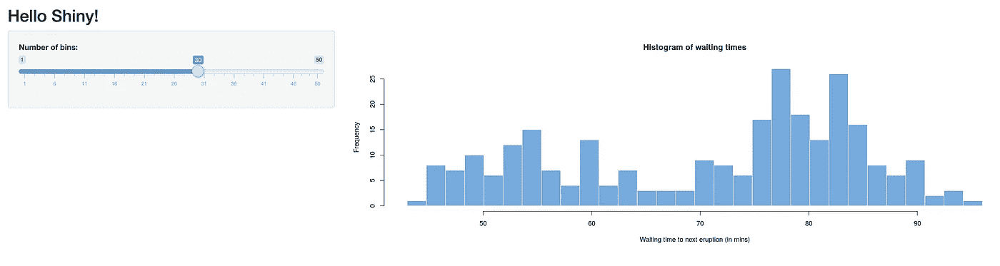

# 使用摇杆/闪亮的 Docker 图像部署 RShiny

> 原文：<https://towardsdatascience.com/deploy-rshiny-with-the-rocker-shiny-docker-image-1d940437e6e0?source=collection_archive---------60----------------------->


如果你用 docker 部署 RShiny，你可以[滚动你自己的镜像](https://www.dabbleofdevops.com/blog/deploy-your-rshiny-app-locally-with-docker)，或者你可以使用[摇杆 Dockerhub 镜像](https://hub.docker.com/r/rocker/shiny)。

您选择哪种解决方案将取决于您自己的需求。通常，我使用大量的生物信息学和/或数据科学软件包，在我看来，没有什么能真正击败康达生态系统。另一方面，拥有一个已经安装了 RShiny 的映像真的很棒！我也很喜欢`rocker/shiny`图像的配置方式。你把你的文件放到一个目录中，只要你有你需要的包，你闪亮的应用程序就会直接启动！

# 使用摇杆/闪亮图像部署简单的闪亮应用程序

这是我们通常使用的闪亮应用程序，大部分是从闪亮文档中偷来的。；-)

```
#!/usr/bin/env Rscript

# This example comes from the r-shiny examples github repo.
# https://github.com/rstudio/shiny-examples/blob/master/001-hello/app.R

library(shiny)

# Define UI for app that draws a histogram ----
ui <- fluidPage(

  # App title ----
  titlePanel("Hello Shiny!"),

  # Sidebar layout with input and output definitions ----
  sidebarLayout(

    # Sidebar panel for inputs ----
    sidebarPanel(

      # Input: Slider for the number of bins ----
      sliderInput(inputId = "bins",
                  label = "Number of bins:",
                  min = 1,
                  max = 50,
                  value = 30)

    ),

    # Main panel for displaying outputs ----
    mainPanel(

      # Output: Histogram ----
      plotOutput(outputId = "distPlot")

    )
  )
)

# Define server logic required to draw a histogram ----
server <- function(input, output) {

  # Histogram of the Old Faithful Geyser Data ----
  # with requested number of bins
  # This expression that generates a histogram is wrapped in a call
  # to renderPlot to indicate that:
  #
  # 1\. It is "reactive" and therefore should be automatically
  #    re-executed when inputs (input$bins) change
  # 2\. Its output type is a plot
  output$distPlot <- renderPlot({

    x    <- faithful$waiting
    bins <- seq(min(x), max(x), length.out = input$bins + 1)

    hist(x, breaks = bins, col = "#75AADB", border = "white",
         xlab = "Waiting time to next eruption (in mins)",
         main = "Histogram of waiting times")

    })

}

# If you want to automatically reload the app when your codebase changes - should be turned off in production
options(shiny.autoreload = TRUE)

options(shiny.host = '0.0.0.0')
options(shiny.port = 8080)

# Create Shiny app ---- 
shinyApp(ui = ui, server = server)
```

制作一个名为`shiny-app`的目录，将上面的`app.R`放进去。

# 提供您的 RShiny 应用程序

现在你有了一个应用程序，你需要知道两个基本的 docker 概念。如何公开端口以及如何挂载卷。

```
docker run --rm \ 
-v "$(pwd)/shiny-app":/srv/shiny-server \ 
-p 3838:3838
```

您应该会看到一条关于您的 RShiny 应用程序正在运行的消息。在`localhost:3838`打开浏览器，您应该会看到以下应用程序。



现在，这是摇滚形象非常简洁的地方。由于我们将应用程序直接放入`/srv/shiny-server`中，它会立即启动。要知道为什么会这样，让我们看看 docker 文件中的魔法。

# 深入摇滚/闪亮的形象

```
FROM rocker/r-ver:3.6.3

RUN apt-get update && apt-get install -y \
    sudo \
    gdebi-core \
    pandoc \
    pandoc-citeproc \
    libcurl4-gnutls-dev \
    libcairo2-dev \
    libxt-dev \
    xtail \
    wget

# Download and install shiny server
RUN wget --no-verbose https://download3.rstudio.org/ubuntu-14.04/x86_64/VERSION -O "version.txt" && \
    VERSION=$(cat version.txt)  && \
    wget --no-verbose "https://download3.rstudio.org/ubuntu-14.04/x86_64/shiny-server-$VERSION-amd64.deb" -O ss-latest.deb && \
    gdebi -n ss-latest.deb && \
    rm -f version.txt ss-latest.deb && \
    . /etc/environment && \
    R -e "install.packages(c('shiny', 'rmarkdown'), repos='$MRAN')" && \
    cp -R /usr/local/lib/R/site-library/shiny/examples/* /srv/shiny-server/ && \
    chown shiny:shiny /var/lib/shiny-server

EXPOSE 3838

COPY shiny-server.sh /usr/bin/shiny-server.sh

CMD ["/usr/bin/shiny-server.sh"]
```

我们在这里可以看到,`rocker/shiny`映像使用了一个 base R Docker 映像，然后安装了闪亮的包。它还将一个`shiny-server.sh`文件从构建目录复制到映像。`shiny-server.sh`正被用作启动`CMD`。(记住，`RUN`在构建期间执行命令，而`CMD`在使用`docker run`运行容器时执行命令。让我们研究一下`shiny-server.sh`启动文件。

```
#!/bin/sh

# Make sure the directory for individual app logs exists
mkdir -p /var/log/shiny-server
chown shiny.shiny /var/log/shiny-server

if [ "$APPLICATION_LOGS_TO_STDOUT" != "false" ];
then
    # push the "real" application logs to stdout with xtail in detached mode
    exec xtail /var/log/shiny-server/ &
fi

# start shiny server
exec shiny-server 2>&1
```

我们在这里看到的是，`shiny-server.sh`脚本正在执行一个命令，该命令带有一个选项，可以选择是否将日志推送到 stdout。这是你在 docker 容器中经常看到的东西。在构建时，您通常希望看到所有的日志信息，但对于生产系统，您通常希望将日志推送到文件或日志基础设施，如 logstash 或 elasticsearch。

# 闪亮服务器在做什么？

我总是喜欢深入容器本身，看看发生了什么，尤其是在启动命令和 web 服务器方面。

要在 docker 容器中挖掘，提供`it`标志(interactive 和 tty)并运行 bash 命令。这会让你直接变成一个空壳。

退出先前的 docker 运行命令或不提供端口。否则，此命令将失败，并显示一个关于端口已被监听的错误。

```
docker run -it --rm \
-p 3838:3838 \
-v "$(pwd)/shiny-app":/srv/shiny-server \
rocker/shiny bash
```

现在，如果我运行`shiny-server --help`，它会启动一个节点服务器，并告诉你它正在查看哪个配置文件。作为一个永远好奇的人，我想知道更多，所以我去看了一下 [Github 回购](https://github.com/rstudio/shiny-server)。据我所知，请不要因为我不太懂 javascript 而坚持这样做，但它所做的是读取您的配置文件，并在`/srv/shinyapps`中为每个文件夹创建一个单独的 web 服务器，以及与您的文件夹名称对应的漂亮路径，这就是您如何获得漂亮的拖放和快速的闪亮效果！

# 创建一个定制的摇滚/闪亮的形象

现在，如果您想安装任何额外的系统软件包，您将需要创建一个新的映像。

我也喜欢将我的应用程序放在 docker 映像中，而不是出于生产目的将其安装在文件系统上，所以我们在这里也将这样做。

您的目录结构应该如下所示:

```
Dockerfile
shiny-app/
    app-R
```

这里有一个样本 Dockerfile 文件。

```
# Dockerfile
FROM rocker/shiny:3.6.3

RUN apt-get update && apt-get install -y \
    things-i-want-to-install

COPY shiny-app/app.R /srv/shiny-app/app.R
```

一旦你有了你的`Dockerfile`设置，你只需要建立你的形象。

```
docker build -t my-rshiny-app .
```

除了，你知道，有一个更好的名字和更具描述性的名字，绝对没有东西或东西在那里。

# 包裹

就是这样！你的 docker 图像将从 rocker/shiny 图像继承启动命令，所以需要在这里指定它。只需添加您的附加包，复制您的文件，并繁荣！

*最初发表于*[*https://www.dabbleofdevops.com*](https://www.dabbleofdevops.com/blog/deploy-rshiny-with-the-rocker-shiny-docker-image)*。*