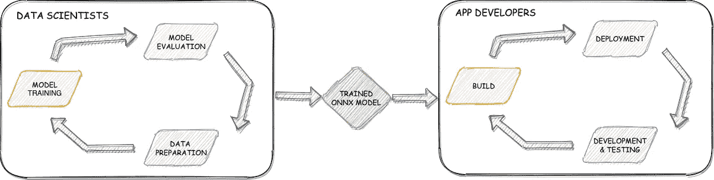
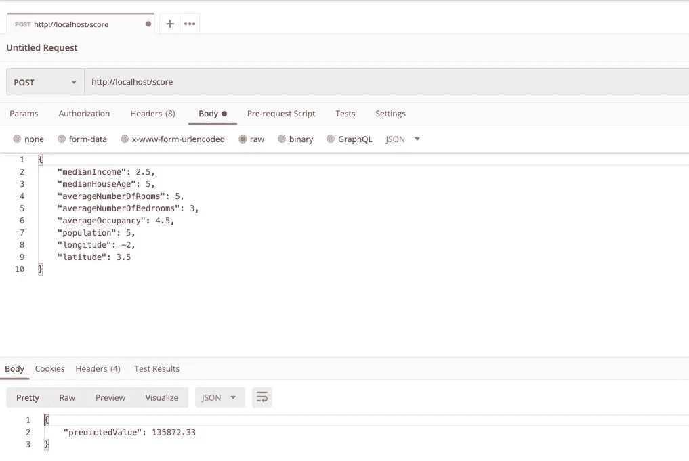

# 在中部署 Sci-kit 学习模型。网络核心应用

> 原文：<https://towardsdatascience.com/deploy-sci-kit-learn-models-in-net-core-applications-90e24e572f64?source=collection_archive---------13----------------------->

## 使用 ONNX 和 ONNX 运行时来跨编程语言和技术栈共享单个模型。

对于试图将 ML 模型交付到产品的组织来说，一个常见的痛点是数据科学家和应用程序开发人员使用的工具和技术之间的差异。数据科学家最有可能使用 Python，使用 Sci-kit Learn、Tensorflow 或 PyTorch 等机器学习框架来构建和训练他们的模型，而应用程序开发人员通常使用 Java、C#或 JavaScript 等编程语言来构建企业应用程序，利用 Spring 或 ASP.NET Core 等流行的 Web 应用程序框架。

有许多方法可以弥补这个差距。几种最常见的方法是:

1.  让数据科学家将模型的训练参数发送给应用程序开发人员，然后应用程序开发人员必须使用将使用模型的 web 应用程序的语言重写模型。
2.  使用 Python web 框架(如 Flask 或 Django)开发一套单独的 web 应用程序来托管部署的模型。

这两个都不理想。对于第一种方法，手动重写步骤导致更慢的周期时间、逻辑的重复和人为错误概率的增加。第二种方法虽然比第一种更有吸引力，但仍然不太好，因为它妨碍了在所有应用程序之间共享开发模式、库和核心逻辑(如安全性、日志记录或公共集成逻辑)的能力。

在本文中，我们将探讨一种更好的方法，使用 ONNX 模型格式和 ONNX 运行时来弥合数据科学家和应用程序开发人员之间的技术差距。具体来说，我们将展示如何使用 Sci-kit learning 构建和训练一个模型，然后使用同一个模型在. NET 核心 Web API 中执行实时推理。



集成 ML 模型和应用程序开发生命周期。(图片由作者提供)

## ONNX 是什么？

开放神经网络交换(ONNX)是一种开放的 ML 模型格式，类似于常用于保存和加载 Sci-kit 学习模型的 Pickle 格式，或 Tensorflow 模型的 SavedModel 格式。然而，ONNX 是框架不可知的，这意味着您可以从任何流行的机器学习框架中生成 ONNX 格式的模型。

除了 ONNX 模型格式，我们还将使用 ONNX 运行时，这是一个开源的运行时，允许我们在我们的。NET 核心应用程序。我们将使用 C # APIs，但是 ONNX 运行时也支持其他几种语言的 API，包括 Python、Java 和 Javascript。

你可以在这里阅读更多关于 ONNX 项目和支持的框架:[https://onnx.ai/](https://onnx.ai/)

你可以在这里了解更多关于如何在不同的语言和平台上使用 ONNX 运行时:[https://microsoft.github.io/onnxruntime/](https://microsoft.github.io/onnxruntime/)

## 构建 ONNX 模型

首先，我们将使用加州住房数据集构建和训练一个 Sci-kit 学习模型。这里没有什么特别的，只是一个 GradientBoostingRegressor，它被训练来预测给定几个数据点(如中值收入、平均卧室数量等)的住宅价格。

我们需要安装 *sklearn-onnx* 库，这将允许我们将 sklearn 模型转换成 onnx 格式:

```
pip install skl2onnx
```

然后我们将使用`convert_sklearn()`方法进行转换:

`initial_types`参数定义了模型输入的维度和数据类型。这个模型有 8 个 float 类型的输入。输入维度`[None,8]`中的`None`表示未知的批量。

**注意**:将 Scikit-learn 模型转换为 ONNX 格式有一些限制。你可以在这里找到关于这些限制和 *sklearn-onnx* 库的细节:[http://onnx.ai/sklearn-onnx/](http://onnx.ai/sklearn-onnx/)

## 使用 ONNX 模型执行推理

现在是 ASP.NET 核心应用程序，它将使用我们的 ONNX 模型，并将其作为 REST API 端点公开，支持作为服务的实时推理。我们将使用`dotnet`命令行工具创建一个空的 ASP.NET 核心 Web API:

```
dotnet new webapi
```

接下来，我们将安装**微软。ML.OnnxRuntime** NuGet 包，它将允许我们在。NET 核心应用程序:

```
dotnet add package Microsoft.ML.OnnxRuntime
```

在我们对模型评分之前，我们需要启动一个`InferenceSession`并将模型对象加载到内存中。在 *Startup.cs* 中的`ConfigureServices`方法中添加下面一行:

如果您不熟悉 ASP.NET 核心或依赖注入，上面一行只是创建一个类型为`InferenceSession`的单例实例，并将其添加到应用程序的服务容器中。这意味着推理会话将在应用程序启动时只创建一次，并且同一个会话将被对我们稍后将创建的推理 API 端点的后续调用重用。

您可以在这里找到关于服务容器、服务生命周期和依赖注入的更深入的信息:[ASP.NET 核心中的依赖注入](https://docs.microsoft.com/en-us/aspnet/core/fundamentals/dependency-injection?view=aspnetcore-3.1)

注意，在上面的代码中，我们加载了。本地文件系统中的 onnx 模型文件。虽然这对于我们的示例来说很好，但是在生产应用程序中，为了将 ML 模型的版本控制从应用程序的版本控制中分离出来，您可能最好从外部模型存储库/注册中心(比如 MLFlow)下载模型对象。

现在，应用程序知道如何将 ONNX 模型加载到内存中，我们可以创建一个 API 控制器类，在 ASP.NET 核心应用程序中，它只是一个定义将由我们的应用程序公开的 API 端点的类。

下面是推理端点的控制器类:

关于上述类的几点注意事项:

*   `[Route("/score")]`属性指定我们可以通过路由*/分数*向该控制器的端点发出请求
*   注意，该类的构造函数接受一个类型为`InferenceSession`的对象作为参数。当应用程序启动时，它将创建我们的控制器类的一个实例，传入我们之前在 *Startup.cs* 中定义的`InferenceSession`的单例实例。
*   当我们调用`_session.Run()`时，我们的模型对输入进行实际评分
*   类`HousingData`和`Prediction`是简单的数据类，分别用于表示请求和响应主体。我们将在下面定义这两者。

这里是代表对我们端点的传入 API 请求的 JSON 主体的`HousingData`类。除了对象的属性，我们还定义了一个`AsTensor()`方法，将`HousingData`对象转换成一个`Tensor<float>`类型的对象，这样我们就可以将它传递给 ONNX 模型:

这里是定义响应结构的`Prediction`类，我们的 API 端点将使用该响应进行回复:

## 测试 API

仅此而已。我们现在准备运行我们的 ASP.NET 核心 Web API，并测试我们的推理端点。使用项目根目录下的`dotnet run`命令启动应用程序。您应该在输出中看到这样一行，指示应用程序正在侦听哪个端口:

```
Now listening on: [http://[::]:80](http://[::]:80)
```

现在应用程序已经启动并运行了，您可以使用您最喜欢的 API 请求工具(我的工具是 [Postman](https://www.postman.com/) )向它发送这样的请求:



通过 Postman 向/score 端点发送请求。(图片由作者提供)

现在你知道了！我们现在能够通过 API 请求从我们的模型中实时获得预测。尝试调整输入值，看看预测值如何变化。

## 结论

感谢阅读。在本文中，我们看到了如何使用 ONNX 模型格式和 ONNX 运行时来简化将 ML 模型集成到生产应用程序中的过程。虽然显示的示例是针对 Scikit-Learn 和 C#的，但 ONNX 和 ONNX 运行时的灵活性允许我们混合和匹配各种机器学习框架和技术堆栈(例如 Scikit-learn & Javascript、Tensorflow & Java 等)。

## 示例代码

您可以在这里找到包含所有用于训练和推理的示例代码的存储库:【https://github.com/gnovack/sklearn-dotnet

## 参考

*   【http://onnx.ai/sklearn-onnx/tutorial.html 
*   [https://github . com/Microsoft/onnx runtime/blob/master/docs/cs harp _ API . MD #入门](https://github.com/microsoft/onnxruntime/blob/master/docs/CSharp_API.md#getting-started)

欢迎在下面留下任何问题或评论。谢谢！