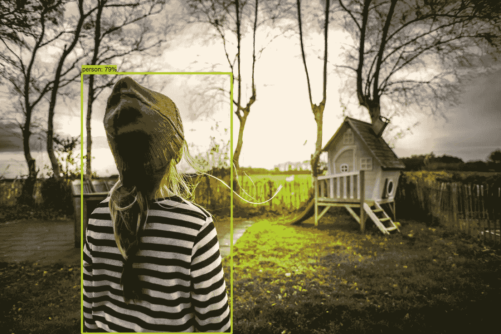
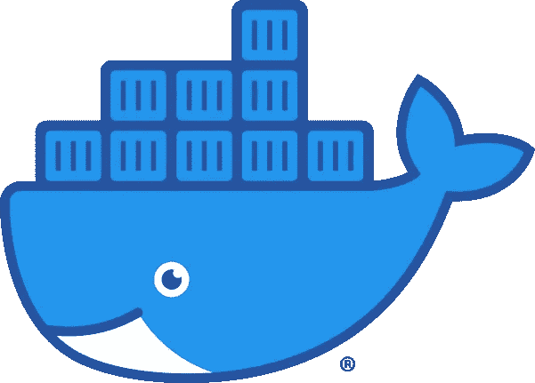
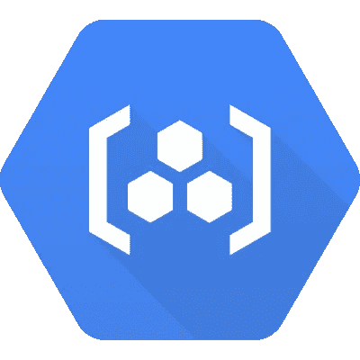
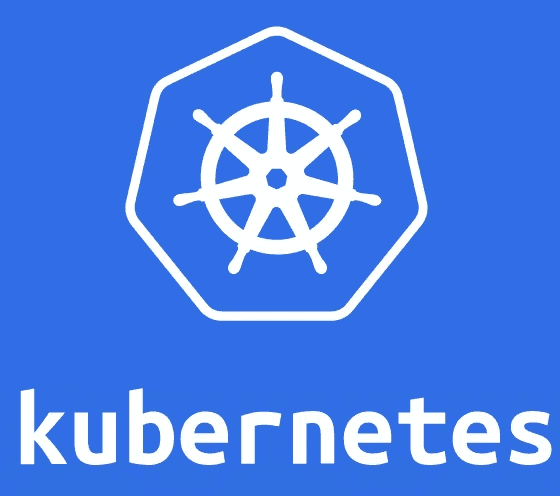

# 使用 Python、Flask 和 Docker 在 Kubernetes 上部署 Tensorflow 对象检测 API

> 原文：<https://towardsdatascience.com/deploy-tensorflow-object-detection-api-on-kubernetes-with-python-flask-and-docker-7a9513dd19e4?source=collection_archive---------21----------------------->

## 在本文中，我们将使用 Flask 提供 Tensorflow 对象检测 API，对应用程序进行 Dockerize，并使用 Google Kubernetes 引擎将其部署在 Kubernetes 上。



图片由来自 [Pixabay](https://pixabay.com/?utm_source=link-attribution&utm_medium=referral&utm_campaign=image&utm_content=1863906) 的[鲁迪和](https://pixabay.com/users/Skitterphoto-324082/?utm_source=link-attribution&utm_medium=referral&utm_campaign=image&utm_content=1863906)彼得·斯皮特林拍摄

# 介绍

TensorFlow 对象检测 API 是一个基于 TensorFlow 构建的开源框架，可以轻松构建、训练和部署对象检测模型。本文演示了如何使用 Flask 提供 Tensorflow 对象检测 API，如何使用 Google Kubernetes 引擎将应用程序 Dockerize 并部署到 Kubernetes 上。

部署后，您可以将 API 合并到您的自定义应用程序中，无论是移动应用程序还是 web 应用程序，都可以满足您的需求。

# 快速大纲

这些是我们将要采取的步骤:

*   设置 Tensorflow 对象检测 API
*   使用烧瓶供应 API
*   使用 Docker 将应用程序容器化
*   在 Kubernetes 上部署容器化应用程序

**注意**:我们不会深入讨论 Tensorflow 对象检测 API，因为这不是本文的重点。有兴趣可以去官方[回购](https://github.com/tensorflow/models/tree/master/research/object_detection)看看。如果你熟悉它，那会很有帮助。我们也不会经历设置环境的整个过程，因为我们可以使用 Docker 来简化它。不过，有兴趣可以参考这篇惊艳的[文章](https://gilberttanner.com/blog/installing-the-tensorflow-object-detection-api)。

# 入门指南

将我的[存储库](https://github.com/wingedrasengan927/Tensorflow-2-Object-Detection-API-Flask-Application)克隆到工作区中。我们将在整篇文章中使用这些代码。

```
git clone [https://github.com/wingedrasengan927/Tensorflow-2-Object-Detection-API-Flask-Application.git](https://github.com/wingedrasengan927/Tensorflow-2-Object-Detection-API-Flask-Application.git)
```

# 建立码头工人形象



码头工人

如果你还没有安装 [Docker](https://docs.docker.com/get-docker/) 在你的系统中。Docker 容器基本上打包了代码及其所有依赖项，因此应用程序可以在任何环境中快速可靠地运行。它包括运行应用程序所需的一切，并将依赖项与主环境隔离开来。

在您克隆的 repo 中，您会发现一个 Dockerfile 文件。Dockerfiles 描述了构建映像的不同过程，还可以包含一些元数据，描述如何基于该映像运行容器。我们的 docker 文件如下所示:

要从 Dockerfile 文件构建映像，请在 repo 内部运行以下命令:

```
docker build -t tf-od-api:latest .
```

-t 表示您赋予 Docker 图像的标签。这个建筑需要很多时间。如果你看到这样的东西:

```
Successfully built 64edf7b4c21f
Successfully tagged tf-od-api:latest
```

这意味着映像已成功构建。现在让我们从图像中运行一个容器。运行以下命令:

```
docker run -d -p 5000:5000 tf-od-api:latest
```

这确保了我们与运行中的容器分离，并且容器暴露在端口 5000 上。

现在让我们测试我们的应用程序。这可以通过运行脚本 client.py 来完成，该脚本位于 repo 中，带有必要的参数(您需要在工作区中安装 opencv 和 numpy 来运行该脚本):

```
python client.py --address [http://127.0.0.1:5000](http://127.0.0.1:5000) --image_path images/test_image.jpg --output_dir outputs/
```

如果您看到类似这样的输出，那么我们的应用程序正在按预期工作:

```
Detections are: [{‘person’: ‘79%’}, {‘chair’: ‘34%’}]
the image size is: size=1920x1281
the image is being written in outputs/
```

# 好吧…刚刚发生了什么！？

当我们从 docker 文件构建映像时，我们设置运行 Tensorflow 对象检测 API 所需的环境，这包括克隆存储库、编译协议缓冲区、设置环境变量、下载模型，当我们准备就绪时，我们克隆存储库，其中包含为 Flask 应用程序提供服务的代码，我们在端口 5000 上启动应用程序，并确保在运行容器时公开该端口。

这是应用程序代码:

您可以在此文件中更改参数、预训练模型。确保您的更改反映在 docker 文件中，您可以使用 docker 文件中的 *COPY* 将已更改的 repo 从您的本地环境复制到 docker 文件中，而不是克隆它。

在客户端，我们发送到端点的请求包含图像数据。我们可以使用 API 测试工具如[邮差](https://www.postman.com/)或 curl 命令来发送数据。我们得到的响应包含图像中的检测、图像大小和带有边界框覆盖的图像数据。我们把这个图像写到*输出目录*

## **注**:

1.  如果您已经设置了包括将所需路径添加到 PATH 环境变量的环境，则可以在本地系统上运行该应用程序。
2.  如果 Docker 容器没有按预期运行，您可以通过运行 *docker logs container_id* 来检查日志，以检查哪里出错了
3.  这是 API 的基础版本，您可以根据需要对其进行定制。

# 将图像推送到 Google 容器注册表



谷歌容器注册

在继续之前，您需要确保您在[谷歌云平台](https://console.cloud.google.com/)上有一个工作帐户，安装了云 [SDK](https://cloud.google.com/sdk) ，并且创建了一个[项目](https://cloud.google.com/resource-manager/docs/creating-managing-projects)。

现在，我们在本地环境中有映像，要进行部署，我们需要将它托管在云上。在本节中，我们将把 Docker 图像推送到 [Google 容器注册表](https://cloud.google.com/container-registry/docs/pushing-and-pulling?hl=en_US)。

## 我们开始吧

首先我们需要配置 Docker 来使用 gcloud 作为凭证助手。为此，请运行命令:

```
gcloud auth configure-docker
```

要将任何本地图像推送到容器注册中心，我们需要首先用注册中心名称标记它，然后推图像。要进行标记，请运行以下命令:

```
docker tag tf-od-api gcr.io/${PROJECT_ID}/tf-od-api
```

*gcr.io* 是主机名，它指定了存储映像的位置或存储库。

要推送标记的图像，请运行:

```
docker push gcr.io/${PROJECT_ID}/tf-od-api
```

要检查图像是否已被推送，请列出图像。为此，请运行:

```
gcloud container images list
```

如果成功推送，您应该会在输出中看到图像名称。

```
NAME
gcr.io/my-project-21212/tf-od-api
```

# 在 Kubernetes 部署



## 介绍

您肯定听说过 Kubernetes，它已经成为部署和管理容器化应用程序的标准。在本节中，我们将使用 [Google Kubernetes 引擎](https://cloud.google.com/kubernetes-engine)在 Kubernetes 上部署我们的应用。

Kubernetes 是一个容器编排系统。它有助于在集群上部署和管理容器化的应用程序。Kubernetes 集群由一个主集群和节点组成，主集群负责管理集群，节点是运行应用程序的工作机。

## 我们开始吧

首先，让我们安装 *kubectl* 。 *kubectl* 用于与 Kubernetes 通信。要安装 *kubectl* ，运行:

```
gcloud components install kubectl
```

## 创建集群

让我们创建一个名为 object-detection 的双节点集群。如前所述，在 Kubernetes 中，节点是一个工作机，它可以是虚拟机，也可以是物理机，这取决于集群。要创建群集，请运行以下命令:

```
gcloud container clusters create object-detection --num-nodes=2**OUTPUT**
NAME              LOCATION       MASTER_VERSION  MASTER_IP       MACHINE_TYPE   NODE_VERSION    NUM_NODES  STATUS
object-detection  us-central1-a  1.14.10-gke.27  35.193.127.147  n1-standard-1  1.14.10-gke.27  2          RUNNING
```

创建集群后，它在 G [oogle 计算引擎](https://cloud.google.com/compute)上启动两个 VM 实例，它们是集群的节点工作器。要查看它们，请运行以下命令:

```
gcloud compute instances list**OUTPUT**
NAME                                             ZONE           MACHINE_TYPE   PREEMPTIBLE  INTERNAL_IP  EXTERNAL_IP   STATUS
gke-object-detection-default-pool-cd7fa3ff-3zd6  us-central1-a  n1-standard-1               10.128.0.4   34.67.58.20   RUNNING
gke-object-detection-default-pool-cd7fa3ff-z2hw  us-central1-a  n1-standard-1               10.128.0.5   35.222.93.20  RUNNING
```

## 部署

现在我们已经有了一个集群，让我们部署我们的容器化应用程序。为此，我们必须创建一个 [Kubernetes 部署](https://kubernetes.io/docs/concepts/workloads/controllers/deployment/)。该部署指导 Kubernetes 如何创建和更新我们的应用程序实例。当我们创建一个部署时，我们必须为我们的应用程序指定容器映像和部署的名称。运行以下命令创建部署:

```
kubectl create deployment object-detection --image=gcr.io/${PROJECT_ID}/tf-od-api
```

当我们创建部署时，Kubernetes 会创建 Pods 来托管应用程序实例。一个 Pod 代表一组一个或多个应用程序容器。一个 Pod 在一个节点上运行。要查看部署创建的 pod，请运行:

```
kubectl get pods**OUTPUT**
NAME                                READY   STATUS    RESTARTS   AGE
object-detection-7c997cbfd8-5nz4j   1/1     Running   0          2m11s
```

## 向 internet 公开应用程序

我们必须允许从互联网到应用程序的流量，这样我们才能访问它。为此，请运行:

```
kubectl expose deployment object-detection --type=LoadBalancer --port 80 --target-port 5000
```

*端口*标志指定负载均衡器上配置的端口号，*目标端口*标志指定 *tf-od-api* 容器监听的端口号。

要获取外部 IP，请运行以下命令:

```
kubectl get service**OUTPUT**
NAME               TYPE           CLUSTER-IP     EXTERNAL-IP     PORT(S)        AGE
kubernetes         ClusterIP      10.51.240.1    <none>          443/TCP        30m
object-detection   LoadBalancer   10.51.245.79   35.193.230.83   80:31667/TCP   4m57s
```

现在让我们检查一下我们的应用程序是否是可访问的。为此，我们将运行相同的 *client.py* ，但我们必须给出外部 IP 作为地址参数:

```
python client.py --address http://35.193.230.83/(my external IP) --image_path images/input_image.jpg --output_dir outputs/**OUTPUT**
Detections are: [{‘person’: ‘79%’}, {‘chair’: ‘34%’}]
the image size is: size=1920x1281
the image is being written in outputs/
```

如果您看到类似于我们之前运行时的输出，那么恭喜您！您已经在 Kubernetes 上成功部署了一个容器化的 Tensorflow 对象检测 API 应用程序。

## 清理

完成后不要忘记删除集群，因为这可能会产生费用。为此，请运行以下命令删除该服务:

```
kubectl delete service object-detection
```

要删除群集及其资源，请运行:

```
gcloud container clusters delete object-detection**OUTPUT**
Deleting cluster object-detection...done.
Deleted [[https://container.googleapis.com/v1/projects/temp-kubernetes/zones/us-central1-a/clusters/object-detection](https://container.googleapis.com/v1/projects/temp-kubernetes/zones/us-central1-a/clusters/object-detection)].
```

# 结论

在本文中，我们学习了如何使用 Flask 服务 Tensorflow 对象检测 API，使用 Docker 封装应用程序，以及在 Kubernetes 上部署应用程序。希望对你有所帮助。

如果您有任何反馈或希望取得联系，请在*ms.neerajkrishna@gmail.com*给我留言