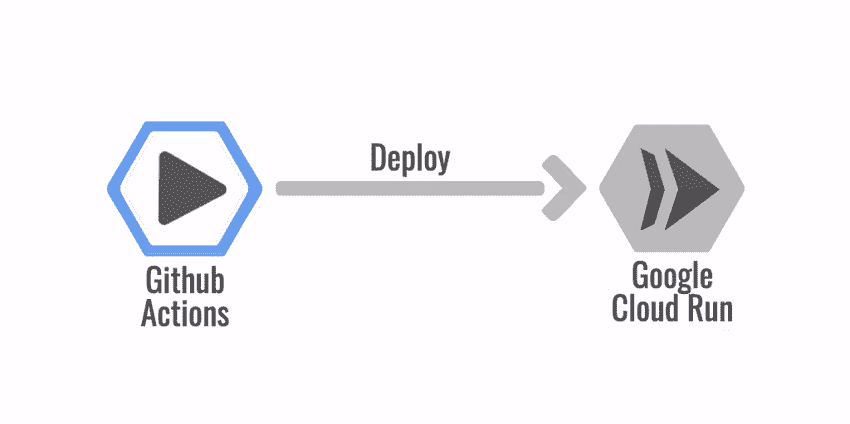
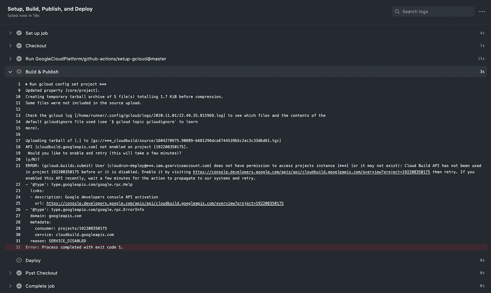
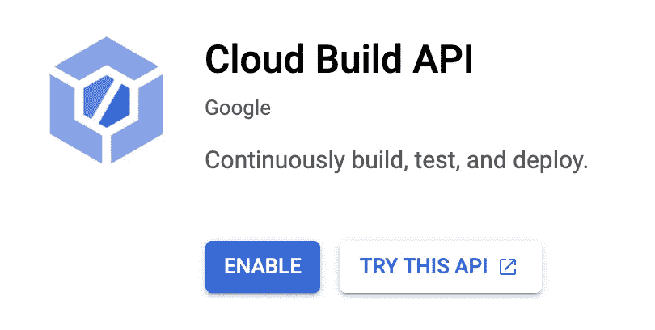
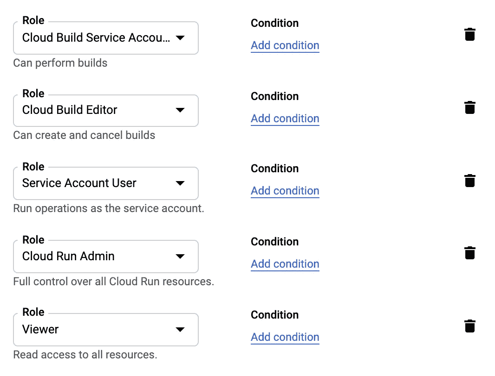
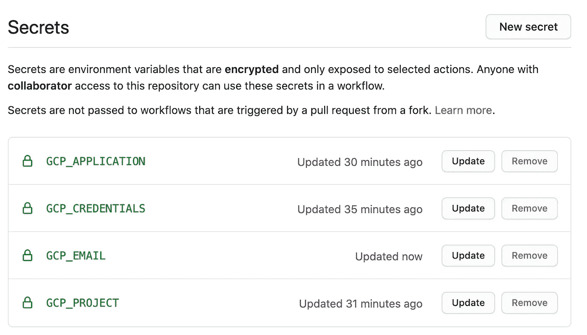
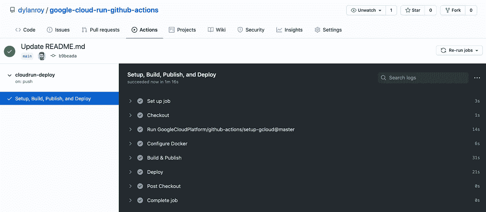

# 使用 Github 操作部署到 Google 云运行

> 原文：<https://towardsdatascience.com/deploy-to-google-cloud-run-using-github-actions-590ecf957af0?source=collection_archive---------6----------------------->

## [实践教程](https://towardsdatascience.com/tagged/hands-on-tutorials)

## 一个 CI/CD 解决方案，可通过操作和云运行扩展到零



图片由[作者](https://medium.com/@dylanroy)

# 背景

当涉及到两个方面时，我在业余时间从事的项目和我与团队一起开发解决方案的时间有很多重叠。由于我自己开发时的空闲时间有限，以及我们团队的规模较小，我总是倾向于简单的解决方案，并且无需任何操作工作就可以缩减到零。

因此，当寻找一个 CI/CD 解决方案来支持我最喜欢的产品之一时，我想看看 Github Actions，这是谷歌云平台(GCP)提供的一款名为 Cloud Run 的产品。Github Actions 在这方面与 Cloud Run 非常相似，因为您只需为您使用的内容付费。

这些服务不仅得到了全面管理，并且可以缩减到零，而且它们还有一个额外的好处，我喜欢在自己进行试验时加以利用，那就是这两种服务都有一个免费层🙌

经过一点努力，我能够让这两个服务很好地配合。由于 GCP 在角色背后不可预测的行为，我在配置角色和权限时遇到了很多困难，但谢天谢地，我写下了我为获得可行的解决方案而经历的每一步，这样你就不需要花费数小时试错来完成 Github Actions 和 Google Cloud Run 之间的集成。

# 入门指南

我将带您浏览的例子是一个简单的 Flask 服务器，它通过 Github Actions 部署到 Google Cloud Run。在我介绍这个例子之前，我已经提供了一些概念，以及在本地运行这个例子所需的一些需求。

## 概念

[**Github Actions**](https://github.com/features/actions)—Github 的自动化解决方案，允许您提供 yaml 配置来自动化 CI/CD 操作等任务。

[**Google Cloud Run**](https://cloud.google.com/run)**——Google 提供的一个托管的无服务器平台，规模可以缩小到零。用户只需要为要运行的容器提供一个 docker 文件。**

**[**Flask**](https://flask.palletsprojects.com/)—Python 开发者常用的 Python 微 web 框架。**

## **要求**

**在这个例子中，我将带你经历你需要两样东西来本地运行它:Python 3.9 和 Flask。和我所有的例子一样，如果你通过 [pip](https://pip.pypa.io/) 在[虚拟环境](https://docs.python.org/3/tutorial/venv.html)中安装你的需求，你的生活会少很多痛苦。如果你熟悉这两者，我也鼓励你使用 [virtualenvwrapper](https://virtualenvwrapper.readthedocs.io) ，它有一些非常好的扩展，可以进一步简化你的开发环境的工作流程。**

## **步骤 1:启用谷歌云运行**

**如果你跳过这一步，你实际上会看到下面的错误，这实际上是非常有用的。**

****

**否则，只需点击下面的链接，并启用 API。**

**[](https://console.developers.google.com/apis/library/run.googleapis.com) [## 谷歌云平台

### Google 云平台让您可以在同一基础设施上构建、部署和扩展应用程序、网站和服务…

console.developers.google.com](https://console.developers.google.com/apis/library/run.googleapis.com) 

您应该会看到包含以下内容的屏幕。确保您已经选择了要部署到的项目，您应该会在左侧的导航栏上看到该项目。



## 步骤 2:设置谷歌认证

在这一步中，我们需要创建一个服务帐户，该帐户拥有从 Github Actions 部署到 Cloud Run 所需的一组权限。因此，导航到您的谷歌项目，并创建这个服务帐户。

创建服务帐户后，您需要选择以下角色。我尝试了许多不同的方法来删除非常宽松的项目查看者角色，但在撰写本文时，您的服务帐户将需要此角色，否则即使成功部署到 Cloud Run，部署也会在 Github 中失败。



剩下的就是为您的服务帐户导出一个凭证，您需要将它放在手边，因为我们稍后将使用它来提供一个凭证，该凭证将允许 Github 操作将我们的 web 服务器部署到 Cloud Run。

## 步骤 3:创建或克隆要部署的示例代码

现在我们可以开始这一步了，但是由于代码并不是我们过程中有价值的部分，我计划更多地关注 Google Cloud Run 和 Github Actions 之间的集成。

对于这一步，您可以做两件事之一。从头开始创建您自己的 Github 资源库，或者克隆下面的资源库。

[](https://github.com/dylanroy/google-cloud-run-github-actions) [## Dylan Roy/谷歌-云-运行-github-操作

### 一个带有 Github 动作的示例项目，用于部署到 Google Cloud Run。为了自己部署这个项目…

github.com](https://github.com/dylanroy/google-cloud-run-github-actions) 

完成该注释或创建简单的 hello world 端点后。下面的例子来自我们的 Github repo，只是提供了一个简单的例子，让我们看看我们的集成是否成功。

在本地运行项目所需的需求，以及我们将在 Docker 容器中启动的需求如下。

```
Flask
gunicorn
```

一个`requirements.txt`文件将需要在您的项目的基础级别创建，以便我们可以轻松地将它们安装在我们的容器中。

## 步骤 4:为容器创建 docker 文件

如果您已经在上一个步骤中克隆了回购，则下面提供的示例是相同的。下面是一个 docker 文件，它帮助我在 Google Cloud Run 上运行了一个简单的 Flask 服务器。

正如你所看到的，我们为 Python 3.9 提供了 slim 镜像，但是如果你想让之前运行的东西运行，比如 Ubuntu 的最新镜像，这可能会导致问题或者需要一些更新。

这个例子只是配置 python 从 Cloud Run 立即登录到 Google 的日志遥测，安装 Python 需求，并在 gunicorn 上提供我们的 Flask 服务器。

## 步骤 5:创建 Github 动作工作流

这只是一个简单的小玩具项目，我只是部署时，我推大师。根据您的部署工作流，您可能希望您的 Github 动作在不同的动作上触发。

上面的例子是在 repo 中提供的，您可能在前面的步骤中克隆了它，它需要存在于我命名为`deploy.yml`的文件中的`.github/workflows`目录中，但是您可以随意命名。

当代码被部署到`main`时，Github 动作工作流执行以下内容。

在该操作的第一步中，该操作检查刚刚部署的代码。如果你经常使用 Github 动作，你可能会把类似这样的步骤“记住”。

第二步我忘了名字，但有评论说`Setup gcloud CLI`就是这么做的。它使用我们之前创建的凭证设置 gcloud 命令行界面，并将作为秘密存储在 Github 中。

在名为`Configure Docker`的步骤中

现在我们已经有了 CLI 和权限设置，我们现在可以构建并向 GCP 发布我们的映像。

在我们的最后一步，我们可以最终完成我们的工作流与行动的预期目的，并部署到谷歌云运行。

如你所见，我们有许多尚未在工作流程中提供的秘密。既然我们已经提供了 Github 动作来执行部署到 Cloud Run 所需的步骤，那么是时候安全地配置我们的 Github 秘密了。

## 步骤 6:填充 Github 秘密

还记得我们之前在第一步中在 GCP 上创建服务帐户时下载的凭证吗？这是我们把它放在最终安息的地方的步骤。

接下来您需要导航到设置面板，在这里您可以添加以下 Github 秘密。对于克隆的回购，如果您想直接导航到您的回购位置，链接如下。

[https://github . com/Dylan Roy/Google-cloud-run-github-actions/settings/secrets](https://github.com/dylanroy/google-cloud-run-github-actions/settings/secrets)

否则，您只需单击回购导航栏中的设置，然后单击机密选项卡。

这里我们设置了以下 Github 秘密:

*   **GCP _ 应用** —您的 Google 服务帐户应用名称，用于您的云运行服务。
*   **GCP 凭证** —这是您需要在谷歌云控制台中生成的服务帐户凭证。你在第一步下载了这些。复制您创建的 JSON 文件的内容，将其作为一个值提供给这个 secret，然后删除该文件。
*   **GCP _ 电子邮件** —这是一封电子邮件，用于标识您在标记为`GCP_CREDENTIALS`的密码中提供了凭据的服务帐户。
*   **GCP _ 项目** —你将部署到云运行的谷歌项目。

在这一点上，你的秘密应该被以下截图中显示的所有内容填充。



## 完成:运行新操作

在这一点上，测试它所需要的就是对你的主分支做一个样本推送，并观察它的步骤。



# 关键要点

除了 GCP 令人困惑的用户角色，在部署到 Google Cloud Run 时，用 Github 操作设置 CI/CD 并不太难。希望这篇文章为您节省了几个小时的时间来直接发现这个问题。感谢你一直读到最后，如果这有帮助的话，请随时订阅未来的教程，或者看看下面我写的其他教程。

# 阅读迪伦的其他教程

[](/create-beautiful-architecture-diagrams-with-python-7792a1485f97) [## 用 Python 创建漂亮的架构图

### 停止花费时间手动调整未对准的箭头

towardsdatascience.com](/create-beautiful-architecture-diagrams-with-python-7792a1485f97) [](/auto-updating-your-github-profile-with-python-cde87b638168) [## 使用 Python 自动更新您的 Github 概要文件

### 通过自动化您的自述文件展示您的技能

towardsdatascience.com](/auto-updating-your-github-profile-with-python-cde87b638168) [](/simple-versioned-datasets-with-github-actions-bd7adb37f04b) [## 具有 Github 操作的简单版本化数据集

### 不到 10 行 Python 代码，保存了著名 CEO 的历史

towardsdatascience.com](/simple-versioned-datasets-with-github-actions-bd7adb37f04b) 

# 资源

*   [帮助解决认证问题的金块问题](https://github.com/google-github-actions/setup-gcloud/issues/62)
*   [谷歌的 Github Actions 回购](https://github.com/google-github-actions/setup-gcloud/tree/master/deploy-cloudrun)
*   [Github 动作](https://github.com/features/actions)T21[秘密](https://docs.github.com/en/free-pro-team@latest/actions/reference/encrypted-secrets)
*   [谷歌云运行](https://cloud.google.com/run)**