# 使用 SageMaker 将定制 Docker 模型部署到使用 S3 的无服务器前端

> 原文：<https://towardsdatascience.com/deploying-a-custom-docker-model-with-sagemaker-to-a-serverless-front-end-with-s3-8ee07edc24e6?source=collection_archive---------5----------------------->

## 如何使用 AWS 有效地部署模型


照片由 [JJ 英](https://unsplash.com/@jjying?utm_source=unsplash&utm_medium=referral&utm_content=creditCopyText)在 [Unsplash](https://unsplash.com/s/photos/pipeline?utm_source=unsplash&utm_medium=referral&utm_content=creditCopyText)

## 介绍

使用 AWS SageMaker 部署模型是允许用户或客户与之交互的一种很好的方式。虽然您可以使用 SageMaker 的 Python SDK 附带的许多[算法](https://docs.aws.amazon.com/sagemaker/latest/dg/algos.html)和模型，但在许多情况下，您可能想要创建自己的算法。这就需要使用 Docker。

让人们与您的模型交互的最简单的方法是使用 AWS Lambda 和 API Gateway 来设置对模型的 API POST 请求。

最后，拥有一个用于发送请求和从模型接收推理响应的 API 是很棒的，但是一个简单好看的供用户与数据交互的 web 应用程序更好。这就是用 S3 托管静态网站和用 AJAX 访问端点的用武之地。

AWS 的所有这些组件协同工作允许一个圆滑的开发和推理服务框架。本教程还介绍了如何使用 AWS CloudWatch 来理解不明确的错误，例如自定义模型中的 500 个内部服务器错误。

查看下面提到的一些代码的回购，[这里](https://github.com/maxbren/aws-custom-docker-model-deploy-front-end)。

# 码头模型

要使用 SageMaker 部署定制模型，它必须由 SageMaker 的估计器类[包装。这可以通过创建一个与该类接口的 Docker 映像来实现。](https://sagemaker.readthedocs.io/en/stable/api/training/estimators.html)

此外，如果你不知道 Docker 是什么以及为什么它在当今如此重要，请查看这篇[帖子](https://medium.com/swlh/what-exactly-is-docker-1dd62e1fde38)。

## 安装 Docker

用这些链接为各自的 OS 安装 Docker:[Mac、](https://docs.docker.com/docker-for-mac/install/) [Ubuntu](https://docs.docker.com/engine/install/ubuntu/) 和 [Windows](https://docs.docker.com/docker-for-windows/install/) 。Windows 家庭版有点难，所以我将在这里介绍一些步骤，因为 Windows 是我使用的操作系统。首先遵循这些[步骤](https://docs.docker.com/docker-for-windows/install-windows-home/)，看看你能走多远。如果你卡住了，参考下面的步骤。

[Windows Home edition 需要 WSL 2](https://docs.microsoft.com/en-us/windows/wsl/wsl2-index) 才能运行 Docker Desktop。

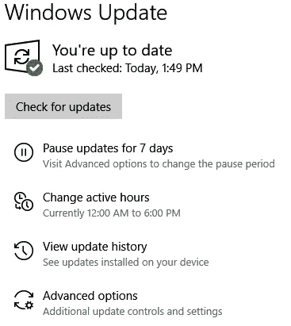

单击“检查更新”并安装，直到没有更新，或找到 2004 年更新本身

首先，您必须更新到 Windows 2004，通过手动检查更新并安装任何出现的更新来完成(警告:这将占用大量内存和时间)。然后你就可以使用[这些方向](https://docs.microsoft.com/en-us/windows/wsl/install-win10)安装 WSL 2 了。

## Docker 图像

[本教程](/brewing-up-custom-ml-models-on-aws-sagemaker-e09b64627722)很好地解释了为我们的定制模型设置 Docker 图像的每个步骤。因此，按照教程，但首先要记住这些问题:

我在使用提供的模板时遇到的一个问题是安装 gevent。正如你在我的[docker 文件中看到的，](https://github.com/maxbren/aws-custom-docker-model-deploy-front-end/blob/master/docker-image-code/Dockerfile)我使用了 *easy_install* 而不是 *pip。*

```
RUN easy_install gevent
```

**重要提示:**如果你在 Windows 上创建图像代码，那么你必须使文件与 Unix 兼容，因为行尾符号是不同的。这可以通过命令 dos2unix 来完成:

```
find some/directory -type f -exec dos2unix {} \;
```

其中 */some/directory* 是图像代码的目录。

**还有**，确保允许*模型/服务*和*模型/列车*等文件执行:

```
chmod +x file/path
```

现在遵循另一个教程的步骤，直到您到达 AWS ECR 部分。确保创建图像并按照描述在本地测试您的模型。

## 唯推理模型

有时，您可能不需要在推断之前实际训练您的模型。这就是我的应用程序的情况，我将在本文结尾展示。不幸的是，SageMaker 仍然要求模型在部署之前必须是合适的。但是，您可以非常容易地在 Docker 映像中设置一个虚拟的训练脚本。例如，您可以打开模型路径并编写一个虚拟字符串作为训练。

以下是我的训练脚本:*docker-image-code/anomaly-model/train*

## 注册 Docker 图像

一旦您的模型图像被创建并且在本地工作，为了 SageMaker 能够访问它，它必须被存储在 AWS 弹性容器注册中心(ECR)中。

进入 [AWS ECR](http://aws.amazon.com/ecr) 并点击“开始”。单击橙色的“创建存储库”。

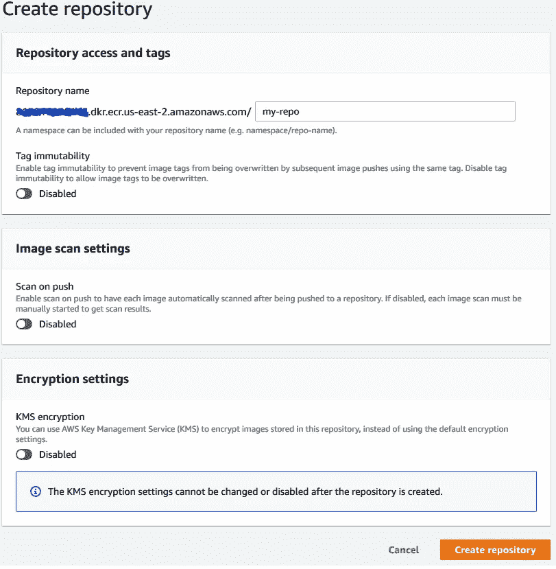

在“存储库名称”下输入代表您的模型的名称。然后再次“创建存储库”。您不需要更改任何其他选项。

然后选择新的回购协议，并点击“查看推送命令”

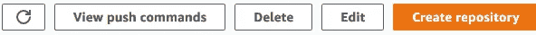

遵循页面上显示的“macOS / Linux”命令。如果这是您第一次做这样的事情，您将需要 AWS 命令行界面(CLI)。遵循这些[指令](https://docs.aws.amazon.com/cli/latest/userguide/cli-chap-install.html)。并且用[这个](https://docs.aws.amazon.com/AmazonECR/latest/userguide/Registries.html#registry_auth)认证 Docker。一旦设置了 CLI 和身份验证，您就不必再重复了。

> 每当您想要更新您的模型时:更新图像代码，重新创建图像，在本地测试它，并再次遵循 push 命令。

Phew ，这可能需要一段时间和一些谷歌搜索，特别是如果你在 Windows 上，但希望我成功地帮你通过它。如果没有，请在评论中告诉我问题出在哪里。此时，您应该有了模型的工作 Docker 映像，并已将其存储在注册表中。

# 使用 SageMaker 部署

现在我们开始使用 AWS 的其他部分。首先，我们必须用 SageMaker 部署模型，然后使用 AWS Lambda 和 API Gateway 来设置一个 API，用于向模型发送数据并接收推理响应。

更详细地说，客户机调用用 API Gateway 创建的 API，并传入数据进行推理。然后，API Gateway 将这些数据传递给 Lambda 函数。在这里，它被解析并发送到 SageMaker 模型端点(称为“调用”)。该模型使用这些数据执行预测，输出通过 lambda 和 API 网关发回，后者使用预测值响应客户端。

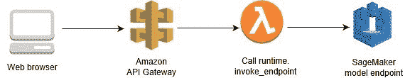

来自[这篇](https://aws.amazon.com/blogs/machine-learning/call-an-amazon-sagemaker-model-endpoint-using-amazon-api-gateway-and-aws-lambda/)博文

## SageMaker 笔记本

首先，我们将使用 [SageMaker](http://aws.amazon.com/sagemaker/) 部署我们的模型。

创建新的笔记本实例(或使用现有的实例)。您可以使用默认设置，并设置一个名称。从我的回购上传这个[笔记本](https://github.com/maxbren/aws-custom-docker-model-deploy-front-end/blob/master/deploy-custom-model.ipynb)。唯一需要设置的是 *docker_image_name* 变量，它是你注册的 docker 图像的名称。可以在 ECR 的“储存库”下找到 URI:

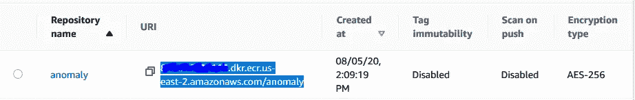

下面我来解释一下笔记本的代码:

首先安装 SageMaker 版本 1.72(我无法让它与最新版本一起工作，但它现在可能工作了)。获取会话、客户机和执行角色，为模型输出创建一个存储桶。docker 图像名称是您上传的图像的 repo URI。

创建接受许多参数的估计器。可以根据你的需求改变的是 *train_instance_type* 。这是 AWS 云计算实例，将在调用 fit 时用于训练模型。注: *m1.m4.xlarge* 似乎是训练允许的最便宜的。此处列出了更多可能适用于也可能不适用于培训的实例类型[。如果你需要更多的内存来训练，或者只是想让它更快，尝试更昂贵的实例。](https://aws.amazon.com/sagemaker/pricing/instance-types/)

接下来，我们调用 fit 来训练模型。这将运行 docker 图像模型目录中的训练脚本。**您将需要调用 fit，即使模型的唯一目的是推理**。我的项目就是如此。

最后，我们通过部署模型来建立端点。 *endpoint_name* 应该是可以识别的东西。用于推理的实例类型甚至可以比用于训练的更不密集，例如最便宜的 *m1.t2.medium* 。

[这里](https://aws.amazon.com/sagemaker/pricing/)更多的是关于 SageMaker 的价格。**使用** [**AWS 成本管理**](https://aws.amazon.com/aws-cost-management/) **来跟踪您的模型的培训和部署成本(如果您不小心，成本可能会很快失控)。**

现在我们已经部署了模型！让我们弄清楚如何真正让人们与它互动。

# 使用 Lambda & API 网关创建 API

我们必须创建一个 lambda 函数来调用端点。转到 [AWS Lambda](http://aws.amazon.com/lambda/) 并创建一个新函数。将其命名为有用的名称，将运行时更改为 Python 3.6，然后选择一个现有的执行角色，该角色有权调用模型端点或创建一个新的执行角色。

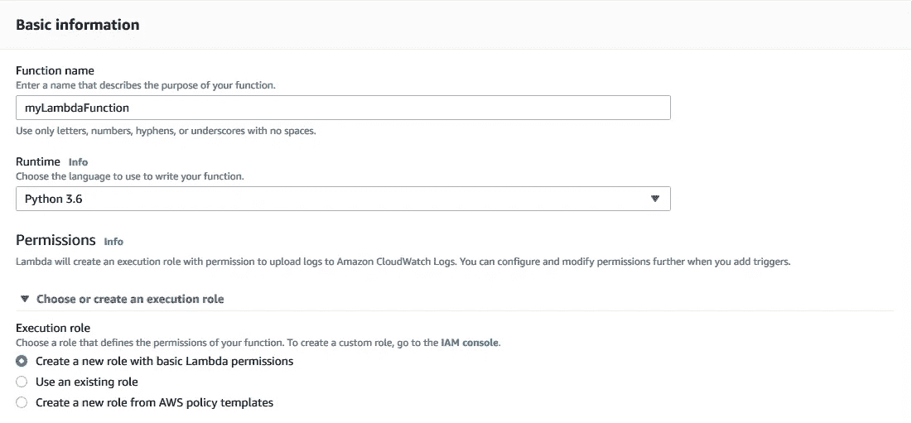

## IAM 角色权限

要向您的角色授予调用模型端点的权限，请转到 [AWS IAM](https://console.aws.amazon.com/iam/) ，然后在侧边栏上选择“角色”:

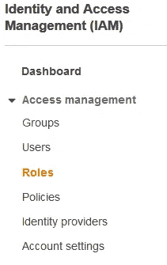

单击角色，在上面的例子中是“myLambdaFunction-role-…”。在打开的“权限”选项卡中，单击唯一策略。

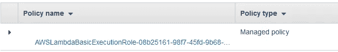

应该会出现一个策略的 JSON 描述。点击“编辑策略”，然后点击“JSON”选项卡，添加一行*“sagemaker:InvokeEndpoint”*，如下所示:

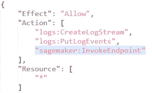

这允许角色与 SageMaker 端点进行交互。点击底部蓝色的“审查政策”和“保存更改”。

回到 lambda，在“lambda_function”代码面板中用[代码替换现有代码](https://github.com/maxbren/aws-custom-docker-model-deploy-front-end/blob/master/lambda-code.py)。

首先，您会注意到*端点名称*变量。这将我们模型的端点链接到这个函数。在我的例子中是*异常检测端点*:

用于部署模型的 SageMaker 代码；显示您选择的端点名称

编辑功能代码下的“环境变量”:

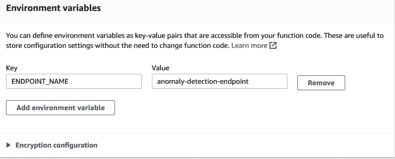

添加一个环境变量，关键字为 *ENDPOINT_NAME* ，值为 SageMaker 中的端点名称。在我的情况下，它将是*异常检测端点。*保存它。

回头看看 lambda 函数代码，下一件重要的事情是*content type = ' application/JSON '*调用端点。在我的例子中，输入数据是一个 JSON，因为我包含了一些用于推理的超参数，而不仅仅是模型的输入数据。然而，如果您不需要推理超参数，那么您可以创建类型*‘text/CSV’*，步骤都非常相似。

## 创建 API 网关

用 POST 请求访问已部署模型的最后一步是设置一个 API。登录后，进入 [AWS API 网关](http://aws.amazon.com/api-gateway/)，点击右上角的“创建 API”。然后选择“HTTP API”作为类型，并单击“构建”。添加一个 lambda 集成，并选择正确的 AWS 区域和刚刚创建的 Lambda 函数的名称。然后命名网关。大概是这样的:

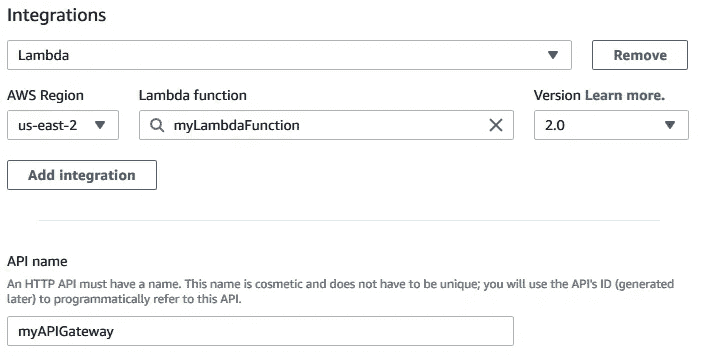

点击“下一步”并添加路线。选择“过帐”作为方法。在“资源路径”中再次输入 lambda 名称，如 */myLambdaFunction* 。并在“集成目标”下再次放置 lambda 函数名。

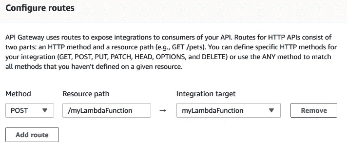

对于 stages，添加一个类似于 *test* 的 stage，并单击开关，这样这个 stage 就会自动部署。这将是后 URI 时代的一部分。

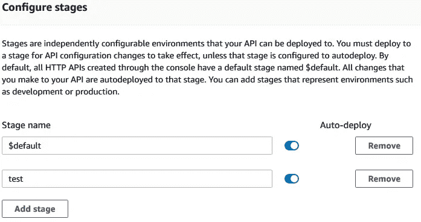

最后，点击底部的“创建”。

如果你回到你的 lambda 函数，你会在顶部的图中看到 API Gateway。单击它，然后显示详细信息。“API 端点”是 POST 请求的 URL，人们可以使用它从您的模型中获得预测。它遵循以下格式:

```
https://{restapi_id}.execute-api.{region}.amazonaws.com/{stage_name}/{resource_name}
```

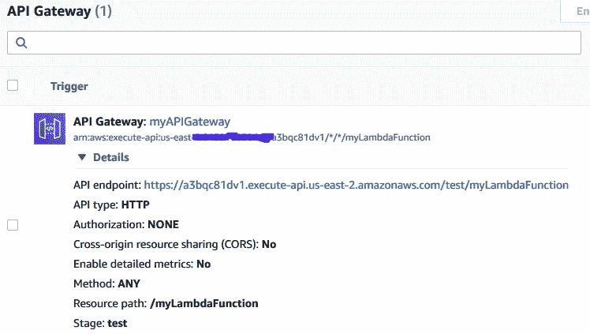

最后，您可能希望允许这个 API 网关的 CORS 配置中的所有源和头，否则当您试图使用 AJAX 在您的静态 S3 网站中发出 POST 请求时，将会遇到 CORS 问题。

回到 API Gateway，点击你的 API。然后转到侧边栏“开发”下的“CORS”。

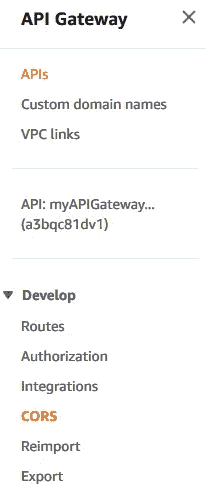

点击“配置”，添加 *** 为“访问-控制-允许-起源”*，** 为“访问-控制-允许-标题”，添加 *POST* 为“访问-控制-允许-方法”。那就省省吧。

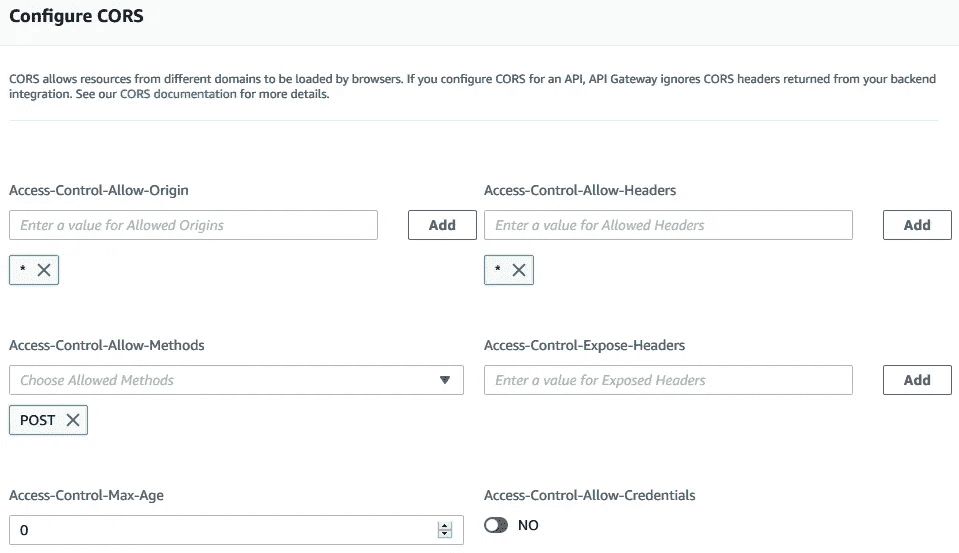

您可能希望更具体地描述这些选项，因为通配符*允许所有可能的选项，例如访问此 API 的所有可能来源。

这是又一个完成的大部分！现在，API 被设置为从您的模型接收预测。在下一节中，我将描述如何用 Postman 测试调用，并使用 AWS CloudWatch 修复任何不明确的错误。

# 使用 Postman 和 CloudWatch 进行测试

让我们用 Postman 测试模型的推理代码，Postman 是一个 API 开发平台，有助于轻松检查我们的新 API。如果你还没有为你的操作系统安装 [Postman](https://www.postman.com/) 。然后创建一个新请求，并选择“过帐”作为类型。在 URL 选项卡中设置我上面提到的 URL。

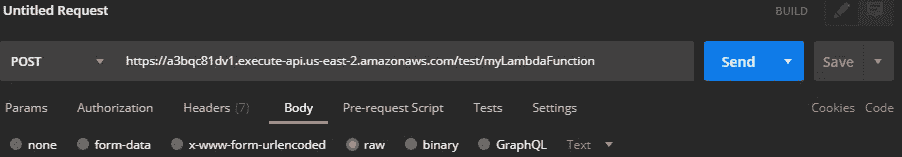

您可以更改请求的某些内容，比如授权或标题，尽管我没有更改默认设置。

接下来，我们必须实际输入请求的正文。这将包含我们希望模型用来进行预测的数据。我发现最简单的方法是对 JSON 和 CSV 数据使用“Body”下的“raw”选项卡。这将避免数据的任何编码(除非您需要)。

对于 CSV 正文，将 CSV 数据本身作为原始字符串粘贴。格式为:

```
"First,Line\r\nSecond,Line\n\r......"
```

对于 JSON 主体，编写 JSON 字符串。如果实际的模型输入本身仍然是 CSV 格式的，那么您可以添加一个关键字，如 *"data"* ，其值与上述相同。类似于:

```
{"hyperparameter_1": #, "hyperparameter_2": #, "data": "First,Line\r\nSecond,Line\n\r......"}
```

然后点击“发送”！有可能有些东西不起作用。确保您的端点仍然在 SageMaker 上(笔记本本身不需要运行)。Lambda 连接到正确的端点(从 env 变量)。API Gateway 通过请求的正确 URL 连接到 Lambda。如果你得到一个“500 内部服务器错误”或者“ModelError ”,那么你的 Docker 镜像代码或者 lambda 函数代码就有问题。这就是 AWS CloudWatch 派上用场的地方。

## AWS 云观察

找出哪一行代码触发了一个模糊错误的最好方法是使用 AWS CloudWatch。我不会详细介绍 CloudWatch，但我会提到一些有用的东西。AWS CloudWatch 允许您监控日志中记录的正在运行的 AWS 进程。例如，可以跟踪 SageMaker 培训工作、笔记本实例或端点。

要找出是什么触发了一个错误，进入 [AWS CloudWatch](http://console.aws.amazon.com/cloudwatch/) ，在左侧栏进入“日志”下的“日志组”。您应该已经创建了一些日志组。首先检查你的 lambda 函数日志。点击它，你会看到一堆日志流。

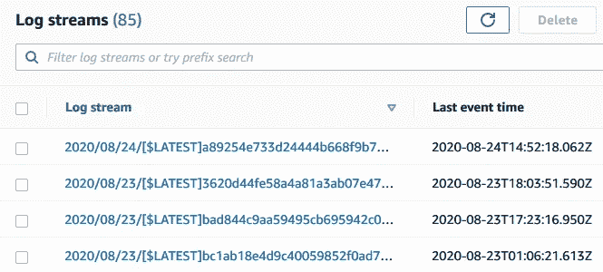

最上面的一个是最近的，所以单击它，查看具体的消息。如果这个日志组有问题，那么应该归咎于你的 lambda 函数。

要检查的另一个日志组是连接到端点的日志组。此处出现的任何问题都表明您的 Docker 图像代码有问题。即使它在本地运行良好，在 AWS 中运行也会有问题。此外，这里还会显示许多 pings，忽略它们或尝试过滤它们。

希望，它现在运行顺利，你得到你期望的输出，如果没有留下评论，我会帮助修复它。

最后，我们有了一个可用的模型。如果你需要的只是文章的网址，你完全可以就此打住。然而，另一件有用的事情可能是创建一个漂亮的前端，让人们可以将自己的数据输入到模型中。一个简单的方法是使用 S3 创建一个静态网站来访问文章的 URL。

# 用 S3 创建一个静态网站前端

[这篇中型文章](https://medium.com/@kyle.galbraith/how-to-host-a-website-on-s3-without-getting-lost-in-the-sea-e2b82aa6cd38)很好地描述了如何一步一步地用 S3 创建一个静态网站。因此，与其自己重新创建，不如检查一下，并完成它的所有步骤(注意:你不需要建立一个 CNAME 记录)。

完成后，我建议您做的唯一一件事就是添加 CORS 策略，方法是转到“权限”->“CORS 配置”，然后粘贴以下内容:

```
<?xml version="1.0" encoding="UTF-8"?>
<CORSConfiguration ae kv" href="http://s3.amazonaws.com/doc/2006-03-01/" rel="noopener ugc nofollow" target="_blank">http://s3.amazonaws.com/doc/2006-03-01/">
<CORSRule>
    <AllowedOrigin>*</AllowedOrigin>
    <AllowedHeader>*</AllowedHeader>
    <AllowedMethod>POST</AllowedMethod>
</CORSRule>
</CORSConfiguration>
```

它将处理 CORS 问题，就像我们在 API Gateway 中处理它一样。

## AJAX 向模型发送请求

最后，让我们在网站中用 AJAX 连接 API 调用。这个调用很简单，看起来像这样:

注意:**将内容类型设置为 text/plain，以避免它像用 Postman 一样对您的请求数据进行编码(除非您希望这样)。**

这就结束了使用 AWS 部署定制模型并使用面向用户的前端设置它的端到端开发链。如果您想对您的模型代码进行更改，那么重新制作 Docker 映像并将其推回 ECR。然后重新部署。另外，当您不希望从 SageMaker 控制台或笔记本代码中部署模型端点时，请删除它。

## 我的应用 Google 趋势数据的异常检测

我创建了一个自定义模型，该模型采用 google 趋势数据(CSV)并使用基于密度的带噪声应用聚类算法(DBSCAN)或黄土季节趋势分解算法(STL)分析异常图。


来自[维基百科](https://en.wikipedia.org/wiki/DBSCAN)

简而言之， [DBSCAN](/dbscan-clustering-explained-97556a2ad556) 是一种机器学习聚类算法，但可用于异常检测，因为与 K-means 不同，它不会对所有点进行聚类。这些剩余或未聚类的点可以被认为是异常值/异常值。

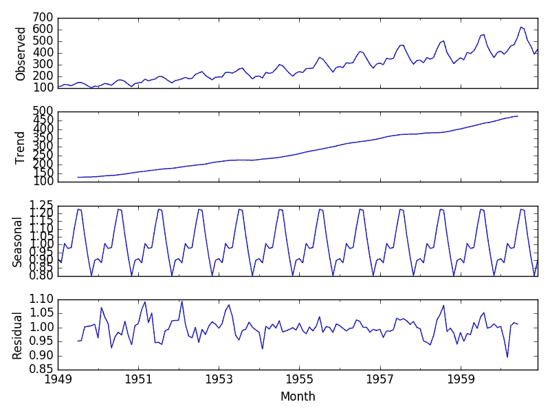

来自[机器学习大师](https://machinelearningmastery.com/decompose-time-series-data-trend-seasonality/)

[STL](http://www.gardner.fyi/blog/STL-Part-II/) 是时间序列数据的统计分解，目的是检测异常或探索数据元素。它将数据分解成季节模式、趋势和残差。然后，您可以对残差使用异常值检测测试，例如[广义极端学生化偏差(GESD)](https://www.itl.nist.gov/div898/handbook/eda/section3/eda35h3.htm) 测试。对于具有季节性模式的数据，STL 往往比 DBSCAN 工作得更好，但是如果没有季节性模式，STL 就不能有效地使用。

查看我部署的模型前端[这里](http://www.google-trends-anomaly-detection.com.s3-website.us-east-2.amazonaws.com/)。在 [google trends](https://trends.google.com/trends/?geo=US) 上搜索一个术语并下载 CSV:

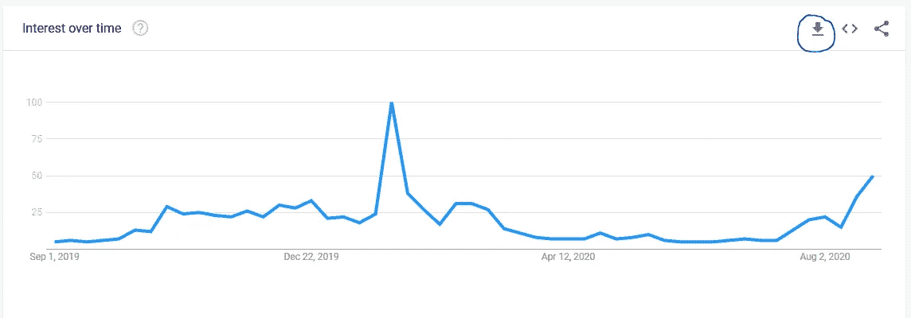

然后上传到网站上，如果数据有季节性，填写给出的超参数。

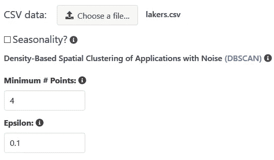

绘制它，它看起来会像这样:

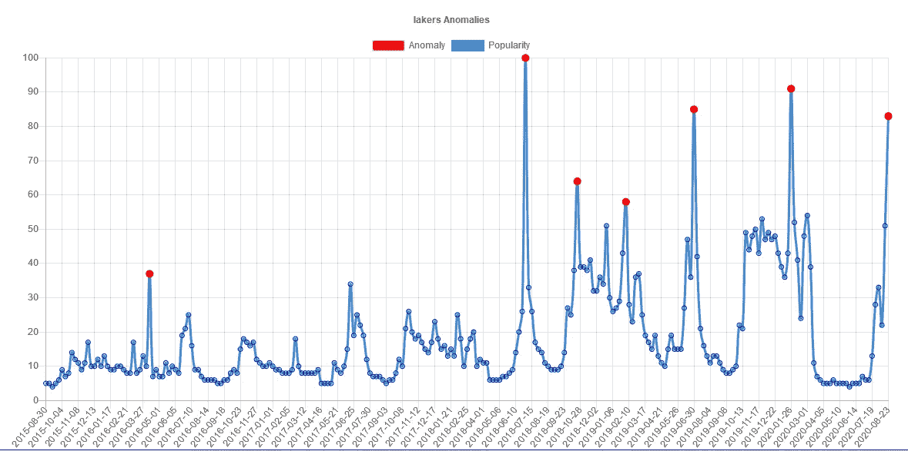

湖人受欢迎程度与异常积分的关系图

注意:**网站可能不会一直打开**

如果它还没出来，你想检查一下，或者你对评论中的这些步骤有任何问题，请告诉我！点击查看随附代码[。](https://github.com/maxbren/aws-custom-docker-model-deploy-front-end)