# 免费在 AWS 上部署数据应用程序

> 原文：<https://towardsdatascience.com/deploying-a-data-app-on-aws-for-free-f62e121c049e?source=collection_archive---------26----------------------->

## [实践教程](https://towardsdatascience.com/tagged/hands-on-tutorials)

## 让其他人立即访问您的数据应用程序


由 [Austin Distel](https://unsplash.com/@austindistel?utm_source=unsplash&utm_medium=referral&utm_content=creditCopyText) 在 [Unsplash](https://unsplash.com/s/photos/stock-price?utm_source=unsplash&utm_medium=referral&utm_content=creditCopyText) 上拍摄

在之前的[帖子](/building-a-data-app-with-streamlit-in-no-time-c5942c48abd)中，我们用 Python 和 Streamlit 创建了一个数据应用。它只在本地机器上工作，所以其他人不能使用它。

在本文中，我们将在 AWS EC2 实例上运行我们的数据应用程序，以便其他人可以访问它。

我们只需要在 AWS 上创建一个[自由层](https://aws.amazon.com/free/?trk=ps_a134p000003yLV5AAM&trkCampaign=acq_paid_search_brand&sc_channel=PS&sc_campaign=acquisition_TR&sc_publisher=Google&sc_category=Core&sc_country=TR&sc_geo=EMEA&sc_outcome=acq&sc_detail=%2Baws%20%2Bfree&sc_content=Cost_bmm&sc_segment=444593201226&sc_medium=ACQ-P|PS-GO|Brand|Desktop|SU|AWS|Core|TR|EN|Text&s_kwcid=AL!4422!3!444593201226!b!!g!!%2Baws%20%2Bfree&ef_id=Cj0KCQjw28T8BRDbARIsAEOMBcyJihEPHLTrk5ps-eBexSUS8Sx2PZ-bce7F6bU0pqjnR5kwunHDzE4aAukWEALw_wcB:G:s&s_kwcid=AL!4422!3!444593201226!b!!g!!%2Baws%20%2Bfree&all-free-tier.sort-by=item.additionalFields.SortRank&all-free-tier.sort-order=asc)账户。创建它非常简单，如果我们保持在免费层的范围内，我们不会被收取一分钱。免费层的范围对于学习来说已经足够了。

如果您已经有一个 AWS 帐户或刚刚创建了一个免费的一级帐户，我们已经准备好开始。

帖子的概要:

*   创建 EC2 实例
*   连接到 EC2 实例(Linux、Mac 和 Windows)
*   在 EC2 实例上运行应用程序

# **创建 EC2 实例**

我们需要在 AWS 管理控制台上打开 EC2 仪表板。

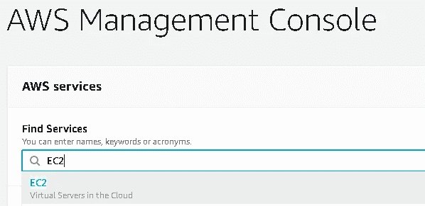

(图片由作者提供)

在 EC2 仪表板上，向下滚动一点并单击 Launch Instance。

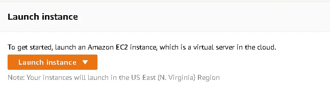

(图片由作者提供)

我们首先需要选择一个 Amazon 机器映像(AMI ),它提供启动实例所需的信息。AMI 包含软件配置(即操作系统)和一些预安装的软件包。

AMI 有很多选择。我们将选择第一个是亚马逊 Linux 2。

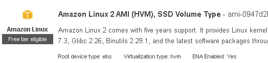

(图片由作者提供)

您可以选择另一个，但要确保它符合自由层条件。

下一步是选择实例类型。有一个符合免费层的条件。

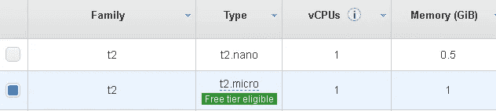

(图片由作者提供)

下一步是配置实例细节，但我们可以保留默认选项。我们也可以跳过接下来的两项，即“添加存储”和“添加标签”。默认的存储选项就足够了。

下一步是配置安全组。可以认为它是一个实例级的防火墙。因此，它管理进出实例的流量。

我们将添加如下两条新规则:

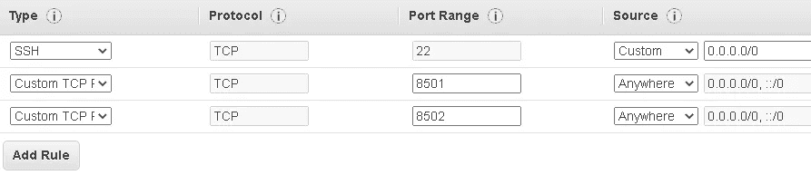

(图片由作者提供)

然后我们将回顾并发布。最后一步是创建密钥对。确保创建一个密钥对并下载它。我们将需要它来连接到实例。

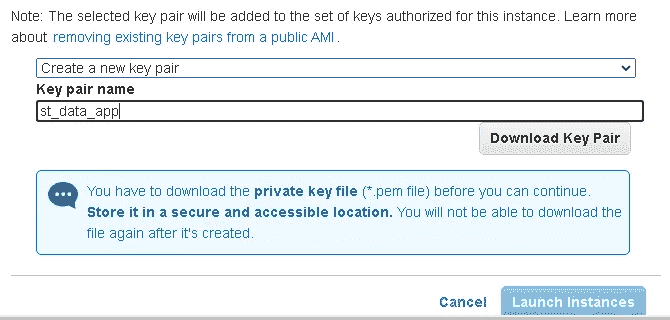

(图片由作者提供)

下载密钥对(。pem 文件)，我们就可以启动实例了。该实例将在几分钟后准备好，我们可以在 EC2 仪表板上查看它。

# 连接到 EC2 实例

我目前使用的是 windows 计算机，因此我将向您展示如何从 windows 计算机连接到实例。

如果您使用 Linux 或 Mac，连接过程会简单得多。事实上，AWS 已经明确解释了这些步骤。在 EC2 仪表板上，选择您的实例并单击“Connect”。将打开一个带有说明的新页面:

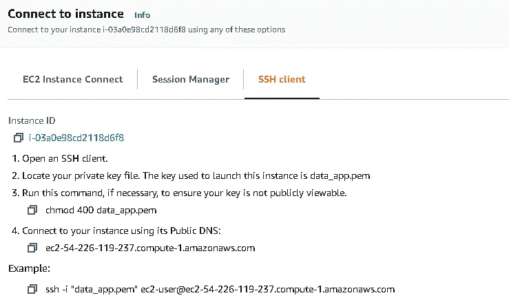

(图片由作者提供)

让我们回到我们的 windows 机器案例。我们将使用 PuTTY，这是一个用于 windows 的免费 SSH 客户端。你可以从 putty.org 下载。

第一步是使用启动实例时下载的密钥对(pem 文件)创建一个 ppk 文件。

从 PuTTY 下的菜单中，打开 PuTTYGen。点击“加载”，然后选择 pem 文件。

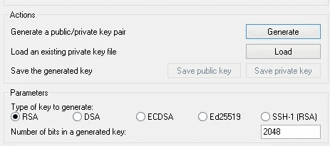

(图片由作者提供)

然后点击“保存私钥”保存生成的 ppk 文件。

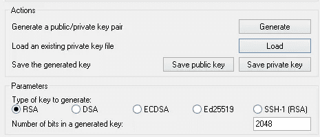

(图片由作者提供)

我们现在有了我们需要的 ppk 文件。下一步，我们将从 PuTTY 下的菜单中打开“PuTTY”。

在 EC2 仪表板上，单击实例 ID 以查看实例详细信息。复制 EC2 实例的 IP 地址(IPv4 公共 IP)。

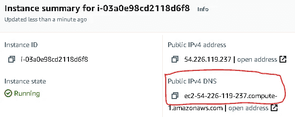

(图片由作者提供)

然后在键入“ec2-user@”后将其粘贴到主机名框中，如下所示:


(图片由作者提供)

然后选择连接-> SSH -> Auth ->浏览并上传 ppk 文件。

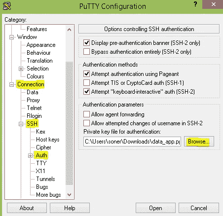

(图片由作者提供)

暂时不要点击“打开”。下一步是为您的会话命名。单击“Session ”,在“Saved Sessions”框中键入名称并保存。


(图片由作者提供)

现在，我们可以单击“打开”来连接到实例。

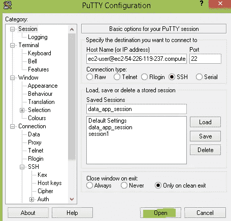

(图片由作者提供)

我们现在连接到我们的实例。Putty 将打开一个终端，如下所示:

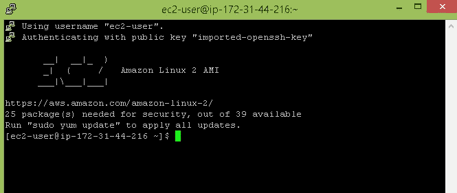

(图片由作者提供)

# 在 EC2 实例上运行应用程序

我们已经准备好上传实例的源代码和依赖项。

这个 EC2 实例预装了 Python 2.7，但我们需要 Python 3.6 或更高版本的 Streamlit。以下命令将安装 Python 3。

```
sudo yum install python3
```

我们将从 [Github 库](https://github.com/SonerYldrm/stock-prices-app)中克隆源代码，因此我们将安装 git。

```
sudo yum install git
```

我们现在可以在 EC2 实例中克隆存储库了。复制存储库的地址:

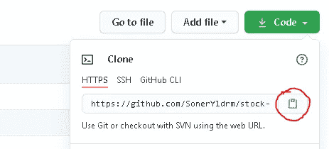

(图片由作者提供)

然后在“git 克隆”后粘贴到终端中:

```
git clone [https://github.com/SonerYldrm/stock-prices-app.git](https://github.com/SonerYldrm/stock-prices-app.git)
```

输入存储库:

```
cd stock-prices-app
```

下一步是安装依赖项:

```
sudo python3 -m pip install streamlit
sudo python3 -m pip install pandas
sudo python3 -m pip install pandas-datareader
```

由于这是一个简单的应用程序，我们没有太多的依赖。

源代码保存在 st1.py 文件中。您可以通过在终端中键入“ls”来查看存储库中的文件。

我们现在可以使用以下命令运行该应用程序:

```
streamlit run st1.py
```

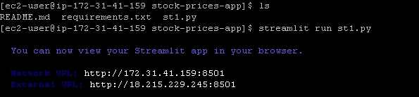

(图片由作者提供)

恭喜你。我们的股票价格数据应用程序运行在 EC2 实例上，可以通过网络浏览器从任何地方访问。

在您的网络浏览器中输入外部 URL，您将看到该应用程序正在运行。这是保存在网络浏览器中的应用程序的简短屏幕记录。

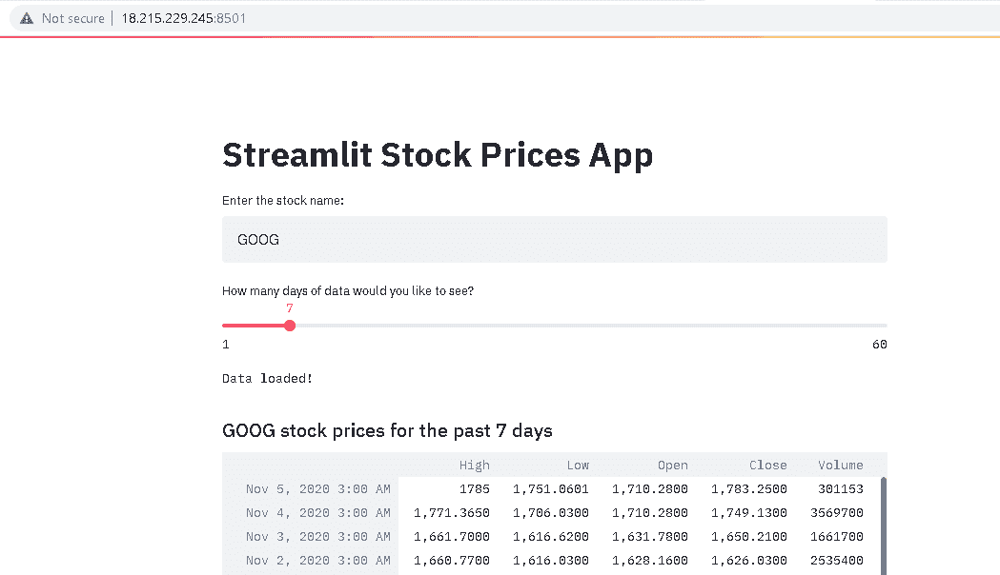

(图片由作者提供)

***注意*** :第一次打开 app 时可能会看到关于数据源的警告。忽略它，输入一个股票名称就可以了。应用程序将顺利运行。

当你读到这篇文章时，我可能已经运行了这个实例。然而，您可以使用[资源库](https://github.com/SonerYldrm/stock-prices-app)中的源代码轻松创建自己的库。

# **结论**

股价数据 app 就是一个简单的。它只是根据用户输入下载股票价格并显示出来。然而，创建更高级和更复杂的应用程序的过程是相同的。

我相信这个简单的应用程序和快速部署将有助于您创建数据科学或机器学习产品。一旦你熟悉了基础，你就可以稳步增加复杂度。

值得注意的是，这不是一个生产就绪的部署。适当的安全与 HTTPS 和证书是非常重要的真正的产品。还应该考虑预期的流量。最后，您可能希望获得一个主机名。

感谢您的阅读。如果您有任何反馈，请告诉我。