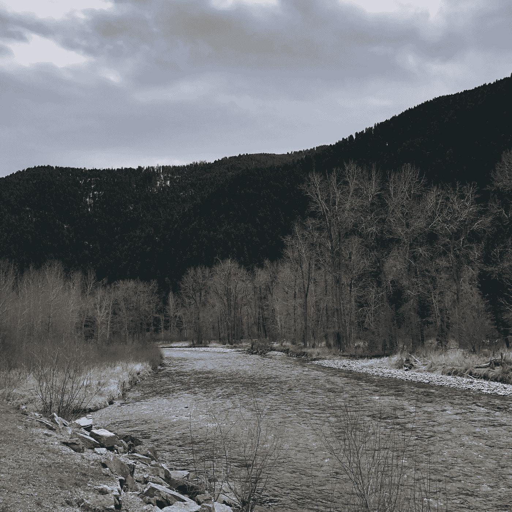
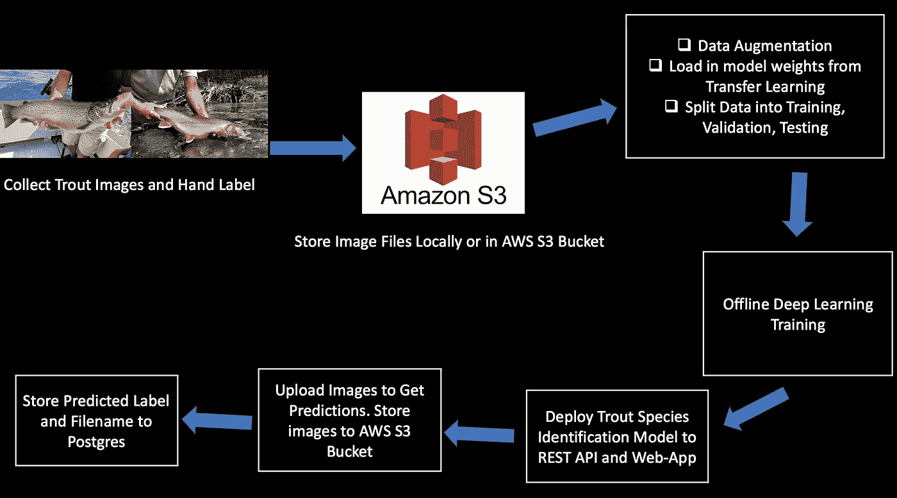
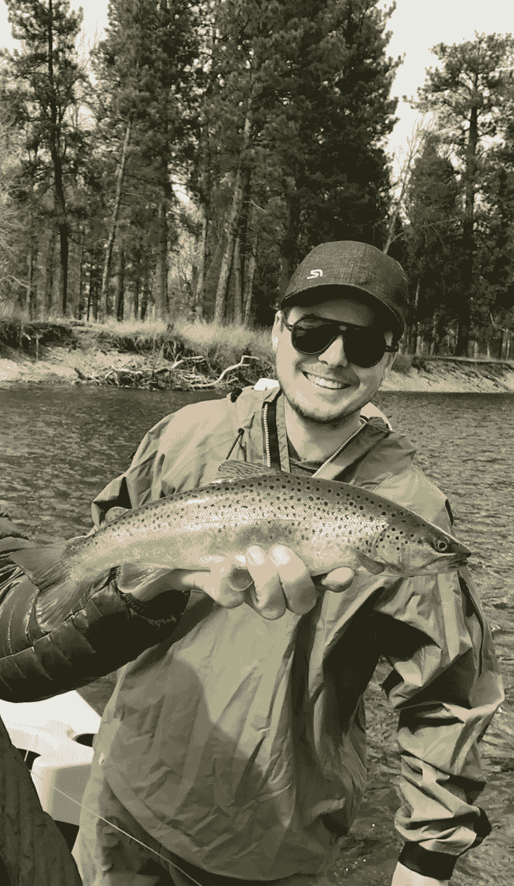
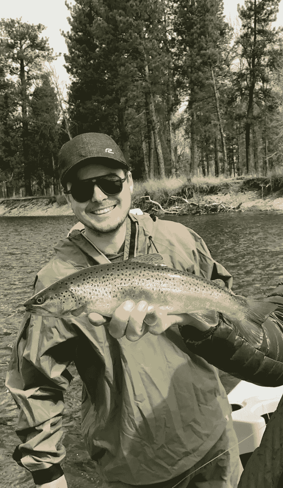

# 构建用于标记鳟鱼种类的深度学习模型 API

> 原文：<https://towardsdatascience.com/deploying-a-deep-learning-api-for-tagging-trout-species-bff1b1f902a3?source=collection_archive---------55----------------------->

## 一个用于识别鳟鱼种类的全栈深度学习研究项目&更多

*本博客参考了正在进行的* [*水视觉深度学习研究项目*](http://www.aqua-vision-research.com) 的工作

我最近在蒙大拿迷上了干蝇钓鱼。这是一项技术运动，我还不是很好(目前为止！)但是，在河上航行是一种享受，每次航行都能学到更多东西。

蒙大拿州洛克克里克

当我出去钓鳟鱼时，我注意到的一件事是，我对不同种类的鳟鱼知之甚少。当我钓到鳟鱼时(这种情况仍然不常见)，我发现自己在谷歌上搜索照片，并将它们与我钓到的鱼进行比较。我几乎无法区分不同的物种。这让我想到，也许有一种方法可以用计算机视觉深度学习来程序化地识别鳟鱼种类。我问了几个朋友，他们是专业的钓鱼向导和铁杆业余爱好者，因为我认为图像识别可能会有所帮助，他们是这样说的:

鳟鱼有大约 30 种，所以很难区分它们中的一些

**“这对于所有的杂交鳟鱼物种来说都是非常有趣的，比如切弓鳟”** *(切弓鳟是割喉鳟和虹鳟的杂交品种)*

我开始提出以下问题:

1.  *能否建立一个准确的深度学习计算机视觉模型，从图像中识别鳟鱼种类？*
2.  *我能否构建一个 web 应用、REST API 和移动应用，作为深度学习模型的支持基础设施？*
3.  *我是否可以建立一个开源的 trout 照片收集库，以鼓励进一步的深度学习模型开发、图像收集/标记和 trout 研究？*

# 数据收集和机器学习管道

用于构建 [*Aqua Vision 深度学习*](http://www.aqua-vision-research.com) *、深度学习应用和 API 的完整数据管道*

## 数据

对于鳟鱼图像(更不用说任何其他鱼类)没有一个全面的标记数据集，所以我从头开始建立了自己的 500+图像数据集。我用下面列出的几种不同的方法收集图像。

**数据来源:**

*   谷歌图片搜索:[在控制台中运行 Javascript 命令](https://github.com/fastai/course-v3/blob/master/nbs/dl1/lesson2-download.ipynb)来抓取图片和下载文件
*   hashtag[insta gram Scraper](https://github.com/rarcega/instagram-scraper)的命令行工具(即 *#browntrout* ， *#rainbowtrout* )
*   从钓鱼博客和研究机构下载照片

收集完图像后，我手动检查了所有的照片，以确保图像与它们各自的鳟鱼种类标签相匹配，并删除了任何不属于它们的杂项图像(捕鱼设备、河流、钓具箱、错误标记的鱼种等)。数据收集和清理阶段大约需要三周时间。现在，我拥有了 500 多张跨越少数鳟鱼物种的图像，我有了一个初始图像数据集，可以开始构建一个深度学习鳟鱼识别模型。

## **构建深度学习模型**

Fastai 深度学习库有一些非常好的内置工具，可以从谷歌图像搜索中抓取图像，然后将图像文件加载到一个`ImageDataBunch`对象中。然后，`ImageDatabunch`可以应用数据扩充转换器，设置图像像素分辨率的大小，加载迁移学习并将数据分成训练、验证和测试集。

对于数据扩充，我用默认设置保持它非常简单，但我确实随机水平翻转图像，以帮助标准化鱼面向每个方向的图像。

数据扩充:棕鳟鱼的水平翻转示例

数据增强真的很好，因为它本质上有助于规范化现有的数据集，以训练更多的例子，增强的图像看起来都很不同，但我们不必做任何额外的手动标记，所以它们就像免费的额外数据。我发现，试验数据扩充参数和数据集的领域专业知识确实是最大限度地扩充数据的方法。

我利用迁移学习，从 ImageNet 预加载模型权重，而不是从头开始初始化深度学习模型权重。ImageNet 是一个数据集，包含数百万张带有标签的高分辨率图像，大致属于 22k 个类别。这些图片是从互联网上收集的，并由人们使用众包工具进行标记。迁移学习是一种很好的方式，可以利用之前训练的模型并降低计算成本，然后根据特定领域的数据进行微调，以执行特定领域的任务。

然后将`ImageDataBunch`与神经网络架构和损失函数一起加载到`Learner`对象中，以训练深度学习模型。

`learn = cnn_learner(ImageDataBunch, models.resnet.34, metrics=error_rate)`

提高模型性能的一个小技巧是从较小的图像尺寸(224)开始训练，然后将这个拟合的模型在较大的图像尺寸(352)上进行一些拟合。这在几乎所有情况下都有助于提高性能。

我在 70%的图像上训练模型，并保留剩余的 30%用于测试。我喜欢使用 [Paperspace](https://www.paperspace.com) 来训练深度学习模型，因为他们有免费的 GPU 支持的 Jupyter 笔记本，非常容易设置和加载到深度学习库中。

在通过数据(历元)的几次运行将数据拟合到更深的像素分辨率之后，该模型在测试集数据上达到 96%分类准确度的峰值。这已经足够好了，可以作为 web-app 和 API 的第一个深度学习鳟鱼标识符版本。

## 将深度学习模型部署为 API 和 Web 应用程序

我将训练好的深度学习模型导出，用于生产环境中进行预测。我将模型包装在 Python 的 web 框架 Flask 中，通过 web 应用程序和 REST API 进行预测。支持这个 Aqua Vision 深度学习研究项目的 web-app 和 API 文档可以在[这里](http://www.aqua-vision-research.com)找到。

**Rest API**

目前有两个 API 端点可用:一个用于获取深度学习模型当前支持的类(物种)，另一个通过发布图像文件进行物种预测。您可以通过从命令行执行以下 cURL 命令来测试 API。

**目前支持的类(种):**

您可以在端点查看模型当前支持的鳟鱼种类:

`GET` `/api/classes`

`curl -X GET “https://aqua-vision.herokuapp.com/api/classes"`

你会得到这样的回报:`["brown_trout", "bull_trout", "rainbow_trout"]`

**物种预测**

预测终点位于:

`POST` `/api/predict`

`curl -X POST -F image=[@b](http://twitter.com/file_name)rown_trout.png “[https://aqua-vision.herokuapp.com/api/predict](https://aqua-vision.herokuapp.com/api/predict)"`

`-X`标志和`POST`值表示我们正在执行 POST 请求。我们提供`-F image=@brown_trout.jpg`来表明我们正在提交表单编码数据。然后将`image`键设置为`brown_trout.jpg`文件的内容。在`brown_trout.jpg`之前提供`@`意味着我们希望 cURL 加载图像内容并将数据传递给请求。

你会得到这样的回报:`{“class”:”rainbow_trout”,”success”:true}`

**通过 Python 以编程方式访问 API**

下面是一个简单的 Python [脚本](https://github.com/perryrjohnson/aqua-vision/blob/master/simple_request.py)，它使用请求库向 API 提交数据，然后使用返回的预测。

# 正在进行的工作

您可以通过访问[项目的网站](http://www.aqua-vision-research.com)和 [GitHub 问题](https://github.com/perryrjohnson/aqua-vision/issues)来查看正在进行的进度。

该项目的持续目标是:

1.  **建立开源鳟鱼照片库**继续提高深度学习模型的准确性，增加鳟鱼种类识别的支持类数量(最终扩展到其他鱼类)
2.  用边界框标记图像以**将对象检测**并入深度学习图像分类
3.  带有坐标和时间戳的地理标签照片，用于未来的鳟鱼物种研究(种群分布、迁徙模式、杂交育种、地理空间分析等)
4.  构建支持性的**本地移动应用**

# 密码

这个项目的代码可以在我的 GitHub 上找到

如果你想为这个项目做出贡献，或者有任何意见或问题，请发邮件给我:[***【perryrjohnson7@gmail.com】***](mailto:perryrjohnson7@gmail.com)***或者联系***[***LinkedIn***](https://www.linkedin.com/in/perryrjohnson/)***。***