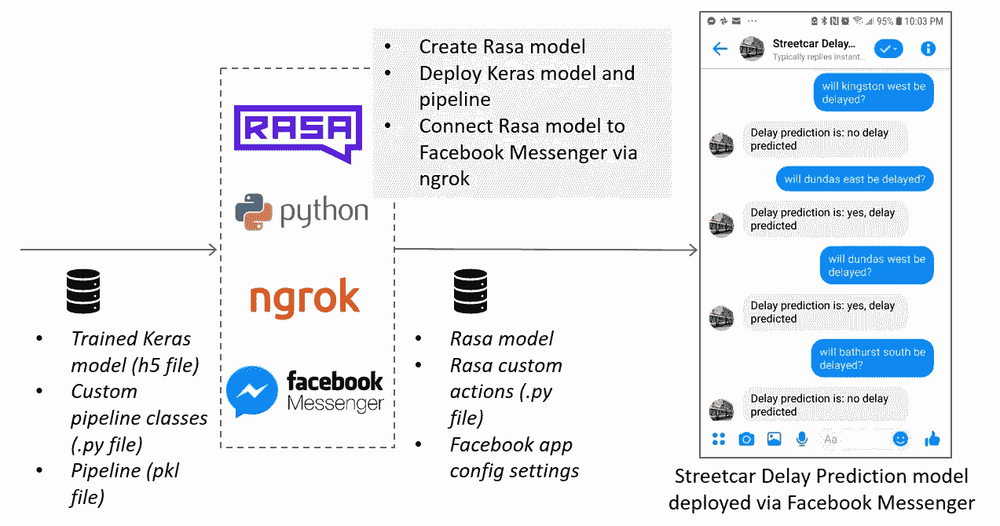
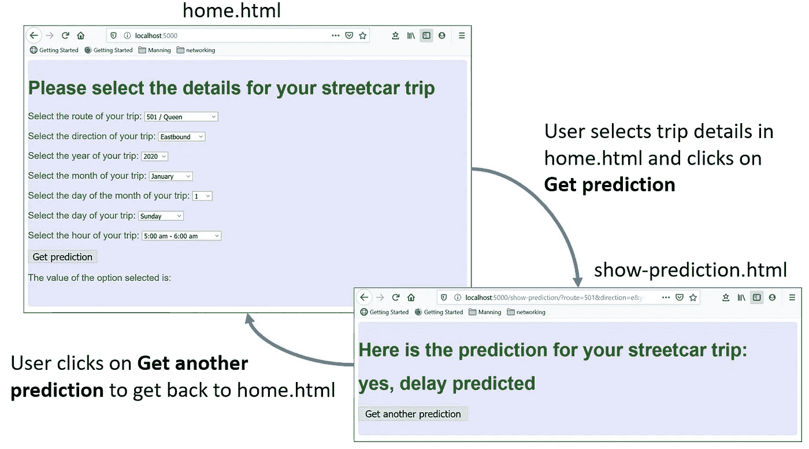
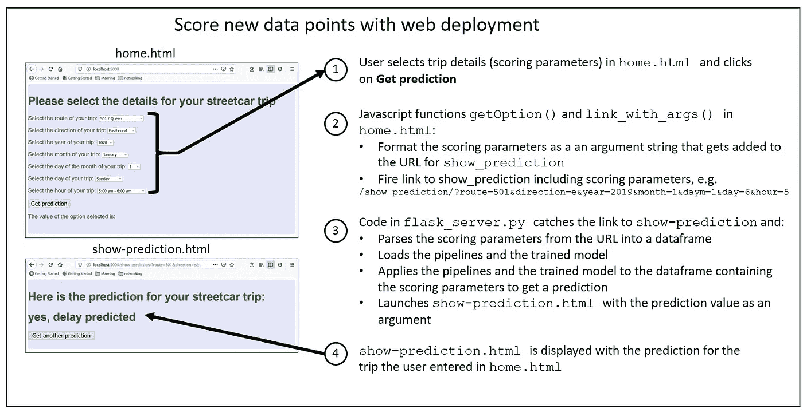
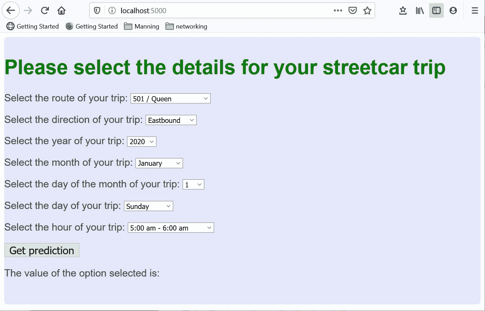
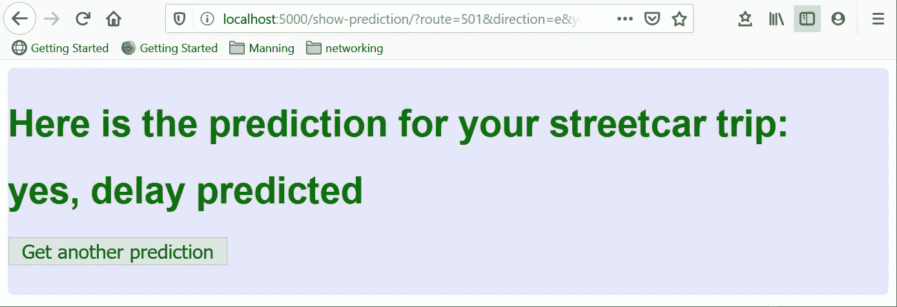

# 使用 Flask 部署深度学习模型

> 原文：<https://towardsdatascience.com/deploying-a-deep-learning-model-using-flask-3ec166ef59fb?source=collection_archive---------24----------------------->


作者照片

## 无需成为 web 开发人员即可创建 web 部署

在之前的一篇文章中，我描述了使用 Facebook Messenger 和 Rasa chatbot 框架部署深度学习模型的过程。这种方法为正在讨论的模型提供了流畅的用户体验(预测多伦多有轨电车网络的延迟)，但它有许多移动部分:配置一个脸书应用程序，训练一个 Rasa 聊天机器人，以及用 Python 为聊天机器人定义自定义操作，以应用深度学习模型来预测用户想要乘坐的有轨电车是否会延迟。



使用 Facebook Messenger 和 Rasa 进行模型部署的组件

我想以更简单、更传统的方式部署相同的深度学习模型。感谢 [Flask web 框架](https://flask.palletsprojects.com/en/1.1.x/)，我能够为街车延迟预测模型创建一个简单的基于 web 的部署。在本文中，我将描述创建这个部署的步骤。

## 为深度学习模型的网络部署寻找框架

我正在为一本书创建 web 部署，这本书是我为曼宁出版社写的，内容是关于使用结构化数据进行深度学习的。本书的读者对如何部署简单的深度学习模型感兴趣。他们需要一个简单明了的部署示例，不要强迫他们费力地处理一大堆 web 编程细节。出于这个原因，我希望 web 部署解决方案尽可能多地保留 Python 中的代码。

考虑到这一点，我研究了两个基于 Python 的 web 部署选项: [Flask](https://flask.palletsprojects.com/en/1.1.x/) 和 [Django](https://www.djangoproject.com/) 。我选择 Flask 是因为它更适合我的书的读者，对他们来说，web 编程本身并不是目的。这篇[文章](https://testdriven.io/blog/django-vs-flask/)很好地对比了 Flask 和 Django 的优缺点，它加强了我的直觉，即 Flask 是我的 web 部署的正确选择。

## web 部署的用户体验

下图总结了 web 部署的预期用户体验。用户通过两个简单的网页与部署的深度学习模型进行交互:

*   **home.html**:用于输入计划的电车行程的详细信息
*   **显示-预测。html** :显示模型对计划中的电车行程是否会延误的预测



web 部署的用户体验

用户将在网页 home.html 中选择关于他们电车旅行的细节，并点击**获得预测**。该预测(或者“是，预测到延迟”或者“没有预测到延迟”)将显示在网页 show-prediction.html 中。然后用户可以点击**获得另一个预测**返回 home.html，输入另一次有轨电车旅行的细节。

有了这个预期的用户体验，我就可以开始编写解决方案了。幸运的是，我在 Flask 上占了先机，因为我之前做过一个项目(在本文的[中有所描述)，我使用 Flask 来服务 Facebook Messenger 上下文中显示的网页。我使用该项目的 Flask 模块作为 web 部署应用程序的起点。](https://medium.com/swlh/using-facebook-messenger-webview-with-a-rasa-chatbot-67b43af3324a)

## web 部署的关键代码

web 部署中的两个关键文件是:

*   **flask_server.py:** 包含调用管道和训练模型的 flask 服务器代码和逻辑
*   **home.html:** 包含获取旅行细节的代码。

下图总结了从收集来自用户的电车行程详细信息(路线、方向和时间/日期)到显示模型预测的端到端过程:



Web 部署端到端摘要

以下是 **flask_server.py** 中的关键代码段:

*   首先，我们读取配置文件，并为管道和模型文件设置文件名:

读取配置文件 [deploy_web_config.yml](https://github.com/ryanmark1867/deep_learning_for_structured_data/blob/master/deploy_web/deploy_web_config.yml) 并设置管道和模型文件名

为管线和模型文件构建路径

*   接下来，我们有一个视图函数，当用户在浏览器中访问 localhost:5000 时，它会呈现 home.html:



home.html

**home.html**包含下拉列表的 HTML 代码，用户可以在其中选择旅行细节。它还包含两个 Javascript 函数，这两个函数从下拉列表中加载选择，并为用户单击 **Get prediction** 按钮时跟踪的链接构建一个 URL(包括具有路线、方向和时间/日期评分参数值的参数):

```
prefix = "/show-prediction/?"
   window.output = prefix.concat("route=",route_string,"&direction=",direction_string,"&year=",year_string,"&month=",month_string,"&daym=",daym_string,"&day=",day_string,"&hour=",hour_string)
```

当用户点击**获取预测**时， **flask_server.py** 中的另一个视图函数被调用:

*   将评分参数实参从 URL 加载到字典中:

*   加载管线和模型:

*   创建加载有评分参数的数据帧，通过管道运行该数据帧，并将该模型应用于管道的输出以获得预测:

*   使用来自模型的预测来构建预测字符串，然后使用预测字符串作为参数来呈现**show-prediction.html**:



show-prediction.html

## 组成 web 部署的文件的摘要

你可以在这个 repo 中找到 web 部署的代码:[https://github . com/ryanmark 1867/deep _ learning _ for _ structured _ data](https://github.com/ryanmark1867/deep_learning_for_structured_data)

这个 repo 包含整本[结构化数据深度学习](https://www.manning.com/books/deep-learning-with-structured-data)书的代码，包括准备输入数据集和训练模型的代码，以及模型的 Facebook Messenger 部署。对于本文，我们只对与 web 部署相关的文件感兴趣，如下所示:

```
├───deploy_web
│   │   custom_classes.py
│   │   deploy_web_config.yml
│   │   flask_server.py
│   │
│   ├───static
│   │   └───css
│   │           main.css
│   │           main2.css
│   │
│   └───templates
│           home.html
│           show-prediction.html
│
├───models
│       scmodelmar272020_5.h5
│
│
└───pipelines
        sc_delay_piplelinemar272020.pkl
        sc_delay_pipleline_keras_prepmar272020.pkl
```

以下是对构成 web 部署的文件的描述:

**/deploy_web** :

*   [flask_server.py](https://github.com/ryanmark1867/deep_learning_for_structured_data/blob/master/deploy_web/flask_server.py) :包含大部分部署代码的主 flask 模块
*   [custom_classes.py](https://github.com/ryanmark1867/deep_learning_for_structured_data/blob/master/deploy_web/custom_classes.py) :管道使用的类的定义
*   [deploy _ web _ config . yml](https://github.com/ryanmark1867/deep_learning_for_structured_data/blob/master/deploy_web/deploy_web_config.yml):flask _ server . py 读取的配置文件，用于设置关键参数，包括管道和模型文件的名称

**/models:** 包含保存为 h5 文件的经过训练的深度学习模型。部署中使用的模型是 deploy_web_config.yml 中的参数集

**/pipelines:** 包含用于已训练管道的 pickle 文件，这些管道将输入的有轨电车行程细节(路线、方向和时间/日期)转换为深度学习模型需要对行程细节进行评分的格式。部署中使用的管道是 deploy_web_config.yml 中设置的参数

## 运行 web 部署

一旦克隆了 repo，就可以按照以下步骤运行 web 部署:

*   转到 repo 的本地实例中的 **deploy_web** 子目录
*   编辑 **deploy_web_config.yml** 配置文件，以指定要用于部署的训练模型和管道文件。缺省情况下，将使用下面显示的管线和模型文件。

*   如果您尚未安装 Flask，请输入以下命令:

```
pip install flask
```

*   输入以下命令启动 Flask 服务器和相关代码:

```
python flask_server.py
```

*   在浏览器中输入此 URL 以加载 home.html:

```
localhost:5000
```

如果一切正常，你会看到 home.html:


## 结论

多亏了 Flask，我能够为深度学习模型创建一个简单的、基于 Python 的 web 部署。这种部署结合了 Python 代码、Javascript 和 HTML，提供了一个基本的界面，用户可以在其中输入评分信息(关于他们提议的有轨电车旅行的详细信息)，并获取深度学习模型的预测。