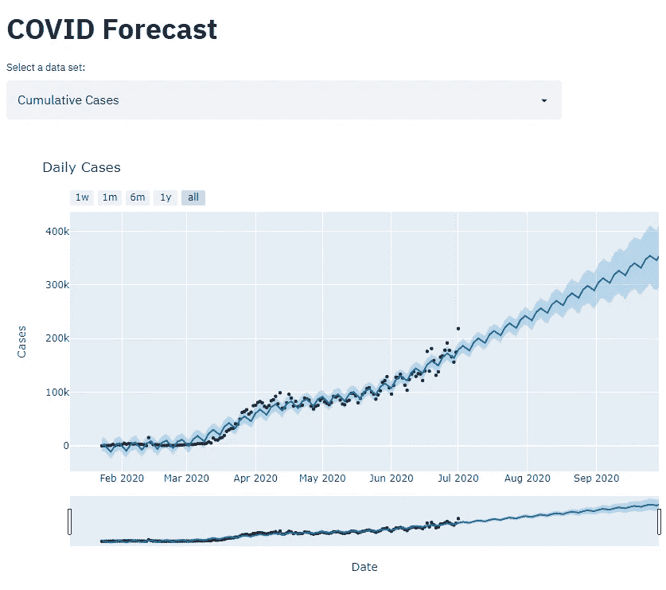
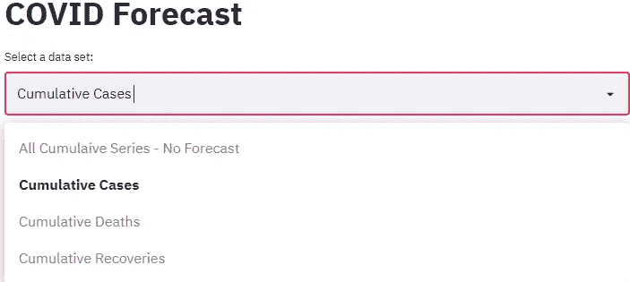
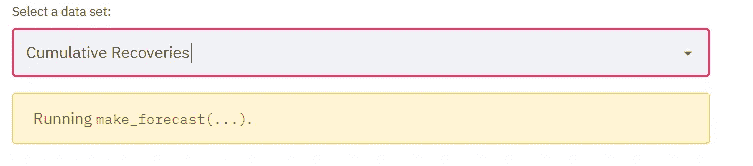
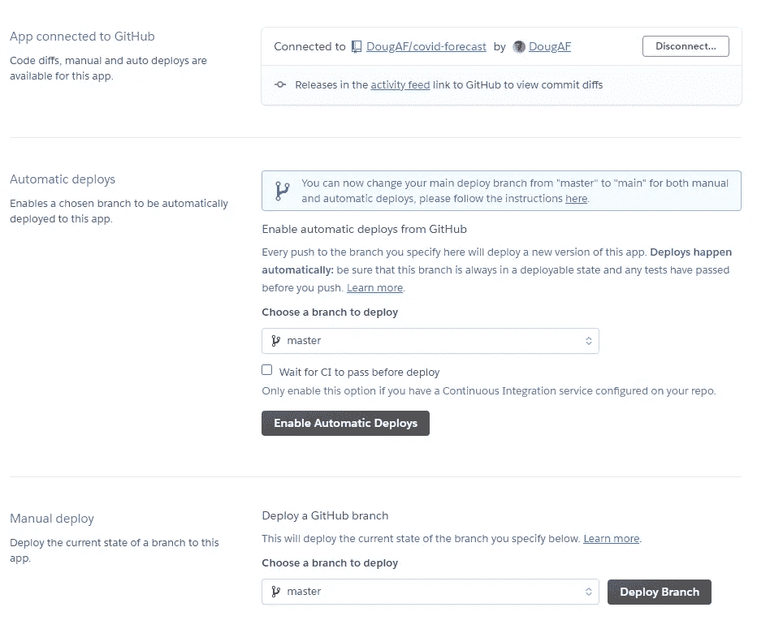
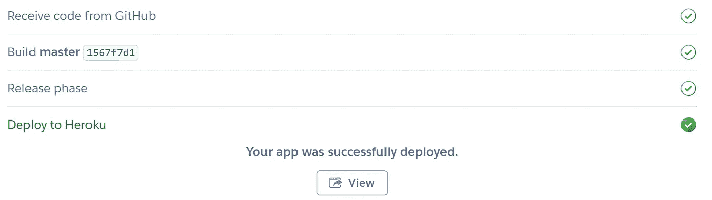
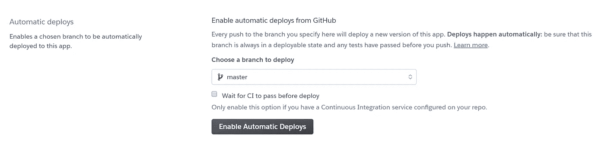

# 使用 Streamlit 将 Prophet 预测模型部署到 Heroku

> 原文：<https://towardsdatascience.com/deploying-a-prophet-forecasting-model-with-streamlit-to-heroku-caf1729bd917?source=collection_archive---------31----------------------->

## 在 Python 应用程序中使用 Prophet 和 Streamlit 预测 COVID 数据的概述。

作者:[爱德华·克鲁格](https://www.linkedin.com/in/edkrueger/)和[道格拉斯·富兰克林](https://www.linkedin.com/in/douglas-franklin-1a3a2aa3/)。


照片由 Hendrik Cornelissen 在 Unsplash 上拍摄

Streamlit 和脸书先知让我们能够以最少的努力和零成本创建一个干净的预测仪表板。这为概念工作流提供了可靠的证明。

在这个项目中，我们使用 Streamlit 和 Prophet 创建一个仪表板来展示数据和进行预测，然后将我们的应用程序部署到 Heroku。

这里有一个到 GitHub 仓库的链接，里面有我们的项目代码。注意，我们使用 Pipenv 来管理我们的依赖关系。

[](https://github.com/edkrueger/covid-forecast) [## 埃德克鲁格/covid-预测

### 运行 pipenv install — dev 来安装 env。运行 pipenv 运行预提交安装来初始化 git 挂钩。运行 pipenv…

github.com](https://github.com/edkrueger/covid-forecast) 

# 什么是 Streamlit？

Streamlit 是一个免费的开源应用框架，为数据科学家和机器学习工程师快速创建伟大的 Python 应用提供了一种简单的方法。Streamlit 固执己见的本性使构建前端变得容易。最后，Streamlit 可以让数据应用的实验和生产以及机器学习分析更容易进行和迭代。

在 GitHub 上查看一下。

[](https://github.com/streamlit/streamlit) [## 简化/简化

### streamlit-用 Python 构建数据应用程序的最快方法-streamlit/streamlit

github.com](https://github.com/streamlit/streamlit) 

## 精简原则

Streamlit 非常优秀，因为它包含 Python 脚本，将小部件视为变量，并缓存数据和计算以供重用。这允许我们定制复杂的可视化，只需要加载一次。此外，Streamlit 可以在本地使用，也可以在云上运行。

# 安装和运行 Streamlit

## 先决条件

在开始之前，您需要 Python 3.6 或更高版本。

## 演示

首先，让我们安装 streamlit。如果您在设置您的机器时有问题，请随意使用我们项目存储库中的 Pipfile。

```
$ pip install streamlit
```

现在运行 hello world 应用程序，确保一切正常:

```
$ streamlit hello
```

这个命令会在你的计算机上打开一个 web 服务器，你可以在那里玩一些演示！第一次运行该命令时，可能会提示您添加一封电子邮件到`~/.streamlit/config.toml`。没有必要将您要使用的电子邮件添加到软件中。

值得注意的是，每次在没有完整的`config.toml`文件的情况下运行 Streamlit 时，都会出现这个电子邮件提示。为了解决这个问题，我们使用这个 bash 脚本来输入我们的电子邮件和我们想要运行的端口。

setup.sh

一旦我们运行这个`setup.sh`脚本，我们就有了我们的电子邮件和端口设置。

# 什么是脸书先知？

脸书预言家或 FB 预言家是一个合适的预测工具。我们将预测时间序列 COVID 数据，而不是预测结束时间。FB Prophet 使用熊猫，接收并输出一个数据帧。

传递给 FB prophet 的数据帧必须有“ds”和“y”列。然后，我们将只包含日期的数据帧输入

FB Prophet 和预测会填充缺失的值。

我们在 windows 10 机器上和 docker 容器中进行本地设置时遇到了一些问题。然而，我们在使用 GCP 人工智能平台笔记本电脑时没有遇到任何复杂情况。

## 安装 FB Prophet

您需要在安装`fbprophet`之前安装`pystan`。

```
pip install pystan
```

那么你应该可以运行:

```
pip install fbprophet
```

请注意，您可能会得到一个 FB Prophet 错误，指出它不能被发现。我们遇到了这个错误，包被找到了。如果你在设置上有问题，试试云虚拟机或者使用我们的 Pipfile！

# 构建我们的 Streamlit 应用

现在我们已经简化了它，并对它的功能有了基本的了解，让我们开始使用我们的预测应用程序。

Pandas 与 Streamlit 配合得很好，并且已经是 FB Prophet 的一个依赖项，所以我们在 load_data.py 文件中使用它来使我们的生活变得稍微容易一些。

我们所有的数据都在`data.json`文件里；我们需要将它加载到 Pandas 中，并将其转换成数据帧。

加载数据

我们的应用程序代码的其余部分相对简单，向我们展示了下拉选项和选择功能。这使得我们的应用程序可以在用户从下拉列表中选择一个选项时获取数据并生成图表。

点击查看`app.py`代码[。](https://github.com/edkrueger/covid-forecast/blob/master/app/app.py)

[](https://github.com/edkrueger/covid-forecast/blob/master/app/app.py) [## 埃德克鲁格/covid-预测

### 使用 fbprophet 预测 COVID-edkrueger/COVID-forecast 的 streamlit 应用程序

github.com](https://github.com/edkrueger/covid-forecast/blob/master/app/app.py) 

## 运行应用程序

Streamlit 让我们像编写 Python 脚本一样编写应用程序。这意味着当我们在下拉菜单中选择一个新的选项时，整个应用程序文件将再次运行以生成绘图。

让我们运行我们的应用程序，看看默认视图。使用以下代码行在本地端口 8000 上运行您的 streamlit 应用程序。

```
streamlit run app/app.py --server.port 8000
```

默认情况下，我们的应用程序设置为加载数据并生成“所有—累积案例”图，如下所示。



COVID 预测—累积数据

由于我们的预测是实时的，在您从下拉列表中选择它们之后，可能需要一些时间来生成图表。为了减少加载时间，我们添加了 Streamlit 缓存来存储函数的结果，即我们的绘图。



下拉选项

我们的应用程序有一个下拉菜单，可以选择您想要查看的地块。当您选择非默认选项时，FB prophet 会按需运行预测。生成的数据帧然后被传递给 Streamlit，后者显示我们的数据。

我们用 Streamlit 缓存的不一定是数据。我们可以缓存任何东西，比如我们的预测！请注意，黄色警告“运行 make_forecast(…)”仅在第一次选择选项时出现。那么当我们重新选择“累积回收率”时，就没有预测；相反，我们的情节是从缓存中提取的。



按需预测

一旦进行预测，这种缓存允许在图之间平滑交换。

## 部署到 Heroku

要在 Heroku 上运行我们的应用程序，我们需要在 GitHub 存储库中添加一个`Procifle`，以便在他们的平台上运行我们的应用程序。这是我们的档案。

```
web: sh setup.sh && streamlit run app/app.py
```

注意，我们正在调用我们的`setup.sh`文件来设置 Heroku 机器上的电子邮件和端口。然后我们告诉 streamlit 运行我们的应用程序。只要把这个`Procfile`添加到你的项目根目录，你就可以在 Heroku 上运行了。

现在让我们访问 Heroku 的网站，使用 GUI 从 GitHub 部署我们的应用程序。



用于应用部署的 Heroku GUI

要连接您的存储库，请选择 GitHub，输入存储库的名称，然后点击 search。一旦您的用户名和存储库出现，单击连接。现在选择所需的分支并单击 deploy。

构建日志将开始填充页面上的控制台。注意，Heroku 首先查找 requirements.txt 文件，然后从 Pipenv 的 Pipfile.lock 安装依赖项。

一旦从 Pipfile.lock 构建了您的环境，并且构建成功，您将会看到下面的消息。



成功的应用部署

该应用程序已成功部署！点击查看按钮，查看 Heroku 上部署的应用程序。现在，我们可以在 Heroku 上实时查看我们的应用程序，并在他们的平台上运行预测。

点击这里查看我们的应用程序！

 [## 细流

### covid-预测-应用

st-covid-forecast.herokuapp.com](https://st-covid-forecast.herokuapp.com/) 

## 自动部署

我们可以启用自动部署，让 Github master 的更改在推送时显示在 Heroku 上。如果您使用这种方法，您将希望确保始终有一个工作的主分支。



启用自动部署

## 结论

回顾一下，我们讨论了 Streamlit 和脸书预言家作为工具，使我们能够以最少的努力和零成本制作预测仪表板。Streamlit 坚持己见，易于使用，并允许我们将前端和后端代码放在一个文件中。

我们使用这些工具制作了一个显示 COVID 数据的简单仪表板，您将使用它们做什么？

感谢您的阅读！请告诉我们您使用什么工具制作仪表板，以及您希望了解更多信息。