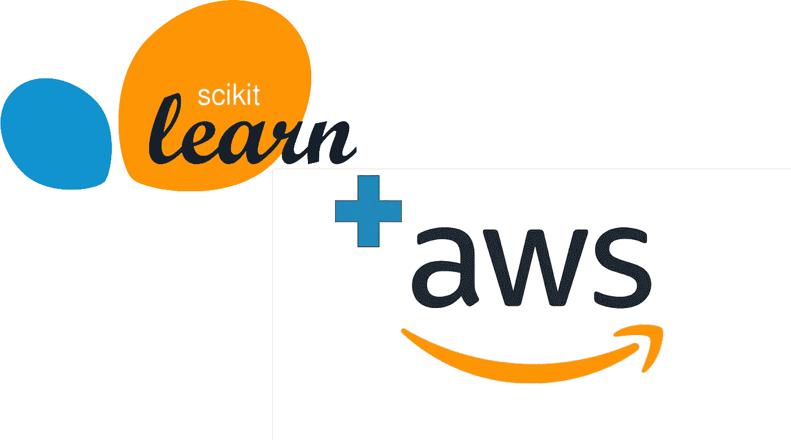
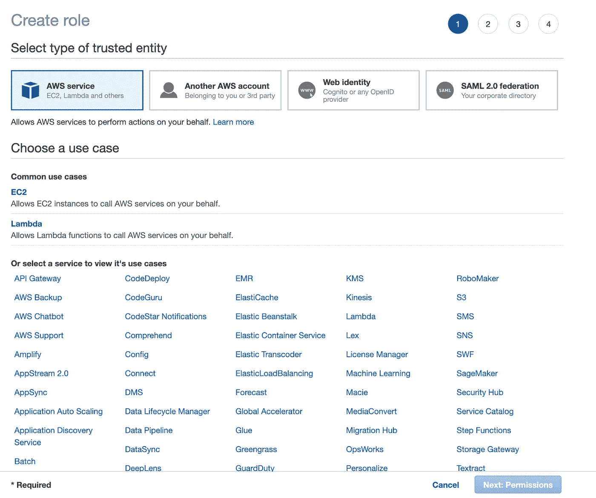
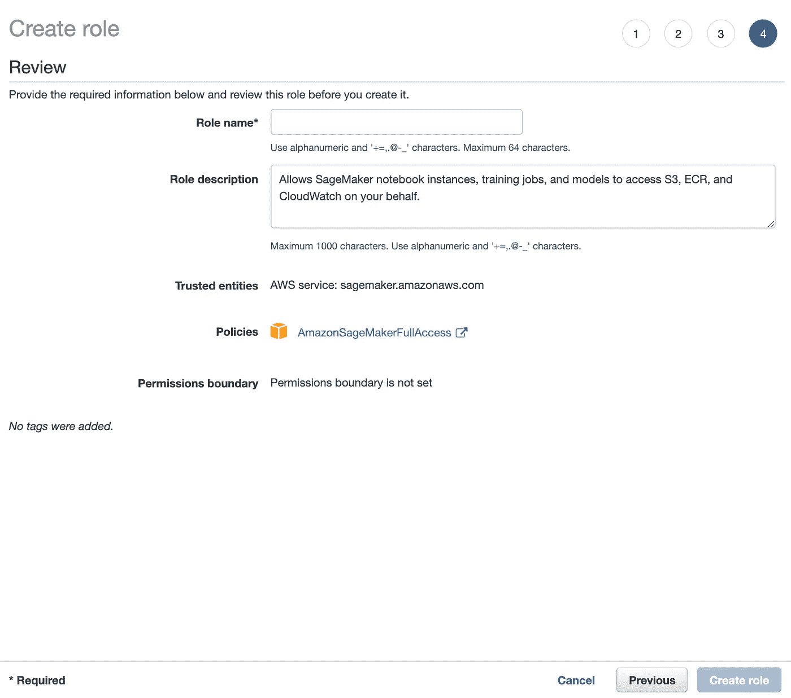

# 使用 SKLearn 估算器、本地 Jupyter 笔记本和终端在 AWS 上部署 Scikit-Learn 模型

> 原文：<https://towardsdatascience.com/deploying-a-scikit-learn-model-on-aws-using-sklearn-estimators-local-jupyter-notebooks-and-the-d94396589498?source=collection_archive---------9----------------------->

## 关于如何从本地设备在 AWS 上部署 scikit-learn 模型的分步教程。



从 Wikipedia.com(scikit-learn)和 aws.amazon.com 检索到的徽标。

亚马逊网络服务(AWS)是目前数据科学和机器学习专业人士最需要的云平台。鉴于此，本机器学习部署系列的第一批博客文章将概述如何在 AWS 上以多种不同的方式部署各种模型。

**本系列其他帖子:**

*   [简介 ](https://medium.com/@lannersq/why-you-should-know-how-to-deploy-your-models-in-the-cloud-41d1c85a8df0)

我们将涉及的第一个 AWS 部署将是一个简单的 Scikit-learn 模型的部署，该模型完全从一个人的本地计算机使用 AWS 预构建 Scikit-learn 估计器来完成。

在我们深入研究这些步骤之前，理解 AWS Sagemaker 如何训练和部署模型的基本概念很重要。如果你不熟悉 Docker，我推荐在这里阅读他们的概述文档。不涉及太多细节，AWS 本质上使用 Docker 容器来存储模型的配置，训练模型，并最终部署模型。通过将 ML 模型封装在 Docker 容器中，AWS 能够同时为通用 ML 框架提供一组预配置的 Docker 映像，同时还允许完全定制。

幸运的是，在 2018 年，AWS 将 Scikit-learn 添加到其支持的框架列表中。因此，我们可以使用预配置的 Docker 容器快速部署我们的模型。正如您将在下面看到的，我们将创建一个训练脚本，并使用 AWS Scikit-learn 估计器在容器内执行它。所以，事不宜迟，让我们开始吧。

> 你可以在我为这个博客系列[开始的回购中找到这篇文章的代码。](https://github.com/qlanners/ml_deploy/tree/master/aws/scikit-learn/sklearn_estimators_locally)

**第一步:账户设置**

在开始之前，我们必须设置一个 AWS 帐户。如果您已经有一个 AWS 帐户，那么您可以跳到下一步。否则，让我们为你注册 AWS 和他们的 175(并且持续增长)服务。首先，导航到[这一页创建你的免费 AWS 账户](https://portal.aws.amazon.com/billing/signup?nc2=h_ct&src=header_signup&redirect_url=https%3A%2F%2Faws.amazon.com%2Fregistration-confirmation#/start)并获得 12 个月的免费层访问(这足以完成本文中的代码)。

**步骤 2: AWS CLI 和 Pip 包**

一旦您注册了 AWS，我们还需要下载 AWS 命令行界面(CLI ),这样我们就可以在本地设备上使用我们的 AWS 帐户。AWS 很好地解释了如何[安装](https://docs.aws.amazon.com/cli/latest/userguide/cli-chap-install.html) , [配置](https://docs.aws.amazon.com/cli/latest/userguide/cli-chap-configure.html),[使用](https://docs.aws.amazon.com/cli/latest/userguide/cli-chap-using.html)他们的 CLI。

我们还需要安装几个 python SDKs，以便在 python 脚本中访问 AWS。具体来说，我们将需要 [Boto3](https://boto3.amazonaws.com/v1/documentation/api/latest/index.html) 来处理数据上传，并需要 [Sagemaker](https://github.com/aws/sagemaker-python-sdk) 来创建我们的 Scikit-learn 估算器。运行下面的 pip 命令来安装它们。

```
pip install boto3
pip install sagemaker
```

**步骤 3:数据设置**

为了专注于模型的部署，并避免陷入数据清理和模型调整的困境，我们将在 Iris 数据集上训练一个简单的逻辑回归模型。您可以在此下载数据集[并将其保存到您的本地设备。](https://archive.ics.uci.edu/ml/datasets/Iris)

一旦我们部署了模型，我们将使用下面的代码块从数据集中提取一些样本来测试 API 调用，并将数据保存到两个名为 **train.csv** 和 **deploy_test.csv** 的新文件中。

*注意:我们不考虑 ML 训练/测试集指南。在实践中，您应该总是将您的数据分成一个训练/测试集。然而，对于本教程，我们只是专注于部署模型，并将通过在最后调用 API 来检查模型如何预测我们在****deploy _ test . CSV****中保存的几个点。*

为了让 AWS Sagemaker 在训练模型时访问这些数据，我们必须通过创建一个新的简单存储服务(S3)桶并将我们的训练数据添加到其中，将数据上传到我们的 AWS 帐户。为此，我们将使用上面安装的 boto3 SDK 在指定区域创建一个 S3 桶，然后将我们的 **train.csv** 文件保存在该桶的 **train/** 文件夹中。 [*点击这里了解更多关于 S3*](https://aws.amazon.com/s3/) *的信息。*

*注意:为了让 Sagemaker 访问数据，S3 存储桶和 Sagemaker 会话需要在同一个区域。鉴于 Sagemaker 仅在某些地区可用，请务必从这里列出的*[](https://docs.aws.amazon.com/general/latest/gr/sagemaker.html)**地区中为您的 S3 桶选择一个地区。**

*为了再次检查以上脚本是否正常工作，您可以导航到 [AWS S3 控制台](https://s3.console.aws.amazon.com/)，登录，并查看我们在上面创建的 bucket 是否在那里。如果有了，我们就可以继续工作，创建我们的模型了！*

***第四步:模型脚本***

*为了使用 Scikit-learn Sagemaker SDK 将模型部署到 AWS，我们首先必须创建一个脚本，告诉 Sagemaker 如何训练和部署我们的模型。虽然比创建我们自己的 Docker 容器来部署我们的模型要简单得多，但是 SDK 确实要求我们坚持相当严格的准则。*

*首先，我们将导入我们需要的所有包，并创建几个字典来将目标标签从文本转换成数字，反之亦然。*

*在这些导入之后，我们需要将训练步骤包装在 __main__ 函数中。我们还将在最后添加一行来保存模型。SKLearn Sagemaker SDK 将运行这个 __main__ 函数，根据我们推送到上面的 S3 存储桶的数据训练一个模型，然后保存这个模型，以便以后我们想要部署它时可以使用它。*

*__main__ 函数是唯一必需的函数。然而，我们有能力修改一些额外的函数，这些函数决定了模型在部署后如何处理 API 调用。这些可选功能是:*

> ****model _ fn:****指定从何处以及如何加载正在部署的模型。*
> 
> ***input _ fn:****将发送到部署模型的请求体格式化为可以馈入模型的格式。* ***predict _ fn:****使用 model_fn 加载的部署模型和 input_fn 格式化的数据进行预测。* ***output _ fn:****将 predict_fn 做出的预测重新格式化为最终的格式，作为 API 调用的响应返回。**

*下面的要点显示了我们模型的这些可选函数。每个函数上面的注释提供了关于每个函数的更多信息。关于这些函数及其默认行为的更多信息，请参见[这里的](https://sagemaker.readthedocs.io/en/stable/using_sklearn.html)。*

***步骤 5:创建 IAM Sagemaker 角色***

*不幸的是，当我说我们将在本地计算机上完成所有这些工作时，我撒了一个谎。如果您还没有 Sagemaker IAM 角色，我们需要导航到 AWS IAM 控制台并创建一个新角色。首先点击[这里](https://console.aws.amazon.com/iam/home?#/roles$new?step=type)并登录。您应该会看到如下所示的屏幕:*

**

*AWS 选择 IAM 角色页*

*从这里，选择 **Sagemaker** 作为服务，并按下**下一步**。*

*通过选择**下一页**跳过下两页，直到您看到以下屏幕:*

**

*AWS 创建 IAM 角色名页*

*在此页面中，在点击**创建角色**之前，只需创建自己的**角色名称*** 和(可选)**角色描述**。请务必记住您为您的角色命名的名称，因为我们将在下一步中用到它！*

***第六步:部署模型***

*艰苦的工作完成后，让我们来部署您的模型。幸运的是，使用 AWS SKLearn 类，这只需要几行代码。只需确保 ***入口点*** 路径指向我们在步骤 4 中保存的脚本，并且 ***角色*** 变量是您在步骤 5 中创建的**角色名称*** 。在这个片段中，我们还为模型和部署的端点指定了 instance_types。instance_type 指定了我们希望 AWS 为我们的服务分配多少计算能力。显然，功率越大，成本越高，所以对于这个例子，我们使用小实例。查看这里的以获得所有可用的 Sagemaker 实例类型的列表。*

**注意:SKLearn()构造函数有许多可选参数，您可以添加这些参数来配置 Scikit-learn framework_version、超参数等。点击* [*此处*](https://sagemaker.readthedocs.io/en/stable/using_sklearn.html#required-arguments) *了解更多信息。**

***第七步:测试终点***

*为了测试端点，我们将 feed send 一个请求，其中包含我们在步骤 3 中保存到 **deploy_test.csv** 的数据样本。为了向部署的端点发送请求，我们首先需要将我们的测试样本转换成模型可以解析的格式(即，可以由我们在 **aws_sklearn_main.py** 中定义的 **input_fn** 函数解释的格式)。由于我们将模型配置为理解具有多个样本的请求，其中每个样本的特征由“，”分隔，每个单独的样本由“|”分隔，因此我们将 request_body 格式化为如下格式:*

```
*'147,6.5,3.0,5.2,2.0|148,6.2,3.4,5.4,2.3|149,5.9,3.0,5.1,1.8'*
```

*在这里，我们使用 boto3 创建一个 Sagemaker 会话，它将允许我们与部署的模型进行交互。为了调用我们的 Sagemaker 端点，我们使用了 **invoke_endpoint** 函数。对于这个函数，我们必须指定一个端点、一个内容类型和一个主体。还有一些可选参数，你可以在这里阅读更多关于[的内容](https://boto3.amazonaws.com/v1/documentation/api/latest/reference/services/sagemaker-runtime.html#SageMakerRuntime.Client.invoke_endpoint)。在我们的例子中，我们将传递在上一步中输出的端点、content_type 'text/csv '和一个格式类似于上面的字符串。最后，一旦我们运行了这个方法并收到了响应，我们就在响应的正文中下标并读取返回的内容。*

*如果预期的响应与模型实际返回的相匹配，那么您已经成功地在 AWS 上训练和部署了一个有效的 Scikit-learn 模型！*

***步骤 8:清理资源***

*为了避免任何 AWS 费用，请务必清理您的资源。您可以通过取消步骤 6 中最后一行的注释并运行它来快速终止模型的端点。*

```
*aws_sklearn_predictor.delete_endpoint()*
```

*虽然这将删除端点，但要完全清除您在本教程中使用的所有资源的 AWS 帐户，请完成以下操作。*

1.  *打开[制袋机控制台](https://console.aws.amazon.com/sagemaker/)*
2.  *在**推理下的侧栏菜单中，**删除在*模型*、*端点*和*端点配置*选项卡上创建的资源。*
3.  *打开 [S3 控制台](https://console.aws.amazon.com/s3/)并删除我们创建的桶。*
4.  *打开 [IAM 控制台](https://console.aws.amazon.com/iam/)，删除我们创建的角色。*
5.  *打开 [Cloudwatch 控制台](https://console.aws.amazon.com/cloudwatch/)，删除所有/aws/sagemaker 日志。*

***回顾***

*总的来说，虽然学习曲线有点高，但一旦您能够在 AWS 服务中导航并理解 Sagemaker 原则，AWS SKLearn 估计器就成为快速部署 Scikit-learn 模型的一个不可思议的工具。*

*好处:*

*   *需要很少的配置，但有很多可用的*
*   *过多的文件*
*   *只需几行代码就可以部署模型*

*缺点*

*   *巨大的初始学习曲线*
*   *需要理解和使用的几个 AWS 服务*
*   *文档可能很难找到*

***本系列其他博文:***

*   *[简介 ](https://medium.com/@lannersq/why-you-should-know-how-to-deploy-your-models-in-the-cloud-41d1c85a8df0)*