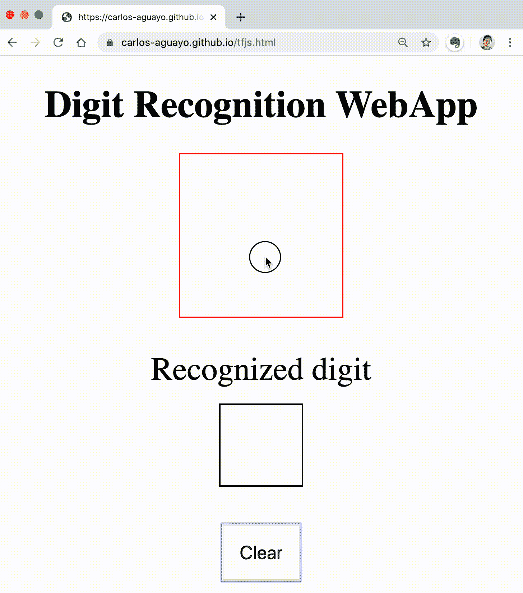
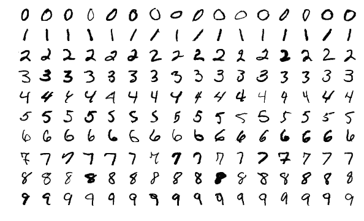
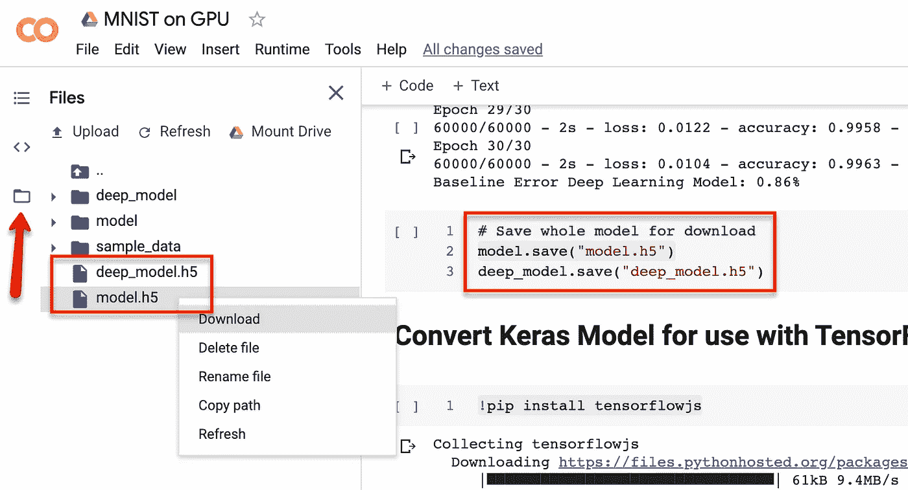
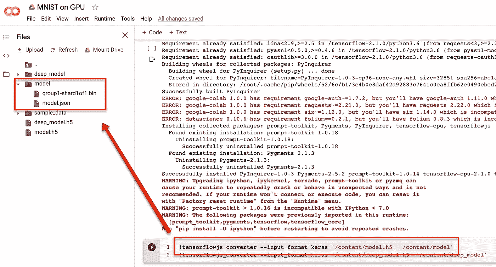
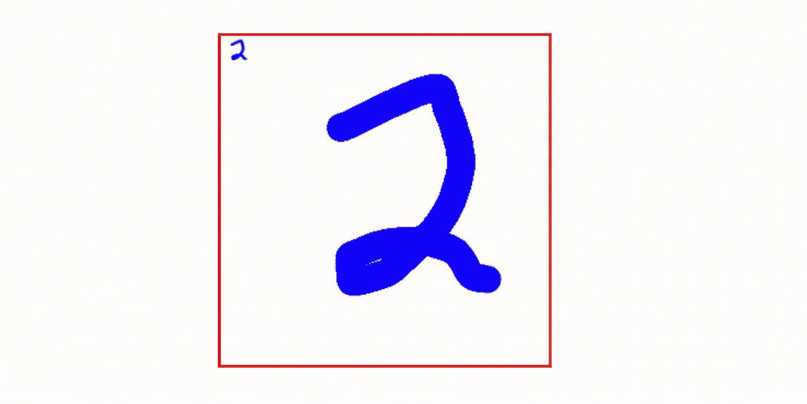

# 使用 TensorFlow.js 将简单的机器学习模型部署到 WebApp 中

> 原文：<https://towardsdatascience.com/deploying-a-simple-machine-learning-model-into-a-webapp-using-tensorflow-js-3609c297fb04?source=collection_archive---------2----------------------->

## 你好，今天，你要构建一个简单的 WebApp，可以识别数字。看看下面的演示。

请在您的浏览器或手机中尝试一下:

[**https://carlos-aguayo.github.io/tfjs.html**](https://carlos-aguayo.github.io/tfjs.html)

**TensorFlow.js 的美妙之处在于，您可以使用 Keras 或 TensorFlow 在 Python 中训练机器学习模型，并使用 TensorFlow.js 将其部署在浏览器上。无需外部服务来运行您的查询。**

****

**数字识别 WebApp**

**这个有趣而简单的应用程序让你画一个一位数，它使用简单的机器学习工具识别它。**

**如果你想直接看的话，下面是完整的代码:**

*   **[谷歌 Colab 笔记本生成机器学习模型](https://colab.research.google.com/gist/carlos-aguayo/e56a341190c4a252c4f66289b9228a69/mnist-on-gpu.ipynb)**
*   **[HTML 文件](https://github.com/carlos-aguayo/carlos-aguayo.github.io/blob/master/tfjs.html)**

**让我们开始吧；这些是构建这个演示所需的*成分*和*步骤*。**

**配料和步骤:**

*   **培训用数据**
*   **培训环境**
*   **预处理数据**
*   **机器学习**
*   **将 Keras 模型转换为 Tensorflow.js**
*   **HTML5 画布**
*   **把一切都连接起来**

# **培训用数据**

**任何机器学习模型都需要高质量的数据。我们将使用 [MNIST 数据集](https://en.wikipedia.org/wiki/MNIST_database)，这是一个手写数字的数据集。**

****

**约瑟夫·斯泰潘[ [CC BY-SA](https://creativecommons.org/licenses/by-sa/4.0)**

**在这个数据集中，有 60，000 幅图像，所有图像的灰度都是 28 x 28 像素，像素值从 0 到 255。**

**有关加载和查看 MNIST 数据集的信息，请参见下面的代码片段。**

# ****培训环境****

**[Google Colab](https://colab.research.google.com/notebooks/intro.ipynb) 允许你在浏览器中编写和执行 Python。**

**Colab 是一个非常方便的 [Jupyter Notebook](https://jupyter.org/) Python 平台，预装了您需要的大部分 Python 机器学习库，这是一种让您快速启动并运行 ML 项目的便捷方法。**

**此外，它让您可以免费访问 GPU/CPU。**

# ****数据预处理****

**来自 MNIST 的数据需要进行一个小的预处理:**

1.  **规范化输入:数据带有从 0 到 255 的值，我们应该将它们规范化为从 0 到 1 的范围。**
2.  **[一键编码](https://en.wikipedia.org/wiki/One-hot)输出。**

```
# Normalize Inputs from 0–255 to 0–1**x_train = x_train / 255****x_test = x_test / 255**# One-Hot Encode outputs**y_train = np_utils.to_categorical(y_train)****y_test = np_utils.to_categorical(y_test)**num_classes = 10
```

# **机器学习**

**我们终于准备好做一些机器学习了。我们可以从一个非常简单的模型开始。我们将使用一个简单的*神经网络*，只有一个隐藏层。这个简单的模型足以获得 98%的准确率。**

```
x_train_simple = x_train.reshape(60000, 28 * 28).astype(‘float32’)x_test_simple = x_test.reshape(10000, 28 * 28).astype(‘float32’)model = Sequential()**model.add(Dense(28 * 28, input_dim=28 * 28, activation=’relu’))****model.add(Dense(num_classes, activation=’softmax’))**model.compile(loss=’categorical_crossentropy’, optimizer=’adam’, metrics=[‘accuracy’])model.fit(x_train_simple, y_train, validation_data=(x_test_simple, y_test), epochs=30, batch_size=200, verbose=2)
```

**如果你想变得花哨，你可以尝试一个*深度学习模型*。有了它，你可以把准确率提高到 99%。**

```
x_train_deep_model = x_train.reshape((60000, 28, 28, 1)).astype(‘float32’)x_test_deep_model = x_test.reshape((10000, 28, 28, 1)).astype(‘float32’)deep_model = Sequential()**deep_model.add(Conv2D(30, (5, 5), input_shape=(28, 28, 1), activation=’relu’))****deep_model.add(MaxPooling2D())****deep_model.add(Conv2D(15, (3, 3), activation=’relu’))****deep_model.add(MaxPooling2D())****deep_model.add(Dropout(0.2))**deep_model.add(Flatten())deep_model.add(Dense(128, activation=’relu’))deep_model.add(Dense(50, activation=’relu’))deep_model.add(Dense(num_classes, activation=’softmax’))deep_model.compile(loss=’categorical_crossentropy’, optimizer=’adam’, metrics=[‘accuracy’])deep_model.fit(x_train_deep_model, y_train, validation_data=(x_test_deep_model, y_test), epochs=30, batch_size=200, verbose=2)
```

# ****将 Keras 模型转换为 Tensorflow.js****

**现在我们有了一个训练好的模型，我们需要转换它，以便可以在 TensorFlow.js 中使用它。**

**首先，我们需要将模型保存到 HDF5 模型中。**

```
model.save(“model.h5”)
```

**之后，您可以通过点击左侧导航中的文件夹图标来访问保存的文件。**

****

**有几种方法可以转换模型。笔记本中的一个简单例子是这样的:**

```
!pip install tensorflowjs!tensorflowjs_converter --input_format keras ‘/content/model.h5’ ‘/content/model’
```

**/content/model.h5 是输入，输出保存在/content/model 文件夹中。**

****

**TensorFlow.js 需要指向 JSON 文件( *model.json* )，需要一个名为“ *group1-shard1of1.bin* ”的兄弟文件。你需要这两份文件。下载这两个文件。**

# ****HTML5 画布****

**让我们有一个简单的 [HTML 页面](https://github.com/carlos-aguayo/carlos-aguayo.github.io/blob/master/tfjs.html)，它使用 HTML5 Canvas 组件让我们在上面绘图。姑且称这个文件为“*tfjs.html*”。**

**核心绘图代码来自[本网站](https://www.html5canvastutorials.com/labs/html5-canvas-paint-application/):**

**使用 HTML5 Canvas 组件，我们可以将鼠标事件挂钩到画布中。**

```
canvas.addEventListener('mousedown', function(e) {
  context.moveTo(mouse.x, mouse.y);
  context.beginPath();
  canvas.addEventListener('mousemove', onPaint, false);
}, false);var onPaint = function() {
  context.lineTo(mouse.x, mouse.y);
  context.stroke();
};
```

**然后，我们添加触摸事件，使其在移动设备上工作。**

**添加触摸动作以禁用滚动。这个代码的灵感来自于这个网站。**

**一旦我们可以绘制，让我们在鼠标抬起时获取图像。我们将把它缩小到 28 乘 28 像素，以便它与训练好的模型相匹配。**

```
canvas.addEventListener('**mouseup**', function() {
  $('#number').html('');
  canvas.removeEventListener('mousemove', onPaint, false);
 **var img = new Image();
  img.onload = function() {
    context.drawImage(img, 0, 0, 28, 28);** data = context.getImageData(0, 0, 28, 28).data;    var input = [];
    for(var i = 0; i < data.length; i += 4) {
      input.push(data[i + 2] / 255);
    }
    predict(input);
 **};
  img.src = canvas.toDataURL('image/png');** }, false);
```

**然后，我们获取数据，将它保存在一个“输入”数组中，并将其传递给一个预测函数，我们将在后面定义该函数。**

```
canvas.addEventListener('mouseup', function() {
  $('#number').html('');
  canvas.removeEventListener('mousemove', onPaint, false);
  var img = new Image();
  img.onload = function() {
    context.drawImage(img, 0, 0, 28, 28);
 **data = context.getImageData(0, 0, 28, 28).data;
    var input = [];
    for(var i = 0; i < data.length; i += 4) {
      input.push(data[i + 2] / 255);
    }
    predict(input);**  };
  img.src = canvas.toDataURL('image/png');
}, false);
```

***数据*是一个 1D 数组，其值为 [RGBA 值](https://en.wikipedia.org/wiki/RGBA_color_model)。我们的模型只取 0 到 1 的值(或者从 255 的灰度中取 0)。假设我们正在画布上绘制 B lue，我们可以将数组分成四块，每隔一个元素取一个。**

```
RG**B**ARG**B**ARG**...**
01**2**345**6**789...
```

# ****把所有东西都挂起来****

**最后，让我们加载 TensorFlow.js 并运行预测。**

```
<script src=”https://cdn.jsdelivr.net/npm/@tensorflow/tfjs@1.5.2/dist/tf.min.js"></script>
```

**你应该已经下载了文件 *model.json* 和 *group1-shard1of1.bin* ，并将它们保存到一个名为 *model* 的文件夹中，这个文件夹与你保存 HTML 文件的文件夹相同。**

**加载后，我们可以通过简单地执行以下操作来加载训练好的模型:**

```
**tf.loadLayersModel**(‘**model/model.json**’).then(function(model) {
 window.model = model;
});
```

**鼠标一放，一旦我们有了数据，我们就可以把它输入到模型中:**

```
**window.model.predict**([tf.tensor(**input**).reshape([1, 28, 28, 1])]).array().then(function(scores){
  scores = scores[0];
  predicted = scores.indexOf(Math.max(...scores));
  $('#number').html(predicted);
});
```

**在本地测试很简单，并且可以很容易地设置一个 HTTP 服务器来用 Python 进行测试:**

```
python3 -m http.server 8080
```

**如果你想用手机测试，你可以利用这个叫做 [ngrok](https://ngrok.com/) 的漂亮工具。**

```
$ ngrok http 8080
```

**这就打开了一个可以通过手机访问的 URL 的通道。**

**一旦你对结果感到满意，你就可以将你的 HTML 部署到一个虚拟主机站点。一个简单的地方就是 Github。如果你从未用 Github 创建过静态网站，你需要创建一个名为“{username}.github.io”的资源库。例如，我的存储库是:**

**[https://github.com/carlos-aguayo/carlos-aguayo.github.io](https://github.com/carlos-aguayo/carlos-aguayo.github.io)**

**然后，您可以通过以下方式访问它:**

**[https://carlos-aguayo.github.io/tfjs.html](https://carlos-aguayo.github.io/tfjs.html)**

# ****结论****

**请注意，我们可以多么轻松地在 Google Colab 中训练模型，导出训练好的模型，并在 JavaScript 中查询它，而无需离开浏览器！**

**我是 [Appian](https://www.appian.com/) 的[软件开发总监兼机器学习工程师](https://www.linkedin.com/in/carlosaguayo)。我在 Appian 工作了 15 年，我一直很开心。如果你想知道我们是如何制作软件的，请给我发消息，让我们的客户开心！**

****