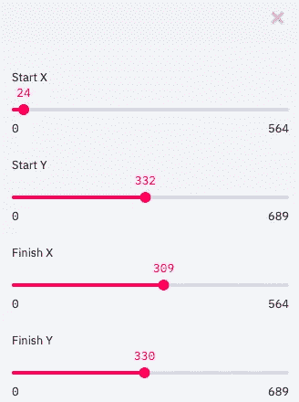
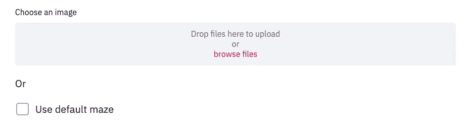
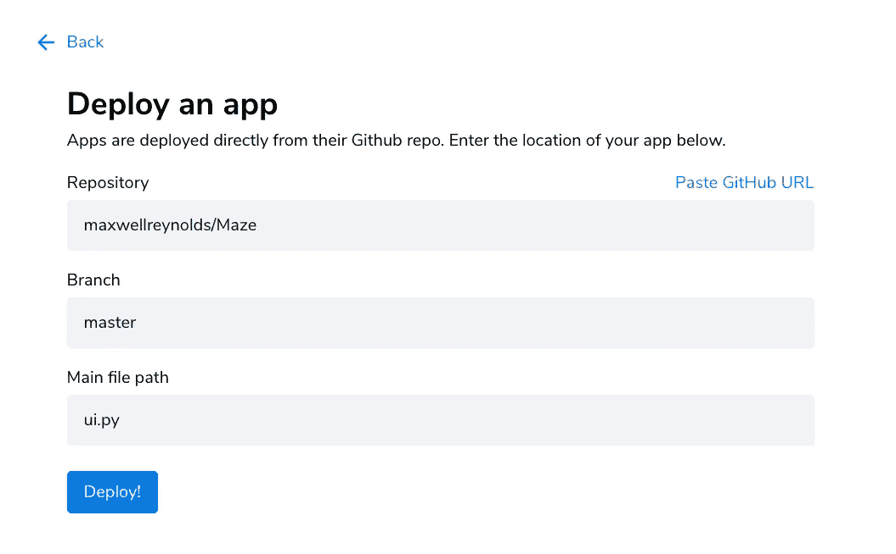

# 为 Python 部署简单的 UI

> 原文：<https://towardsdatascience.com/deploying-a-simple-ui-for-python-88e8e7cbbf61?source=collection_archive---------8----------------------->

## Streamlit 共享:Python 项目的游戏规则改变者


瑞安·莫尔顿在 [Unsplash](https://unsplash.com?utm_source=medium&utm_medium=referral) 上的照片

使用 Streamlit 为 Python 项目创建用户界面是无缝的，Streamlit 是一个相对较新的基于浏览器的 Python 框架，允许您优雅地展示项目，而无需编写任何 HTML、CSS 或 Javascript 代码。

现在，通过 Streamlit Sharing，你可以免费部署你的项目，而不需要启动服务器或使用任何云服务，如 Heroku。

# 背景

在之前的[文章](/solving-mazes-with-python-f7a412f2493f)中，我们构建了一个简单的迷宫求解器[应用](https://share.streamlit.io/maxwellreynolds/maze/ui.py)。简而言之，它允许用户上传一个迷宫的图像，并显示一个解决方案。用于促进用户交互的一些 Streamlit 功能包括:

## 滑块



## 文件上传和复选框:



要更深入地了解该应用如何实现 Streamlit 特性，请访问:

[](/building-a-simple-ui-for-python-fd0e5f2a2d8b) [## 为 Python 构建一个简单的 UI

### Streamlit:一个基于浏览器的 Python UI，不需要 HTML/CSS/JS

towardsdatascience.com](/building-a-simple-ui-for-python-fd0e5f2a2d8b) 

# 部署

Streamlit 最近推出了 [Streamlit 共享](https://www.streamlit.io/sharing)服务，以促进 Streamlit 项目的部署。使用该服务需要几个快速步骤。

## **1。创建一个 requirements.txt**

您可以在项目环境中使用以下命令来创建它:

```
pip freeze > requirements.txt
```

## 2.将您的项目推送到 GitHub

为您的项目创建一个公共存储库，并确保提交 requirements.txt 以及任何项目文件。

[如果你没有使用过 Github，这里有一个关于创建资源库的初级读本。](https://medium.com/@soufianerafik/how-to-add-a-local-project-to-github-on-macos-94a64659612b)

## 3.请求访问简化共享

虽然这项服务仍处于早期阶段，但你可以在这里申请访问。不到 24 小时，我就获得了 Streamlit 团队的访问权限。

收到访问邮件后，使用当前 GitHub 帐户登录 share.streamlit.io。

## 4.部署

登录后，点击“新建应用”并输入存储库信息。



注意:如果您的 python 依赖项需要操作系统级别的包，您可能需要将 packages.txt 文件添加到您的存储库中。例如，将 OpenCV Python 库与 Streamlit 一起使用需要主机服务器安装 ffmpeg。

在本课中，我们使用 Streamlit 共享免费快速部署了一个 Python 项目。你可以在这里查看最终部署的应用[以及](https://share.streamlit.io/maxwellreynolds/maze/ui.py) [Github](https://github.com/maxwellreynolds/Maze) 上的所有源代码。

要了解更多关于迷宫求解器背后的算法，或者如何使用 Streamlit 用很少几行 Python 代码创建友好的 web 界面，请查看本系列的第一部分和第二部分。

[](/solving-mazes-with-python-f7a412f2493f) [## 用 Python 解迷宫

### 使用 Dijkstra 的算法和 OpenCV

towardsdatascience.com](/solving-mazes-with-python-f7a412f2493f) [](/building-a-simple-ui-for-python-fd0e5f2a2d8b) [## 为 Python 构建一个简单的 UI

### Streamlit:一个基于浏览器的 Python UI，不需要 HTML/CSS/JS

towardsdatascience.com](/building-a-simple-ui-for-python-fd0e5f2a2d8b)